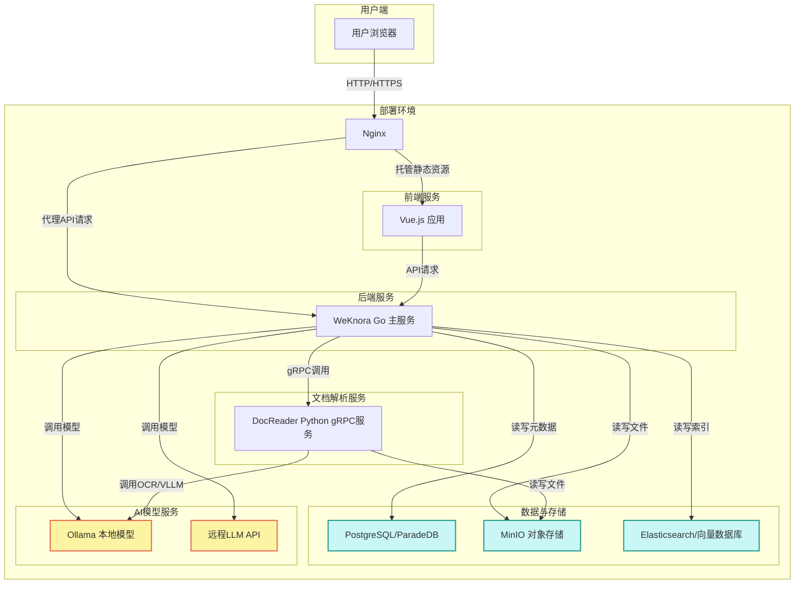
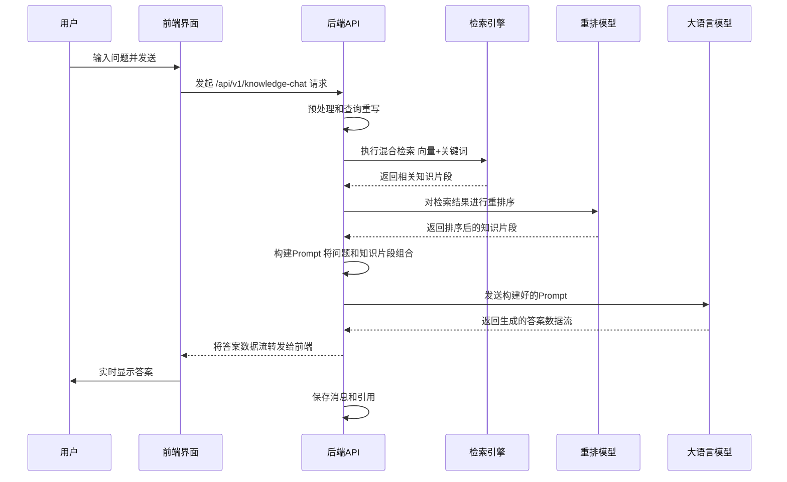
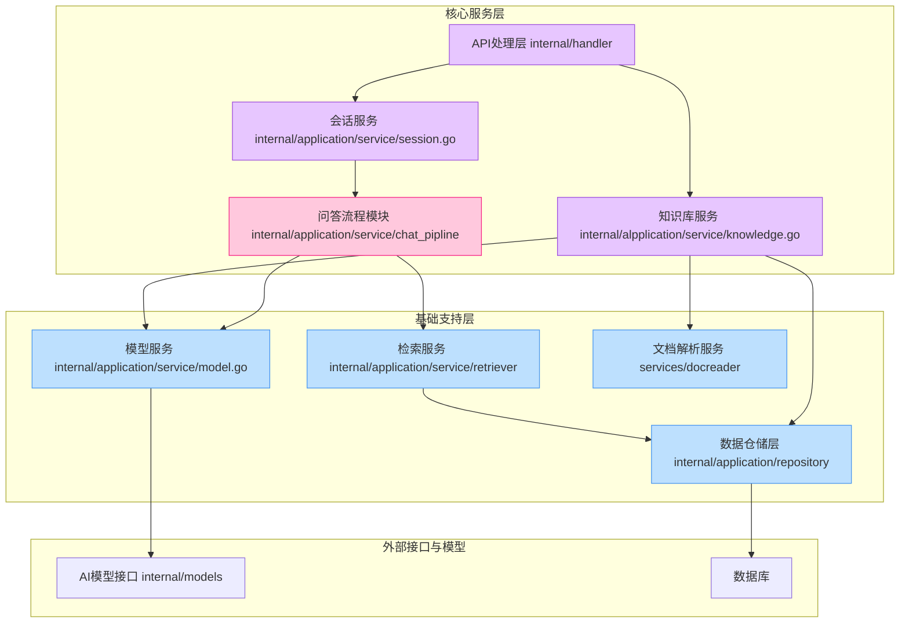
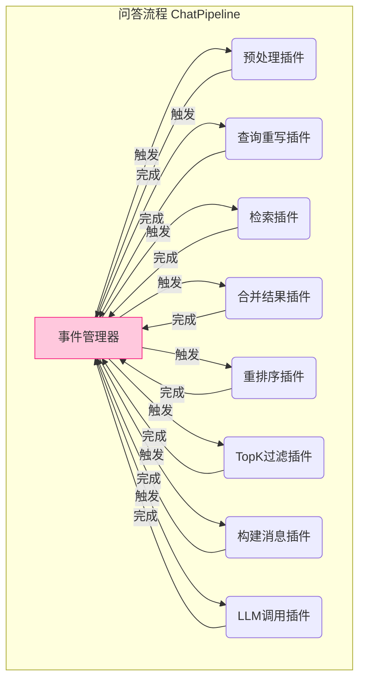
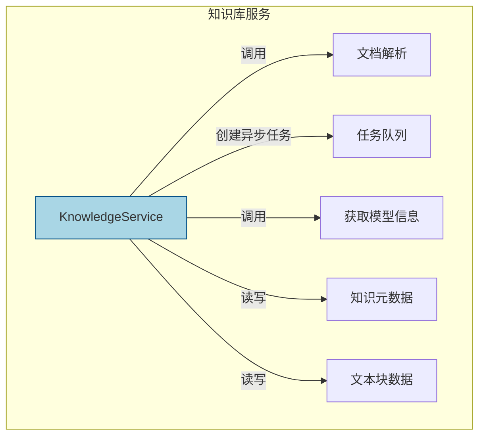
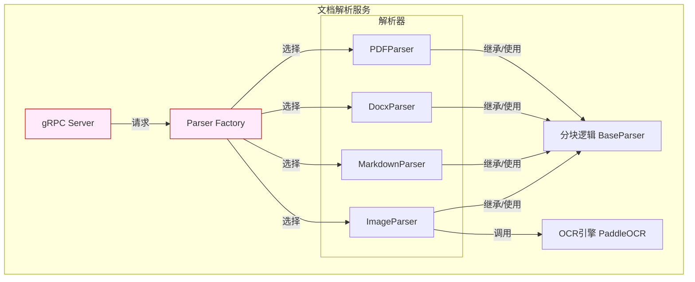

# Tencent WeKnora项目

Tencent WeKnora 是一个先进的、基于大语言模型（LLM）的文档理解与语义检索框架。该项目旨在解决企业在处理和利用海量、异构、结构复杂的文档时所面临的挑战。在数字化时代，企业内部积累了大量的PDF、Word文档、网页、图片等非结构化数据，这些数据蕴含着宝贵的知识，但传统关键词搜索难以精准、深入地挖掘其价值。WeKnora 通过结合最新的大语言模型技术和经典的知识检索方法，提供了一套完整的“检索增强生成”（Retrieval-Augmented Generation, RAG）解决方案。

该框架的核心价值在于其强大的文档解析、知识构建和智能问答能力。首先，它内置了一个高性能的文档读取服务（DocReader），能够高效解析包括 PDF、DOCX、Markdown、HTML、图片在内的多种格式文件。该服务不仅能提取文本，还能通过 OCR 技术识别图片中的文字，并对文档进行智能分块（Chunking），为后续的语义理解和检索奠定基础。

其次，WeKnora 能够将解析后的文档知识化、结构化。它通过深度学习模型将文本块转换为向量（Embedding），并构建向量索引，同时支持传统的关键词索引。这种混合检索模式结合了语义相似度和关键词精确匹配的优点，显著提升了信息召回的全面性和准确性。更进一步，项目还能从文档中提取实体和关系，构建知识图谱，从而实现更深层次的知识关联与推理。

最终，WeKnora 将强大的检索能力与大语言模型的生成能力相结合，为用户提供精准、自然的问答体验。当用户提出问题时，系统会先进行查询重写、意图理解，然后通过混合检索模块在知识库中查找最相关的知识片段，经过重新排序（Re-rank）后，将这些知识作为上下文提供给大语言模型，最终生成一个有理有据、忠于原文的答案，并能附上参考文献来源，确保了信息的可追溯性和可信度。项目采用模块化、微服务化的架构设计，前后端分离，主要后端服务使用 Go 语言开发，文档解析服务使用 Python，易于部署、扩展和二次开发，是企业构建智能知识库、智能客服、投研助手等应用的理想基础框架。

## 技术栈

| 类别 | 技术/工具 | 描述 |
| :--- | :--- | :--- |
| **编程语言** | Go | 后端 API 服务的主要开发语言，提供高性能和并发能力。 |
| | Python | `DocReader` 服务的开发语言，利用其丰富的文档处理和AI生态。 |
| | TypeScript | 前端应用的主要开发语言，提供类型安全。 |
| **后端框架与库** | Gin | Go 语言的高性能 Web 框架，用于构建 RESTful API。 |
| | GORM | Go 语言的 ORM 库，用于与数据库进行交互。 |
| | Asynq | 基于 Redis 的分布式任务队列，用于处理耗时的后台任务（如文档解析）。 |
| | OpenTelemetry | 用于实现分布式追踪和可观测性，监控系统性能。 |
| | gRPC | `DocReader` 服务与主后端之间的通信协议，高效且跨语言。 |
| **前端框架与库** | Vue.js | 用于构建用户界面的渐进式 JavaScript 框架。 |
| | Vite | 下一代前端构建工具，提供极速的开发服务器和优化的构建输出。 |
| | Pinia | Vue 的官方状态管理库，用于管理应用的状态。 |
| | TDesign | 腾讯设计体系的 Vue Next 实现，提供了一套高质量的 UI 组件。 |
| | Axios | 基于 Promise 的 HTTP 客户端，用于与后端 API 通信。 |
| **AI/ML 模型与库** | PaddleOCR | 百度飞桨的 OCR 工具库，用于从图片中提取文字。 |
| | Ollama | 支持在本地运行大语言模型（如 Llama 3）的工具。 |
| | OpenAI | 支持通过 API 调用远程大语言模型。 |
| **数据库与存储** | PostgreSQL/ParadeDB | 关系型数据库，用于存储元数据。ParadeDB 提供了内置的全文搜索和向量搜索能力。 |
| | Elasticsearch | 可选的检索引擎，提供强大的全文搜索和向量搜索功能。 |
| | MinIO | 高性能的分布式对象存储服务，兼容 Amazon S3 API，用于存储上传的原始文件。 |
| **构建与工具** | Docker & Docker Compose | 用于容器化部署和管理整个应用栈。 |
| | Nginx | 高性能 Web 服务器，用作前端静态资源服务和反向代理。 |
| | Makefile | 自动化构建、测试、部署等常见开发任务。 |
| | Supervisor | 进程控制系统，用于管理和监控后端服务的运行。 |
| **主要外部依赖** | golang-migrate | 数据库迁移工具，用于管理数据库 schema 的版本。 |
| | python-docx, pypdf | 用于解析 `.docx` 和 `.pdf` 文件的 Python 库。 |

## 可视化图表

### 系统架构图

### 核心问答流程（RAG Pipeline）

### 模块依赖关系图

## 模块解析

WeKnora 项目的架构清晰，遵循典型的分层和微服务设计思想。以下是其核心模块的解析：

---

### **1. 前端应用 (Frontend)**

*   **核心职责**:
    提供用户与系统交互的图形界面（GUI）。它负责知识库管理、创建和进行对话、以及系统配置等所有面向用户的操作。

*   **关键文件/组件**:
    *   `/frontend/src/views/`: 包含了应用的主要视图组件。
        *   `knowledge/KnowledgeBase.vue`: 知识库管理界面，支持文件拖拽上传、查看知识列表、删除等操作。
        *   `chat/index.vue`: 对话界面，负责展示用户与AI的交互历史，实时渲染流式返回的答案及参考文献。
        *   `settings/Settings.vue`: 系统设置界面，允许用户配置后端API端点、API Key和默认知识库ID。
    *   `/frontend/src/api/`: 定义了与后端API的通信逻辑，是前后端交互的桥梁。
        *   `knowledge-base/index.ts`: 封装了知识库相关的API调用，如上传文件、获取知识列表。
        *   `chat/index.ts`: 封装了会话和问答相关的API调用。
    *   `/frontend/src/stores/`: 使用 Pinia 进行状态管理。
        *   `menu.ts`: 管理左侧菜单栏的状态，包括动态添加的对话列表。
        *   `settings.ts`: 存储和管理用户的系统配置，并持久化到`localStorage`。
    *   `/frontend/src/hooks/useKnowledgeBase.ts`: 封装了知识库操作的通用逻辑，如文件上传处理。
    *   `/frontend/nginx.conf`: Nginx 配置文件，负责部署前端静态资源，并将 `/api/` 路径的请求反向代理到后端Go服务，同时正确处理SSE（Server-Sent Events）以支持流式响应。

*   **重要特性解读**:
    *   **响应式UI**: 基于 Vue.js 和 TDesign 组件库，提供了现代化的、响应式的用户体验。
    *   **状态持久化**: 系统设置（如API Key）通过 Pinia 和 `localStorage` 进行持久化，避免用户每次刷新页面都重新输入。
    *   **流式响应处理**: 通过 `@microsoft/fetch-event-source` 库，能够处理后端通过 SSE 推送的流式数据，实现打字机效果的答案展示，提升了用户体验。
    *   **自动测试数据加载**: 在用户未配置API Key等信息时，系统会自动调用 `/api/v1/test-data` 接口加载演示所需的数据（租户、知识库等），实现了开箱即用的体验。

---

### **2. 后端主服务 (Backend Go Application)**

*   **核心职责**:
    作为系统的中枢，处理所有业务逻辑。它负责API路由、用户认证、会话管理、知识库操作、任务分发、模型调用以及编排完整的RAG问答流程。

*   **关键文件/组件**:
    *   `/internal/handler/`: Gin 框架的处理器，定义了所有HTTP API端点，负责解析请求、调用服务并返回响应。例如 `knowledge.go` 定义了知识库相关接口。
    *   `/internal/application/service/`: 核心业务逻辑层。
        *   `session.go`: `SessionService` 实现了会话的创建、查询、删除，并包含了核心的 `KnowledgeQA` 方法，是RAG流程的入口。
        *   `knowledge.go`: `KnowledgeService` 负责知识的增删改查，文件上传后会创建异步任务，并调用`DocReader`服务进行解析。
        *   `tenant.go`: `TenantService` 管理租户信息，包括API Key的生成与校验。
        *   `model.go`: `ModelService` 管理AI模型（Embedding、Rerank、LLM）的配置，并作为工厂根据配置创建相应的模型实例。
    *   `/internal/application/service/chat_pipline/`: **RAG核心流程模块**。采用插件化和事件驱动的设计，清晰地定义了问答的每一个步骤。
        *   `chat_pipline.go`: 定义了事件管理器（EventManager）和插件接口。
        *   `rewrite.go`, `search.go`, `rerank.go`, `chat_completion.go`: 分别实现了查询重写、知识检索、重排序、LLM调用等核心步骤的插件。这个流水线设计使得整个RAG流程非常灵活和可扩展。
    *   `/internal/application/repository/`: 数据仓储层，定义了与数据库交互的接口和实现（使用GORM）。
    *   `/internal/common/asyncq.go`: `Asynq` 的封装，用于将耗时的文档处理任务（如解析、向量化）异步化，通过Redis任务队列执行，避免阻塞API请求。
    *   `/internal/middleware/`: Gin 的中间件。
        *   `auth.go`: 实现了基于 `X-API-Key` 的认证，并从Key中解析出租户ID注入到上下文中。
        *   `logger.go`: 为每个请求生成唯一的 `RequestID`，并记录详细的访问日志。
    *   `/internal/container/container.go`: 使用 `uber-go/dig` 实现依赖注入，解耦了各个组件。

*   **重要特性解读**:
    *   **异步任务处理**: 对文档上传后的解析、分块、向量化等操作采用异步任务队列处理，提升了系统的响应速度和吞吐量。
    *   **插件化RAG流程**: `chat_pipline` 模块的设计是本项目的亮点。通过事件和插件，可以轻松地增加、删除或替换RAG流程中的环节（如增加不同的检索策略、替换重排模型），具有高度的可扩展性。
    *   **多租户架构**: 系统从设计上支持多租户，通过API Key来隔离不同租户的数据和资源，如知识库、会话历史等。
    *   **模型抽象与管理**: 系统将不同来源（本地Ollama、远程API）、不同类型（Embedding、Rerank、Chat）的模型抽象为统一的接口，使得上层业务逻辑无需关心底层模型的具体实现，切换模型变得非常简单。

---

### **3. 文档解析服务 (DocReader Service)**

*   **核心职责**:
    一个独立的、使用Python开发的微服务，专门负责深度解析各种格式的文档。它接收文件内容或URL，返回结构化的文本块（Chunks）和元数据（如图片信息）。

*   **关键文件/组件**:
    *   `/services/docreader/src/server/server.py`: gRPC 服务的入口，实现了 `DocReader` service 定义的接口。
    *   `/services/docreader/src/parser/`: 包含了针对不同文件格式的解析器。
        *   `parser.py`: `Parser` 工厂类，根据文件类型（`.pdf`, `.docx`, `.md`等）选择合适的解析器实例。
        *   `pdf_parser.py`, `docx_parser.py`, `markdown_parser.py`: 分别实现了对PDF、Word、Markdown文档的文本提取。
        *   `image_parser.py`: 图片解析器，利用 `PaddleOCR` 进行文字识别。
        *   `base_parser.py`: 定义了解析器的基类和统一的文本分块逻辑，所有解析器都继承自它。
    *   `/services/docreader/src/proto/docreader.proto`: Protobuf 文件，定义了 `DocReader` 服务的gRPC接口、请求和响应的数据结构（如`ReadFromFileRequest`, `Chunk`, `Image`）。

*   **重要特性解读**:
    *   **微服务化**: 将文档解析这个计算密集型且依赖特定语言生态（Python）的功能独立成服务，与主后端解耦，使得两者可以独立扩展和部署。
    *   **多格式支持**: 实现了对主流办公文档格式的全面支持，这是构建企业级知识库的基础。
    *   **OCR能力**: 集成了PaddleOCR，能够从文档中的图片里提取文字，极大地丰富了知识的来源，避免了图片信息的丢失。
    *   **统一分块逻辑**: 在`BaseParser`中实现了统一的文本分块（Chunking）和重叠（Overlap）逻辑，确保不同来源的文档都能被处理成大小一致、上下文连贯的知识单元，有利于后续的向量检索。

---

### **4. 数据与模型层**

*   **核心职责**:
    为整个系统提供数据持久化、文件存储和AI模型能力支撑。

*   **关键文件/组件**:
    *   `/migrations/`: 包含了使用`golang-migrate`管理的数据库表结构定义（SQL文件），确保了数据库结构的版本化和一致性。
    *   `/docker-compose.yml`: 定义了基础架构服务，如 `postgres` 数据库和 `minio` 对象存储，以及主应用和 `docreader` 服务的容器编排。
    *   `/internal/models/`: 封装了对不同AI模型的调用逻辑。
        *   `embedding/`: 实现了对本地（Ollama）和远程（OpenAI-like）向量模型调用的适配器。
        *   `chat/`: 实现了对不同聊天模型（LLM）调用的适配器。
        *   `rerank/`: 实现了对重排模型调用的适配器。
    *   `/internal/application/repository/retriever/`: 实现了具体的检索引擎逻辑。
        *   `elasticsearch/`: 对接 Elasticsearch 作为检索引擎的实现。
        *   `postgres/`: 对接 ParadeDB/PostgreSQL 作为检索引擎的实现。

*   **重要特性解读**:
    *   **可插拔的检索引擎**: 通过统一的 `RetrieveEngineService` 接口，系统可以方便地接入并切换不同的检索引擎（如Postgres, Elasticsearch），用户可以根据自己的技术栈和需求进行选择。
    *   **灵活的模型支持**: 同时支持本地部署的开源模型（通过Ollama）和商业闭源模型（通过远程API），为用户提供了成本和性能上的多种选择。
    *   **容器化与易部署**: 整个项目被完全容器化，通过`docker-compose`可以一键启动所有依赖的服务和应用，大大降低了部署和运维的复杂度。

## 各个模块内文件/组件/功能关系图

### **RAG 核心问答流程 (Chat Pipeline) 内部组件关系图**

### **知识库服务 (KnowledgeService) 交互关系图**

### **文档解析服务 (DocReader) 内部组件关系图**

***

### **5. 典型应用场景**

WeKnora 作为一个通用的文档理解与问答框架，其设计使其能灵活适应多种业务需求。以下是几个最典型且贴近真实使用的场景示例：

1.  **企业智能知识库与内部智囊**
    *   **场景描述**: 大中型企业内部积累了海量的规章制度、技术文档、项目报告、SOP（标准作业程序）和历史邮件。员工在查找特定信息时，往往面临“文档浩如烟海，不知从何搜起”的困境。传统的文件名或关键词搜索效率低下且不够智能。
    *   **应用示例**:
        *   **人力资源**: 员工可以直接向基于 WeKnora 构建的“HR 智能助手”提问：“我今年的年假还剩几天？出差到上海的住宿报销标准是多少？” 系统能自动从最新的《员工手册》和《差旅报销制度》PDF中定位、整合信息，并给出精确答复，同时附上制度原文的链接。
        *   **技术研发**: 新员工入职后，面对复杂的项目代码和架构文档，可以提问：“请解释一下‘订单服务’的核心职责和它依赖的下游服务有哪些？” 系统能从架构设计文档、API 文档中提炼出关键信息，生成清晰的解释，极大缩短了新人的学习曲线。

2.  **智能化客户支持与服务**
    *   **场景描述**: 无论是软件产品还是硬件设备，厂商都需要提供大量的用户手册、FAQ、故障排除指南等支持材料。客服团队需要快速准确地响应用户的各类问题，而用户也希望能自助解决问题。
    *   **应用示例**:
        *   一家家电制造商，将所有型号的洗衣机用户手册和维修指南上传至 WeKnora 系统。当用户在其官网的智能客服窗口输入：“我的 ABC-123 型号洗衣机显示 E21 错误代码，怎么办？” 系统不再是返回整个手册的链接，而是直接从手册中提取出针对 E21 错误的具体解决方案（例如：“E21 错误表示排水超时。请检查并清理排水泵过滤器。具体步骤如下：1. 断开电源... 2. ...”），甚至可以展示手册中对应的图示，为用户提供清晰、可执行的指引。

3.  **专业领域投研与分析助手**
    *   **场景描述**: 金融分析师、律师、市场研究员等专业人士，日常工作需要阅读和分析大量的行业报告、财报、法律文书、市场调研数据等。从这些密集的信息中快速提取关键洞察是一项挑战。
    *   **应用示例**:
        *   一位投资分析师，需要快速了解某上市公司的近期状况。他将该公司最近两个季度的财报（PDF格式）和电话会议纪要（DOCX格式）上传。随后他可以提出复杂的问题，如：“对比最近两个季度，该公司在研发投入上有哪些显著变化？并总结管理层在电话会议中对‘供应链风险’的回应。” WeKnora 能够跨文档进行信息检索和对比，最终生成一份包含数据和观点的摘要，并标明每个信息的来源页码，极大提升了研究效率和准确性。

4.  **教育与在线培训平台**
    *   **场景描述**: 在线教育平台或高校希望为其课程提供更智能的辅导工具，让学生可以随时就课程材料进行提问和互动，深化理解。
    *   **应用示例**:
        *   一门关于“机器学习”的在线课程，授课教师将所有的课件、电子教材、阅读论文和课堂笔记上传到 WeKnora。学生在复习时，可以向课程助手提问：“请用课程中的例子解释一下‘过拟合’现象以及有哪些常见的解决方法？” 系统会从上传的材料中找到相关的定义、案例和技术方案，为学生生成一份个性化的学习解答，如同拥有了一位24小时在线的助教。

### **6. 产品研发参考**

作为一名资深的产品与技术专家，我认为 WeKnora 项目在产品设计和技术架构上都有许多值得借鉴的亮点。

---

#### **如果你是产品经理，可以借鉴以下设计和思路：**

1.  **开箱即用的“演示模式”体验**
    *   **优秀设计**: 在用户未配置 API Key 时，系统自动调用 `test-data` 接口加载预设的租户和知识库信息。
    *   **设计理由**: 这极大地降低了新用户的试用门槛。用户无需繁琐的初始配置，就能立即体验产品的核心功能（如对话、知识库查看），直观地感知产品价值。这对于产品推广、PoC（概念验证）和吸引潜在用户至关重要。
    *   **如何使用**: 在设计任何需要配置才能使用的企业级或开发者工具时，都应内置一个“一键体验”或“示例项目”模式。该模式应预置逼真的数据和场景，引导用户完成核心操作流程，从而快速建立用户对产品的信心。

2.  **以“可信度”为核心的答案呈现**
    *   **优秀设计**: RAG 流程的最终产出不仅是一个答案，还包含了明确的“参考文献”列表，指向用于生成答案的原始知识片段。
    *   **设计理由**: 在企业应用中，AI 的答案必须是可验证和可追溯的。一个“黑盒”的答案无法获得用户的完全信任，尤其是在处理合规、法务、财务等严肃场景时。提供溯源功能，将AI从一个“无所不知的先知”转变为一个“高效的信息检索与总结助手”，这一定位更能被企业接受。
    *   **如何使用**: 在所有AI生成内容（AIGC）的产品中，都应将“可追溯性”作为一项核心功能来设计。UI 上应清晰地展示信息来源，允许用户点击查看原文，理解AI的“思考过程”。这不仅建立了信任，也为用户提供了一个深入研究的入口。

3.  **分层级的用户控制与配置**
    *   **优秀设计**: 项目将核心的问答、上传功能做得非常简洁直观，同时将API端点、密钥、知识库ID等高级配置项收敛在独立的“系统设置”页面中。
    *   **设计理由**: 这种“渐进式披露”的设计理念，能够同时满足不同水平用户的需求。新用户不会被复杂的设置界面劝退，而高级用户或系统管理员又能找到他们所需要的深度控制选项。
    *   **如何使用**: 设计产品时，应优先打磨核心用户旅程，使其尽可能地流畅、简单。将非必要、低频次的配置项从主流程中剥离，放入独立的设置模块。避免在用户首次使用时就抛出大量的配置表单，而是让用户在需要时能方便地找到这些选项。

---

#### **如果你是技术架构师，可以复用以下设计和技术：**

1.  **文档解析服务的解耦与微服务化 (`DocReader`)**
    *   **优秀设计**: 将文档解析这个计算密集、且对 Python 生态依赖性强的任务，独立成一个通过 gRPC 通信的微服务。
    *   **设计理由**:
        *   **技术栈优化**: 允许后端主服务使用 Go 语言来获得高并发和高性能的优势，同时文档解析服务可以充分利用 Python 丰富的库（如 PaddleOCR, PyPDF2）。
        *   **资源独立扩展**: 文档解析通常会消耗大量 CPU 和内存。微服务化后，可以根据负载情况独立地扩展 `DocReader` 服务的实例数量，而无需扩展整个后端应用，从而节约成本。
        *   **容错与隔离**: `DocReader` 服务的故障不会直接导致主应用崩溃。
    *   **如何使用及实例**: 当你的系统需要处理特定类型的、计算密集或有特殊环境依赖的任务时（如视频转码、图像识别、大规模数据计算），应优先考虑将其设计为独立的微服务。例如，构建一个电商平台，可以将“商品图片处理”（如生成缩略图、添加水印）功能作为一个独立的 Python 服务，主应用（可能是 Java 或 Go）通过 gRPC 或消息队列（如 RabbitMQ）向其提交处理任务。

2.  **插件化、事件驱动的 RAG 核心流程 (`chat_pipline`)**
    *   **优秀设计**: 将整个 RAG 流程抽象为一个由多个“插件”（Plugin）组成的流水线，通过事件管理器（EventManager）来驱动和编排。流程中的每一步（如查询重写、检索、重排、LLM 调用）都是一个独立的、可替换的插件。
    *   **设计理由**:
        *   **高可扩展性**: 想增加一个新的处理步骤（比如，在检索前进行查询意图分类）？只需实现一个新的插件并注册到事件管理器中即可，无需修改现有代码。
        *   **高灵活性**: 可以轻松地切换不同的实现。例如，通过配置就可以将 `Reranker` 插件从一个模型切换到另一个模型，或者增加一个并行的“关键词检索”插件与“向量检索”插件一起工作。
        *   **高可维护性与可测试性**: 每个插件职责单一，可以独立开发、测试和维护，降低了整个系统的复杂度。
    *   **如何使用及实例**: 任何复杂的多步骤业务流程都适合采用此模式。例如，一个订单处理系统可以设计成一个流水线：`CreateOrderEvent` -> `ValidationPlugin` -> `InventoryPlugin` -> `PaymentPlugin` -> `NotificationPlugin`。你可以轻易地在支付插件中增加一种新的支付方式（如“Stripe支付插件”），或在通知插件中增加一个新的通知渠道（如“短信通知插件”），而系统的主干流程保持不变。

3.  **长耗时任务的异步化处理 (`Asynq`)**
    *   **优秀设计**: 使用基于 Redis 的 `Asynq` 任务队列来处理文档的上传、解析、分块和向量化等耗时操作。
    *   **设计理由**:
        *   **提升用户体验**: API 调用可以立即返回，告知用户“任务已提交”，而不是让用户长时间等待一个几十兆的 PDF 文件处理完成，避免了 HTTP 请求超时。
        *   **系统削峰与可靠性**: 面对突发的大量上传请求，任务队列可以起到缓冲作用，让后端工作节点按照自己的节奏平稳处理，避免系统过载。同时，`Asynq` 支持任务重试和持久化，确保了即使处理过程中出现瞬时故障，任务也不会丢失。
    *   **如何使用及实例**: 在你的应用中，识别所有可能耗时超过 500ms 的操作，并将其异步化。例如，在用户注册成功后，发送欢迎邮件、初始化用户数据、同步到其他系统等操作，都应该作为异步任务被推送到队列中，由后台的 Worker 来执行，从而保证注册接口的快速响应。

4.  **可插拔的存储与模型抽象层**
    *   **优秀设计**: 通过定义清晰的接口（如 `RetrieveEngineService`, `ModelService`, `interfaces.FileService`），将核心业务逻辑与具体的技术实现（如用 Postgres 还是 Elasticsearch 做检索，用本地 Ollama 还是远程 OpenAI 做 LLM）分离开。
    *   **设计理由**: 这是遵循“依赖倒置原则”的典范，为系统带来了巨大的灵活性。
        *   **技术选型自由**: 开发初期可以使用轻量级的实现（如内存数据库、Postgres的向量插件）快速启动项目，后期根据业务发展再无缝切换到更高性能的专用服务（如专用的向量数据库）。
        *   **适配多种环境**: 可以为开发环境配置本地模型，为生产环境配置云端高性能模型，而业务代码无需任何改动。
    *   **如何使用及实例**: 在构建任何服务时，都应该为其依赖的外部组件（数据库、缓存、第三方API等）定义接口。例如，设计一个缓存服务，先定义 `CacheService` 接口，包含 `Get(key)` 和 `Set(key, value, ttl)` 方法。然后提供 `RedisCacheService` 和 `InMemoryCacheService` 两个实现。在应用启动时，根据配置通过依赖注入（DI）容器来决定实例化哪一个实现。这在单元测试中也极其有用，可以注入一个`MockCacheService`来模拟缓存行为。