# OvLLM项目概述

OvLLM 是一个旨在极度简化本地大型语言模型（LLM）部署与使用的 Python 库。项目的核心价值在于，它将业界领先的高性能推理引擎 vLLM 进行了精心封装，使得开发者和研究人员无需深入了解底层复杂的配置、内存管理和批处理机制，即可通过一行代码调用强大的本地大模型。

该项目的主要目标用户是希望在本地环境中利用 LLM 能力，但又不想被繁琐的环境配置和性能优化所困扰的开发者。特别是对于正在使用或希望尝试 Stanford NLP 推出的 DSPy 框架的用户，OvLLM 提供了原生且无缝的集成体验。它通过一个全局的代理对象 `ovllm.llm`，解决了 DSPy 在复制语言模型实例时可能导致的内存冗余问题，并实现了透明的、自动化的请求批处理，从而最大化 GPU 的利用效率。

OvLLM 解决了以下几个关键需求：
1.  **降低使用门槛**：传统的 LLM 本地部署往往需要手动下载模型、配置推理参数、管理 GPU 显存，过程复杂且容易出错。OvLLM 将这一切简化为 `llmtogpu("模型名称")` 这样直观的函数调用。
2.  **提升开发效率**：项目提供了“开箱即用”的体验，首次调用时会自动下载并加载一个性能均衡的默认模型。开发者可以立即开始编写业务逻辑，而非环境搭建。
3.  **无感知的性能优化**：对于并发请求，OvLLM 的 `AutoBatchLM` 机制会自动将多个请求打包成一个批次，送入 vLLM 引擎处理。这种优化对用户完全透明，无论是进行简单的预测还是在 DSPy 中进行批量处理，都能自动获得最佳的吞吐量。
4.  **动态与灵活性**：支持在运行时通过单个命令热切换 GPU 上加载的模型，并能智能地清理旧模型占用的资源，为实验不同模型提供了极大的便利。
5.  **友好的错误引导**：当出现如显存不足或模型需要授权访问等常见问题时，OvLLM 会提供清晰、可操作的错误提示，引导用户快速解决问题。

总之，OvLLM 是一个连接易用性与高性能的桥梁，它让本地 LLM 的使用体验变得像调用一个云端 API 一样简单，同时保留了本地部署所带来的低延迟、数据隐私和成本效益。

## 技术栈

*   **编程语言**:
    *   Python (3.10, 3.11, 3.12)

*   **框架与库**:
    *   **dspy**: 用于构建和优化语言模型应用的编程模型。
    *   **vllm**: 项目的核心后端，一个为 LLM 推理和服务设计的高吞吐量、低延迟引擎。
    *   **torch**: vLLM 依赖的底层深度学习框架。
    *   **transformers**: 来自 Hugging Face 的库，用于处理和管理模型。

*   **构建与工具**:
    *   **setuptools / wheel**: 用于打包 Python 项目。
    *   **twine**: 用于将 Python 包发布到 PyPI。
    *   **uv**: 一个快速的 Python 包安装器和解析器，用于管理项目依赖。
    *   **pytest**: 用于编写和执行单元测试。
    *   **black / ruff / mypy**: 用于代码格式化、Linting 和静态类型检查，保证代码质量。

*   **主要外部依赖**:
    *   **PyPI**: 作为包的发布和分发平台。
    *   **Hugging Face Hub**: 作为预训练语言模型的来源。

## 可视化图表

### 系统架构图

此图展示了 OvLLM 的整体架构，描述了从用户调用到模型推理的完整流程。


### 关键调用流程图 (DSPy 集成)

此图描述了在集成 DSPy 后，一次 `predict` 调用的内部处理流程。


## 模块解析

### 1. 核心接口 (Core Interface)

*   **核心职责**:
    提供用户与 OvLLM 系统交互的主要入口点。该模块负责隐藏后端复杂性，提供简洁、直观的 API，让用户可以轻松地调用大模型和管理模型生命周期。

*   **关键文件/组件/功能**:
    *   `ovllm.llm` (代理对象): 这是用户最常与之交互的对象。它是一个轻量级的代理，其本身不持有庞大的模型状态。当用户调用 `llm("...")` 时，它会将请求转发给后端的单例管理器。这种设计使得 `llm` 对象可以被 DSPy 等框架安全地复制和传递，而不会导致 GPU 内存被重复占用。
    *   `ovllm.llmtogpu(model_name, **kwargs)` (函数): 这是模型管理的核心函数。它负责在 GPU 上加载、热切换指定的语言模型。
        *   **功能逻辑**: 当被调用时，它会指令后端的单例管理器：
            1.  如果已存在一个旧模型引擎，则优雅地关闭它。
            2.  释放相关的 GPU 显存。
            3.  使用新的模型名称和用户传入的 vLLM 参数（如 `tensor_parallel_size`, `gpu_memory_utilization` 等）初始化一个新的 vLLM 引擎。
            4.  将新引擎与 `AutoBatchLM` 包装器关联起来。
    *   `ovllm.suggest_models()` (函数): 一个辅助函数，用于根据硬件能力（未来规划）向用户推荐合适的模型。

*   **重要代码特性**:
    *   **代理模式**: `llm` 对象的设计是此库易用性的关键。它将一个看似无状态的函数调用接口 (`llm(...)`) 与一个高性能、有状态的后端服务连接起来。
    *   **单例管理**: 整个 OvLLM 系统在后端由一个全局单例管理器控制，确保无论用户如何导入和使用，GPU 上的 vLLM 引擎始终只有一个实例，避免了资源冲突和浪费。

### 2. DSPy 集成层 (DSPy Integration Layer)

*   **核心职责**:
    确保 OvLLM 完全兼容 DSPy 框架。这包括实现 `dspy.BaseLM` 接口，处理请求的自动批处理，以及将 vLLM 的输出格式转换为 DSPy 所期望的格式。

*   **关键文件/组件/功能**:
    *   `AutoBatchLM` (类): 这是实现自动批处理的核心组件。它继承自 `dspy.BaseLM`。
        *   **功能逻辑**: 它作为一个智能队列，接收来自 `ovllm.llm` 代理的单个请求。它并不会立即执行请求，而是会等待一个极短的时间窗口（例如几毫秒）。如果在此期间有更多的请求到达，它会将这些请求收集起来，合并成一个批次，然后一次性发送给底层的 vLLM 引擎。这极大地提升了并发场景下的 GPU 吞吐量。
    *   `VLLMChatLM` (类): 同样继承自 `dspy.BaseLM`，是 vLLM 引擎的直接包装器。
        *   **功能逻辑**: 它实现了 `forward` 和 `forward_batch` 方法。`forward_batch` 方法负责接收 `AutoBatchLM` 传来的批处理请求，并调用 vLLM 引擎的 `generate` 方法执行推理。
    *   `_wrap_request_output` (内部函数): 这是一个至关重要的数据转换函数。
        *   **功能逻辑**: vLLM 的输出结果有其自身的结构。然而，DSPy 期望的是类似 OpenAI API 的响应格式。此函数负责将 vLLM 的原生输出（包含文本、token ID 等） meticulously 转换为带有 `choices`, `message`, `content`, `usage` 等字段的标准结构。`test_dspy_integration.py` 中的测试用例明确验证了这一转换的正确性。

*   **重要代码特性**:
    *   **接口遵从**: 通过严格继承和实现 `dspy.BaseLM` 的所有必需方法（如 `forward`, `forward_batch`, `aforward`），确保了 OvLLM 实例可以被无缝地配置到 DSPy 的任何模块、优化器或评估流程中。
    *   **透明批处理**: 开发者在使用 `dspy.Predict.batch()` 或其他会产生并发调用的 DSPy 功能时，无需任何额外代码，`AutoBatchLM` 会在后台自动完成批处理优化。

### 3. 配置与发布 (Configuration & Publishing)

*   **核心职责**:
    管理项目的元数据、依赖关系以及自动化构建、测试和发布的流程。

*   **关键文件/组件/功能**:
    *   `pyproject.toml`: 项目的中央配置文件。它定义了：
        *   `[project]`: 项目名称 (`ovllm`)、版本、描述、作者、许可证等元数据。
        *   `[project.dependencies]`: 运行时的核心依赖，如 `vllm`, `dspy`, `torch`。
        *   `[project.optional-dependencies]`: 开发环境 (`dev`) 和文档 (`docs`) 的额外依赖。
        *   `[tool.*]`: 配置 `black`, `ruff`, `mypy` 等开发工具的规则。
    *   `.github/workflows/publish.yml`: GitHub Actions 工作流文件，定义了项目的 CI/CD 流程。
        *   **触发条件**: 当一个以 `v*` 开头的 Git 标签（如 `v0.3.0`）被推送到仓库时触发。
        *   **核心步骤**:
            1.  **版本校验**: 脚本会自动比较 Git 标签的版本号与 `pyproject.toml` 中定义的 `version` 字段，确保两者一致，防止版本错乱。
            2.  **构建**: 使用 `python -m build` 命令创建源码分发包 (sdist) 和轮子包 (wheel)。
            3.  **验证**: 使用 `twine check` 确保打包出的文件是有效的。
            4.  **发布**: 使用 `pypa/gh-action-pypi-publish` 操作，通过可信发布（Trusted Publishing）机制将包安全地上传到 PyPI，无需在仓库中存储明文 API 密钥。

*   **重要代码特性**:
    *   **可信发布 (Trusted Publishing)**: 采用现代、安全的 PyPI 发布方式，通过 OIDC 令牌进行身份验证，提升了供应链安全性。
    *   **版本一致性检查**: 自动化流程保证了发布的包版本、代码库标签和项目配置文件中的版本号三者统一，减少了人为错误。

### 4. 示例与测试 (Examples & Tests)

*   **核心职责**:
    提供清晰的代码示例来演示如何使用 OvLLM，并通过一套完整的测试来保证代码的质量、功能正确性和稳定性。

*   **关键文件/组件/功能**:
    *   `examples/dspy_integration.py`: 一个全面的示例脚本，展示了 OvLLM 与 DSPy 集成的各种场景：
        *   `basic_example`: 最基础的问答预测。
        *   `chain_of_thought_example`: 使用 `dspy.ChainOfThought` 进行多步推理。
        *   `batch_processing_example`: 演示如何利用 `predict.batch` 进行批量处理，并强调其背后的自动批处理优化。
        *   `rag_example`: 展示在 RAG（检索增强生成）场景下如何结合上下文进行提问。
    *   `tests/test_basic.py`: 基础功能测试，确保核心对象和函数可被导入、可被调用，并具备预期的属性。
    *   `tests/test_dspy_integration.py`: DSPy 集成专项测试，是保证库可靠性的关键。它通过模拟和断言来验证：
        *   输出格式是否符合 DSPy 规范 (`test_dspy_forward_output_format`)。
        *   自定义的 LM 类是否正确继承了 `dspy.BaseLM` (`test_dspy_base_lm_interface`)。
        *   是否声明了支持批处理 (`test_dspy_supports_batch`)。

*   **重要代码特性**:
    *   **面向用例的示例**: 示例代码不仅是功能的罗列，而是围绕实际应用场景（如 CoT, RAG）进行组织，更具指导意义。
    *   **接口契约测试**: `test_dspy_integration.py` 不仅测试代码是否运行，更重要的是测试它是否遵守了与 DSPy 框架之间的“接口契约”，这是确保第三方库兼容性的最佳实践。

## 各个模块内文件/组件/功能关系图

### DSPy 集成层核心组件关系图

此图详细描绘了 DSPy 集成层内部各个组件如何协同工作，以实现无缝兼容。

```mermaid
graph TD
    subgraph DSPy 集成层
        A(AutoBatchLM) -- 继承自 --> B[dspy.BaseLM]
        C(VLLMChatLM) -- 继承自 --> B
        D(_wrap_request_output 函数)

        A -- 包装并管理 --> C
        A -- 将并发请求打包成 --> E{批处理请求}
        E -- 发送给 --> C
        C -- 调用 --> F(vLLM 引擎)
        F -- 返回 --> G{vLLM原生输出}
        G -- 由...处理 --> D
        D -- 转换为 --> H{DSPy标准格式输出}
        H -- 返回给 --> C
        C -- 返回给 --> A
    end

    subgraph 外部交互
        I(ovllm.llm 代理) -- 转发调用 --> A
        A -- 返回最终结果 --> I
    end
```




### 5. 典型应用场景

OvLLM 的核心价值在于将高性能的本地大模型推理能力变得触手可及。其最典型的应用场景都围绕着“快速、低成本、高私密性地利用大模型能力”这一核心。

#### 场景一：AI 应用的快速原型验证

**情景**:
一名机器学习工程师或产品经理想要快速验证一个基于“思维链 (Chain of Thought)”的复杂问答功能。他们需要一个能够进行逻辑推理的模型，但不想立即投入成本购买昂贵的云服务 API，也希望能快速迭代提示词（Prompt）。

**OvLLM 如何助力**:
开发者可以直接在本地机器上，通过几行代码就搭建起一个完整的开发和测试环境。他们可以使用 `ovllm` 加载一个中等规模的模型（如 `google/gemma-3n-E4B-it`），并将其无缝集成到 DSPy 中来构建原型。

**示例代码**:
```python
import dspy
import ovllm

# 1. 配置 DSPy 使用本地的 OvLLM 实例
#    首次调用会自动下载并加载默认模型，或可预先指定
ovllm.llmtogpu("google/gemma-3n-E4B-it")
dspy.configure(lm=ovllm.llm)

# 2. 定义一个需要多步推理的 DSPy "思维链"签名
class MathProblem(dspy.Signature):
    """解决一个数学应用题，需要展示推理过程。"""
    question = dspy.InputField(desc="一个数学问题")
    reasoning = dspy.OutputField(desc="一步一步的思考过程")
    answer = dspy.OutputField(desc="最终的数字答案")

# 3. 创建一个思维链预测器
cot_predictor = dspy.ChainOfThought(MathProblem)

# 4. 运行预测，在本地 GPU 上完成推理
problem = "我有5个苹果，吃了2个，然后又买了3个。我现在还剩多少个苹果？"
result = cot_predictor(question=problem)

# 5. 立即查看结果，快速迭代
print(f"问题: {problem}")
print(f"模型的推理过程: {result.reasoning}")
print(f"最终答案: {result.answer}")
```
在这个场景中，开发者完全无需关心模型的加载、卸载和批处理，可以专注于 `MathProblem` 这个签名的设计和效果，极大地加速了从想法到验证的周期。

#### 场景二：构建处理敏感数据的内部工具

**情景**:
一家法律咨询公司需要开发一个内部工具，用于快速总结和问答大量的案件文档。这些文档包含高度敏感的客户信息，绝对不能离开公司的本地网络。

**OvLLM 如何助力**:
OvLLM 使得在公司内部的、不连接外网的服务器上部署大模型成为可能。信息安全团队可以审计 `ovllm` 及其依赖项（如 vLLM），确保其安全性。开发团队则可以利用它来构建一个基于 RAG (检索增强生成) 的文档分析应用。

**示例流程**:
1.  **部署**: 在内部服务器上，使用 `ovllm.llmtogpu()` 加载一个经过合规审查的模型。
2.  **集成**: 开发一个应用程序，前端允许用户上传文档。后端使用文档分块和向量化技术，将文档内容存入本地的向量数据库。
3.  **查询**: 当用户提出问题时：
    *   应用程序首先从向量数据库中检索与问题最相关的文档片段（Context）。
    *   然后，使用 `dspy` 构建一个 RAG 模块，将检索到的“上下文”和用户的“问题”一起传给由 `ovllm` 驱动的本地大模型。
    *   模型根据提供的上下文生成一个精准且忠于原文的回答。
4.  **调用示例 (代码片段)**:
    ```python
    # 假设 context 变量是从本地向量数据库检索到的文本
    # question 变量是用户的输入
    import dspy
    import ovllm
    
    # 在内网服务器上配置 dspy
    dspy.configure(lm=ovllm.llm)

    # 定义 RAG 签名
    class LegalRAG(dspy.Signature):
        """根据提供的法律文件上下文，回答相关问题。"""
        context = dspy.InputField(desc="相关的案件文档片段")
        question = dspy.InputField()
        answer = dspy.OutputField(desc="基于上下文的回答")

    # 创建预测器
    rag_predictor = dspy.ChainOfThought(LegalRAG)

    # 将数据传入本地模型进行推理
    result = rag_predictor(context=retrieved_document_chunks, question=user_question)

    print(f"回答: {result.answer}")
    ```
通过这种方式，公司既享受到了大模型的强大能力，又确保了数据的绝对安全和私密性。

### 6. 产品研发参考

#### 作为产品经理，可以借鉴的设计和思路：

1.  **极致简化用户首次体验 (Frictionless Onboarding)**
    *   **设计思路**: OvLLM 的核心产品理念是“一行代码跑起大模型”。它通过提供一个开箱即用的 `ovllm.llm` 对象和自动下载的默认模型，将用户启动和运行的门槛降到了最低。
    *   **借鉴理由**: 在技术产品中，初始配置和环境搭建往往是流失率最高的环节。通过“智能默认”和“零配置启动”，可以极大地提升用户的“首次成功体验”，快速展示产品的核心价值，从而提高用户留存率。
    *   **如何应用**: 在设计你的产品时，思考一下“用户为了体验到第一个‘Aha Moment’需要几个步骤？”。然后，将这个步骤数减到最少。例如，如果是一个数据可视化工具，不要让用户上来就连接数据库、选表、拖拽字段，而是提供一个“上传 CSV 文件立即生成图表”的功能，让用户一键看到价值。

2.  **渐进式增强 (Progressive Disclosure)**
    *   **设计思路**: OvLLM 对新手极其友好，只需 `llm("...")`。但对于需要定制化的高级用户，它也提供了 `llmtogpu()` 函数，允许传入各种专业的 `vllm_args` 参数，如张量并行大小、显存利用率等。
    *   **借鉴理由**: 这种设计避免了用一大堆高级选项淹没新用户，同时又满足了专业用户的深度使用需求。它构建了一个从“易上手”到“高精通”的平滑学习曲线。
    *   **如何应用**: 将你的产品功能分为“核心功能”和“高级功能”。默认界面只展示核心功能，将高级选项、复杂配置收纳在“高级设置”或“专家模式”中。这样，产品对所有人都是易用的，但其能力天花板又足够高。

3.  **人性化的错误引导 (Human-centric Error Handling)**
    *   **设计思路**: `README.md` 中展示的错误信息非常出色。当模型太大导致显存不足时，它不仅告诉用户“出错了”，还会明确指出“显存不足”，并给出具体建议：“尝试降低 `gpu_memory_utilization` 或使用更小的模型”。
    *   **借鉴理由**: 好的错误处理能将用户的挫败时刻转化为一个可解决的问题，甚至是一次学习机会。这能显著降低用户流失，减轻客服压力，并建立用户对产品的信任感。
    *   **如何应用**: 将“错误信息设计”纳入产品设计规范。要求错误信息必须包含三要素：**发生了什么（What）**、**可能的原因（Why）**、以及**用户可以做什么（How）**。避免使用模糊的、对用户不透明的错误码。

#### 作为技术架构师，可以复用的设计和技术：

1.  **代理与单例模式管理重资源 (Proxy/Singleton for Heavy Resources)**
    *   **技术设计**: `ovllm.llm` 是一个轻量级代理对象，它本身不包含模型，而是将调用委托给一个全局的、单例的后端管理器。管理器确保整个应用生命周期中，只有一个 vLLM 引擎实例在 GPU 上运行。
    *   **复用理由**: 这是管理昂贵资源（如 GPU 引擎、数据库连接池、大型内存缓存）的经典且高效的模式。它彻底解决了资源被意外重复初始化导致的内存/句柄泄露问题，同时为上层应用提供了一个简单、无状态的调用接口。
    *   **如何使用**: 当你的系统中存在一个创建成本高、需要被多处共享的组件时：
        1.  创建一个 `Manager` 类，使用单例模式实现（例如，通过模块级变量）。`Manager` 负责该资源的初始化 (`startup`)、获取 (`get_instance`) 和销毁 (`shutdown`)。
        2.  创建一个 `Proxy` 类，其接口与重资源组件的核心方法一致。`Proxy` 的实例可以被廉价地创建和传递。
        3.  `Proxy` 的方法实现非常简单：它向 `Manager` 请求资源实例，然后在该实例上执行真正的操作。
    *   **实例**:
        ```python
        # manager.py - 单例管理器
        class HeavyService:
            def do_work(self, task):
                print(f"Doing heavy work for: {task}")
                # ... 实际的昂贵操作

        _instance = None

        def get_service():
            global _instance
            if _instance is None:
                print("Initializing HeavyService for the first time...")
                _instance = HeavyService()
            return _instance

        # proxy.py - 用户使用的代理
        from . import manager

        class ServiceProxy:
            def do_work(self, task):
                service_instance = manager.get_service()
                return service_instance.do_work(task)

        # 全局可用的代理实例
        client = ServiceProxy()
        ```

2.  **透明的异步请求批处理层 (Transparent Async Batching Layer)**
    *   **技术设计**: `AutoBatchLM` 是一个非常精巧的设计。它对上层调用者（如 DSPy）呈现了一个处理单个请求的 `forward` 接口，但在内部，它通过一个微小的延迟和队列机制，将短时间内到达的多个请求“攒”成一个批次，再调用后端的 `forward_batch` 方法。
    *   **复用理由**: 对于任何能够从批处理中受益的后端（如数据库、GPU、微服务 API），这个模式都可以在不改变客户端调用逻辑的前提下，极大地提升系统吞-吐量和效率。它是性能优化的一个“银弹”。
    *   **如何使用**:
        1.  创建一个 `BatchProcessor` 类，它内部维护一个队列 (`queue`) 和一个定时器 (`timer`)。
        2.  实现一个公共方法 `submit(request)`，它返回一个 `Future` 对象。当请求被提交时，它被加入队列。如果这是队列中的第一个请求，则启动一个短暂的定时器（如 10ms）。
        3.  当定时器到期或队列达到最大容量时，触发 `_process_batch` 方法。
        4.  `_process_batch` 方法将队列中所有的请求打包，一次性发送到后端服务。
        5.  当后端返回批处理结果后，该方法需要根据请求将结果分发，并逐一完成（resolve）之前返回给调用者的 `Future` 对象。
    *   **实例**: 这个模式通常需要 `asyncio` 来实现。调用者代码看起来很简单 `response = await batcher.submit(my_request)`，但其背后发生了高效的批处理。

3.  **面向接口契约的开发与测试 (Interface-driven Development)**
    *   **技术设计**: OvLLM 严格遵守了 `dspy.BaseLM` 的接口规范，实现了所有必需的方法。其测试套件 (`test_dspy_integration.py`) 也不是简单地测试功能，而是验证其是否符合接口契约，比如输出的数据结构是否完全符合 DSPy 的预期。
    *   **复用理由**: 这是一种高度解耦、可扩展和可维护的架构风格。通过依赖抽象（接口）而非具体实现，你可以轻松地替换底层实现。例如，今天使用 OvLLM，明天可以无缝切换到一个调用 OpenAI API 的实现，只要新的实现也遵守 `dspy.BaseLM` 接口即可。
    *   **如何使用**: 在你的服务或模块边界，优先定义抽象基类（ABC）或协议（Protocol）。
        *   让你的具体类去实现这些接口。
        *   在你的代码中，类型提示和依赖注入都应该使用抽象类型，而非具体类。
        *   你的集成测试应该有一个专门的部分，用来验证你的实现是否完全符合接口的每一个细节（方法签名、返回值类型和结构等）。