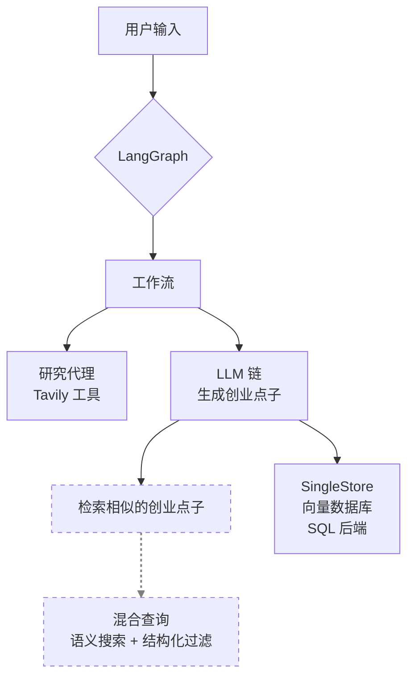

# Agentic AI 系统架构概览**

视频首先展示了整个系统的架构图，解释了其工作流程。

**系统架构图**



**流程解读:**

1.  **用户输入 (User Input):** 用户提出一个想法或问题，例如“AI在旅游行业的应用”。
2.  **LangGraph:** 这是整个工作流的核心控制器，负责协调不同模块和代理之间的交互。
3.  **工作流 (Workflow):**
    *   **研究代理 (Research Agent):** 利用像 **Tavily** 这样的搜索工具，在互联网上进行信息检索，收集相关数据和见解。
    *   **LLM 链 (LLM Chain):** 将研究代理收集到的信息，通过大语言模型（LLM）处理，生成一个结构化的创业点子或商业计划书。
4.  **数据存储与检索 (Data Storage & Retrieval):**
    *   **SingleStore:** 这是一个既支持SQL又支持向量存储的数据库。所有生成的创业点子都会被存储在这里，作为向量数据库和SQL后端。
    *   **检索相似点子 (Retrieve similar startup ideas):** 当有新的点子生成时，系统可以（可选地）通过**混合查询**（结合语义搜索和结构化过滤）在SingleStore中检索历史上相似的创业点子，以供参考或避免重复。

---

### **什么是 Agentic AI (智能代理AI)?**

与传统的问答式、一次性响应的大语言模型应用不同，Agentic AI 系统被设计用来模拟**目标驱动的行为**。

**Agentic AI 架构核心组件图**


**核心能力:**

*   **感知 (Perceive):** 能够接收和理解来自环境的输入。
*   **推理 (Reason):** 对获取的信息进行分析和逻辑处理。
*   **规划 (Plan):** 制定一系列行动步骤以达成目标。
*   **行动 (Act):** 利用工具（如搜索引擎、数据库）执行计划。
*   **反馈循环 (Feedback Loop):** 系统会持续迭代，直到达成预设的目标。

**发言人总结:** 这些系统是**持久的、多步骤的、自主的**，这使得它们非常强大。

---

### **LangChain vs. LangGraph**

视频特别对比了LangChain和LangGraph的区别。

*   **LangChain:** 主要使用“链（Chain）”的概念，数据流通常是**线性的**，从A到B再到C。
*   **LangGraph:** 使用“图（Graph）”的结构，允许定义**节点（Nodes）**和**边（Edges）**，从而构建更复杂的、非线性的、带有循环和条件分支的工作流，就像流程图一样。


**LangGraph可以被理解为：** `LangChain + 图结构 + 内存 + 反馈循环`，功能远超传统的LangChain。

### **LangGraph 工作流详解**

视频进一步解释了LangGraph的工作流是如何通过节点和边来构建的。


*   **状态 (State):** 在整个工作流中传递的数据对象。
*   **节点 (Node):** 代表工作流中的一个具体步骤，比如一个与用户交互的**代理（Agent）**，或者一个执行特定任务的**工具（Tool）**。
*   **边 (Edge):** 连接不同的节点，定义了工作流的方向。它可以是条件性的，根据上一个节点的结果决定下一步“去哪里（Where to go）”。

---

### **代码开发与演示**

视频的后半部分展示了实际的代码和运行效果。

**项目文件结构:**

在VS Code中，可以看到项目包含以下关键部分：
*   **agents/**: 存放不同功能的代理。
    *   `research_agent.py`: 负责信息检索的代理。
    *   `summarizer_agent.py`: 负责总结信息的代理。
    *   `pitch_generator_agent.py`: 负责生成最终创业点子的代理。
*   **graph/**:
    *   `orchestrator.py`: 使用LangGraph构建和协调整个工作流。
*   **vectorstore/**:
    *   与SingleStore数据库交互的逻辑。
*   `app.py`: 应用的主入口文件，负责接收用户输入并调用图工作流。
*   `similar_queries.py`: 用于查询相似历史记录的脚本。
*   `.env`: 存放API密钥和数据库连接信息等环境变量。

**核心代码逻辑 (`app.py`):**

```python
def main():
    # 接收用户输入
    topic = input("Enter your startup idea or target market: \n")
    print(f"\nRunning Startup Intelligence Agent for: {topic}...\n")

    # 构建并获取LangGraph图实例
    graph = build_graph(topic)
    
    # 调用图工作流来执行任务
    result = graph.invoke({})
    
    # 打印最终生成的创业点子
    print("\nGenerated Pitch:\n")
    print(result["pitch"])

if __name__ == "__main__":
    main()

```

**运行演示:**

1.  **启动应用:**
    ```bash
    python app.py
    ```

2.  **用户输入:**
    ```
    Enter your startup idea or target market: The use of AI is travel industry
    ```

3.  **代理执行过程 (Agent Executor Chain):**
    *   **思考:** 代理首先确定需要找到关于“AI在旅游行业的最新趋势”的信息，并识别出该领域的主要竞争对手。
    *   **行动:** 调用`tavily_search_results.json`工具，输入关键词“latest trends in AI in the travel industry”。
    *   **观察:** 从搜索结果中获取到多篇文章链接和摘要，内容涵盖了AI在旅游业中的应用，如个性化行程规划、聊天机器人、预测性预订工具等。
    *   **再次行动:** 再次调用搜索工具，查询“main competitors in AI in the travel industry”。
    *   **最终答案:** 综合所有信息，总结出AI在旅游业的最新趋势，并列出主要竞争对手，如 Snowflake, IBM, NVIDIA, Microsoft, AWS, Salesforce, Google LLC, Amadeus IT Group, Booking.com, TripAdvisor, KAYAK, and Expedia Group。

4.  **生成创业点子 (Generated Pitch):**
    应用最终输出一份结构化的创业计划书，包含以下部分：
    *   **I. 引言 (Introduction):** 介绍公司和使命。
    *   **II. 问题陈述 (Problem Statement):** 描述旅行者在规划和预订过程中面临的挑战。
    *   **III. 我们的解决方案 (Our Solution):** 介绍AI驱动的个性化行程规划和预订解决方案。
    *   **IV. 竞争格局 (Competitive Landscape):** 列出主要竞争对手。
    *   **V. 我们解决方案的优势 (Benefits of Our Solution):** 阐述方案如何帮助旅行者和旅游公司。
    *   **VI. 结论 (Conclusion):** 总结要点。
    *   **VII. 行动号召 (Call to Action):** 邀请潜在客户或投资者进行下一步沟通。

### **SingleStore 数据库集成**

视频最后展示了SingleStore的云数据库控制台。

*   **工作区与数据库:** 用户可以创建工作区（Workspace）和数据库（Database）。视频中创建了一个名为`Agents`的数据库。
*   **数据存储:** 当AI代理运行后，生成的内容和其向量嵌入（Embeddings）被存储在数据库的表中。
*   **数据查看:** 在控制台可以查看存储的数据，包括ID、内容（Content）、向量（Vector）和元数据（Metadata）。
*   **相似性搜索:** 由于数据以向量形式存储，因此可以轻松地执行语义搜索，找出与新查询相似的历史记录。例如，当再次运行`similar_queries.py`并输入“AI in travel”时，系统能够从数据库中快速检索出之前分析过的最相关的三条记录。

这个演示清晰地展示了如何利用Agentic AI架构、LangGraph的灵活性以及SingleStore的混合数据存储能力，构建一个端到端的、能够进行研究、分析并生成复杂内容的智能应用。