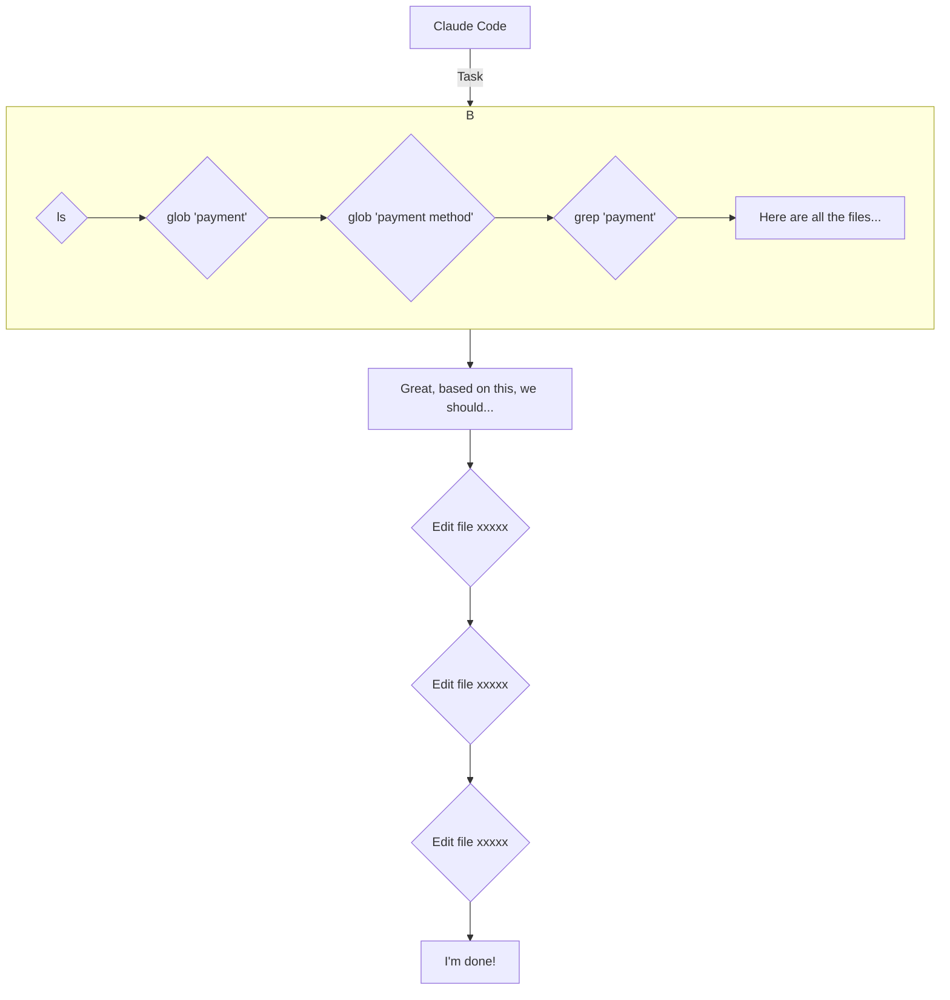
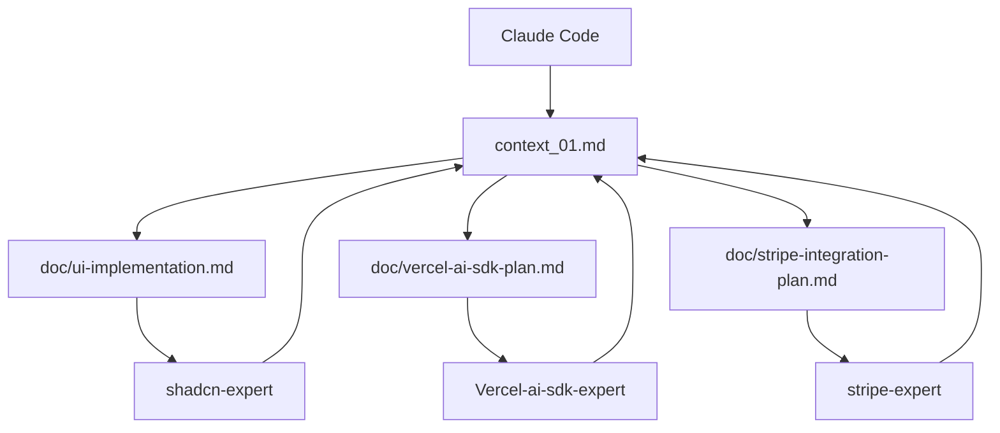

好的，这就为您详细解读影片内容：

### **前言**

影片主要介绍了 Claude Code 的子代理（sub-agent）功能，并探讨了其最佳实践方法。影片中，主讲人分享了自己从最初的负面体验到后来掌握诀窍，从而大幅提升 Claude Code 性能的过程。

### **Claude Code 子代理功能介绍**

Claude Code 推出的子代理功能，允许使用者创建自己的人工智慧代理团队。

*   **后端架构师（backend-architect）**：负责设定资料库结构和 API。
*   **前端开发者（frontend-developer）**：负责建立使用者介面元件。
*   **支付整合商（payment-integrator）**：负责处理支付流程。

然而，许多使用者在初期体验中发现，子代理运行缓慢，消耗大量 token，且使用者无法看到具体的变更过程，导致体验不佳。

### **深入理解子代理的设计初衷**

要掌握子代理的最佳实践，首先需要理解其设计的初衷——**脉络工程（Context Engineering）与脉络最佳化（Context Optimization）**。

#### **传统 Claude Code 代理的工作模式**

在没有子代理的情况下，Claude Code 代理的工作流程如下：

1.  **接收任务**：例如，研究哪个档案包含支付功能。
2.  **执行一系列工具**：
    *   `ls`：列出档案。
    *   `glob 'payment'`：搜寻包含 "payment" 的档案。
    *   `glob 'payment method'`：搜寻包含 "payment method" 的档案。
    *   `read 'payment.tsx'`：读取特定档案。
    *   ...
3.  **问题**：在执行修改档案的指令前，仅研究阶段就可能用掉 **80% 的脉络视窗（context window）**。

<br>

**Claude Code 代理工具集**

| 基础工具 | 进阶工具 |
| :--- | :--- |
| **Bash** | **Plan** |
| `bash` | `TodoWrite` |
| `ExitPlanMode` |
| **Context** | **Run parallel sub agents** |
| `context` | `Task` |
| `glob` |
| `grep` |
| `read` |
| `ls` |
| **File operation** |
| `edit` |
| `multi-edit` |
| `write` |
| **Notebook** |
| `notebookread` |
| `notebookwrite` |

<br>

由于 `read` 等工具会消耗大量 token，当脉络视窗被填满时，系统会触发 `compact` 指令来压缩对话历史，这会导致 Claude Code 失去部分脉络，从而影响其性能。

#### **子代理的最佳实践：分工与脉络最佳化**

引入子代理的核心目的，是将**研究与规划**和**执行**分离。

1.  **任务指派**：主代理（Parent Agent）将研究任务指派给一个子代理。
2.  **子代理执行研究**：子代理执行 `ls`, `glob`, `grep`, `read` 等高 token 消耗的操作。
3.  **回报摘要**：子代理完成研究后，不会将所有详细步骤都回报给主代理，而是提供一份**摘要**，例如：「以下是所有包含支付相关内容且需要您修改的档案：xxxxxx」。
4.  **主代理执行**：主代理根据这份简洁的摘要，开始执行具体的修改档案等操作。

<br>

**工作流程图**


<br>

透过这种方式，原本可能消耗 **90k+ tokens** 的研究过程，被压缩成仅有几百个 token 的摘要。这大大节省了主代理的脉络视窗，使其能够更专注于执行任务。

**核心理念**：子代理应被视为**研究员**，负责大量的资讯收集和整理工作，并将结果以精简的形式回馈给主代理。

### **创建专家子代理**

基于上述理念，我们可以为不同的服务或框架创建专门的**专家子代理**。

*   **shadcn-expert**：
    *   `shadnc theme MCP`
    *   `shadnc component MCP`
*   **Vercel-ai-sdk-expert**：
    *   `latest vercel ai sdk v5 doc`
*   **stripe-expert**：
    *   `latest stripe docs`
    *   `context7`

<br>

**子代理的建立规则**

*   **在系统提示中包含文件（Doc in system prompt）**：将相关的最新文件和最佳实践直接写入子代理的系统提示中。
*   **提供检索脉络的工具（Tools to help retrieve context）**：为子代理提供专门的工具（如 MCP），使其能够高效地获取所需资讯。

### **实例演练：建立一个 ChatGPT 复制品**

#### **1. 设定上下文共享机制**

主讲人设计了一套基于档案系统的上下文共享机制：

*   `.claude/`
    *   `Task/`
        *   `context_01.md`：储存专案的整体脉络和计画。
    *   `Doc/`
        *   `ui-implementation.md`：UI 实现计画。
        *   `vercel-ai-sdk-plan.md`：Vercel AI SDK 整合计画。
        *   `stripe-integration-plan.md`：Stripe 整合计画。

<br>

**工作流程图**



<br>
#### **2. 程式码实作展示**

影片中展示了如何透过指令行与 Claude Code 互动，建立一个类似 ChatGPT 的应用。

**建立新专案**
```bash
pnpx d1x shadcn@latest init
cd my-app
claude
/init
```

**主代理的指令**

```bash
Help me build a replica of chatGPT, using shadcn as frontend, and vercel ai sdk 5 as AI service;
Lets firstly build the UI, make sure we consult the subagent
```

**子代理 `shadcn-ui-expert` 的任务**

子代理接收到的指令会非常具体：

```
Prompt: I need to build a ChatGPT replica UI using shadcn/ui components in a Next.js 15.4.6 app with App Router.

Please read the context file at '.claude/tasks/context_session_1.md' first to understand the project.

Then, design and plan the UI implementation...
...
After completing your research and planning, update the context file at '.claude/tasks/context_session_1.md' with your findings and create a detailed plan document at '.claude/doc/chatgpt_ui_implementation_plan.md'.
```
<br>

子代理完成后，主代理会读取其生成的计画档案，并开始执行具体的 UI 建立工作。

#### **3. 整合 Vercel AI SDK**

```bash
Great next lets do the vercel AI SDK integration, and make sure you consult the sub agent```

此指令会触发 `vercel-ai-sdk-implementation-planner` 子代理，该代理同样会先读取上下文档案，然后根据其内建的 Vercel AI SDK v5 知识，生成一份详细的整合计画。主代理再根据此计画完成后续的程式码编写和整合工作。

### **结论**

通过将研究和执行分离，并利用文件系统进行上下文共享，可以大幅提升 Claude Code 子代理的性能和可靠性。这种**专家子代理**的模式，使得每个代理都能专注于其擅长的领域，从而共同高效地完成复杂的开发任务。