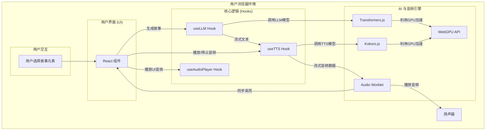
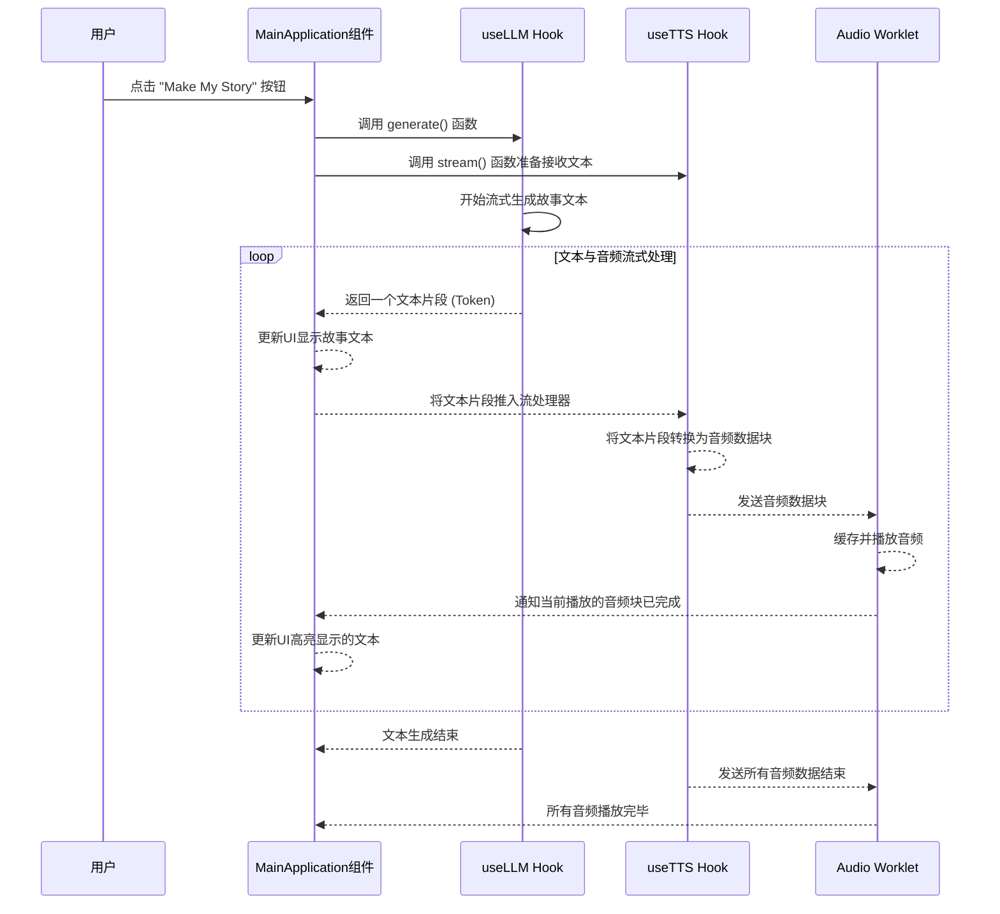
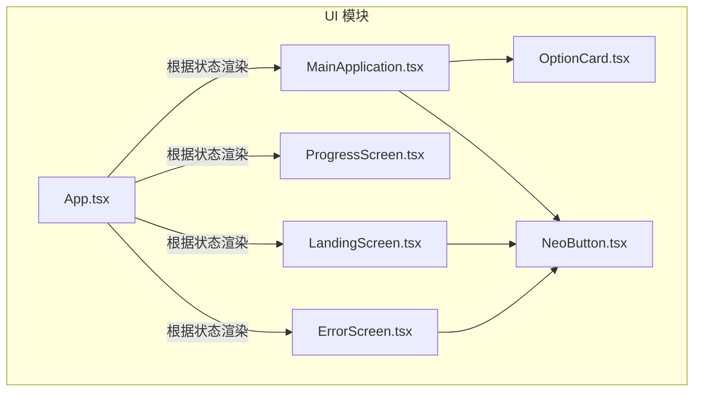
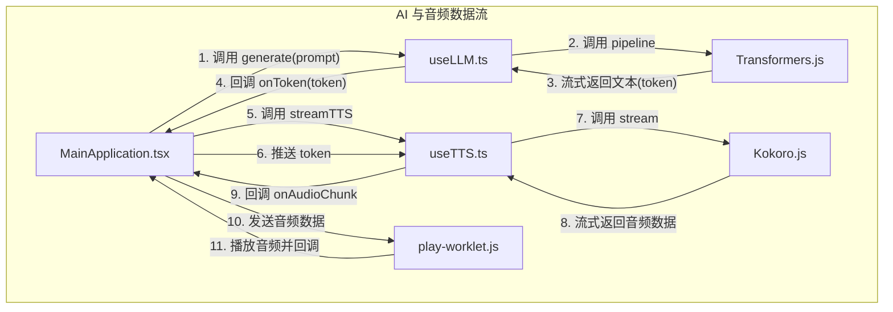

# Bedtime Story Generato项目

`Bedtime Story Generator` 是一个创新的前端 Web 应用，其核心功能是利用尖端的设备端（On-Device）人工智能技术，即时生成并朗读个性化的睡前故事。用户只需通过简单的点选，组合不同的角色、场景、情节和主题，即可在数秒内创作出一篇独一无二的故事。该项目最大的亮点在于其完全在用户的浏览器中运行，无需任何后端服务器支持故事的生成与朗读，这不仅保证了用户的隐私安全，也使得应用在模型加载完成后可以离线使用。

该项目旨在解决现代父母或故事创作者对于快速、多样化、富有想象力的故事内容的需求。在快节奏的生活中，每天都构思新的故事是一项挑战。此生成器通过提供丰富的预设选项和自定义输入功能，极大地降低了创作门槛，激发用户的创造力。其目标用户群体非常广泛，包括为孩子寻找新鲜故事的父母、需要教学素材的幼儿教师，以及任何喜爱创意写作和奇幻故事的用户。

从技术实现上看，项目通过集成 Hugging Face Transformers.js 和 Kokoro.js 库，直接在浏览器中利用 WebGPU 的计算能力加载并运行了 Gemma 3 270M 语言模型和 Kokoro 文本转语音（TTS）模型。当用户点击生成按钮后，应用首先根据用户的选择构建一个提示（Prompt），然后将其输入语言模型以流式（Streaming）生成故事文本。与此同时，生成的文本流被实时地送入 TTS 模型，转换为音频流。最后，通过 Audio Worklet 技术，音频被平滑地播放出来，并且页面上的文字会同步高亮显示，为用户提供一种沉浸式的“边听边看”的阅读体验。这种纯前端的 AI 实现方案是项目最核心的技术特色，代表了 Web 应用发展的一个前沿方向。

## 技术栈

*   **编程语言**:
    *   TypeScript
    *   JavaScript
*   **框架与库**:
    *   **React**: 用于构建用户界面的核心框架。
    *   **Tailwind CSS**: 一个功能类优先的 CSS 框架，用于快速构建现代化界面。
    *   **Lucide React**: 提供简洁、一致的图标集。
*   **构建与工具**:
    *   **Vite**: 新一代前端构建工具，提供极速的开发服务器和优化的打包体验。
    *   **ESLint**: 用于代码质量检查和风格统一。
    *   **TypeScript**: 为 JavaScript 添加静态类型，增强代码的可维护性和健壮性。
*   **主要外部依赖**:
    *   **@huggingface/transformers**: Hugging Face 官方的 JavaScript 库，使得在浏览器中直接运行 Transformers 模型成为可能。本项目使用它来加载和运行 Gemma 语言模型。
    *   **kokoro-js**: 一个高效的、可在浏览器中运行的文本转语音库。本项目用它来实现故事的实时朗读功能。

## 可视化图表

### 系统架构图



### 关键调用流程图 (故事生成与朗读)



## 模块解析

### 1. 核心应用与状态管理模块

*   **模块名称**: `Application Core & State`
*   **核心职责**: 作为应用的入口和心脏，负责管理整个应用的生命周期、UI 状态切换、数据流转以及整合所有子模块。
*   **关键文件/组件**:
    *   `src/App.tsx`:
        *   **功能**: 顶层组件，负责管理应用的核心状态（如 `landing`, `loading`, `main`, `error`）。
        *   **逻辑**: 初始化 AI 模型（LLM 和 TTS），设置音频上下文（Audio Context）和音频工作线程（Audio Worklet）。根据模型加载的进度和结果，控制显示欢迎界面、进度条、主应用界面或错误界面。
        *   **关系**: 它是所有视图组件的父容器，并通过 props 将模型生成函数、音频播放控制等核心功能传递给 `MainApplication` 组件。
    *   `src/components/MainApplication.tsx`:
        *   **功能**: 应用的主交互界面，用户在此选择故事元素、触发生成、查看和收听故事。
        *   **逻辑**:
            *   使用 `useReducer` (storyReducer) 来管理故事选项的状态（角色、场景、物品等），逻辑清晰且易于扩展。
            *   `generateStory` 函数是核心业务流程的起点，它协调 LLM 的文本生成和 TTS 的音频流式合成。
            *   通过监听 Audio Worklet 返回的消息来更新当前朗读文本的高亮，实现了音文同步。
            *   处理 UI 状态，如加载中（isLoading）、随机选择中（isShuffling）等。
        *   **关系**: 引用 `OptionCard` 和 `NeoButton` 来构建 UI，并调用从 `App.tsx` 传入的 `generate` 和 `streamTTS` 方法来与 AI 模块交互。
*   **代码特性**:
    *   **状态机思想**: `App.tsx` 中的 `appState` 变量（landing, loading, main, error）清晰地定义了应用的几种可能状态，使得应用流程和UI展示逻辑非常明确。
    *   **Reducer 状态管理**: 在 `MainApplication.tsx` 中使用 `useReducer` 管理复杂的故事配置状态，使得状态变更的逻辑（如 `SET_FIELD`, `SURPRISE_ME`, `RESET`）被集中处理，优于使用多个 `useState`。

### 2. AI 模型集成模块

*   **模块名称**: `AI Model Hooks`
*   **核心职责**: 封装与底层 AI 库的交互，为上层应用提供简洁、易用的接口来加载模型、生成文本和合成语音。
*   **关键文件/组件**:
    *   `src/hooks/useLLM.ts`:
        *   **功能**: 负责加载和运行文本生成模型 (Gemma)。
        *   **逻辑**: 暴露 `load` 和 `generate` 两个核心函数。`load` 函数使用 Transformers.js 的 `pipeline` API 异步加载模型，并通过回调更新加载进度。`generate` 函数接收用户输入，并使用 `TextStreamer` 以流式方式返回生成的文本。
        *   **关系**: 被 `App.tsx` 调用以加载模型，其 `generate` 方法被传递给 `MainApplication.tsx` 以生成故事。
    *   `src/hooks/useTTS.ts`:
        *   **功能**: 负责加载和运行文本转语音模型 (Kokoro)。
        *   **逻辑**: 暴露 `load` 和 `stream` 函数。`load` 函数负责加载 Kokoro TTS 模型。`stream` 函数是关键，它创建一个 `TextSplitterStream`，接收来自 LLM 的文本流，并将其输入 TTS 模型进行流式音频合成，最后通过回调函数输出音频数据块。
        *   **关系**: 被 `App.tsx` 调用以加载模型，其 `stream` 方法被 `MainApplication.tsx` 用于实时语音合成。
*   **代码特性**:
    *   **关注点分离**: 将复杂的模型加载、缓存和执行逻辑封装在自定义 Hook 中，使得业务组件（如 `MainApplication`）无需关心 AI 模型的具体实现细节。
    *   **全局缓存**: 使用 `globalThis` 对象 (`__LLM`, `__TTS`) 来缓存已加载的模型实例。这是一个非常实用的优化，可以防止在组件重渲染或开发环境热重载时重复下载和初始化庞大的模型，极大地提升了二次加载速度和开发体验。
    *   **流式处理**: `useLLM` 和 `useTTS` 都完美支持流式处理，这是实现“即时响应”和“音文同步”功能的关键技术。

### 3. 音频子系统模块

*   **模块名称**: `Audio Subsystem`
*   **核心职责**: 管理应用中的所有音频播放，包括背景音乐、UI 音效以及由 TTS 生成的流式语音。
*   **关键文件/组件**:
    *   `src/hooks/useAudioPlayer.ts`:
        *   **功能**: 管理非流式的音频资源，如背景音乐和按钮点击音效。
        *   **逻辑**: 封装了 `HTMLAudioElement` 的创建和播放控制，提供了如 `toggleMusic`, `playPopSound` 等简洁的 API。
        *   **关系**: 被 `App.tsx` 用来控制背景音乐，并将其 `playPopSound` 等函数传递给子组件以响应用户交互。
    *   `src/play-worklet.js`:
        *   **功能**: 运行在独立线程中的音频处理器，负责高效、无阻塞地播放来自 TTS 模块的音频流。
        *   **逻辑**: 内部维护一个音频块队列 (`bufferQueue`)。`process` 方法不断从队列中取出数据填充到音频输出缓冲区。当一个音频块播放完毕时，通过 `postMessage` 向主线程发送 `next_chunk` 消息，用于触发UI更新。
        *   **关系**: 在 `App.tsx` 中被加载到 `AudioContext`。`MainApplication` 通过 `audioWorkletNode.port.postMessage` 将 TTS 生成的 `Float32Array` 音频数据发送给它。
*   **代码特性**:
    *   **Audio Worklet 的高效应用**: 使用 `AudioWorklet` 是处理实时生成音频的最佳实践。它将音频处理任务从主线程中分离出去，避免了当主线程繁忙（例如，在进行复杂的 React 渲染时）可能导致的音频卡顿或爆音，确保了流畅的听觉体验。
    *   **双向通信机制**: 通过 `port.onmessage` 和 `port.postMessage` 实现了主线程与 Audio Worklet 线程之间的双向通信，这是实现音文同步高亮功能的关键。主线程发送音频数据，Worklet 在播放关键节点（如一个分句结束）时发送通知回来。

## 各个模块内文件/组件/功能关系图

### UI 模块内组件关系图



### AI 与音频模块数据流图



## 典型应用场景

假设一位父亲想在晚上给他的女儿讲一个独一无二的睡前故事。

1.  **打开应用**: 他在平板电脑上打开了“Bedtime Story Generator”的网址。一个带有“✨ Bedtime Story Generator ✨”标题和“Start Creating”按钮的欢迎界面出现了。
2.  **开始创作**: 他点击“Start Creating”。界面上显示出一个进度条，提示“Warming up the magic...”，几秒钟后，模型加载完成，背景响起了轻柔的音乐，主应用界面出现。
3.  **选择元素**: 他看到了几个选项卡：
    *   在“1. Choose a Character”中，他选择了“a shy dragon”（一只害羞的龙）。
    *   在“2. Pick a Setting”中，他选择了“in a castle made of clouds”（在一座云朵做的城堡里）。
    *   在“3. Add a Twist”中，他选择了“discovers a map to hidden treasure”（发现了一张藏宝图）。
    *   在“4. Select a Theme”中，他点击了“Magical”（魔幻）。
    *   在“5. Story Length”中，他选择了“Medium”（中等）。
4.  **生成故事**: 他点击了黄色的“Make My Story”按钮。背景音乐渐弱停止，按钮显示加载状态，故事面板滚动到视图中。
5.  **沉浸式体验**: 几乎是立刻，故事面板中开始逐字浮现故事内容，同时一个温柔的声音开始朗读：“在一座漂浮于天际的云朵城堡里，住着一条名叫德拉科的害羞小龙...”。随着声音的朗读，对应的文字会实时以黄色背景高亮显示。
6.  **互动与随机性**: 第二天晚上，为了获得新的灵感，他点击了“Surprise Me!”按钮。所有的选项卡开始快速随机切换，最终停留在“a clever fox in an enchanted forest befriends a friendly ghost”（一只聪明的狐狸在魔法森林里与一个友好的幽灵交朋友）的组合上。他再次点击生成，又获得了一个全新的故事。

这个场景展示了项目如何通过简单的交互，快速生成高质量、个性化且带有音频朗读的故事，为亲子互动提供了极大的便利和乐趣。

## 产品研发参考

### 如果我是产品经理

我应该借鉴该项目以下优秀的设计和产品思路：

1.  **设备端 AI 的极致体验 (Privacy-First & Offline-Capable)**:
    *   **设计思路**: 将计算密集型的 AI 任务完全置于客户端，是该产品最核心的价值主张。这不仅解决了用户对数据隐私的担忧（故事内容永不离开设备），还消除了对服务器的依赖，降低了运营成本，并为应用赋予了“离线可用”的潜力。
    *   **如何应用**: 这个思路可以推广到更多创意工具类产品中。例如，可以开发一个“浏览器内的图片风格转换器”、“本地运行的诗歌生成器”或“隐私安全的会议纪要总结工具”。在宣传上，应大力强调“无需联网、保护隐私、无服务器费用”这些独特的优势。

2.  **流式交互的沉浸感 (Streaming First)**:
    *   **设计思路**: 项目没有让用户在点击生成后漫长等待，而是几乎同步地展示文本、朗读音频和高亮文本。这种“流式”的反馈机制极大地提升了用户的参与感和即时满足感，将等待过程变成了产品体验的一部分。
    *   **如何应用**: 在任何涉及 AI 生成的内容型产品中，都应优先考虑流式输出。无论是生成代码、文章还是对话，让内容“活”起来，逐字或逐句地呈现，都能显著优化用户体验。同时，可以设计与流式输出联动的交互，比如允许用户在生成过程中随时打断并修改方向。

3.  **“惊喜我”功能的引导与降维 (Delightful Simplicity)**:
    *   **设计思路**: 对于有选择困难症或缺乏灵感的用户，“Surprise Me”按钮是一个绝佳的解决方案。它通过一次点击完成所有设置，降低了用户的决策成本，并带来了探索未知的趣味性，增加了产品的可玩性和重复使用率。
    *   **如何应用**: 在任何需要用户进行多项配置或选择的产品中，都可以加入一个“一键配置”或“随机推荐”功能。例如，在视频剪辑软件中可以有“一键生成模板”，在数据可视化工具中可以有“智能推荐图表”，这能有效帮助新用户快速上手并体验到产品的核心价值。

### 如果我是技术架构师

我应该复用该项目中以下优秀的设计和技术：

1.  **基于自定义 Hooks 的 AI 能力模块化封装**:
    *   **设计思路**: 项目将 LLM 和 TTS 的复杂逻辑分别封装在 `useLLM` 和 `useTTS` 两个 Hook 中。这种设计极大地降低了系统耦合度。UI 组件只需调用 `generate()` 或 `stream()` 等简单函数，而无需关心模型如何加载、在哪运行、如何处理数据流等底层细节。
    *   **如何复用**: 这是现代前端应用架构的典范。当需要在大型应用中集成第三方复杂服务（如图表库、地图服务、支付SDK等）时，都可以采用这种模式。
    *   **具体实例**:
        ```typescript
        // 伪代码: 封装一个地图服务Hook
        // src/hooks/useMapService.ts
        import MapLib from 'some-map-lib';

        // 全局缓存地图实例
        const g = globalThis as any;
        let mapInstance: MapLib | null = g.__MAP__ || null;

        export function useMapService(containerId: string) {
          const [isReady, setIsReady] = useState(!!mapInstance);

          useEffect(() => {
            if (mapInstance) return;
            const map = new MapLib(containerId, { apiKey: '...' });
            map.on('load', () => {
              mapInstance = map;
              g.__MAP__ = map;
              setIsReady(true);
            });
          }, [containerId]);

          const addMarker = (coords) => mapInstance?.addMarker(coords);
          const panTo = (coords) => mapInstance?.panTo(coords);

          return { isReady, addMarker, panTo };
        }
        ```

2.  **Audio Worklet 在流式音频播放中的健壮应用**:
    *   **设计思路**: 对于实时性要求高的音频播放（如本项目的TTS流），使用 `AudioWorklet` 是防止主线程阻塞导致音频卡顿的最佳方案。它将音频数据的处理和排队播放完全移交给一个独立的后台线程，保证了音频输出的稳定性和流畅性。
    *   **如何复用**: 该技术可以直接应用于任何需要在浏览器中进行音频处理的场景，例如：在线乐器、语音聊天应用、音频可视化工具、或者在网页中动态生成音效。`play-worklet.js` 的实现是一个非常通用的“缓冲播放器”，可以直接复用。
    *   **具体实例**:
        1.  将 `play-worklet.js` 文件复制到新项目中。
        2.  在主应用逻辑中初始化 `AudioContext` 并添加该模块。
        3.  创建一个 `AudioWorkletNode` 实例并连接到输出。
        4.  当从 WebSocket 或其他来源接收到音频数据（`Float32Array`）时，通过 `workletNode.port.postMessage(audioData)` 将其发送给 Worklet 进行播放。

3.  **利用 WebGPU 实现客户端高性能计算**:
    *   **设计思路**: 项目通过 `Transformers.js` 和 `Kokoro.js` 间接利用了 WebGPU。这展示了将传统上需要在服务器完成的重度计算任务（如神经网络推理）转移到现代浏览器中的可行性，大大扩展了 Web 应用的能力边界。
    *   **如何复用**: 当需要开发计算密集型的前端应用时（例如：3D渲染、物理模拟、图像视频处理、科学计算），应优先考虑使用 WebGPU。可以直接使用支持 WebGPU 后端的库（如 `Transformers.js`, `TensorFlow.js`, `Babylon.js`），或者直接编写 WGSL 着色器代码来利用 GPU 的并行计算能力。这是一个可以颠覆许多传统C/S架构应用领域的技术方向。