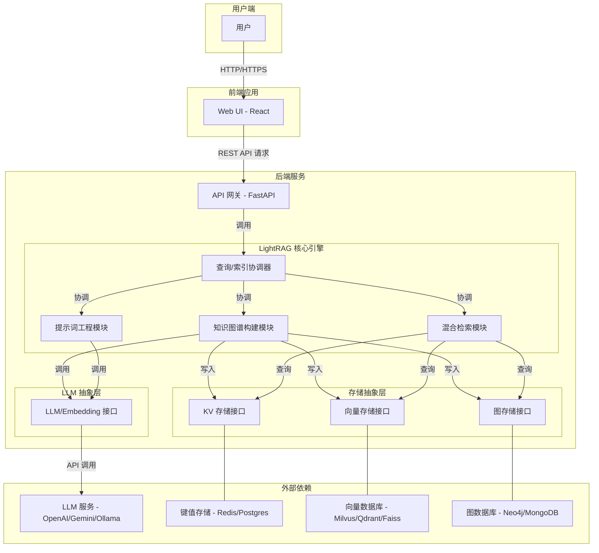
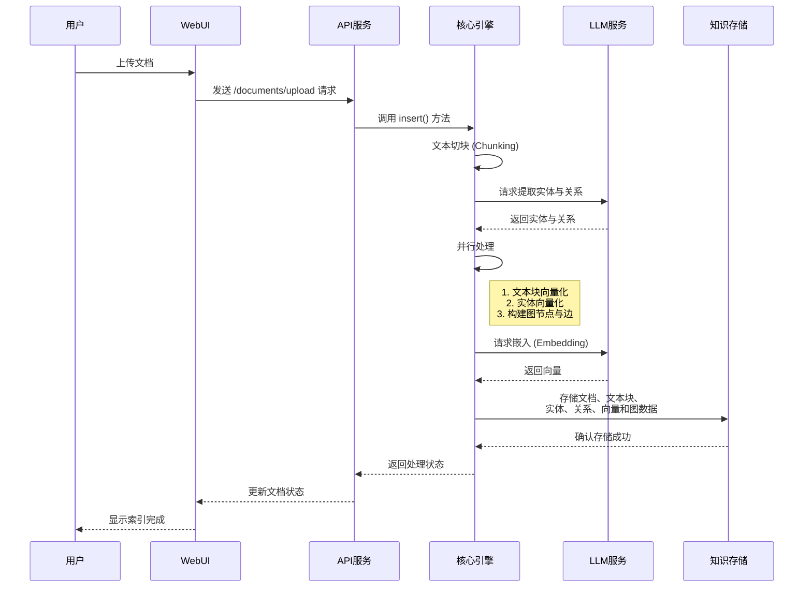
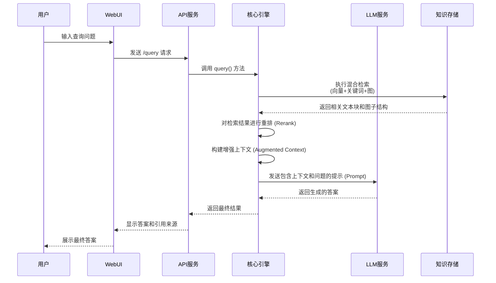
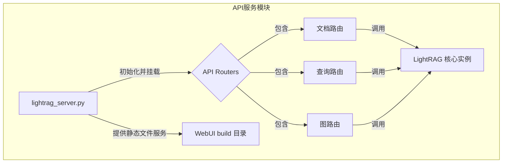
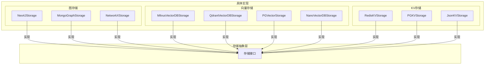

# LightRAG 项目概述

LightRAG 是一个专为高效、轻量级检索增强生成（Retrieval-Augmented Generation, RAG）而设计的先进框架。它巧妙地将大型语言模型（LLM）的强大生成能力与外部知识库的精确性相结合，旨在解决传统语言模型在处理需要特定、实时或专有知识的任务时可能出现的“幻觉”和信息过时问题。项目的核心设计理念是“简单与快速”，通过模块化的架构和对知识图谱的深度集成，为开发者提供一个灵活、可扩展且易于部署的 RAG 解决方案。

该项目的核心用途是构建能够理解复杂信息并生成精准、有据可依答案的智能应用。与仅依赖向量搜索的传统 RAG 系统不同，LightRAG 创新性地引入了知识图谱作为其核心组件。在处理非结构化数据（如 PDF、Word 文档、纯文本）时，系统不仅会将其切分为文本块（Chunks）并进行向量化，还会通过 LLM 自动提取文本中的实体（Entities）和关系（Relations），构建一个结构化的知识图谱。这种“双重知识表示”机制使得系统在检索时，既能利用向量数据库进行快速的语义相似度匹配，也能通过知识图谱进行深度的逻辑关系推理和路径发现。

主要功能包括：
1.  **混合检索能力**：结合了向量检索、关键词检索和图检索，能够根据查询的性质动态选择最优的检索策略，从而显著提升信息召回的准确性和相关性。
2.  **自动化知识图谱构建**：能够从上传的文档中自动抽离出实体和关系，无需手动定义图谱结构，极大地降低了知识工程的门槛。
3.  **高度模块化与可扩展性**：项目的架构设计清晰，将 LLM 服务、向量存储、图数据库、键值存储等完全解耦。开发者可以像搭积木一样，轻松替换或集成不同的后端服务，例如使用 OpenAI、Gemini 或本地部署的 Ollama 作为语言模型，选择 Neo4j、MongoDB 作为图数据库，或使用 Milvus、Qdrant、PostgreSQL (pgvector) 作为向量存储。
4.  **一体化的 Web UI 和 API**：项目自带一个基于 React 的现代化 Web 用户界面，提供了文档管理、知识图谱可视化、检索测试和 API 调试等功能。这使得非技术用户也能直观地与系统交互，并清晰地看到知识的组织形式和模型的检索过程。同时，所有核心功能都通过标准的 RESTful API 暴露，便于集成到现有的企业应用或工作流中。
5.  **云原生部署支持**：项目提供了完整的 Docker 和 Kubernetes（Helm Chart）部署方案，支持一键式部署整个应用及其依赖的数据库服务，非常适合在现代云环境中进行规模化部署和运维。

LightRAG 的目标用户主要是需要构建高级问答系统、智能知识库、专业领域（如金融、法律、医疗）智能助手等应用的开发者和企业。它解决了在海量、复杂的非结构化文档中进行精准信息检索和深度关系挖掘的痛点，通过图谱的可视化，让 RAG 的“黑盒”过程变得更加透明和可解释。

## 技术栈

*   **编程语言**:
    *   Python (后端核心逻辑)
    *   TypeScript (前端 WebUI)

*   **框架与库**:
    *   **后端**:
        *   FastAPI: 用于构建高性能的异步 API 服务。
        *   Pydantic: 用于数据验证和模型定义。
        *   NetworkX: 用于处理和操作图数据结构。
        *   NumPy / Pandas: 用于数值计算和数据处理。
        *   Asyncio: 用于实现高并发的异步 I/O 操作。
        *   Tenacity: 用于实现健壮的重试逻辑。
    *   **前端**:
        *   React: 用于构建用户界面的核心库。
        *   Vite: 下一代前端开发与构建工具。
        *   Tailwind CSS: 一个功能类优先的 CSS 框架。
        *   Sigma.js: 用于高性能、交互式图表可视化。
        *   Zustand: 轻量级的 React 状态管理库。
        *   React Table, Radix UI: 用于构建高质量的 UI 组件。
    *   **LLM 与嵌入**:
        *   OpenAI: 与 OpenAI API 集成。
        *   Tiktoken: 用于精确计算 Token 数量。
        *   Sentence Transformers (Hugging Face): 用于本地嵌入模型。

*   **构建与工具**:
    *   Docker / Docker Compose: 用于应用容器化和本地环境编排。
    *   Kubernetes (Helm): 用于在 K8s 集群中进行自动化部署、扩展和管理。
    *   Pre-commit / Ruff: 用于代码格式化和静态检查，保证代码质量。
    *   GitHub Actions: 用于 CI/CD，自动化测试、构建和发布流程。
    *   Bun: 高性能的 JavaScript 运行环境、打包器、测试运行器和包管理器。

*   **主要外部依赖**:
    *   **数据库与存储**:
        *   **图数据库**: Neo4j, Memgraph, MongoDB
        *   **向量数据库**: Milvus, Qdrant, Faiss, PostgreSQL (pgvector), NanoVectorDB
        *   **键值/文档存储**: Redis, PostgreSQL, MongoDB, 本地 JSON 文件
    *   **LLM 服务**:
        *   OpenAI (GPT 系列)
        *   Google (Gemini)
        *   Ollama (本地模型)
        *   Amazon Bedrock (Anthropic Claude 等)
        *   Azure OpenAI
        *   NVIDIA NIM
    *   **其他**:
        *   KubeBlocks: 用于在 K8s 上简化和管理数据库集群。

## 可视化图表

#### 系统架构图

此图展示了 LightRAG 的整体架构，包括用户界面、API 服务、核心 RAG 引擎以及与外部数据存储和语言模型的交互。



#### 关键调用流程图 - 数据索引

此图描绘了当用户上传一份文档时，系统如何处理数据并将其存入知识库的完整流程。



#### 关键调用流程图 - 查询应答

此图展示了系统接收用户查询后，如何通过多阶段检索、信息整合和语言模型生成来最终提供答案的流程。



## 模块解析

LightRAG 项目的结构清晰，可以划分为以下几个核心模块：

#### 1. **`lightrag` (核心引擎模块)**

*   **核心职责**:
    这是项目的心脏，负责编排整个 RAG 流程。它集成了数据处理、知识提取、多模式检索和答案生成等所有核心功能，为上层 API 提供统一的调用接口。

*   **关键文件/组件/功能**:
    *   `lightrag.py`: 定义了 `LightRAG` 主类，是所有操作的入口点。它初始化并管理存储后端和 LLM 客户端，并实现了 `insert()` 和 `query()` 这两个核心公共方法。
        *   `insert()`: 接收原始文本或文档，启动一个异步的、多阶段的数据处理流水线，包括文本分块、知识图谱提取、数据嵌入和最终存储。
        *   `query()`: 接收用户查询，执行复杂的混合检索策略（如 `naive`, `local`, `global`, `hybrid`），整合检索结果，构建提示词，并调用 LLM 生成答案。
    *   `operate.py`: 包含了数据处理的核心逻辑，如实体关系提取、数据转换、以及与存储层的交互等底层操作。
    *   `prompt.py`: 集中管理了所有与 LLM 交互时使用的提示词模板。这使得提示词的优化和管理变得非常方便，是提升 RAG 效果的关键。
    *   `rerank.py`: 实现了对初步检索结果的重排序逻辑，可以集成更高级的重排模型，以提高最终上下文的信噪比。
    *   `types.py`: 使用 Pydantic 定义了项目中使用到的核心数据结构，如 `KnowledgeGraphNode`, `KnowledgeGraphEdge` 等，保证了数据在不同模块间流转时的一致性和类型安全。

#### 2. **`lightrag.llm` (语言模型接口模块)**

*   **核心职责**:
    该模块提供了一个统一的接口，用于与各种不同的语言模型和嵌入模型服务进行交互。它将不同服务提供商的 API 差异性完全封装起来，使得核心引擎可以以一种统一的方式调用它们。

*   **关键文件/组件/功能**:
    *   `openai.py`, `azure_openai.py`, `bedrock.py`, `ollama.py`, `gemini_demo.py` (在 `examples` 中): 每个文件对应一个具体的 LLM 服务提供商。它们实现了与相应 API 的异步通信逻辑，包括请求的构建、认证处理、异常捕获和重试机制。
    *   **统一函数签名**: 该模块的设计精髓在于，无论后端是哪个模型，它都向上层提供了类似 `llm_model_func` 和 `embedding_func` 的统一函数签名。这种设计使得切换 LLM 提供商仅需在初始化 `LightRAG` 实例时更改配置，而无需修改任何核心代码，体现了优秀的可插拔性。
    *   **缓存与重试**: `openai_complete_if_cache` 等函数展示了内置的缓存机制，可以避免对相同提示词的重复请求，节省成本并提高响应速度。同时，利用 `tenacity` 库实现了强大的 API 请求重试逻辑。

#### 3. **`lightrag.kg` (知识存储模块)**

*   **核心职责**:
    这是 LightRAG 的数据持久化层，负责与所有类型的后端存储进行交互。它通过定义一套标准的存储接口，将上层逻辑与具体的数据库实现解耦。

*   **关键文件/组件/功能**:
    *   **存储接口定义**: 模块内部定义了 `KVStorage`, `VectorStorage`, `GraphStorage` 等基类或接口（虽未显式展示基类文件，但从实现可推断），规定了如 `save`, `load`, `search` 等标准操作。
    *   **具体实现**:
        *   `neo4j_impl.py`: 实现了与 Neo4j 图数据库的交互逻辑，负责图节点和边的增删改查。
        *   `milvus_impl.py`, `qdrant_impl.py`, `faiss_impl.py`: 实现了与主流向量数据库的连接、集合管理和向量搜索功能。
        *   `redis_impl.py`, `postgres_impl.py`, `mongo_impl.py`: 分别实现了与 Redis、PostgreSQL 和 MongoDB 的交互，用于键值存储、文档状态跟踪或作为图/向量存储的替代方案。
        *   `networkx_impl.py`, `nano_vector_db_impl.py`: 提供了轻量级的、基于内存的本地存储实现，非常适合快速原型开发和测试，无需部署外部数据库。
    *   `shared_storage.py`: 管理共享的存储实例和 pipeline 状态，确保在整个应用中数据访问的一致性。

#### 4. **`lightrag.api` (API 服务模块)**

*   **核心职责**:
    该模块使用 FastAPI 将 LightRAG 的核心功能封装成一个高性能的 RESTful API 服务，并承载了 WebUI 的静态文件服务。

*   **关键文件/组件/功能**:
    *   `lightrag_server.py`: API 应用的启动入口，负责初始化 FastAPI 应用、加载配置、挂载路由和 WebUI 静态文件目录。
    *   `routers/`: 该目录下的文件定义了不同的 API 端点。
        *   `document_routes.py`: 处理文档的上传、删除、状态查询等请求。
        *   `query_routes.py`: 处理用户的查询请求，并流式或一次性返回 RAG 结果。
        *   `graph_routes.py`: 提供获取知识图谱数据、节点标签等图相关信息的接口，供前端可视化使用。
    *   `webui/`: 存放编译后的 React 前端静态文件（HTML, CSS, JS）。FastAPI 将此目录配置为静态文件服务，使用户可以通过浏览器直接访问 Web 界面。
    *   `auth.py`: 实现了 API 的认证与授权逻辑，可能基于 JWT 或其他机制，保护 API 端点不被未授权访问。

#### 5. **`lightrag_webui` (前端界面模块)**

*   **核心职责**:
    提供一个直观、交互式的用户界面，让用户可以轻松地使用 LightRAG 的各项功能。它是项目的重要组成部分，极大地提升了产品的可用性和用户体验。

*   **关键文件/组件/功能**:
    *   `src/App.tsx`: 应用的主组件，负责整体布局和路由管理。
    *   `src/features/`: 包含了应用的主要功能页面。
        *   `DocumentManager.tsx`: 文档管理界面，支持文件上传、查看处理状态和删除文档。
        *   `GraphViewer.tsx`: 知识图谱可视化界面，使用 Sigma.js 渲染图数据，支持节点搜索、缩放、拖拽和属性查看，是项目的一大亮点。
        *   `RetrievalTesting.tsx`: 检索测试（问答）界面，提供一个类似聊天机器人的界面，让用户可以输入问题并实时获取 RAG 系统的回答。
    *   `src/api/lightrag.ts`: 封装了所有与后端 API 的通信逻辑，提供了类型安全的数据请求函数。
    *   `src/stores/`: 使用 Zustand 进行全局状态管理，如用户信息、应用设置、图谱状态等。
    *   `vite.config.ts`: Vite 的配置文件，定义了构建过程、代理设置和模块打包策略，其中 `manualChunks` 配置展示了对前端性能优化的精细控制。

#### 6. **`k8s-deploy` (部署与运维模块)**

*   **核心职责**:
    提供了一套完整的、生产级的 Kubernetes 部署解决方案，极大地简化了 LightRAG 在云原生环境中的部署和管理。

*   **关键文件/组件/功能**:
    *   `lightrag/`: 存放 LightRAG 应用本身的 Helm Chart。
        *   `values.yaml`: 核心配置文件，允许用户在部署时轻松定制镜像版本、资源限制、环境变量（如数据库连接信息、LLM API 密钥）等。
        *   `templates/`: 包含了 Kubernetes 资源（Deployment, Service, Secret, PVC）的模板文件。
    *   `databases/`: 存放依赖的数据库服务的部署脚本和配置。它巧妙地利用了 KubeBlocks 来简化数据库集群的部署和生命周期管理。
        *   `01-prepare.sh`, `02-install-database.sh`: 自动化安装脚本，能够一键部署 PostgreSQL, Neo4j, Qdrant 等多种数据库。
        *   `values.yaml` (在各数据库子目录中): 为每个数据库提供了定制化的 KubeBlocks 配置。
    *   `install_lightrag.sh`, `uninstall_lightrag.sh`: 提供了便捷的脚本来通过 Helm 安装或卸载 LightRAG 应用。

## 各个模块内文件/组件/功能关系图

#### `lightrag.api` 模块内核心组件关系图

此图展示了 API 服务模块中，入口文件、路由和核心服务之间的调用关系。



#### `lightrag.kg` 模块存储抽象关系图

此图展示了存储模块如何通过抽象接口支持多种具体的数据库实现。



## 典型应用场景

1.  **企业智能知识库**
    *   **场景描述**: 一家大型制造企业拥有数千份 PDF 格式的技术手册、设备维护记录和质量控制报告。新员工在查找特定问题的解决方案时，常常需要在繁杂的文档中花费大量时间。
    *   **LightRAG 应用**:
        1.  管理员将所有相关文档批量上传至 LightRAG 系统。
        2.  系统自动进行索引，不仅创建了文本块的向量索引，还构建了一个包含设备、故障代码、零部件、解决方案等实体及其关系的知识图谱。
        3.  当一名现场工程师遇到“设备 A-102 频繁报出错误码 E-45”的问题时，他可以在 WebUI 的问答界面中直接用自然语言提问：“A-102 型号设备报 E-45 错误码的常见原因和解决步骤是什么？”
        4.  LightRAG 的混合检索模块首先通过向量搜索找到描述 E-45 错误码的文本片段，同时通过图检索发现“E-45”关联到“传感器校准问题”，而“传感器校准”又关联到具体的“维护手册第 5.3 节”。
        5.  系统整合这些信息，并由 LLM 生成一个条理清晰的回答：“错误码 E-45 通常与传感器校准有关。根据维护手册，请按照以下步骤操作：1. ... 2. ...。相关案例记录显示，更换部件 P-987 也能解决此问题。” 同时提供相关文档的来源链接。工程师还可以通过图谱可视化界面，直观地看到错误码、设备、部件和解决方案之间的关系。

2.  **金融投研智能助手**
    *   **场景描述**: 一位投资分析师需要快速分析一家上市公司的年度报告（财报）、公告和相关新闻，以评估其投资价值。这些文档内容庞大，信息密度高，人工阅读和关联分析耗时耗力。
    *   **LightRAG 应用**:
        1.  分析师将目标公司的所有相关文档（PDF, HTML, TXT）导入 LightRAG。
        2.  系统构建的知识图谱清晰地展示了公司、子公司、高管、关键财务指标、重大合同、合作伙伴等实体间的复杂关系。
        3.  分析师可以提出深层次的问题，例如：“该公司过去三年中，哪些子公司的营收增长最快？其主要增长动力是什么？与哪些新签合同或合作有关？”
        4.  LightRAG 通过图遍历和节点属性分析，快速定位到相关的子公司节点，聚合其历年营收数据，并追踪与之关联的“合同”和“合作”节点，最后由 LLM 综合这些结构化信息，生成一份精准的分析摘要，大大提高了研究效率。

## 产品研发参考

#### 作为产品经理，可以借鉴的设计和思路：

1.  **用户体验驱动的复杂技术封装**:
    *   **借鉴点**: LightRAG 成功地将 RAG 和知识图谱这些复杂的技术，通过一个简洁直观的 WebUI 呈现给用户。特别是图谱可视化功能，它将抽象的“知识”具象化，让用户能直观理解数据间的关联，这不仅是调试工具，更是一个强大的产品特性，提升了系统的透明度和可信度。
    *   **应用方式**: 在设计其他技术驱动型产品时，应思考如何将核心技术能力转化为用户可以理解和交互的功能。例如，对于一个复杂的算法模型，可以设计一个交互式界面，让用户通过调整参数实时看到结果变化，而不是仅仅提供一个 API。将“过程”可视化，是提升用户信任和产品价值的关键。

2.  **“开箱即用”与“深度定制”的平衡**:
    *   **借鉴点**: LightRAG 提供了默认的、基于内存的存储实现（`NetworkXStorage`, `NanoVectorDBStorage`），用户下载代码后可以立即运行 `examples`，无需任何外部依赖配置。这极大地降低了上手门槛。同时，它又通过清晰的配置（`config.ini`）和模块化设计，支持用户轻松接入生产级的数据库和 LLM 服务。
    *   **应用方式**: 设计产品时，应提供一条平滑的用户成长路径。为初学者提供一个“一键启动”的体验，让他们能快速看到产品价值。同时，为高级用户和企业客户提供丰富的配置选项和 API 接口，满足他们对性能、安全和集成性的深度需求。

3.  **API-First 的设计哲学**:
    *   **借鉴点**: LightRAG 的所有核心功能都通过 API 暴露，WebUI 本身就是这个 API 的一个客户端。这种设计确保了功能的复用性和集成能力。
    *   **应用方式**: 在规划产品时，应优先定义核心业务逻辑的 API 接口。这不仅能让前后端并行开发，更重要的是，API 成为了产品的核心交付物之一，可以轻松地被集成到客户的自动化工作流、其他 SaaS 产品或移动应用中，从而拓展产品的应用边界和生态系统。

#### 作为技术架构师，可以复用的设计和技术：

1.  **存储与计算分离的插件化架构**:
    *   **复用点**: `lightrag.llm` 和 `lightrag.kg` 两个模块是该架构的典范。它们通过定义统一的接口（函数签名或抽象基类），将核心业务逻辑（`lightrag` 模块）与具体的技术实现（如 `openai.py`, `neo4j_impl.py`）彻底解耦。
    *   **应用方式**: 在设计任何需要与多种外部服务或数据库交互的系统时，都应采用这种“策略模式”或“适配器模式”。
        *   **示例**: 假设要构建一个多渠道通知服务。可以定义一个 `NotificationProvider` 接口，包含 `send(message)` 方法。然后创建 `EmailProvider`, `SMSProvider`, `SlackProvider` 等具体实现类。系统核心逻辑只依赖 `NotificationProvider` 接口，具体使用哪个渠道则通过配置动态注入。
        ```python
        # 在 LightRAG 中，这体现在初始化时传入不同的函数
        rag = LightRAG(
            llm_model_func=my_custom_llm_func,
            graph_storage="MyCustomGraphStorage" # 通过字符串和配置来动态加载
        )
        ```
        这种设计使得添加对一个新 LLM 或新数据库的支持，只需新增一个实现文件，而无需改动核心代码，符合“开闭原则”。

2.  **全面的异步化设计 (Asyncio)**:
    *   **复用点**: 整个 I/O 密集型的 RAG 流程，尤其是与外部 LLM API 和数据库的通信，都采用了 `async/await` 语法。这使得应用在等待网络响应时，可以释放 CPU 去处理其他请求，极大地提升了系统的吞吐量和并发处理能力。
    *   **应用方式**: 对于任何包含大量网络请求、文件读写或数据库查询的应用（如微服务、数据处理管道、Web 应用），都应该优先考虑异步化。
        *   **示例**: 在一个数据同步服务中，需要从多个数据源拉取数据并写入目标库。如果用同步方式，必须一个一个地拉取。而使用 `asyncio.gather`, 可以并发地向所有数据源发起请求，总耗时将取决于最慢的那个请求，而不是所有请求耗时的总和。
        ```python
        # LightRAG 在处理批量插入时，可以并发地对多个文本块进行 LLM 调用和数据库写入
        async def process_batch(batch_of_chunks):
            # 并发提取实体
            extraction_tasks = [extract_entities(chunk) for chunk in batch_of_chunks]
            entities_results = await asyncio.gather(*extraction_tasks)
            
            # 并发向量化
            embedding_tasks = [embed(chunk) for chunk in batch_of_chunks]
            embeddings = await asyncio.gather(*embedding_tasks)
            
            # ... 后续并发存储
        ```

3.  **生产级的云原生部署实践**:
    *   **复用点**: `k8s-deploy` 目录提供了一个非常完整和规范的 Helm Chart 部署方案。它不仅管理了应用本身，还通过 KubeBlocks 管理了有状态的数据库依赖，并通过 `values.yaml` 和 `Secret` 模板来处理配置和敏感信息，这是现代云原生应用部署的最佳实践。
    *   **应用方式**: 当需要将任何应用部署到 Kubernetes 时，都可以参考这套结构。
        *   **创建 Helm Chart**: 为自己的应用创建一个类似的 Helm Chart，将所有 Kubernetes 资源（Deployment, Service, Ingress, ConfigMap, Secret）模板化。
        *   **管理依赖**: 如果应用依赖数据库等中间件，可以借鉴其使用 KubeBlocks 或其他 Operator 的方式，在 Helm Chart 的 `dependencies` 中声明，实现整个技术栈的一键部署。
        *   **配置外部化**: 确保将所有环境相关的配置（数据库地址、API 密钥、副本数）都放在 `values.yaml` 中，而不是硬编码在代码或 Docker 镜像里，这大大提高了应用在不同环境（开发、测试、生产）中的可移植性。