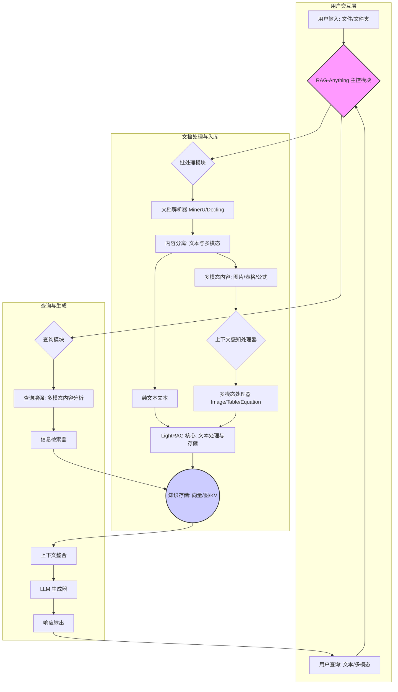
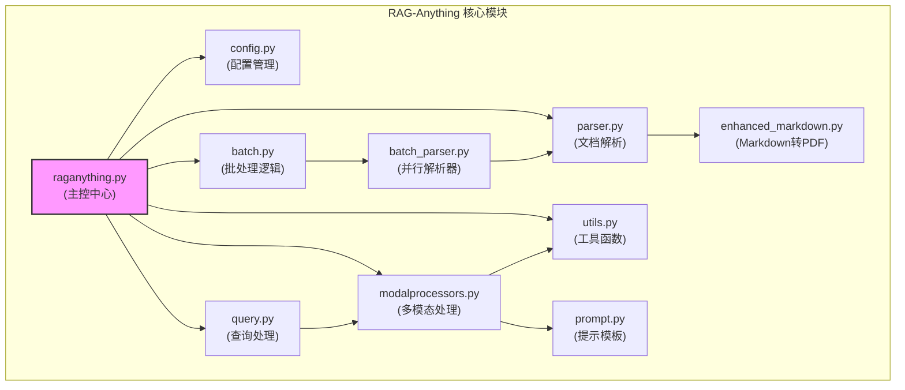
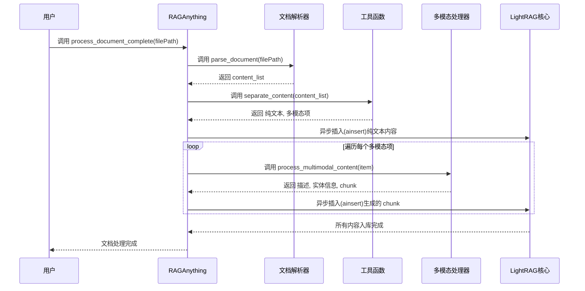
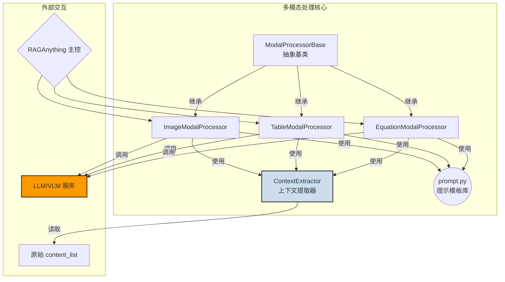
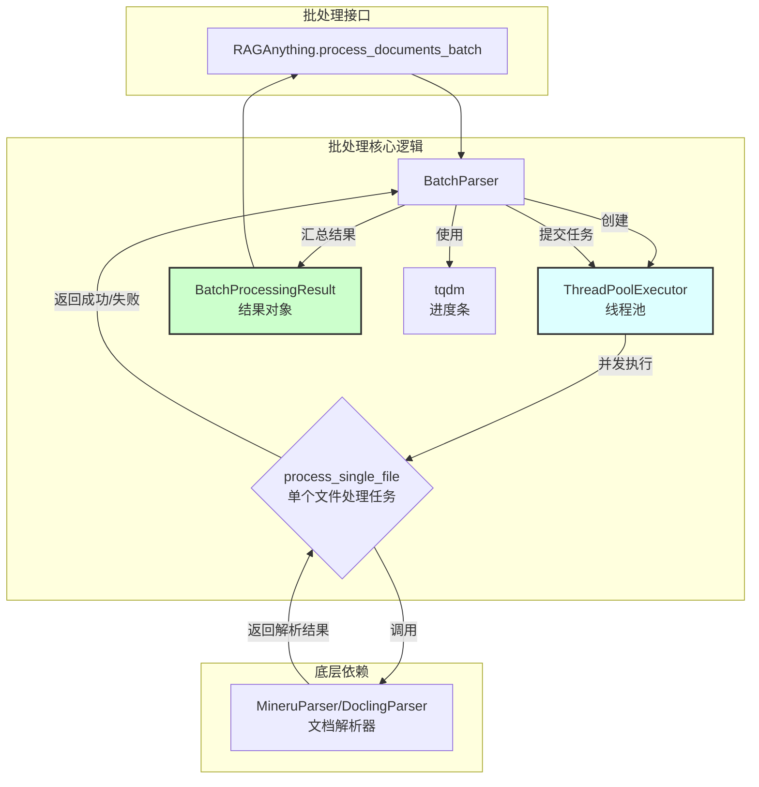

# RAG-Anything项目概述

RAG-Anything 是一个由香港大学数据智能实验室（Data Intelligence Lab@HKU）开发的一体化、多模态的检索增强生成（RAG）系统。该项目的核心目标是解决在构建知识库和进行智能问答时，如何高效、精准地处理和理解包含多种内容格式的复杂文档。传统的 RAG 系统通常侧重于纯文本处理，而 RAG-Anything 将其能力扩展到了“任何”类型的内容，包括文本、图片、表格、公式等，致力于提供一个从文档解析到知识检索与生成的端到端解决方案。

该项目的核心功能是其强大的多模态文档解析引擎。它能够接收各种格式的输入文件，如 PDF、Word、PPT、Excel、Markdown 文件以及各类图片格式。通过先进的解析器（如 MinerU），系统能将非结构化或半结构化的文档智能地分解为一个结构化的内容列表（`content_list`）。这个列表不仅包含了纯文本块，还精确地识别和分离出图片、表格、数学公式等非文本元素，并保留了它们的原始上下文信息，如页码、标题、脚注等。

对于解析出的多模态内容，RAG-Anything 引入了“上下文感知处理”（Context-Aware Processing）机制。在分析图片或表格等元素时，系统会自动提取其在文档中的前后文本内容作为附加上下文，提供给大语言模型（LLM）进行分析。这种设计极大地提升了模型对多模态内容理解的深度和准确性，使其生成的描述和摘要与文档的整体语义保持一致。

此外，项目还具备高效的批处理能力，能够利用多线程并行处理大量文档，并通过进度条提供实时反馈，显著提升了大规模知识库构建的效率。其模块化的设计也保证了良好的可扩展性，用户可以方便地集成新的内容处理器，以支持更多样的文件格式和数据类型。

RAG-Anything 的目标用户主要是需要构建高级知识管理系统、智能文档分析工具或复杂问答机器人的开发者和研究人员。它解决了传统 RAG 系统在处理真实世界复杂文档时的痛点，即无法有效利用文档中的图表、表格等富媒体信息。通过将所有类型的内容统一纳入 RAG 框架，RAG-Anything 使得用户能够围绕整个文档（而不仅仅是文本）进行更自然、更深入的提问和探索，从而释放了海量文档中蕴含的全部知识价值。

## 技术栈

以下是根据项目文件（`requirements.txt`, `setup.py`, `.pre-commit-config.yaml` 等）和代码结构分析得出的技术栈：

*   **编程语言**:
    *   Python 3.9+

*   **框架与库**:
    *   **核心 RAG 框架**: `lightrag-hku` - 项目依赖的核心检索引擎和 RAG 框架。
    *   **文档解析**: `mineru` - 核心的多模态文档解析库，用于从 PDF、Office 文档等文件中提取结构化内容。
    *   **异步处理**: `asyncio` - Python 内置库，广泛用于实现异步 I/O 操作，如文档处理和 API 调用。
    *   **进度条**: `tqdm` - 用于在处理长任务（如批处理）时提供用户友好的进度条。
    *   **Markdown 处理**: `markdown`, `pygments` - 用于将 Markdown 文本转换为 HTML，并支持代码块语法高亮。
    *   **PDF 生成**: `weasyprint`, `reportlab` - 作为可选后端，用于将处理后的 Markdown 或 HTML 内容高质量地转换为 PDF。
    *   **图像处理**: `Pillow` - 用于图像格式的转换和基础处理，是处理多种图片格式的依赖。

*   **构建与工具**:
    *   **包管理与构建**: `setuptools` - 用于打包和分发 Python 项目。
    *   **代码质量**: `pre-commit`, `ruff` - 用于在代码提交前自动进行格式化和静态代码分析，保证代码风格一致性和质量。
    *   **持续集成/持续部署 (CI/CD)**: `GitHub Actions` - 用于自动化代码检查（Linting）和发布到 PyPI。
    *   **依赖管理**: `pip` 配合 `requirements.txt` 文件管理项目依赖。

*   **主要外部依赖**:
    *   **大语言模型 (LLM) 与嵌入 (Embedding) 服务**:
        *   OpenAI (gpt-4o, gpt-4o-mini)
        *   Ollama
        *   Azure OpenAI
        *   Lollms
        *   这些服务通过 `env.example` 中的配置进行集成，是模型能力的核心来源。
    *   **办公文档处理引擎**: `LibreOffice` - 作为外部系统依赖，用于将 `.doc`, `.ppt`, `.xls` 等旧版 Office 格式转换为可处理的格式。
    *   **文档转换工具**: `Pandoc` - 作为高级 Markdown 到 PDF 转换的可选后端，尤其适用于格式复杂的学术文档。
    *   **向量数据库/存储**: 从 `env.example` 中的配置项可以看出，项目设计上支持多种后端存储，包括：
        *   PostgreSQL (PGKVStorage, PGVectorStorage)
        *   Neo4j (Neo4JStorage)
        *   Milvus
        *   Qdrant
        *   Redis
        *   MongoDB

## 可视化图表

#### 系统整体架构图

此图展示了 RAG-Anything 从文档输入到最终用户查询的完整处理流程。



#### 核心模块依赖关系图

此图描绘了 `raganything` 包内核心 Python 模块之间的依赖和交互关系。



#### 关键调用流程图：`process_document_complete`

此图详细说明了当用户调用 `process_document_complete` 方法处理单个文档时的内部执行流程。



## 模块解析

RAG-Anything 项目的代码结构清晰，可以归纳为以下几个核心逻辑模块：

---

### 1. 主控与配置模块

*   **模块名称**: `Orchestration & Configuration`
*   **核心职责**: 作为整个系统的入口和指挥中心，负责初始化、配置加载以及协调其他模块完成文档处理和查询任务。
*   **关键文件**:
    *   `raganything/raganything.py`: 这是项目的主类 `RAGAnything` 所在地。它整合了所有功能，为用户提供了统一的 API 接口，如 `process_document_complete`, `process_documents_batch`, `aquery` 等。它负责实例化解析器、多模态处理器，并与底层的 `LightRAG` 框架进行交互。
    *   `raganything/config.py`: 定义了 `RAGAnythingConfig` 数据类，集中管理所有可配置参数，如工作目录、解析方法、是否启用多模态处理等。该模块的一大特性是支持从环境变量中自动加载配置，极大地增强了系统的灵活性和在不同环境中部署的便利性。

*   **代码特性解读**:
    *   **统一入口**: `RAGAnything` 类通过依赖注入的方式，在初始化时根据配置创建所需的所有服务（如 LLM 函数、嵌入函数、各个处理器），实现了高度的内聚和松耦合。
    *   **配置即代码**: `RAGAnythingConfig` 使用 dataclass 实现，并结合 `get_env_value` 函数，使得配置项清晰明了，且能轻松地通过环境变量覆盖默认值，非常适合云原生和容器化部署。

---

### 2. 文档解析与预处理模块

*   **模块名称**: `Document Parsing & Preprocessing`
*   **核心职责**: 负责将用户输入的各种格式的原始文档（PDF, DOCX, 图片等）转换为统一的、结构化的 `content_list` 格式，并从中分离出文本和多模态内容。
*   **关键文件**:
    *   `raganything/parser.py`: 定义了解析器的基类和具体实现，如 `MineruParser` 和 `DoclingParser`。`MineruParser` 是核心，它能够处理 PDF、Office 文档、图片和文本文件，利用其强大的能力来识别页面中的不同元素（文本块、图片、表格等）并保留其结构。
    *   `raganything/utils.py`: 包含 `separate_content` 辅助函数。该函数接收解析器输出的 `content_list`，并将其拆分为两部分：一个是由所有文本块拼接而成的长字符串，另一个是包含所有非文本元素（图片、表格等）的列表。这个步骤是后续分别处理文本和多模态内容的关键。
    *   `raganything/enhanced_markdown.py`: 这是一个特殊的解析增强模块，提供了将 Markdown 文件高质量转换为 PDF 的功能。它支持 WeasyPrint 和 Pandoc 等多个后端，可以实现复杂的样式、代码高亮和目录生成，确保了 Markdown 作为输入源时的处理质量。

*   **代码特性解读**:
    *   **适配器模式**: `parser.py` 中的不同解析器实现可以看作是适配器模式的应用，它们将不同文档类型的解析库的输出统一为标准的 `content_list` 格式，供下游模块消费。
    *   **内容标准化**: `content_list` 是系统内部流通的核心数据结构，它将多样化的文档内容标准化，是实现“RAG-Anything”概念的技术基石。

---

### 3. 多模态内容处理模块

*   **模块名称**: `Multimodal Content Processing`
*   **核心职责**: 专门处理从文档中识别出的非文本内容，如图片、表格和公式。它利用多模态大模型（VLM）和语言模型（LLM）对这些内容进行深度分析、总结，并生成可被检索的文本描述。
*   **关键文件**:
    *   `raganything/modalprocessors.py`: 这是该模块的核心。它定义了 `ModalProcessorBase` 抽象基类，以及针对不同内容类型的具体实现：`ImageModalProcessor`, `TableModalProcessor`, `EquationModalProcessor`。每个处理器都负责调用相应的模型，生成详细的描述和简洁的摘要。
    *   `raganything/prompt.py`: 存储了所有用于分析多模态内容的提示模板。这些模板经过精心设计，能够引导 LLM/VLM 生成结构化、高质量的 JSON 输出，其中包含了详细描述和实体信息。
    *   **上下文提取器 (`ContextExtractor`)**: 这是 `modalprocessors.py` 中的一个关键组件。它实现了“上下文感知”功能，在处理一个多模态项（如图片）之前，会根据配置（如窗口大小、模式）从原始 `content_list` 中提取其周围的文本内容，并将其注入到提示中。

*   **代码特性解读**:
    *   **策略模式**: 每个 `ModalProcessor` 都是一种处理策略，`RAGAnything` 主控模块会根据内容的类型（"image", "table" 等）动态选择合适的处理器。这种设计使得添加对新模态的支持变得非常简单，只需实现一个新的处理器子类即可。
    *   **上下文感知能力**: `ContextExtractor` 的设计是该项目的一大亮点。它通过页码（`page` 模式）或元素索引（`chunk` 模式）来定位上下文，并能智能地处理边界情况和 token 限制，确保了多模态分析的准确性和相关性。

---

### 4. 批处理与并行化模块

*   **模块名称**: `Batch & Parallel Processing`
*   **核心职责**: 提升大规模文档处理的效率。它允许用户一次性提交一个文件夹或文件列表，并使用多线程并行处理，同时提供进度反馈和详细的错误报告。
*   **关键文件**:
    *   `raganything/batch_parser.py`: 实现了 `BatchParser` 类，封装了并行处理的核心逻辑。它使用 `concurrent.futures.ThreadPoolExecutor` 来管理一个工作线程池，将文件解析任务分发给多个线程同时执行。
    *   `raganything/batch.py`: 这是一个 Mixin 类 `BatchMixin`，它将 `BatchParser` 的功能无缝集成到 `RAGAnything` 主类中，提供了如 `process_documents_batch` 和 `process_documents_with_rag_batch` 这样的高级接口。
    *   `BatchProcessingResult`: 一个 `dataclass`，用于结构化地返回批处理的结果，包括成功文件列表、失败文件列表、错误详情、处理时间等统计信息，非常便于后续的自动化处理和监控。

*   **代码特性解读**:
    *   **高吞吐设计**: 通过线程池实现 I/O 密集型和 CPU 密集型（取决于解析内容）任务的并行化，能够充分利用多核 CPU 资源，显著缩短大量文档的处理时间。
    *   **健壮的错误处理**: 即使部分文件处理失败，批处理任务也不会中断。所有成功和失败的结果都会被记录在 `BatchProcessingResult` 中，保证了系统的健壮性。

## 各个模块内文件/组件/功能关系图

#### 多模态内容处理模块内部关系图

此图展示了多模态处理模块的核心组件如何协同工作，以实现对不同类型内容的上下文感知分析。



#### 批处理与并行化模块内部关系图

此图描绘了批处理模块如何通过并行解析器来高效处理文件集合。



## 典型应用场景

RAG-Anything 的多模态处理能力使其在多个真实场景中都具有极高的应用价值。以下是一个典型的应用场景：

**场景：金融投研报告的智能分析与问答**

一位金融分析师需要快速从数十份上市公司的年度财报（PDF 格式）中提取关键信息、进行交叉对比，并形成投研摘要。这些财报通常是复杂的长文档，包含了大量的文本叙述、财务报表（表格）、业务增长图表（图片）以及复杂的金融模型公式（公式）。

**使用 RAG-Anything 的流程：**

1.  **批量入库**: 分析师将一个包含所有公司财报PDF文件的文件夹直接上传至基于 RAG-Anything 构建的知识管理平台。
    *   系统启动**批处理模块** (`Batch Processing`)，并行处理所有 PDF 文件。
    *   对于每一份财报，**文档解析器** (`MineruParser`) 开始工作，它会逐页扫描文档，将财报的引言、业务回顾、风险分析等**文本**部分提取出来。
    *   同时，解析器会精确识别出资产负债表、利润表、现金流量表等**表格**，并将其结构化地提取出来。
    *   对于报告中的营收构成饼图、市场份额条形图等**图片**，系统也会将其识别并分离。

2.  **深度分析与知识构建**:
    *   所有**文本**内容被送入 `LightRAG` 核心，进行分块、嵌入，并构建向量索引。
    *   对于每一个**表格**（如利润表），**多模态处理器** (`TableModalProcessor`) 会被调用。它不仅读取表格的原始数据，还会结合**上下文提取器** (`ContextExtractor`) 提供的表格前后的文本（例如“本年度营收主要受XX业务驱动……”），而后调用 LLM 进行分析，生成一份关于这个表格的摘要，例如：“该表格显示公司年度总营收为10亿美元，同比增长15%，其中核心产品线A贡献了60%的收入。”
    *   对于每一个**图片**（如市场份额图），`ImageModalProcessor` 会调用 VLM 进行分析，并同样结合上下文生成描述：“此图表展示了公司在XX市场的份额为35%，位居行业第一，领先第二名10个百分点，与前文所述‘市场领导地位’的论述一致。”
    *   所有这些生成的文本描述和摘要，都会被再次嵌入并存入知识库中，与原始的文本块建立关联。

3.  **智能查询与交互**:
    *   分析师现在可以开始用自然语言进行提问：
        *   **跨模态查询**: “对比A公司和B公司的营收和净利润增长率，并总结它们在财报中提到的主要增长驱动力。”
            *   系统能够从A、B两家公司财报的利润表（表格）中检索到具体的财务数据，同时从相关的文本段落中检索到关于增长驱动力的叙述，最后整合信息生成精准的回答。
        *   **针对性图片查询**: “A公司财报中关于市场份额的图表是怎么说的？”
            *   系统会直接定位到处理市场份额图时生成的详细描述，并返回给用户。
        *   **复杂逻辑推理**: “根据B公司的现金流量表，分析其投资活动的健康状况，并结合风险提示章节，判断是否存在潜在的流动性风险。”
            *   这个查询需要结合表格数据和文本叙述进行综合推理，而 RAG-Anything 的上下文感知处理能力使得这种深层次的分析成为可能。

通过这个流程，RAG-Anything 将原本静态、分散的财报文档转化为了一个动态、可交互的结构化知识库，极大地提升了金融分析师的工作效率和决策质量。

## 产品研发参考

#### 如果我是产品经理

作为产品经理，RAG-Anything 项目在产品设计和思路上提供了宝贵的借鉴。

1.  **借鉴思路**:
    *   **“万物皆可 RAG”的产品定位**: 这个项目的核心理念——将任何类型的文档内容都无缝集成到 RAG 流程中——是一个极其强大的产品定位。它直接解决了用户在现实世界中面临的数据多样性问题。在设计知识管理或智能助手类产品时，应将“统一入口，简化处理”作为核心用户体验目标。用户不需要关心文件格式，只需“拖拽即用”，产品后台负责处理所有复杂性。
    *   **上下文是提升AI能力的关键**: “上下文感知处理”是本项目最值得借鉴的产品思路。它认识到孤立地分析一个图表或表格是远远不够的。产品设计上，任何需要AI进行深度分析的功能，都应该思考如何为AI提供最丰富、最相关的上下文。这可以体现在UI设计上（例如，允许用户手动圈选相关段落），也可以体现在后端逻辑上（如此项目中的自动提取）。
    *   **从“解析”到“理解”的价值链延伸**: 项目不仅止步于从文档中“提取”信息，更是通过 LLM/VLM 对提取出的多模态内容进行“理解”和“摘要”。这实现了价值链的延伸。产品设计时，应思考如何将原始数据转化为更高层次的“洞察”（insights），这才是用户愿意付费的核心价值。
    *   **可观测性与透明度**: `BatchProcessingResult` 的设计体现了对过程可观测性的重视。在产品中，应为用户提供清晰的处理反馈，如哪些文件成功、哪些失败、失败原因是什么。这不仅能建立用户信任，还能帮助用户排查问题。

2.  **如何应用**:
    *   在设计下一代企业知识库时，将“多模态文档处理”作为核心功能卖点，并围绕它设计简洁的上传和管理界面。
    *   在AI助手中，当用户上传一份报告并提问时，如果答案来源于报告中的图表，可以在回答旁边附上该图表的截图和AI生成的摘要，增强答案的可信度和解释性。
    *   为专业人士（如律师、医生、研究员）设计垂直领域的文档分析工具时，可以借鉴 `ModalProcessors` 的思路，为特定领域的内容（如合同条款、医学影像、化学式）开发专门的、带有上下文感知的“技能”处理器。

#### 如果我是技术架构师

作为技术架构师，RAG-Anything 在系统设计和技术实现上提供了许多优秀的实践。

1.  **复用设计与技术**:
    *   **解耦的、可插拔的处理器架构 (Strategy Pattern)**: `ModalProcessorBase` 和其子类的设计堪称典范。这种设计将不同模态的处理逻辑完全隔离，使得系统易于维护和扩展。当需要支持一种新的模态（如音频、视频）时，我们只需添加一个新的处理器实现，而无需改动核心编排逻辑。
    *   **混合式文档解析策略**: 系统支持多种解析器（MinerU, Docling）和解析方法（auto, ocr, txt），并能根据文件类型和配置自动选择。这种灵活性和容错性是构建健壮数据管道的关键。在设计数据摄取（ingestion）系统时，应采用类似的混合策略，并提供清晰的配置选项。
    *   **异步化与并行化设计**: 广泛使用 `asyncio` 和 `ThreadPoolExecutor` 来处理 I/O 密集型和 CPU 密集型任务，是构建高性能、高吞吐量系统的标准做法。`BatchParser` 的实现是一个可以直接复用的并行处理框架，适用于任何需要批量处理文件的场景。
    *   **集中式配置与环境注入**: `RAGAnythingConfig` 的设计使得系统配置非常清晰，并且与12-factor App的理念一致，优先从环境中读取配置。这对于系统的部署、测试和运维都大有裨益。

2.  **如何应用与实例**:
    *   **构建可扩展的数据处理管道**: 借鉴 `ModalProcessors` 的设计，我们可以构建一个通用的数据处理框架。
        *   **实例**: 假设我们要构建一个处理不同来源社交媒体数据的系统（文本、图片、短视频）。
        ```python
        # 伪代码
        class SocialMediaProcessor(ABC):
            @abstractmethod
            async def process(self, data: dict, context: dict) -> ProcessedData:
                pass

        class TextPostProcessor(SocialMediaProcessor):
            async def process... # 处理文本帖子

        class ImagePostProcessor(SocialMediaProcessor):
            async def process... # 调用VLM处理图片

        class VideoPostProcessor(SocialMediaProcessor):
            async def process... # 调用视频理解模型

        # 主控逻辑
        processors = {"text": TextPostProcessor(), "image": ImagePostProcessor(), ...}
        post_type = get_post_type(post)
        if post_type in processors:
            await processors[post_type].process(post, context)
        ```

    *   **实现高性能批处理服务**: `BatchParser` 的逻辑可以被直接抽象出来，用于任何需要并行处理大量独立任务的场景。
        *   **实例**: 构建一个批量图片压缩服务。
        ```python
        # 伪代码，借鉴 BatchParser 结构
        from concurrent.futures import ThreadPoolExecutor, as_completed

        class ImageCompressor:
            def compress_single_image(self, image_path, output_path):
                # ...压缩逻辑
                return True, "Success"

            def compress_batch(self, image_paths, output_dir, max_workers=4):
                results = {}
                with ThreadPoolExecutor(max_workers=max_workers) as executor:
                    future_to_path = {executor.submit(self.compress_single_image, path, ...): path for path in image_paths}
                    for future in as_completed(future_to_path):
                        path = future_to_path[future]
                        try:
                            success, message = future.result()
                            results[path] = {"success": success, "message": message}
                        except Exception as e:
                            results[path] = {"success": False, "message": str(e)}
                return results
        ```

    *   **上下文注入**: `ContextExtractor` 的思想可以应用在任何需要增强AI模型输入的场景。例如，在代码生成任务中，除了用户的指令，还可以自动提取相关函数定义、类结构作为上下文，提供给代码生成模型，以产出质量更高、与现有代码库更兼容的代码。