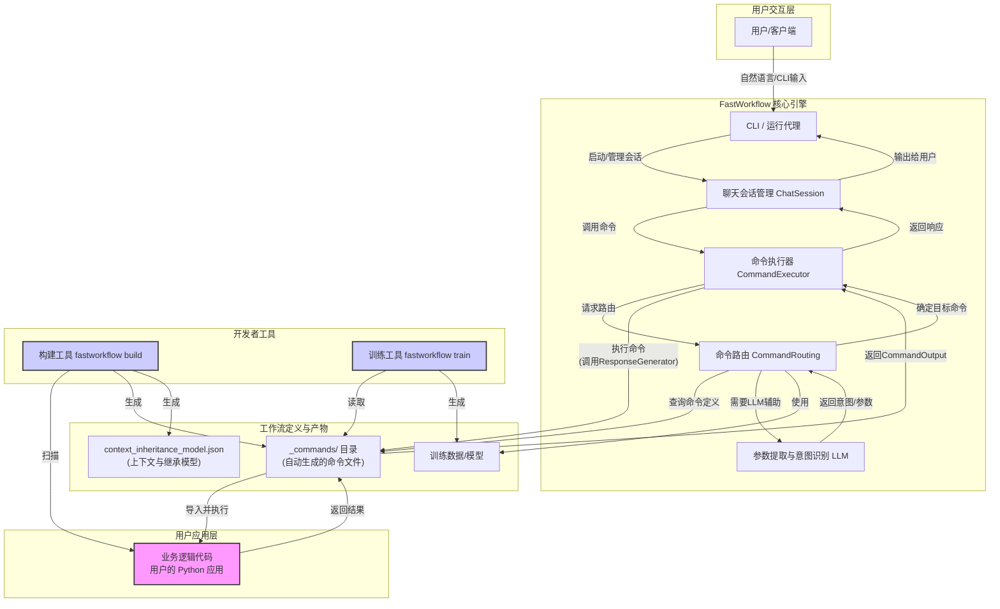
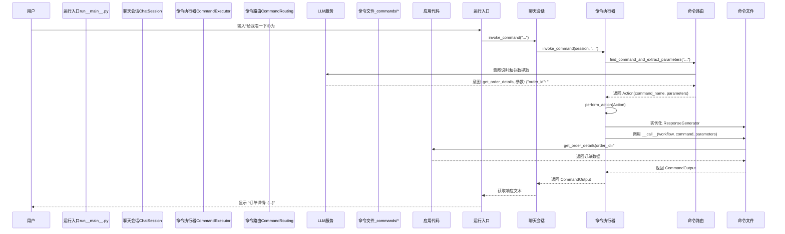
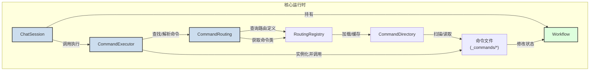
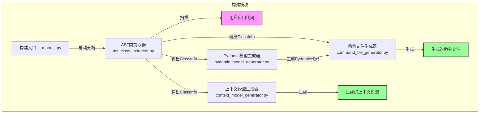

# fastworkflow项目

`fastworkflow` 是一个功能强大且设计精良的框架，旨在快速地将现有的 Python 应用程序代码库（无论是简单的函数还是复杂的面向对象系统）转化为可通过自然语言交互的大规模、确定性、交互式工作流。该项目的核心价值在于其独特的“代码优先”理念：开发者无需重写业务逻辑，只需通过 `fastworkflow` 的构建工具扫描现有代码，即可自动生成一个功能完备、具备上下文感知能力的命令行与对话式用户界面。

该框架主要解决将复杂业务逻辑暴露给非技术用户或实现自动化操作的痛点。传统方式下，为现有应用开发一个对话式机器人或一个灵活的 CLI 工具，需要投入大量精力在接口定义、意图识别、参数提取和状态管理上。`fastworkflow` 通过自动化这一过程，极大地提升了开发效率。它通过静态代码分析（AST）来理解应用程序的结构（类、方法、参数），并自动生成包含类型定义（Pydantic）、示例语句（utterances）和响应逻辑的“命令文件”。

项目的主要功能包括：

1.  **自动化构建**：提供一个强大的 CLI 工具，能够扫描 Python 应用程序目录，并自动为每个公共函数、类方法和属性生成对应的命令文件。
2.  **上下文管理**：支持复杂的多层级上下文（Context）。用户可以在不同的业务对象（如“订单”、“用户”）之间切换，框架会自动调整可用的命令集，从而实现对复杂工作流的精确控制。
3.  **对话式交互**：通过与大型语言模型（LLM）集成，`fastworkflow` 能够理解用户的自然语言输入，将其准确地映射到具体的命令和参数上，并生成人性化的响应。
4.  **工作流继承**：允许一个工作流继承另一个“基础”工作流的功能，实现了工作流的模块化和复用，便于构建复杂且分层的业务流程。
5.  **确定性与容错性**：框架的设计保证了工作流的执行是确定且可预测的，同时内置了错误处理和修正机制，如“你理解错了”等核心指令，提升了用户体验。

`fastworkflow` 的目标用户是希望为其现有 Python 应用快速赋能对话式交互能力或构建高级自动化工具的开发者和团队。无论是为内部运营团队提供一个自然语言的后台管理工具，还是为终端用户构建一个智能客服机器人，`fastworkflow` 都提供了一个高效、可扩展且维护性强的解决方案。

## 技术栈

*   **编程语言**:
    *   Python 3.11+
*   **框架与库**:
    *   **Pydantic**: 用于数据验证和设置管理，是定义命令输入输出签名的核心。
    *   **DSPy**: 一个用于算法化提示和组合语言模型（LM）的框架，用于增强 AI 交互能力。
    *   **PyTorch**: 深度学习框架，作为 `transformers` 和 `sentence-transformers` 的底层依赖。
    *   **Transformers**: 提供最先进的通用架构（BERT、GPT-2 等），用于自然语言处理。
    *   **sentence-transformers**: 用于最先进的句子、文本和图像嵌入。
    *   **LibCST (Concrete Syntax Tree)**: 用于解析和修改 Python 源代码，是 `build` 过程的核心，用于分析应用代码并生成命令文件。
*   **构建与工具**:
    *   **Poetry**: 用于 Python 的依赖管理和打包。
    *   **Makefile**: 用于定义自动化任务，如代码检查和发布。
    *   **Linters/Formatters**: isort, black, flake8, pylint, mypy, bandit 用于保证代码质量和风格一致性。
*   **主要外部依赖**:
    *   **LiteLLM**: 提供一个统一的接口来调用各种大型语言模型（LLM），如 OpenAI、Mistral、Groq 等。
    *   **scikit-learn**: 用于机器学习，可能用于意图分类或相似度计算。
    *   **python-levenshtein**: 用于快速计算字符串相似度，在模糊匹配中非常有用。
    *   **speedict**: 一个高性能的持久化字典库，用于工作流上下文的缓存和状态管理。

## 可视化图表

#### 系统架构图

此图展示了 `fastworkflow` 的整体架构，从用户交互到最终的业务逻辑执行。



#### 关键调用流程图

此图详细描述了当用户输入一条指令后，系统内部处理该指令的完整流程。



## 模块解析

`fastworkflow` 的代码结构清晰，可以划分为以下几个核心模块：

---

### 1. 工作流构建模块 (`fastworkflow/build`)

*   **核心职责**:
    此模块是 `fastworkflow` 的“编译器”。它负责接收用户指定的应用程序代码目录 (`--app-dir`)，通过静态代码分析（AST）技术解析 Python 源代码，并自动生成在运行时所需的所有工作流定义文件，包括命令文件、上下文模型和 Pydantic 模型。
*   **关键文件/组件/功能**:
    *   `__main__.py`: 构建命令的入口，解析命令行参数并启动构建流程。
    *   `ast_class_extractor.py`: 使用 `libcst` 库遍历 Python 代码的抽象语法树，提取类、方法、函数、参数和类型注解等关键信息，并将其组织成 `ClassInfo` 结构。
    *   `command_file_generator.py`: 核心的代码生成器。它接收 `ast_class_extractor.py` 提取的信息，使用预定义的模板（`command_file_template.py`）为每个需要暴露的业务逻辑（方法或函数）生成一个对应的命令文件。
    *   `pydantic_model_generator.py`: 根据分析出的函数签名（参数和返回值），为每个命令自动生成 Pydantic `Input` 和 `Output` 模型代码，确保运行时的类型安全和数据验证。
    *   `context_model_generator.py`: 分析应用代码中的类继承关系，并生成 `_commands/context_inheritance_model.json` 文件。这个文件定义了命令的上下文分组和继承关系，是实现上下文感知的关键。
*   **代码特性解读**:
    该模块最核心的特性是其**非侵入式代码生成**能力。它不要求开发者修改任何现有的业务代码，而是像一个外部编译器一样，从源代码中“提取”出一个可交互的接口层。这种设计极大地降低了接入成本，并确保了业务逻辑与交互逻辑的完全解耦。使用 `LibCST` 进行具体的语法树分析，比传统的 `ast` 模块更强大，能够保留代码格式和注释，为未来生成更丰富的代码提供了可能性。

---

### 2. 核心运行时模块 (`fastworkflow/`)

*   **核心职责**:
    这是 `fastworkflow` 的“运行时引擎”，负责加载构建好的工作流，管理用户交互会话，并将用户的输入分派给正确的命令执行。它构成了整个框架的执行核心。
*   **关键文件/组件/功能**:
    *   `workflow.py`: `Workflow` 类是核心的状态管理器。每个活动的工作流实例都由一个 `Workflow` 对象表示，它持有当前的工作流上下文 (`current_command_context`)、根上下文对象以及工作流的路径等信息。
    *   `chat_session.py`: `ChatSession` 类管理整个用户交互周期。它维护一个 `Workflow` 实例栈，处理用户输入，并调用 `CommandExecutor` 来执行命令。
    *   `command_executor.py`: 负责命令的最终执行。它接收一个 `Action` 对象（包含命令名和参数），加载对应的命令文件模块，实例化 `ResponseGenerator`，并调用其 `__call__` 方法来触发业务逻辑。
    *   `command_routing.py`: 这是意图识别和命令分派的核心。它使用训练好的模型或模糊匹配算法，将用户的自然语言输入转换为一个结构化的 `Action` 对象。`RoutingRegistry` 在此模块中用于缓存和管理不同工作流的路由定义。
    *   `command_directory.py`: 负责发现和加载指定工作流路径下的所有命令文件和元数据。它在启动时扫描 `_commands` 目录，并将命令信息缓存在内存中，供 `CommandRouting` 使用。
*   **代码特性解读**:
    该模块的设计体现了**关注点分离**原则。`ChatSession` 关注用户交互的宏观流程，`CommandExecutor` 关注单个命令的微观执行，`CommandRouting` 关注“输入到命令”的智能映射。这种清晰的职责划分使得系统易于理解和扩展。`Workflow` 类对上下文的精巧管理，特别是 `current_command_context` 的动态切换，是实现复杂多步交互的关键。

---

### 3. 模型训练模块 (`fastworkflow/train`)

*   **核心职责**:
    此模块负责为 `fastworkflow` 的智能路由功能提供模型支持。它的主要任务是利用命令文件中定义的元数据（如 `plain_utterances`）生成高质量、多样化的合成训练数据，并用于微调或训练语言模型，以提高意图识别和参数提取的准确性。
*   **关键文件/组件/功能**:
    *   `__main__.py`: 训练命令的入口，启动训练流程。
    *   `generate_synthetic.py`: 核心的合成数据生成器。它利用大型语言模型（LLM），根据开发者提供的少量示例语句（`plain_utterances`），围绕不同的“用户画像”（persona）生成大量风格和意图各异的训练样本。
*   **代码特性解读**:
    该模块的亮点在于其**数据增强（Data Augmentation）**策略。开发者通常只需为每个命令提供几个简单的示例语句，训练模块就能自动将其扩展成一个庞大且多样化的数据集。这极大地降低了准备训练数据的门槛，使得即便是小样本场景也能训练出效果不错的意图识别模型，是 `fastworkflow` 能够实现高精度自然语言理解的关键。

---

### 4. 内置核心工作流 (`fastworkflow/_workflows`)

*   **核心职责**:
    提供一套所有 `fastworkflow` 应用都可以继承和使用的基础命令。这些命令构成了框架的“通用语”，用于处理一些元级别的交互，如错误纠正、上下文查询和功能发现。
*   **关键文件/组件/功能**:
    *   `command_metadata_extraction/_commands/`:
        *   `ErrorCorrection/`: 包含 `abort.py`（中止当前操作）和 `you_misunderstood.py`（告诉系统之前的指令理解错误，请求重新选择）。
        *   `IntentDetection/`: 包含 `go_up.py`（返回上一级上下文）、`reset_context.py`（重置到全局上下文）、`what_can_i_do.py`（查询当前上下文可用命令）和 `what_is_current_context.py`（查询当前所在上下文）。
*   **代码特性解读**:
    这个模块体现了框架的**可扩展性和用户友好性**。通过将这些基础的、与业务无关的交互功能作为可继承的“核心工作流”，不仅避免了每个项目重复实现，也为用户提供了一套标准化的“逃生通道”和探索工具。当用户迷失在复杂的工作流中时，`what_can_i_do` 和 `go_up` 等命令能提供极大的帮助，显著提升了整体用户体验。

## 各个模块内文件/组件/功能关系图

#### 核心运行时模块内部关系图



#### 工作流构建模块内部关系图



## 典型应用场景

假设我们有一个电子商务后台系统，使用 `fastworkflow` 快速构建一个智能客服命令行工具。

**场景：客服人员查询并修改用户订单**

1. **启动与初始化**: 客服人员在终端启动 `fastworkflow` 运行程序。

   ```bash
   fastworkflow run --workflow-folderpath ./examples/retail_workflow
   ```

   系统自动执行 `startup` 命令，加载所有零售相关的用户、商品和订单数据，进入全局上下文。

2. **识别用户**: 客服接到用户电话，需要先确认用户身份。

   *   **客服输入**: `找到邮箱是 sara_doe_496@example.com 的用户`
   *   **FastWorkflow 处理流程**:
       *   `CommandRouting` 接收到输入，通过 LLM 或其他匹配模型，识别出最匹配的命令是 `find_user_id_by_email`。
       *   同时，它提取出参数 `email` 的值为 `sara_doe_496@example.com`。
       *   `CommandExecutor` 执行 `find_user_id_by_email` 命令，调用后台应用逻辑，在数据库中查找并返回用户 ID。
   *   **系统响应**: `The user id is: sara_doe_496`

3. **获取用户详情并进入上下文**: 客服需要查看该用户的详细信息，特别是历史订单。

   *   **客服输入**: `获取这个用户的详细信息` (这里利用了上一步的隐式上下文) 或者 `获取用户 sara_doe_496 的详细信息`
   *   **FastWorkflow 处理流程**:
       *   系统识别出 `get_user_details` 命令，并传入用户ID `sara_doe_496`。
       *   该命令的 `ResponseGenerator` 在执行时，不仅返回用户数据，还会**将该用户对象设置为当前的工作流上下文** (`workflow.current_command_context = user_object`)。
   *   **系统响应**: `Current context is now 'User: Sara Doe' \n 用户详情: { "name": "Sara Doe", "orders": ["#W1234567", "#W7654321"] }`

4. **在用户上下文中操作**: 现在，所有的后续命令都在 "Sara Doe" 这个用户对象的上下文中执行。

   *   **客服输入**: `订单 #W1234567 的状态是什么？`
   *   **FastWorkflow 处理流程**:
       *   由于当前在用户上下文中，系统可以自动关联订单号和用户，并调用 `get_order_details` 命令。
       *   执行后，系统可以将上下文进一步切换到该订单对象，允许进行更细粒度的操作。
   *   **系统响应**: `Current context is now 'Order: #W1234567' \n 订单详情: { "status": "pending", "items": [...] }`

5. **执行修改操作**: 用户请求修改待处理订单的收货地址。

   *   **客服输入**: `把地址改成幸福路 88 号`
   *   **FastWorkflow 处理流程**:
       *   在订单上下文中，系统识别出 `modify_pending_order_address` 命令，并提取新地址。
       *   执行命令，调用后台API更新数据库。
   *   **系统响应**: `地址已成功更新`

通过这个场景，`fastworkflow` 将一个复杂的多步骤业务流程，分解为一系列在清晰上下文中执行的、符合人类直觉的自然语言指令，极大地提高了客服的工作效率。

## 产品研发参考

#### 作为产品经理

`fastworkflow` 的设计哲学对产品设计有极高的借鉴价值，尤其是在构建企业级内部工具和 AI 应用方面。

1.  **借鉴思路：代码即接口（Code as Interface）的产品化**
    *   **项目设计**: `fastworkflow` 的核心理念是，一个良好结构化的代码库本身就是最好的 API 文档和功能定义。`build` 工具将这个理念产品化，它创造了一个“翻译层”，将程序员的语言（Python代码）自动翻译成业务人员或最终用户能理解的语言（自然语言命令）。
    *   **如何借鉴**: 在设计需要与复杂后端系统交互的工具时，可以思考如何将“自发现”和“自生成”作为核心功能。例如，设计一个数据分析平台，它可以自动扫描连接的数据仓库 schema，为非技术用户自动生成可交互的图表配置界面和自然语言查询（NLQ）能力，而不是让用户从零开始拖拽字段。这大大降低了用户的使用门槛。
    *   **理由**: 这种设计将工具的“配置成本”降至最低，实现了“开箱即用”。对于内部工具，这意味着更快的采纳速度和更低的培训成本。对于商业产品，这意味着更强的产品竞争力和更好的用户初次体验。

2.  **借鉴思路：上下文驱动的交互设计**
    *   **项目设计**: `fastworkflow` 的上下文管理（`current_command_context`）是其交互设计的精髓。它模拟了人类对话的自然流程：我们总是在某个话题（上下文）下进行讨论。当用户说“删除它”时，系统知道“它”指的是当前正在操作的“订单”或“待办事项”。
    *   **如何借鉴**: 在设计任何多步骤、非线性的用户流程时，都应引入明确的“上下文”概念。例如，在一个项目管理工具中，当用户点击进入某个“任务”详情页时，整个应用界面都应围绕这个“任务”上下文展开，所有操作按钮（如“添加评论”、“分配成员”）都隐式地与该任务关联。这比让用户在每个操作中重复选择“哪个任务”要高效得多。
    *   **理由**: 上下文驱动的设计减少了用户的认知负荷和操作冗余，使复杂的交互变得简洁、流畅。它让用户感觉系统是“智能”的，能够理解他们的意图，从而提升满意度和工作效率。

#### 作为技术架构师

`fastworkflow` 的架构设计充分体现了高内聚、低耦合和可扩展性，对于构建大型应用框架具有重要的参考意义。

1. **复用设计：声明式接口与运行时分离的架构**

   * **项目设计**: `fastworkflow` 的架构清晰地分离了三个阶段：**定义（用户的业务代码）**、**声明（build工具生成的`_commands`目录）**和**执行（运行时引擎）**。`_commands` 目录就像一个中间表示（Intermediate Representation），它将业务逻辑以一种标准化的、声明式的方式描述出来，而运行时引擎则是一个通用的解释器，负责执行这些声明。

   * **如何复用**: 这种模式可以广泛应用于插件化系统、规则引擎或自定义表单/报表生成器。例如，在构建一个营销自动化平台时，可以将每个营销动作（如“发送邮件”、“打标签”）定义为独立的业务逻辑代码。然后，通过一个“构建”步骤，将这些动作扫描并生成为标准的 JSON 或 YAML 声明。运行时引擎则加载这些声明，让运营人员可以通过图形化界面自由编排和组合这些动作，形成一个完整的工作流。

   * **理由**: 这种架构实现了业务逻辑和框架的完全解耦。业务开发者可以专注于实现核心功能，而无需关心它将如何被调用和编排。框架开发者则可以专注于优化运行时，而无需担心会影响到具体的业务。这使得系统极易扩展，添加新功能只需编写新的业务代码并重新“构建”即可。

   * **使用实例**:

     ```python
     # 业务代码 (application/notification.py)
     class EmailService:
         def send_welcome_email(self, user_id: int):
             # ... 发送邮件的逻辑 ...
             print(f"Sent welcome email to user {user_id}")
     
     # 运行 fastworkflow build --app-dir ./application
     # 生成 _commands/EmailService/send_welcome_email.py
     
     # 运行时，即可通过CLI或API调用
     # > "给用户 123 发送欢迎邮件"
     ```

2. **复用技术：基于代码生成和继承的工作流模块化**

   * **项目设计**: `workflow_inheritance_model.json` 和 `extended_workflow_example` 完美展示了如何通过继承来构建和复用工作流。一个复杂的工作流可以由多个基础工作流组合而成，并且可以有选择地覆盖（override）或扩展基础功能。

   * **如何复用**: 在构建大型企业级系统时，可以将通用的核心功能（如用户管理、权限校验、日志记录）封装成一个“基础工作流”。然后，不同的业务部门可以在此基础上构建自己的业务工作流，例如“订单管理工作流”或“客户关系管理工作流”。它们将自动继承所有基础功能，并可以添加自己特有的命令。

   * **理由**: 这种分层、可继承的架构模式极大地促进了代码复用，减少了重复开发。它使得系统架构更加清晰，便于维护和团队协作。当基础功能需要升级时（例如，更新了权限模型），所有继承它的业务工作流都能自动受益。

   * **使用实例**:
     假设我们有一个 `base_workflow` 提供了 `get_user` 命令。现在我们要创建一个 `premium_support_workflow` 来继承它，并添加一个 `escalate_ticket` 命令。

     1. 在 `premium_support_workflow` 目录下创建 `workflow_inheritance_model.json`:

        ```json
        {
            "base": ["path/to/base_workflow"]
        }
        ```

     2. 在 `_commands` 目录下添加 `escalate_ticket.py`。

     3. 运行 `fastworkflow run` 时，`premium_support_workflow` 将同时拥有 `get_user` 和 `escalate_ticket` 两个命令。