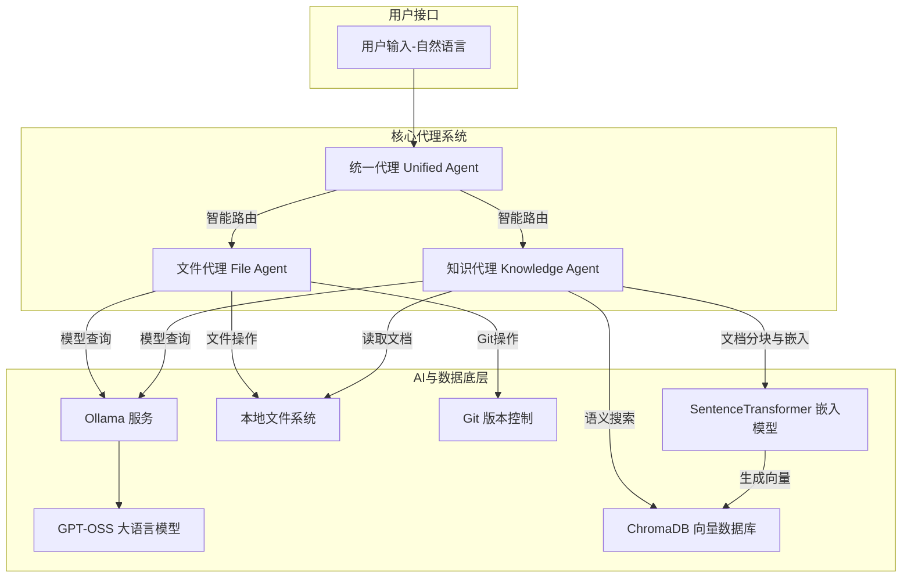
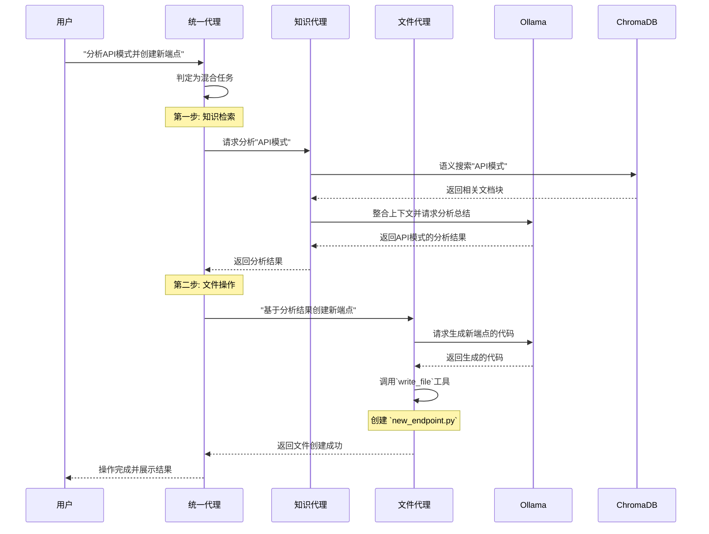
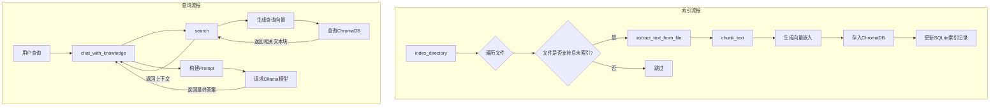
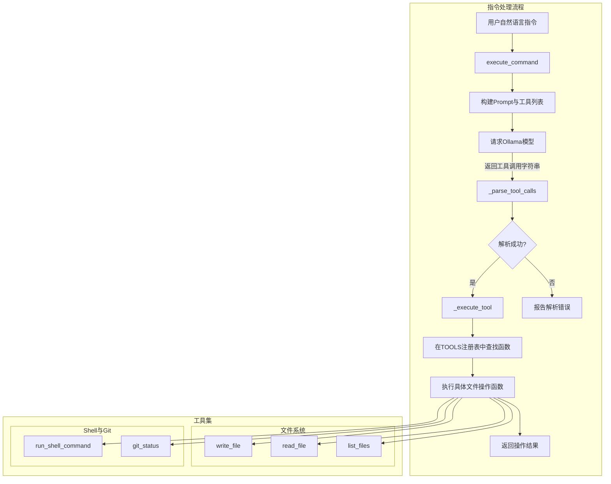

# GPT-OSS Agent 

GPT-OSS Agent 是一个功能强大、以隐私为核心的本地化人工智能代理系统。它巧妙地将智能知识管理（RAG，检索增强生成）与自然语言文件系统操作相结合，旨在为开发者和高级用户提供一个完全在本地设备上运行的、可离线的私人AI助手。该项目的核心价值在于其“隐私优先”的设计理念，通过集成 Ollama 来运行本地的开源大语言模型（如 GPT-OSS 20B 和 120B），确保所有数据处理、文档索引和模型交互均在用户本地完成，无任何数据被发送到外部服务器。

项目主要由三大核心组件构成：
1.  **知识代理 (Knowledge Agent)**：这是一个先进的本地 RAG 系统。用户可以将本地的文档（如PDF、DOCX）、代码、Markdown笔记等进行索引。系统会自动对这些文档进行解析、分块，并利用 SentenceTransformers 模型生成向量嵌入，存储在本地的 ChromaDB 向量数据库中。用户随后可以通过自然语言与这些私有数据进行对话，实现高精度的语义搜索和智能分析。

2.  **文件代理 (File Agent)**：该组件将强大的文件系统管理能力赋予了自然语言。用户不再需要记住复杂的Shell命令，而是可以通过简单的口语化指令来执行文件和目录的创建、读取、修改、移动、删除等操作。此外，它还集成了Git版本控制功能和通用Shell命令执行能力，让开发者能够用自然语言管理代码仓库和执行系统任务。

3.  **统一代理 (Unified Agent)**：作为整个系统的“大脑”，统一代理负责智能地路由用户请求。它能够判断用户的意图是查询知识、执行文件操作，还是二者兼有。对于复杂的混合型任务（例如，“根据我知识库中的API设计文档，创建一个新的API服务端点文件”），统一代理能够首先调用知识代理进行分析和信息检索，然后将结果传递给文件代理以执行具体的文件创建和代码编写任务，从而实现从分析到行动的无缝工作流自动化。

该项目的目标用户是注重数据隐私、希望利用AI提升本地工作流效率的开发者、研究人员和技术爱好者。它解决了对云端AI服务数据安全性的担忧，同时提供了一个高度可扩展、可离线的强大AI工具集。

## 技术栈

| 分类 | 技术 | 描述 |
| :--- | :--- | :--- |
| **编程语言** | Python 3.8+ | 项目的主要开发语言。 |
| **框架与库** | Ollama | 用于在本地加载并运行开源大语言模型（LLM）。 |
| | ChromaDB | 作为本地向量数据库，用于存储文档嵌入并进行高效的相似度搜索。 |
| | SentenceTransformers | 用于将文本块转换为高质量的向量嵌入。 |
| | PyPDF2 | 用于解析和提取 PDF 文件中的文本内容。 |
| | python-docx | 用于解析和提取 Microsoft Word (.docx) 文件中的文本内容。 |
| | PyYAML | 用于处理 YAML 格式的数据和配置文件。 |
| | NumPy | 为向量操作和数值计算提供基础支持。 |
| **构建与工具** | Pip & Venv | 用于Python包管理和虚拟环境隔离。 |
| | Setuptools | 用于项目的打包和分发。 |
| | Git | 用于版本控制。 |
| | Black, Flake8 | 用于代码格式化和风格检查，保证代码质量。 |
| | Pytest | 作为项目的主要测试框架，确保代码的稳定性和可靠性。 |
| **主要外部依赖**| GPT-OSS Models | 核心的AI能力来源，项目支持20B和120B等不同规模的模型。 |

## 可视化图表

### 系统架构图

此图展示了 GPT-OSS Agent 的整体架构和数据流。用户输入通过统一代理进行智能路由，分别流向知识代理和文件代理，最终与本地数据和工具进行交互。



### 关键调用流程图 (混合任务示例)

此图演示了一个典型的混合任务处理流程，例如用户发出指令：“分析我项目中的API模式，并创建一个新的端点文件”。



## 模块解析

项目可以划分为五个核心模块：**统一智能代理**、**知识管理代理**、**文件操作代理**、**核心工具与异常**以及**安装与环境管理**。

### 1. 统一智能代理 (Unified Agent)

-   **核心职责**: 作为系统的总入口和调度中心，负责接收用户的自然语言指令，智能判断其意图，并将任务分发给知识代理或文件代理，或协调两者共同完成复杂的混合型任务。
-   **关键文件**: `gpt_oss_agent.py`, `gpt_oss_agent_improved.py`
-   **功能详述**:
    -   `GPTOSSAgent` / `UnifiedGPTOSSAgent` 类:
        -   在初始化时，同时加载知识代理和文件代理的实例。
        -   `process_request` 方法是核心处理函数。它通过关键词（如 `create`, `list` vs `analyze`, `search`）或更复杂的逻辑（如 `_determine_mode`）来对用户输入进行分类。
        -   对于**文件操作**类请求，直接调用 `file_agent.execute_command`。
        -   对于**知识查询**类请求，调用 `knowledge_agent.chat_with_knowledge`。
        -   对于**混合型任务**，它会先调用知识代理进行信息检索和分析，然后将分析结果作为上下文，再调用文件代理执行具体操作。
    -   `_improved` 版本 (`gpt_oss_agent_improved.py`) 显著增强了健壮性：
        -   引入了结构化的日志系统 (`setup_logging`)。
        -   对初始化过程增加了错误处理，即使某个子代理加载失败，系统也能部分运行。
        -   `process_request` 返回结构化的字典，包含状态、错误信息等，便于API调用和调试。
        -   `_determine_mode` 使用更精细的评分机制来判断用户意图，提高了路由的准确性。

### 2. 知识管理代理 (Knowledge Agent)

-   **核心职责**: 负责构建和管理本地化的私人知识库。它能够索引各种格式的文档，将其转化为可供AI检索的向量数据，并提供基于这些数据的聊天和搜索功能（RAG）。
-   **关键文件**: `knowledge_agent.py`, `knowledge_agent_improved.py`
-   **功能详述**:
    -   `KnowledgeAgent` / `EnhancedKnowledgeAgent` 类:
        -   **文档索引 (`index_directory`, `index_file`)**: 遍历指定目录，对支持的文件类型进行处理。通过SQLite数据库 (`documents.db`) 跟踪已索引文件及其哈希值，避免重复处理。
        -   **文本提取 (`extract_text_from_file`)**: 针对不同文件后缀（`.pdf`, `.docx`, `.txt`等）调用相应的解析库来提取纯文本。
        -   **文本分块 (`chunk_text`)**: 将长文本分割成带有重叠（overlap）的、大小合适的块，以便于向量嵌入和上下文检索。
        -   **向量化与存储**: 使用 `SentenceTransformer` 模型将文本块转换为向量，并将文本、向量和元数据（如文件来源）一同存入 `ChromaDB` 集合中。
        -   **语义搜索 (`search`)**: 接收用户查询，将其向量化后在 `ChromaDB` 中执行相似度最高的Top-K搜索，返回最相关的文档块。
        -   **知识聊天 (`chat_with_knowledge`)**: 这是RAG的核心实现。它首先调用 `search` 获取相关上下文，然后将上下文和用户问题组合成一个详细的提示（Prompt），最后请求Ollama中的大语言模型基于此上下文进行回答。
    -   `_improved` 版本 (`knowledge_agent_improved.py`) 的重要特性：
        -   引入 `DatabaseManager` 实现线程安全的数据库操作。
        -   对文件处理（如哈希计算、文本提取）增加了基于 `@retry_with_backoff` 的重试逻辑。
        -   增加了对文件大小的限制，并对PDF和DOCX的解析进行了更安全的封装。
        -   在调用Ollama API时使用 `safe_ollama_chat` 工具函数，增加了超时、重试和模型回退机制。
        -   索引过程更加健壮，能更好地处理单个文件的失败，并提供详细的统计报告。

### 3. 文件操作代理 (File Agent)

-   **核心职责**: 赋予用户通过自然语言与本地文件系统交互的能力。它将用户的指令翻译成具体的工具调用，如文件创建、代码写入、命令执行等。
-   **关键文件**: `file_agent.py`, `file_agent_improved.py`
-   **功能详述**:
    -   `FileAgent` / `EnhancedFileAgent` 类:
        -   **工具注册表 (TOOLS)**: 核心是一个字典，将字符串形式的工具名（如 `'write_file'`）映射到实际的Python函数。这些函数封装了 `os`, `shutil`, `subprocess` 等库的操作。
        -   `execute_command` 方法:
            1.  接收用户输入的自然语言指令（例如，“创建一个名为 app.py 的文件，并写入'print("Hello")'”）。
            2.  将该指令包装在一个精心设计的Prompt中，连同所有可用工具的列表和用法说明，发送给Ollama。
            3.  请求LLM返回一个或多个格式化的工具调用字符串，例如 `write_file('app.py', 'print("Hello")')`。
            4.  `_parse_tool_calls` 方法解析LLM返回的字符串，提取出工具名称和参数。
            5.  `_execute_tool` 方法根据工具名在 `TOOLS` 注册表中查找并执行相应的函数。
    -   `_improved` 版本 (`file_agent_improved.py`) 的安全和稳健性增强：
        -   引入 `SafeFileOperations` 类，对所有文件操作进行封装，增加了路径验证（防止目录遍历攻击）、文件大小检查、危险命令检测（如 `rm -rf /`）和自动备份等安全特性。
        -   对Shell命令的执行增加了超时机制和输出截断，防止恶意或失控的命令。
        -   输入和参数解析更加严格，使用 `sanitize_input` 清理用户输入。
        -   同样利用 `safe_ollama_chat` 保证与LLM通信的稳定性。

### 4. 核心工具与异常 (Utilities & Exceptions)

-   **核心职责**: 提供项目共享的基础功能和统一的错误处理框架。
-   **关键文件**: `utils.py`, `exceptions.py`
-   **功能详述**:
    -   `exceptions.py`: 定义了一套自定义的异常类，如 `GPTOSSAgentError`, `FileOperationError`, `KnowledgeBaseError`, `ModelError` 等。这使得错误处理更加精细和明确，便于上层模块捕获和处理特定类型的错误。
    -   `utils.py`:
        -   `retry_with_backoff`: 一个非常实用的装饰器，可以对任何函数应用指数退避的重试逻辑，极大地增强了对网络波动或服务暂时不可用的容错能力。
        -   `safe_ollama_chat`: 封装了对Ollama聊天API的调用，集成了模型可用性检查、超时处理、自动模型回退和统一的错误抛出，是保障AI交互稳定性的关键。
        -   `sanitize_input`, `validate_file_path`: 提供了重要的安全功能，用于清理用户输入和验证文件路径，防止常见的安全漏洞。
        -   `ErrorHandler`: 一个上下文管理器，用于优雅地捕获和记录指定操作中的错误，避免程序崩溃。

### 5. 安装与环境管理 (Installation & Setup)

-   **核心职责**: 自动化项目的安装、配置和卸载过程，降低用户的使用门槛。
-   **关键文件**: `install.sh`, `uninstall.sh`, `init_gpt_oss_agent.py`, `setup.py`, `requirements.txt`, `pyproject.toml`
-   **功能详述**:
    -   `install.sh`: 这是一个为macOS优化的自动化安装脚本。它会检查系统环境、安装Homebrew和Python、安装和启动Ollama、拉取GPT-OSS模型、创建Python虚拟环境、安装依赖，并创建启动和卸载脚本，实现了一键式部署。
    -   `init_gpt_oss_agent.py`: 一个Python脚本，用于检查环境依赖是否满足（如Ollama是否在运行、模型是否已下载），并引导用户进行安装。
    -   `uninstall.sh`: 提供一个干净的卸载路径，删除虚拟环境、知识库数据、日志和脚本，但不删除Ollama本身和模型文件。
    -   `pyproject.toml`, `setup.py`, `requirements.txt`: 定义了项目的元数据、依赖项和打包配置，是标准的Python项目管理文件。

### 4.1 各个模块内文件/组件/功能关系图

#### 知识管理代理 (Knowledge Agent) 内部工作流



#### 文件操作代理 (File Agent) 内部工作流




## 典型应用场景

1.  **开发者的智能编码伙伴**:
    一位Python开发者正在维护一个大型的微服务项目。他首先在项目根目录运行 `knowledge-agent`，将整个代码库（包括 `.py` 文件、`Dockerfile`、`README.md` 和 `.yaml` 配置文件）索引到本地知识库中。
    -   **场景一：理解旧代码**
        他想理解一个尘封已久的模块 `auth_service.py`。他不再需要逐行阅读代码，而是直接在 `gpt-oss-agent` 的交互模式中提问：“*总结一下 auth_service.py 的核心功能和主要的依赖关系*”。代理会检索该文件的内容，并利用LLM给出一个清晰的摘要。
    -   **场景二：快速代码生成与重构**
        他需要添加一个新的API端点。他发出指令：“*参考 user_api.py 的风格，创建一个名为 product_api.py 的新文件，并包含一个用于获取产品信息的 /products/{product_id} 端点框架*”。统一代理首先会调用知识代理分析 `user_api.py` 的代码模式，然后指示文件代理创建新文件并写入符合项目风格的代码框架。
    -   **场景三：自然语言Git操作**
        完成编码后，他想提交代码，可以直接说：“*把所有在 api/ 目录下的修改添加到暂存区，并以'feat: add product endpoint'为消息进行提交*”。文件代理会解析这个指令并依次执行 `git add api/` 和 `git commit -m 'feat: add product endpoint'`。

2.  **研究员的私人文献分析助理**:
    一位机器学习研究员下载了数十篇关于“扩散模型”的PDF论文。他将这些论文放在一个文件夹内，并使用知识代理进行索引。
    -   **场景：文献综述**
        他需要撰写文献综述，于是向代理提问：“*对比并总结一下，论文 A、B 和 C 在训练扩散模型时使用了哪些不同的噪声调度技术？*” 代理会从三篇论文中检索相关段落，并生成一个条理清晰的对比分析，极大地节省了他阅读和整理的时间。
    -   **场景：跨文档信息检索**
        他模糊地记得某篇论文提到了一个特殊的优化器，但忘了是哪一篇。他可以问：“*搜索我的知识库，找到所有提到 'AdamW' 优化器及其变体的段落*”。代理会快速定位所有相关论文和具体位置。

3.  **自动化项目初始化与管理**:
    一位DevOps工程师需要频繁地为新项目创建标准化的脚手架。
    -   **场景：动态创建项目脚手架**
        他可以配置一个模板，然后通过 `gpt-oss-agent` 执行：“*基于我的 'python-service-template' 知识，在 '~/projects/new-service' 目录下创建一个新项目。项目名称是 'new-service'，端口号是 8080*”。代理会利用知识库中的模板信息，并结合文件代理的能力，动态地生成 `Dockerfile`, `docker-compose.yml`, `main.py` 等一系列文件，并替换掉其中的变量。

## 产品研发参考

### 作为产品经理

从产品设计的角度看，`GPT-OSS Agent` 项目提供了几个极具价值的思路，值得在其他产品中借鉴：

1.  **隐私优先作为核心差异化卖点**:
    -   **借鉴思路**: 在一个数据隐私日益受到关注的时代，将“隐私安全”和“数据所有权”作为产品的核心价值主张，能够有效吸引对数据敏感的个人用户和企业客户。这不仅仅是一个技术特性，更是一个强大的市场定位。
    -   **应用方式**:
        -   在设计新产品，尤其是涉及用户个人或业务数据的产品时，优先考虑提供一个完全离线或私有化部署的版本。
        -   在产品营销和用户引导中，明确强调“您的数据永远不会离开您的设备”，并将其作为信任基石。
        -   可以设计一种“混合模式”，允许用户在便利性（云端）和隐私性（本地）之间做出选择。

2.  **自然语言接口 (NLI) 作为效率倍增器**:
    -   **借鉴思路**: 该项目成功地将复杂的、需要专业知识的命令行操作（如文件管理、Git）转化为直观的自然语言指令。这极大地降低了高级功能的使用门槛，并提升了专业用户的操作效率。
    -   **应用方式**:
        -   对于任何具有复杂配置或操作界面的B端软件或开发者工具，都可以考虑增加一个NLI层。例如，在一个数据分析平台中，允许用户说“*帮我找出上个季度销售额环比增长最快的三个产品*”，而不是通过复杂的UI点击和配置。
        -   将NLI与自动化工作流结合，允许用户用一句话定义一个多步骤的任务，就像本项目中的混合任务一样。

3.  **“知识 + 行动”的闭环智能体设计**:
    -   **借鉴思路**: 产品的价值不仅在于提供信息（“知识”），更在于基于信息完成任务（“行动”）。统一代理的设计完美体现了这一点，它先通过RAG理解上下文，再通过工具调用来执行任务，形成了一个从“思考”到“执行”的完整闭环。
    -   **应用方式**:
        -   在设计智能客服产品时，除了回答用户问题，还应赋予其执行相关操作的能力，如“*帮我查询最近的订单状态，如果是已发货，就将物流信息通过邮件发给我*”。
        -   在企业内部知识库产品中，员工在查询到某个流程文档后，可以直接通过对话触发后续的审批或资源申请流程。

### 作为技术架构师

从技术实现和架构设计的角度，`GPT-OSS Agent` 同样有许多值得复用和学习的优秀实践：

1.  **模块化与可扩展的Agent架构**:
    -   **复用设计**: 项目将不同的能力清晰地划分到 `KnowledgeAgent` 和 `FileAgent` 中，并通过 `UnifiedAgent` 进行顶层调度。这种松耦合、高内聚的设计使得系统易于维护和扩展。
    -   **应用方式**:
        -   在构建任何复杂的AI应用时，都应采用类似的模块化思想。例如，要添加一个新的“Web搜索”能力，只需创建一个 `WebAgent`，实现相应的工具，然后在 `UnifiedAgent` 中注册并添加路由逻辑即可，对现有模块无侵入。
        -   **具体实例**: 假设我们要为一个电商AI助手添加“订单管理”功能。可以创建一个 `OrderAgent`，它包含 `getOrderStatus(order_id)`、`cancelOrder(order_id)` 等工具。然后在统一代理中增加关键词（如“订单”，“取消”）来将相关请求路由到 `OrderAgent`。

2.  **健壮的本地AI服务调用与容错机制**:
    -   **复用技术**: `utils.py` 中的 `safe_ollama_chat` 函数和 `@retry_with_backoff` 装饰器是保障系统稳定性的典范。它封装了对可能不稳定的本地AI服务（Ollama可能会崩溃或模型加载失败）的调用，并提供了重试、超时和回退机制。
    -   **应用方式**:
        -   `@retry_with_backoff` 装饰器是通用的，可以直接复制到任何项目中，用于包裹不稳定的函数调用，如外部API请求、数据库连接等。
        -   `safe_ollama_chat` 的设计模式（检查依赖 -> 调用 -> 错误处理 -> 回退）可以被抽象出来，用于封装任何关键的、可能失败的服务调用。
        -   **具体实例**: 在一个需要调用第三方天气API的服务中，可以这样应用：
            ```python
            # from utils import retry_with_backoff
            # from exceptions import ApiError
            
            @retry_with_backoff(max_retries=3, exceptions=(ConnectionError, TimeoutError))
            def get_weather_data(city: str):
                # ... API调用逻辑 ...
                if response.status_code != 200:
                    raise ConnectionError("API returned non-200 status")
                return response.json()

            def safe_get_weather(city: str, fallback_source: callable):
                try:
                    # 主数据源
                    return get_weather_data(city)
                except Exception as e:
                    # 如果主数据源失败，尝试备用数据源
                    logger.warning(f"Primary weather API failed: {e}. Using fallback.")
                    return fallback_source(city)
            ```

3.  **安全优先的文件与命令操作封装**:
    -   **复用设计**: `file_agent_improved.py` 中的 `SafeFileOperations` 类是一个优秀的安全组件。它将所有高风险的操作（文件IO、命令执行）集中管理，并强制执行安全检查。
    -   **应用方式**:
        -   在任何允许用户输入来影响文件系统或执行系统命令的应用中（例如，在线编程环境、自动化运维平台），都应该建立一个类似的安全层。
        -   **具体实例**: 创建一个Web应用，允许用户上传和管理文件。在处理文件操作的后端逻辑中，不应直接使用 `os` 或 `shutil`。而应该调用一个安全封装层：
            ```python
            # from utils import validate_file_path
            
            class SecureFileManager:
                def __init__(self, user_base_dir):
                    self.base_dir = user_base_dir

                def write_user_file(self, relative_path, content):
                    # 关键: 组合路径并验证
                    full_path = os.path.join(self.base_dir, relative_path)
                    if not validate_file_path(full_path, base_dir=self.base_dir):
                        raise PermissionError("Invalid or unsafe file path.")
                    
                    # 执行安全的写入
                    with open(full_path, 'w') as f:
                        f.write(content)
            ```
            这个模式确保了用户的操作被严格限制在其自己的目录内，有效防止了目录遍历等攻击。