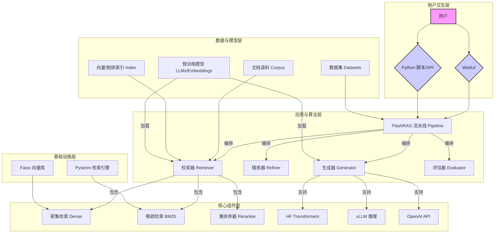
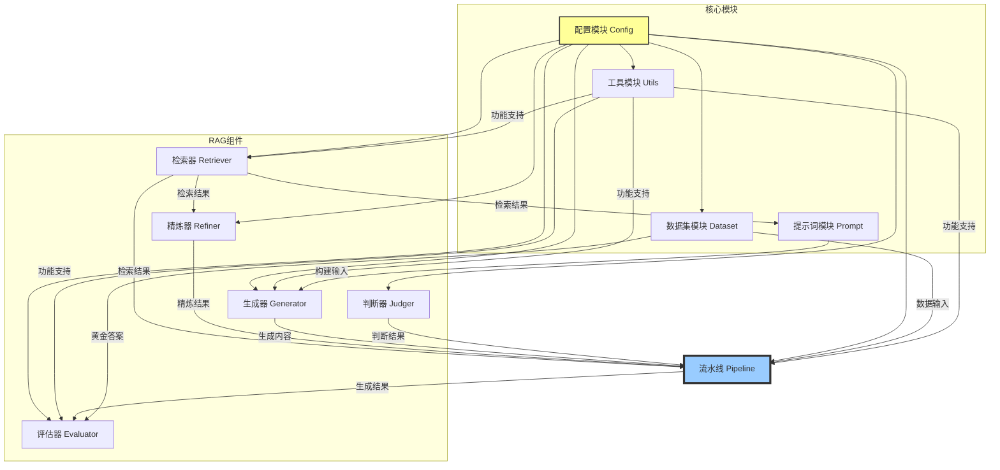
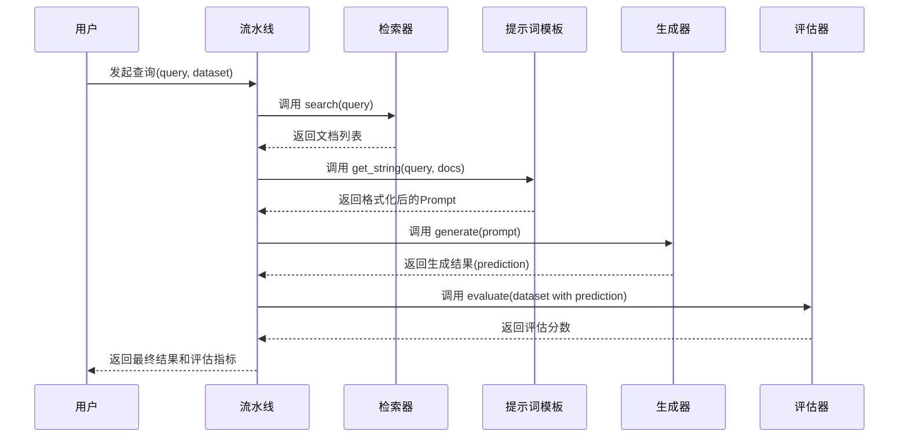
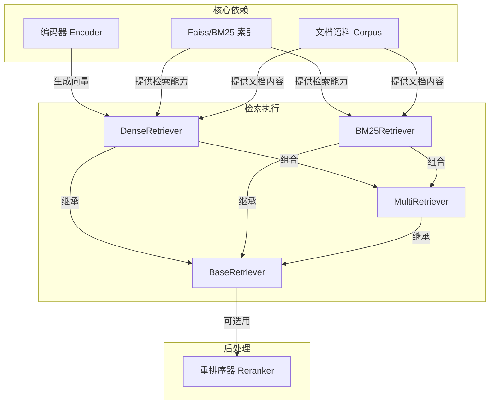
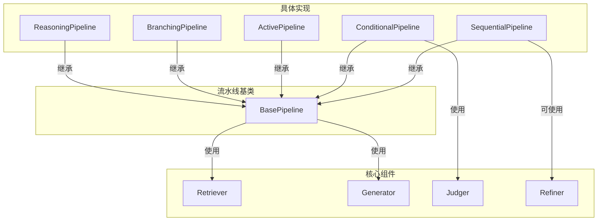

# FlashRAG
# 项目概述
FlashRAG 是一个专为检索增强生成（Retrieval-Augmented Generation, RAG）研究而设计的高效、模块化 Python 工具包。在当前大语言模型（LLM）蓬勃发展的背景下，RAG 作为一种有效结合外部知识库与 LLM 生成能力的技术，受到了广泛关注。然而，复现和开发新的 RAG 算法通常面临着数据处理繁琐、流程复杂、缺乏统一基准等挑战。FlashRAG 的诞生正是为了解决这些痛点，它旨在为研究人员和开发者提供一个统一、高效、可扩展的平台，从而显著简化和加速 RAG 的研究与开发周期。

该项目的核心用途是提供一个“开箱即用”的 RAG 实验环境。它通过高度模块化的设计，将复杂的 RAG 流程拆分为多个独立且可插拔的核心组件，如数据加载器（Dataset）、检索器（Retriever）、精炼器（Refiner）、生成器（Generator）、判断器（Judger）和评估器（Evaluator）。这种设计不仅使得标准的 RAG 流程（检索-阅读-生成）变得清晰易懂，还极大地增强了系统的灵活性，用户可以像搭积木一样，自由组合这些组件来构建、测试和验证各种创新的、复杂的 RAG 算法，例如 Self-RAG、FLARE 等。

FlashRAG 的主要功能亮点包括：
1.  **全面的基准支持**：项目预处理并集成了多达 36 个 RAG 领域的常用数据集和 16 种前沿的 RAG 算法，为算法的性能复现和公平比较提供了坚实的基础。
2.  **高效的底层优化**：为了提升运行效率，FlashRAG 集成了 vLLM、FastChat 等先进的 LLM 推理加速框架，并利用 Faiss 进行高效的向量索引与检索，确保了在处理大规模数据时依然能保持高性能。
3.  **完善的生态工具**：项目不仅提供核心算法库，还配备了丰富的数据处理脚本（如维基百科语料处理、文档分块）和索引构建工具，覆盖了 RAG 实验的全链路需求。
4.  **友好的用户界面**：内置了一个基于 Gradio 的 WebUI，用户无需编写代码，即可通过图形化界面直观地配置参数、进行交互式问答测试，并运行评估流程，极大地降低了使用门槛。

该项目的目标用户主要是从事自然语言处理、信息检索和人工智能领域的研究人员、学生以及希望将 RAG 技术应用到实际业务中的 AI 工程师。无论是需要快速验证算法思路，还是进行严谨的学术实验，抑或是搭建一个 RAG 应用原型，FlashRAG 都能提供强大的支持。

## 技术栈
*   **编程语言**:
    *   Python 3.9+
*   **框架与库**:
    *   **核心框架**: `transformers` (Hugging Face 生态核心), `torch` (PyTorch 深度学习框架)
    *   **LLM 推理加速**: `vllm`, `fschat`
    *   **向量检索**: `faiss` (CPU/GPU)
    *   **稀疏检索**: `pyserini`, `bm25s`
    *   **Web UI**: `gradio`, `streamlit`
    *   **数据处理**: `datasets`, `numpy`, `pandas` (通过 Excel 支持)
    *   **NLP 工具**: `nltk`, `spacy`, `jieba` (中文分词), `rouge-chinese`
*   **构建与工具**:
    *   `setuptools`: 用于项目打包和分发。
    *   `twine`: 用于将包发布到 PyPI。
    *   `ruff`: 用于代码风格检查和格式化。
*   **主要外部依赖**:
    *   Hugging Face Hub: 用于下载和托管模型、数据集。
    *   OpenAI API: 作为可选的生成器后端。
    *   PyPI: 用于包管理。

## 可视化图表

#### 系统架构图


#### 模块依赖图


#### 关键调用流程图 (标准RAG查询)


## 模块解析

### 1. 配置模块 (Config)
*   **核心职责**: 集中管理项目的所有配置参数。它作为整个系统的“神经中枢”，为其他所有模块提供统一、便捷的参数访问接口。该模块支持从 YAML 文件和 Python 字典加载配置，并实现了优先级机制（字典 > YAML 文件 > 默认配置），极大地提高了实验的灵活性和可复现性。
*   **关键文件**: `flashrag/config/config.py`, `flashrag/config/basic_config.yaml`
    *   `config.py`: 定义了 `Config` 类，负责解析、合并和管理配置项。初始化时，它会加载默认配置，然后用指定 YAML 文件中的配置覆盖，最后用传入的字典配置覆盖。
    *   `basic_config.yaml`: 提供了所有参数的默认值和模板，用户可以基于此文件创建自己的实验配置。它清晰地划分了全局路径、环境设置、检索器、生成器、评估器等部分的参数。
*   **代码特性**:
    *   **统一入口**: 所有模块都从一个 `Config` 实例中获取所需参数，避免了参数在代码中硬编码或四处传递的问题。
    *   **路径别名**: `model2path` 和 `method2index` 等设计，允许用户为模型和索引设置别名，简化了在不同实验中切换模型路径的复杂度。

### 2. 流水线模块 (Pipeline)
*   **核心职责**: 编排和驱动整个 RAG 流程。它是具体 RAG 算法的实现载体，通过组合不同的核心组件（检索器、生成器等）来执行从接收查询到生成最终答案的全过程。
*   **关键文件**: `flashrag/pipeline/pipeline.py`, `flashrag/pipeline/active_pipeline.py`, `flashrag/pipeline/branching_pipeline.py`
    *   `pipeline.py`: 定义了 `BasePipeline` 和一个最基础的 `SequentialPipeline`（顺序流水线）。`SequentialPipeline` 实现了标准的“检索-生成”流程，是其他复杂流程的基础。
    *   `active_pipeline.py`: 实现了一系列主动式、迭代式的 RAG 算法，如 `SelfRAGPipeline` 和 `FLAREPipeline`。这些流水线通常包含多轮的检索和生成，或者在生成过程中动态决定是否需要检索。
    *   `branching_pipeline.py`: 实现了分支式逻辑的 RAG 算法，如 `REPLUGPipeline`，它可能会并行处理多个检索结果或生成路径。
*   **代码特性**:
    *   **策略模式**: 每一种 RAG 算法都被封装成一个独立的 Pipeline 类，它们都遵循 `BasePipeline` 定义的接口（如 `.run()` 方法）。这使得添加新的 RAG 算法变得非常容易，只需继承基类并实现其核心逻辑即可。
    *   **组件注入**: Pipeline 在初始化时，通过 `Config` 动态加载所需的 `Retriever`、`Generator` 等组件，实现了流程与具体组件实现的解耦。

### 3. 检索器模块 (Retriever)
*   **核心职责**: 根据输入查询从大规模文档语料库中检索出最相关的文档片段。这是 RAG 的“检索”环节，其质量直接决定了生成答案的信息量和准确性。
*   **关键文件**: `flashrag/retriever/retriever.py`, `flashrag/retriever/reranker.py`, `flashrag/retriever/index_builder.py`
    *   `retriever.py`: 定义了 `BaseRetriever` 以及其具体实现，如 `DenseRetriever`（用于向量检索）和 `BM25Retriever`（用于稀疏检索）。它还实现了多路检索（`MultiRetriever`）逻辑，可以融合多种检索方法的结果。
    *   `reranker.py`: 提供了重排序功能。在初步检索（召回）后，使用更复杂的模型（如 `CrossRoster`）对候选文档进行重新排序，以提高排序顶部的文档质量。
    *   `index_builder.py`: 一个独立的脚本，用于根据指定的模型（如 E5, BGE）和语料库，构建 Faiss 向量索引或 BM25 倒排索引。
*   **代码特性**:
    *   **多样化支持**: 同时支持基于 embedding 的密集检索和基于关键词匹配的稀疏检索（BM25），并允许通过重排器进一步优化。
    *   **缓存机制**: 通过装饰器实现了检索结果的缓存，对于重复的查询可以直接从缓存加载，避免了不必要的计算，加速了调试和实验过程。

### 4. 生成器模块 (Generator)
*   **核心职责**: RAG 的“生成”环节。它接收经过处理的 prompt（通常包含原始问题和检索到的上下文），并调用大语言模型（LLM）来生成最终的答案。
*   **关键文件**: `flashrag/generator/generator.py`, `flashrag/generator/openai_generator.py`, `flashrag/generator/multimodal_generator.py`
    *   `generator.py`: 定义了 `BaseGenerator` 和针对本地模型的生成器实现，如 `HFGenerator`（基于 Hugging Face Transformers）、`VLLMGenerator`（基于 vLLM 框架）和 `FschatGenerator`（基于 FastChat）。
    *   `openai_generator.py`: 封装了对 OpenAI API 的调用，使其能够像本地模型一样被流水线统一调用。
    *   `multimodal_generator.py`: 提供了对多模态模型的支持，能够处理包含图像和文本的混合输入。
*   **代码特性**:
    *   **多后端抽象**: 通过统一的 `generate` 接口，屏蔽了不同推理后端（本地、vLLM、API）的实现差异。用户只需在配置中指定 `framework`，即可无缝切换，在开发效率和推理性能之间灵活选择。

### 5. WebUI 模块
*   **核心职责**: 提供一个图形化的用户界面，用于交互式地配置、运行和评估 RAG 流程。它极大地提升了项目的易用性和展示性。
*   **关键文件**: `webui/interface.py`, `webui/runner.py`, `webui/chatter.py`, `webui/manager.py`
    *   `interface.py`: 使用 Gradio 库构建 WebUI 的主入口，负责定义界面的整体布局，包括各个功能选项卡（聊天、评估、参数配置等）。
    *   `runner.py`: UI 的后端逻辑处理器。它负责解析来自前端的配置，构建 `Config` 对象，加载并运行相应的 `Pipeline`，并将结果返回给前端展示。
    *   `chatter.py`: 专门处理聊天功能的逻辑，实现了流式输出，使用户可以实时看到生成过程。
    *   `manager.py`: 一个管理 Gradio UI 组件的工具类，方便在后端逻辑中引用和更新前端的各个元素。
*   **代码特性**:
    *   **前后端分离**: 尽管都使用 Python，但其设计思想上将界面布局（`interface.py`）与后端逻辑（`runner.py`, `chatter.py`）分离，使得代码结构清晰。
    *   **动态配置加载**: UI 支持从保存的 YAML 配置文件中加载参数，也允许用户实时修改参数，`runner` 会动态地根据最新配置重新加载 RAG 流水线，提供了极佳的交互体验。

## 各个模块内文件/组件/功能关系图

#### 检索器模块 (Retriever Module)



#### 流水线模块 (Pipeline Module)


## 典型应用场景

1.  **场景一：快速验证和评测一个标准的 RAG 流程**
    *   **描述**: 一名研究生需要在一个新的问答数据集（如 NQ）上，快速搭建一个基于 `E5-base` 检索模型和 `Llama3-8B` 生成模型的标准 RAG 系统，并评测其 EM (Exact Match) 和 F1 分数。
    *   **实现**:
        1.  准备数据：下载 NQ 数据集，并使用 `scripts/preprocess_wiki.py` 和 `scripts/build_index.sh` 准备好 Wikipedia 语料库和对应的 Faiss 索引。
        2.  配置环境：在 `examples/methods/my_config.yaml` 文件中，填写好模型、数据、索引的本地路径。
        3.  执行脚本：直接运行 `examples/quick_start/simple_pipeline.py`。该脚本会自动加载配置，初始化 `SequentialPipeline`，在 NQ 测试集上运行完整的“检索-生成”流程，并调用 `Evaluator` 计算 EM 和 F1 分数，最后打印结果并将中间数据保存。这个过程不到 10 分钟即可完成一次完整的实验。

2.  **场景二：一键复现前沿的复杂 RAG 算法**
    *   **描述**: 一位算法研究员想要比较自己的新算法与 Self-RAG 在 `HotpotQA` 多跳问答任务上的性能差异。他需要一个可靠的 Self-RAG 基线结果。
    *   **实现**:
        1.  环境准备：除了标准模型和数据外，根据 `docs/original_docs/reproduce_experiment_zh.md` 的指引，下载 Self-RAG 官方发布的预训练模型。
        2.  修改配置：在 `examples/methods/run_exp.py` 中找到 `selfrag` 函数，确保其指向正确的模型路径。
        3.  运行命令：在终端执行 `python run_exp.py --method_name 'selfrag' --dataset_name 'hotpotqa'`。脚本会自动加载为 Self-RAG 定制的 `SelfRAGPipeline`，该流水线内部实现了动态检索和反思的复杂逻辑。实验结束后，可以直接获得 Self-RAG 在 HotpotQA 上的标准评测结果，为后续研究提供了坚实的对比基础。

3.  **场景三：通过可视化界面进行交互式演示和调试**
    *   **描述**: 一个AI团队需要向非技术的项目经理演示 RAG 技术如何提升问答系统的效果。同时，开发人员也希望能直观地看到每一步的中间结果，以方便调试。
    *   **实现**:
        1.  启动 WebUI：在终端中进入 `webui` 目录，运行 `python interface.py`。
        2.  参数配置：在浏览器打开的 Gradio 界面中，通过下拉菜单和文本框，轻松配置使用的检索模型、生成模型、语料库路径、检索的 Top-K 值等参数。
        3.  交互式问答：在“聊天”选项卡中输入问题，例如“中国的首都是哪里？中国的首都有哪些著名的旅游景点？”。系统会实时展示：
            *   **检索结果**：列出检索到的相关文档标题和内容。
            *   **中间步骤**（如果算法复杂）：如子问题生成、判断结果等。
            *   **最终答案**：由 LLM 生成的整合了检索信息的答案。
            通过这个界面，项目经理可以直观地感受到 RAG 带来的效果提升，开发人员也可以清晰地看到每一步的输入输出，快速定位问题。

## 产品研发参考

#### 作为产品经理，我应该借鉴的设计和思路：

1.  **模块化与可组合性 (Modular & Composable) 的产品设计**
    *   **借鉴思路**: FlashRAG 最核心的产品思想是将一个复杂的系统（RAG）拆解为一系列定义清晰、功能独立且可自由组合的“能力模块”（检索、生成、重排、判断等）。这不仅是技术架构上的解耦，更是产品设计上的“乐高化”。它允许用户根据自身需求，从简单到复杂，逐步构建自己的解决方案。
    *   **如何应用**: 在设计任何复杂的技术产品或平台时，都应优先考虑这种模块化思路。
        *   **定义标准接口**: 为每个核心功能模块定义清晰、稳定的输入输出接口。
        *   **提供默认组合**: 提供一个“一键启动”的默认组合（如 FlashRAG 的 `SequentialPipeline`），满足 80% 用户的基本需求，降低上手门槛。
        *   **开放高级定制**: 允许高级用户替换或自定义任何模块，甚至编排更复杂的流程。这能满足专业用户的深度需求，并促进社区生态的形成。

2.  **体验闭环与可视化**
    *   **借鉴思路**: FlashRAG 不仅仅是一个代码库，它通过提供 WebUI，构建了一个从“配置-运行-调试-评估”的完整体验闭环。这个 UI 将抽象的后端能力直观地呈现出来，让用户能“看到”并“玩起来”。这对于技术产品的推广和用户接受度至关重要。
    *   **如何应用**: 为你的技术产品设计一个配套的演示或管理界面。即使是面向开发者的工具，一个简单的 UI 也能极大地提升其吸引力。这个 UI 应该能：
        *   **可视化核心流程**: 将系统内部的关键步骤和中间结果展示出来。
        *   **参数可交互配置**: 让用户能通过点击和拖拽来调整参数，并立即看到效果。
        *   **简化核心任务**: 将最常用的任务（如运行一次评测）封装成一个按钮。

3.  **基准 (Benchmark) 即价值**
    *   **借鉴思路**: FlashRAG 集成了大量的标准数据集和算法实现，这本身就构成了产品的核心价值之一。它将自己定位为领域内的“标准尺子”，用户可以用它来衡量自己工作的成效。这为产品建立了权威性和信任度。
    *   **如何应用**: 如果你的产品处于一个新兴或快速发展的领域，积极拥抱并建立行业基准。
        *   **集成公共标准**: 预置行业内公认的数据集、模型或测试标准。
        *   **发布性能报告**: 定期发布基于你的平台的性能白皮书或排行榜。
        *   **简化复现**: 提供一键复现顶尖研究成果的功能，吸引顶尖用户。

#### 作为技术架构师，我应该复用的设计和技术：

1.  **配置驱动的架构 (Configuration-Driven Architecture)**
    *   **复用设计**: FlashRAG 的 `Config` 类是整个架构的基石。所有组件的实例化和行为都由一个外部的、统一的配置文件来驱动，而不是在代码中硬编码。
    *   **如何复用**: 在构建任何需要高度灵活性和可扩展性的系统（尤其是实验性平台）时，都应采用此模式。
        *   **实例**: 创建一个全局配置类，负责解析 YAML 或 JSON。系统中的各个模块（如数据库连接器、服务客户端）都通过依赖注入的方式从这个配置实例中获取自己的参数。
            ```python
            # my_system/config.py
            class AppConfig:
                def __init__(self, path):
                    # ... load from yaml ...
            
            # my_system/data_service.py
            class DataService:
                def __init__(self, config: AppConfig):
                    db_params = config.get('database')
                    self.connection = connect(**db_params)
            
            # main.py
            config = AppConfig('prod.yaml')
            data_service = DataService(config)
            ```
            这样做可以轻松地为不同环境（开发、测试、生产）或不同实验组创建不同的配置文件，而无需修改任何代码。

2.  **基于工厂模式和策略模式的多后端抽象**
    *   **复用设计**: `flashrag.utils.get_generator` 和 `get_retriever` 函数是典型的工厂方法。它们根据配置中的一个字符串（如 `framework: "vllm"`）返回不同的具体实现类（`VLLMGenerator`）。这些具体实现类都遵循同一个接口（策略模式），使得上层调用者（`Pipeline`）无需关心底层的具体技术。
    *   **如何复用**: 当你的系统需要集成多种外部服务或内部实现时（如不同的支付渠道、日志系统、推理引擎），这个模式非常有用。
        *   **实例**: 假设你需要支持多种云存储服务。
            ```python
            # storage/base.py
            from abc import ABC, abstractmethod
            class StorageProvider(ABC):
                @abstractmethod
                def upload(self, file):
                    pass
            
            # storage/s3.py
            class S3Storage(StorageProvider):
                def upload(self, file):
                    # ... S3 upload logic ...
            
            # storage/gcs.py
            class GCSStorage(StorageProvider):
                def upload(self, file):
                    # ... GCS upload logic ...
            
            # storage/factory.py
            def get_storage_provider(config):
                provider_name = config['storage']['provider']
                if provider_name == 's3':
                    return S3Storage(...)
                elif provider_name == 'gcs':
                    return GCSStorage(...)
                raise ValueError("Unknown provider")
            ```
            上层业务逻辑只需调用 `get_storage_provider(config).upload(file)`，完全无需关心文件是上传到 AWS S3 还是 Google Cloud Storage。

3.  **利用装饰器实现横切关注点 (Cross-Cutting Concerns)**
    *   **复用技术**: FlashRAG 在 `Retriever` 中巧妙地使用装饰器来实现缓存逻辑。这是一种非常优雅地添加通用功能（如日志、缓存、监控、权限校验）而不侵入核心业务逻辑代码的方式。
    *   **如何复用**: 在你的代码库中，识别那些重复出现在多个函数或方法中的逻辑。
        *   **实例**: 为需要大量计算的函数添加缓存。
            ```python
            import functools
            
            # cache_decorator.py
            def simple_lru_cache(maxsize=128):
                def decorator(func):
                    cache = {}
                    @functools.wraps(func)
                    def wrapper(*args, **kwargs):
                        key = (args, frozenset(kwargs.items()))
                        if key in cache:
                            return cache[key]
                        result = func(*args, **kwargs)
                        if len(cache) >= maxsize:
                            cache.pop(next(iter(cache))) # Simple FIFO
                        cache[key] = result
                        return result
                    return wrapper
                return decorator
            
            # data_processing.py
            @simple_lru_cache(maxsize=100)
            def heavy_computation(param1, param2):
                # ... takes a long time to compute ...
                return result
            ```
            通过简单地在函数上添加 `@simple_lru_cache`，就为其赋予了缓存能力，代码非常整洁。

