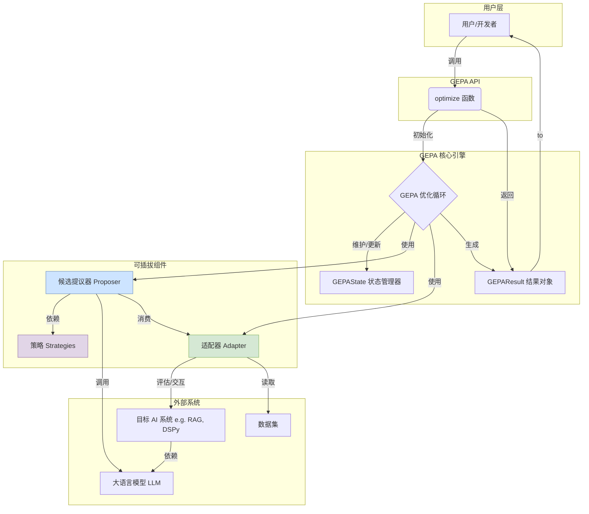
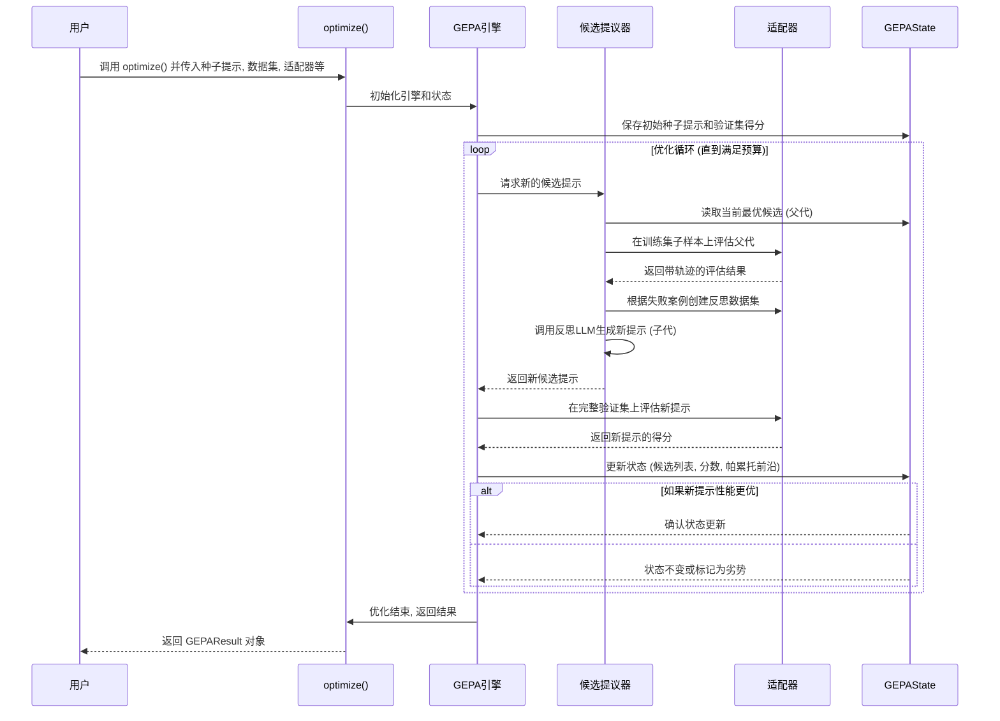
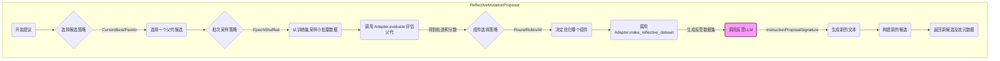
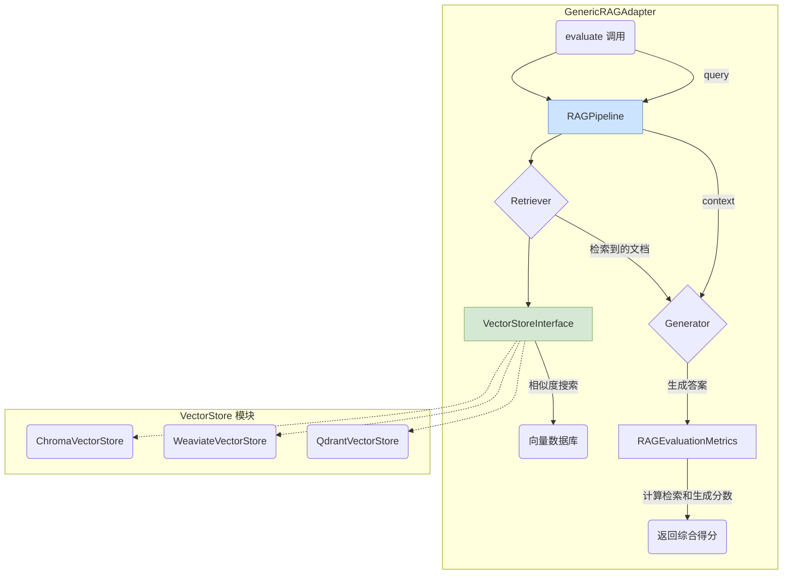

# GEPA

***

# 项目概述

GEPA (Genetic-Pareto) 是一个创新的框架，旨在通过模拟生物进化和自然语言反思的机制，自动化地优化人工智能系统中的文本组件，尤其是大型语言模型（LLM）的提示词（Prompt）。该项目提出了一种名为“反思性提示演进” (Reflective Prompt Evolution) 的方法，作为传统强化学习（RL）调优方法的有力替代方案。

传统的 RL 方法（如 GRPO）通常需要数千次的“rollouts”（即模型执行和评估的完整周期）才能让模型适应新的任务，这个过程不仅计算成本高昂，而且效率低下。GEPA 的核心论点是，语言本身具有丰富的可解释性，可以为 LLM 提供比稀疏的标量奖励信号（scalar rewards）更高效的学习媒介。

GEPA 的工作流程独具匠心。它首先在一个给定的 AI 系统（该系统可以包含一个或多个 LLM 提示）中进行采样，获取系统级的执行轨迹，这些轨迹包含了推理过程、工具调用和最终输出等完整信息。然后，GEPA 会对这些轨迹进行“反思”，使用自然语言诊断其中的问题，并提出具体的提示词修改建议。这些建议会被测试，表现优异的修改方案会被保留下来。更进一步，GEPA 借鉴了遗传算法和帕累托最优（Pareto frontier）的概念，将来自不同优化尝试的、互补的“经验教训”进行融合，从而创造出性能更强大的新一代提示词。

这种设计的最大优势在于，GEPA 能够将极少数的执行经验转化为显著的性能提升。实验数据显示，在四个不同的测试任务中，GEPA 的平均性能比 GRPO 高出 10%，最高可达 20%，而所需的执行次数（rollouts）却减少了高达 35 倍。同时，与业界领先的提示词优化器 MIPROv2 相比，GEPA 在两个不同的大型语言模型上也取得了超过 10% 的性能优势。

该项目的目标用户主要是 AI 开发者、研究人员和提示工程师。它解决了在将通用 LLM 应用于特定下游任务时，如何高效、低成本地提升模型性能的核心痛点。通过自动化和系统化的提示词演进，GEPA 摆脱了繁琐且依赖直觉的手动调优，为构建更强大、更可靠的 LLM 应用提供了一套科学而高效的方法论。

## 技术栈

*   **编程语言**:
    *   Python (>=3.10, <3.14)
*   **框架与库**:
    *   **LLM 交互**: `litellm` (用于与多种 LLM API 进行统一交互)
    *   **AI 框架集成**: `dspy` (项目提供与 DSPy 框架深度集成的适配器)
    *   **数据校验**: `pydantic` (用于定义和验证数据结构)
    *   **数据集处理**: `datasets` (来自 Hugging Face，用于加载和处理数据)
    *   **向量数据库 (用于 RAG)**:
        *   `chromadb`
        *   `weaviate-client`
        *   `qdrant-client`
        *   `pymilvus`
        *   `lancedb`
*   **构建与工具**:
    *   **包管理与虚拟环境**: `uv` (官方推荐的高性能包管理器)
    *   **构建系统**: `setuptools`, `wheel`, `build`
    *   **代码规范与格式化**: `ruff`, `pre-commit`
    *   **测试**: `pytest`
    *   **持续集成/持续部署 (CI/CD)**: GitHub Actions
*   **主要外部依赖**:
    *   **实验跟踪**: `mlflow`, `wandb`
    *   **数学库**: `semver`, `packaging` (用于版本处理)
    *   **命令行工具**: `tqdm` (用于显示进度条)

## 可视化图表

#### 系统整体架构图



#### 关键调用流程图 (优化过程)



## 模块解析

GEPA 的代码结构清晰，高度模块化，主要可以分为以下几个核心模块：

### 1. 核心引擎 (Core Engine)

*   **核心职责**:
    此模块是 GEPA 的心脏，负责驱动整个优化流程。它管理着演进算法的主循环，协调其他模块（如提议器、适配器）的工作，并精确地追踪和管理整个优化过程的状态。

*   **关键文件/组件/功能**:
    *   **`src/gepa/api.py`**:
        *   **功能**: 提供了项目最主要的外部接口 `optimize` 函数。这是用户与 GEPA 框架交互的入口点。
        *   **逻辑**: 该函数负责接收用户的配置（如种子候选、数据集、适配器、预算等），初始化 `GEPAEngine`，启动优化循环，并在循环结束后将最终的 `GEPAState` 封装成一个易于使用的 `GEPAResult` 对象返回给用户。
    *   **`src/gepa/core/state.py`**:
        *   **功能**: 定义了 `GEPAState` 类，这是整个优化过程中最关键的数据结构。
        *   **逻辑**: `GEPAState` 实例在内存中维护了所有运行时的重要信息，包括：所有已生成的候选提示列表 (`program_candidates`)、每个候选的父代关系 (`parent_program_for_candidate`)、在验证集上的完整得分和子任务得分 (`program_full_scores_val_set`, `prog_candidate_val_subscores`)，以及帕累托最优前沿 (`program_at_pareto_front_valset`)。它还提供了状态的保存和加载功能，支持长时间运行任务的中断和恢复。
    *   **`src/gepa/core/result.py`**:
        *   **功能**: 定义了 `GEPAResult` 数据类，作为 `optimize` 函数的最终返回结果。
        *   **逻辑**: 这是一个不可变的快照，封装了优化运行的所有关键结果。它提供了便利的属性访问器（如 `.best_candidate` 获取得分最高的候选），使得用户可以轻松地分析和使用优化成果，而无需关心内部状态的复杂性。
    *   **`src/gepa/core/adapter.py`**:
        *   **功能**: 定义了 `GEPAAdapter` 抽象基类。
        *   **逻辑**: 这是 GEPA 模块化设计的基石。它定义了一个清晰的接口契约，规定了核心引擎如何与任何待优化的外部 AI 系统进行交互。任何希望接入 GEPA 的系统都必须实现这个接口，主要包括 `evaluate`（评估一个候选）和 `make_reflective_dataset`（根据评估结果生成用于反思的数据集）两个核心方法。

### 2. 适配器层 (Adapters Layer)

*   **核心职责**:
    作为 GEPA 引擎与具体应用场景之间的桥梁。适配器将不同 AI 系统的评估逻辑和反馈机制统一封装，使得 GEPA 的核心算法无需关心底层系统的具体实现，从而实现了框架的高度可扩展性。

*   **关键文件/组件/功能**:
    *   **`src/gepa/adapters/default_adapter/`**:
        *   **功能**: 一个基础的、通用的适配器，用于优化简单的单轮问答任务。它定义了如何调用 LLM、如何判断回答是否包含标准答案，以及如何构造简单的反馈。
    *   **`src/gepa/adapters/dspy_full_program_adapter/`**:
        *   **功能**: 一个高级适配器，展示了 GEPA 的强大能力——不仅能优化提示词，还能演进整个 DSPy 程序（包括签名、模块和控制流）。
        *   **逻辑**: 它将整个 Python 代码块作为候选对象，通过 `exec` 执行来实例化 DSPy 程序，然后进行评估。其反思过程能够提出对代码结构的根本性修改，例如将一个 `dspy.Predict` 模块重构为一个包含多个 `dspy.ChainOfThought` 的复杂自定义模块。
    *   **`src/gepa/adapters/generic_rag_adapter/`**:
        *   **功能**: 为 Retrieval-Augmented Generation (RAG) 系统设计的专用适配器。
        *   **逻辑**: 这是最复杂的适配器之一，它内部包含了一个完整的 RAG 管道 (`RAGPipeline`)、一套专门的 RAG 评估指标 (`RAGEvaluationMetrics`)，以及一个与多种向量数据库（Chroma, Weaviate 等）交互的抽象接口 (`VectorStoreInterface`)。它能够协同优化检索提示和生成提示，并根据检索的准确率、召回率以及生成答案的忠实度等多维度指标进行评估。
    *   **`src/gepa/adapters/anymaths_adapter/`**:
        *   **功能**: 专门用于解决数学应用题的适配器。
        *   **逻辑**: 它要求 LLM 以结构化 JSON 的形式输出答案（包含最终答案和解题步骤），便于精确评分。它的反馈机制会明确指出正确答案，引导模型学习正确的解题格式和逻辑。

### 3. 候选提议器 (Candidate Proposer)

*   **核心职责**:
    这是实现“演进”的核心模块。它负责分析现有候选的表现，并创造出新的、有望超越现有水平的候选。

*   **关键文件/组件/功能**:
    *   **`src/gepa/proposer/base.py`**:
        *   **功能**: 定义了提议器的基础协议 `ProposeNewCandidate` 和数据结构 `CandidateProposal`。
    *   **`src/gepa/proposer/reflective_mutation/reflective_mutation.py`**:
        *   **功能**: `ReflectiveMutationProposer` 是 GEPA 默认的、也是最核心的提议器实现。
        *   **逻辑**: 它完整地实现了“反思-变异”的流程：
            1.  **选择**: 调用 `CandidateSelector` 策略，从当前所有候选中选择一个“父代”进行优化。
            2.  **采样**: 调用 `BatchSampler` 策略，从训练集中抽取一个小批量数据。
            3.  **评估与反思**: 使用适配器在小批量数据上评估父代，收集失败或表现不佳的案例，并调用 `adapter.make_reflective_dataset` 生成用于反思的结构化数据。
            4.  **生成**: 调用一个强大的“反思 LLM”，将原始提示、失败案例和反馈作为输入，要求其生成一个经过改进的新提示。这个过程由 `InstructionProposalSignature` 来结构化。
            5.  **返回**: 将生成的新提示封装成 `CandidateProposal` 对象返回给核心引擎。

### 4. 策略与辅助组件 (Strategies & Utilities)

*   **核心职责**:
    提供一系列可插拔的策略组件，用于精细化地控制提议器的行为。这种设计使得算法的不同方面（如选择、采样）可以独立地进行替换和实验。

*   **关键文件/组件/功能**:
    *   **`src/gepa/strategies/candidate_selector.py`**:
        *   **功能**: 定义了选择父代候选的策略。
        *   **逻辑**: 包含 `ParetoCandidateSelector`（从帕累托最优前沿中根据频率进行采样，鼓励多样性）和 `CurrentBestCandidateSelector`（始终选择当前总分最高的候选，倾向于利用）等。
    *   **`src/gepa/strategies/component_selector.py`**:
        *   **功能**: 对于拥有多个可优化文本组件的候选（例如 RAG 中的检索提示和生成提示），该策略决定本次迭代优化哪一个组件。
        *   **逻辑**: 提供了 `RoundRobinReflectionComponentSelector`（轮流选择）和 `AllReflectionComponentSelector`（同时优化所有组件）等策略。
    *   **`src/gepa/strategies/instruction_proposal.py`**:
        *   **功能**: 定义了 `InstructionProposalSignature`，它本质上是一个精心设计的、用于指导“反思 LLM” 的元提示（Meta-Prompt）。
        *   **逻辑**: 这个元提示模板会格式化地整合当前指令、输入输出案例和反馈，然后清晰地指示 LLM 分析问题并生成一个更优的新指令，最后通过 `output_extractor` 从 LLM 的响应中解析出新指令。

## 各个模块内文件/组件/功能关系图

#### 候选提议器 (ReflectiveMutationProposer) 内部工作流程



#### 通用 RAG 适配器 (GenericRAGAdapter) 内部结构



## 典型应用场景

一个最典型且能体现 GEPA 核心价值的应用场景是：**为一个数学问答机器人优化系统提示，以提升其在 GSM8K 等数学应用题基准测试上的准确率**。

**场景复现**:
1.  **目标**: 我们有一个基础的 LLM (例如 `ollama/qwen3:4b`)，希望它能准确解答数学应用题。初始的系统提示非常简单，比如：“你是一个数学助手，请解决以下问题。”
2.  **准备工作**:
    *   **数据集**: 使用 `src/gepa/examples/anymaths-bench/train_anymaths.py` 中的 `init_dataset` 函数加载 `openai/gsm8k` 数据集，并划分为训练集和验证集。每条数据包含 `question` 和 `answer`。
    *   **适配器**: 实例化 `AnyMathsAdapter`。这个适配器被配置为使用我们的基础 LLM。它知道如何将系统提示和问题发送给 LLM，并期望得到一个包含 `final_answer` 和 `solution_pad` 的 JSON 响应。它的评分逻辑很简单：`1.0 if ground_truth in assistant_final_answer else 0.0`。
    *   **反思模型**: 准备一个更强大的 LLM (例如 `ollama/qwen3:8b`) 作为“反思模型”，用于分析失败案例并提出改进建议。
3.  **执行优化**:
    *   **编写脚本**: 参照 `train_anymaths.py`，设置初始的种子提示 `seed_instruction`。
    *   **调用 GEPA**:
        ```python
        optimized_results = optimize(
            seed_candidate={"instruction_prompt": seed_instruction},
            trainset=trainset,
            valset=valset,
            adapter=AnyMathsAdapter(model=base_lm),
            reflection_lm=reflection_lm, # 强大的反思模型
            max_metric_calls=500, # 设置优化预算
            display_progress_bar=True,
        )
        ```4.  **GEPA 内部工作流**:
    *   **第1轮**: GEPA 使用初始提示在验证集上进行评估，得到一个基准分数。
    *   **第2轮**:
        *   `ReflectiveMutationProposer` 选择初始提示作为父代。
        *   它从训练集中随机抽取一小批数学题（例如 8 道）。
        *   `AnyMathsAdapter` 用初始提示去解答这 8 道题，发现答错了 5 道。
        *   适配器为这 5 道错题生成“反思数据”，格式如下：
            ```
            - Inputs: "马克有5个苹果..."
            - Generated Outputs: "..." (错误答案)
            - Feedback: "回答错误。正确答案是 7。"
            ```
        *   提议器将这些反思数据连同初始提示一起发送给强大的反思 LLM，并指示它：“请分析这些失败案例，并重写一个更好的系统提示。”
        *   反思 LLM 可能会发现基础 LLM 经常在多步计算中出错，于是它生成了一个新的、更详细的提示，强调“分步思考，并仔细检查每一步的计算”。
    *   **后续迭代**: GEPA 引擎用这个新提示在完整验证集上评估。如果分数提升，这个新提示就被加入到候选池中。接下来的迭代会继续从表现最好的提示中选择，不断重复“评估-反思-改进”的循环，直到预算用尽。
5.  **最终成果**:
    `optimize` 函数返回的 `optimized_results.best_candidate` 包含了一个经过上百次迭代演进而来的最优提示。这个提示可能非常详尽（类似 `optimal_prompt.txt`），包含了对问题类型的深入理解、对常见错误的规避策略、以及对输出格式的严格要求，从而使得最初那个表现平平的基础 LLM 在数学能力上得到巨大提升。

## 产品研发参考

### 对产品经理的启示

1.  **借鉴“反思演进”的产品思路**:
    *   **核心思想**: GEPA 的核心是“机器通过自我反思进行学习和进化”。这个思想可以产品化到许多 AI 应用中。例如，一个 AI 写作助手，当用户反复修改其生成的文案时，系统可以自动触发一个“反思”流程，分析用户的修改模式，并主动优化其内部的生成指令，从而在下一次生成时更贴近用户的风格和需求。
    *   **如何应用**: 我们可以设计一个“持续学习”模块。在产品后台，收集用户负反馈或高频修改的案例，将其打包成 GEPA 中的“反思数据集”。定期或在资源空闲时，调用一个更强大的模型（反思 LLM）来优化应用的核心提示，实现产品的“自适应”和“自进化”，减少人工维护成本。

2.  **模块化与可扩展性的产品设计**:
    *   **核心思想**: GEPA 通过 `Adapter` 模式将核心优化算法与具体应用场景解耦，这是一个极佳的平台化设计思路。
    *   **如何应用**: 如果我们正在构建一个企业级 AI 应用平台，可以将 GEPA 作为核心的“性能优化引擎”。然后，为不同的业务场景（如邮件撰写、合同审查、SQL 查询生成、客服对话）开发不同的“适配器插件”。这样，平台的核心能力是通用的，而对具体业务的适应性可以通过插件市场或开放 API 来实现，极大地增强了产品的生态潜力和商业价值。

3.  **过程可视化与用户控制**:
    *   **核心思想**: GEPA 的帕累托前沿概念意味着不存在唯一的“最优解”，而是一系列在不同维度上各有优势的解。
    *   **如何应用**: 在产品界面上，可以设计一个可视化的仪表盘，展示提示词的演进过程。用图表（如散点图）展示不同候选提示在不同评估指标（如“准确率” vs “响应速度” vs “安全性”）上的表现。这使用户能够根据自己的业务需求（例如，客服场景可能更看重安全性，而数据分析场景更看重准确率）选择最合适的提示，而不是被动接受一个“黑盒”优化结果。

### 对技术架构师的启示

1.  **复用 Adapter 设计模式进行系统解耦**:
    *   **核心技术**: `GEPAAdapter` 抽象基类是教科书级别的适配器模式应用，它定义了清晰的职责边界。
    *   **如何应用**: 在任何需要将一个通用算法应用于多个不同子系统的场景中，都可以借鉴此模式。例如，构建一个统一的数据质量监控系统。我们可以定义一个 `DataSourceAdapter` 接口，包含 `connect()`, `sample_data()`, `get_schema()` 等方法。然后为 `PostgreSQL`, `MongoDB`, `S3 CSV` 等不同数据源实现具体的适配器。这样，核心的监控和告警逻辑就可以保持不变，而系统的数据源支持能力可以无限扩展。
    *   **具体实例**:
        ```python
        # 定义统一接口
        class DataSourceAdapter(ABC):
            @abstractmethod
            def get_data_batch(self, size: int) -> pd.DataFrame:
                pass
        
        # 为特定系统实现适配器
        class PostgresAdapter(DataSourceAdapter):
            def get_data_batch(self, size: int) -> pd.DataFrame:
                # ... 实现从 Postgres 拉取数据的逻辑 ...
                pass

        # 核心逻辑与适配器解耦
        def run_quality_checks(adapter: DataSourceAdapter):
            data = adapter.get_data_batch(1000)
            # ... 通用的数据质量检查逻辑 ...
        ```

2.  **借鉴状态管理与可恢复性设计**:
    *   **核心技术**: `GEPAState` 类将所有运行时状态集中管理，并支持序列化到磁盘，这对于长时间运行的、有状态的计算任务至关重要。
    *   **如何应用**: 在设计任何需要进行多轮迭代、计算成本高昂的系统时（如模型训练、大规模数据处理、仿真模拟），都应该设计一个类似的状态管理对象。该对象应包含所有恢复任务所需的信息，并在每次迭代后（或定期）进行持久化。
    *   **具体实例**: 在一个自定义的模型训练循环中，可以创建一个 `TrainingState` 类。
        ```python
        @dataclass
        class TrainingState:
            epoch: int
            model_state_dict: dict
            optimizer_state_dict: dict