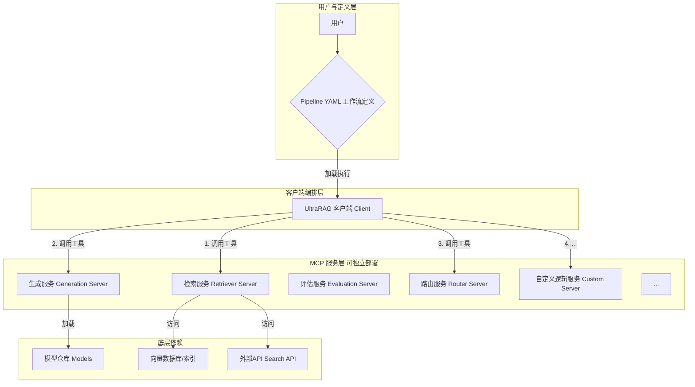
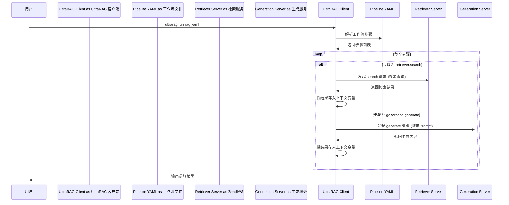
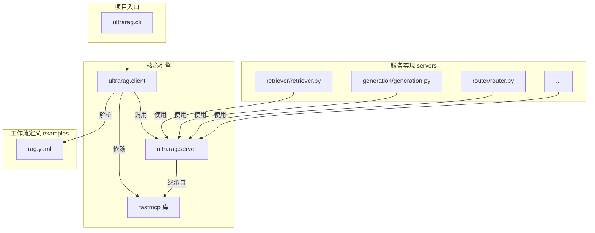
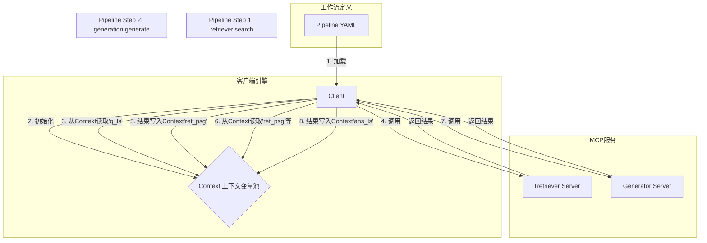
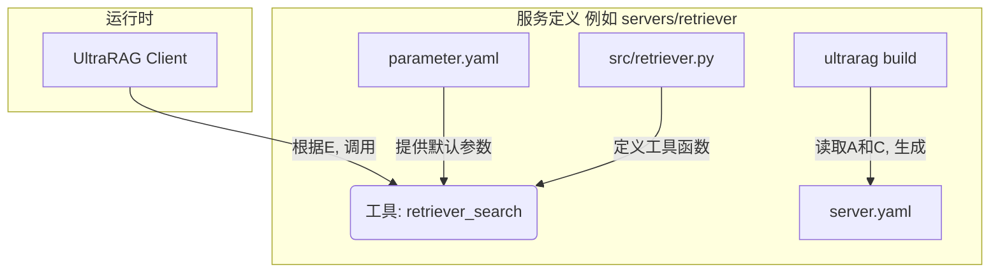

# UltraRAG

---

# UltraRAG 项目技术文档

# 项目概述

UltraRAG 是一个先进的、以**服务编排**为核心思想的检索增强生成（RAG）框架。与传统的 RAG 工具库不同，UltraRAG 的设计哲学是将 RAG 的各个功能单元（如检索、生成、评估等）彻底解耦，将它们封装成独立的、标准化的 **MCP Server (Model Context Protocol Server)**。这种架构使得开发者能够从繁重的工程实现中解放出来，转而通过编写简洁的 **YAML 配置文件**来定义和执行从简单到极其复杂的 RAG 工作流。

项目的核心目标是**降低复杂 RAG 系统的构建门槛，并加速前沿 RAG 算法的实验与迭代**。它认识到，现代 RAG 系统正在从简单的“检索+生成”模式，演变为包含自适应知识组织、多轮迭代推理和动态工具调用的复杂智能体（Agent）系统。为了应对这种复杂性，UltraRAG 引入了 **Model Context Protocol (MCP)**，这是一个开放协议，旨在标准化大型语言模型（LLM）与外部知识和工具的交互方式。通过这种 Client-Server 架构，UltraRAG 将复杂的执行逻辑（如循环、条件分支）从 Python 代码中剥离，转移到了声明式的 YAML `pipeline` 中。

UltraRAG 的目标用户是那些希望探索和实现前沿 RAG 方法（如 `DeepResearch`, `Search-o1`, `IRCoT`）的研究人员，以及需要构建可扩展、可维护的生产级 RAG 服务的系统架构师。对于研究者，它提供了一个“低代码”的实验平台，可以快速验证复杂的推理链条。对于工程师，它提供了一套可独立部署和扩展的微服务组件，能够灵活应对生产环境的需求。总而言之，UltraRAG 不仅仅是一个 RAG 功能的集合，更是一个强大、灵活的 **RAG 工作流编排引擎**。

# 技术栈

| 分类 | 技术/工具 | 描述 |
| :--- | :--- | :--- |
| **编程语言** | `Python` | 项目的主要开发语言。 |
| **核心框架** | `FastMCP` | 项目的基石，一个实现了 Model Context Protocol 的高性能客户端-服务端框架。 |
| | `Jinja2` | 用于动态生成和管理复杂的提示（Prompt）。 |
| | `vLLM` | 作为可选的高性能 LLM 推理后端，通过 OpenAI 兼容的 API 接口提供服务。 |
| **核心库** | `infinity_emb` | 一个灵活的文本嵌入推理服务，用于支持本地部署的检索和重排序模型。 |
| | `lancedb` | 一个可选的、高性能的开源向量数据库。 |
| | `faiss-gpu` / `faiss-cpu` | Facebook AI 的向量检索库，用于构建本地向量索引。 |
| | `aiohttp` | 用于实现异步 HTTP 客户端，与 MCP Server 进行通信。 |
| | `PyYAML` | 用于解析作为工作流定义的 YAML 配置文件。 |
| | `llama-index` | 用于文档解析和分块等语料库处理任务。 |
| | `uv` / `pip` | 项目推荐和支持的 Python 包管理和安装工具。 |
| **构建与工具** | `Conda` | 用于创建和管理 Python 虚拟环境。 |
| | `Docker` | 用于项目的容器化部署，提供了一致的运行环境。 |
| | `setuptools` | Python 项目的打包和分发工具。 |
| **主要外部依赖** | `OpenAI API` | 支持直接调用 OpenAI 的模型作为生成器或嵌入模型。 |
| | `Tavily AI` / `Exa` | 集成了第三方搜索引擎 API，用于需要实时网络搜索的 RAG 流程。 |

# 可视化图表

### 系统架构图

此图展示了 UltraRAG 基于 MCP 的 Client-Server 核心架构。客户端通过解析 YAML 工作流，编排调用一系列独立的 MCP 服务。



### 核心工作流执行流程图

此图描绘了一个典型的 UltraRAG 工作流是如何被客户端解析和执行的。



### 模块依赖关系图

此图展示了 UltraRAG 内部核心模块的构成与关系，突出了其以 `client` 和 `server` 为核心的结构。



# 模块解析

UltraRAG 的架构设计独树一帜，其核心是 **Client-Server** 模式和**声明式工作流**。

### 1. 客户端与编排引擎 (`src/ultrarag/client.py`)

*   **核心职责**: 这是整个框架的“大脑”和执行入口。它负责解析用户指定的 YAML 工作流文件，管理一个全局的上下文（context），并根据 pipeline 中定义的步骤，依次向对应的 MCP Server 发送请求，然后将返回结果更新到上下文中，供后续步骤使用。
*   **关键组件/功能**:
    *   `Client` 类: 维护一个服务器池 (`servers`) 和一个上下文状态 (`context`)。
    *   `run` 方法: 循环遍历 YAML 文件中 `pipeline` 列表的每一个步骤。
    *   **步骤解析**: 对每个步骤，如 `retriever.retriever_deploy_search`，它会拆分为服务器名 (`retriever`) 和工具名 (`retriever_deploy_search`)。
    *   **参数映射**: 它会根据工具的输入/输出注解（如 `q_ls->ret_psg`）和 YAML 中定义的 `input/output` 映射，从当前上下文中提取变量作为请求参数，并将服务器返回的结果写回指定的上下文变量。
*   **代码特性解读**: `client.py` 的设计实现了**业务逻辑与执行流程的完全分离**。它本身不包含任何 RAG 的具体实现（如如何检索、如何生成），它只关心“调用谁（哪个 Server）”、“用什么参数（从 context 来）”以及“结果存到哪（存回 context）”。这使得工作流的定义异常灵活。

### 2. MCP 服务模块 (`servers/` 目录, `src/ultrarag/server.py`)

*   **核心职责**: 将 RAG 的原子能力（如检索、生成、重排序等）封装成独立的、可通过网络调用的服务。每个子目录（如 `servers/retriever`）都代表一个可独立运行的微服务。
*   **关键组件/功能**:
    *   `UltraRAG_MCP_Server` 类 (`src/ultrarag/server.py`): 继承自 `FastMCP`，是所有服务的基础。它提供了 `@app.tool` 和 `@app.prompt` 装饰器，用于将普通 Python 函数快速封装成可通过 MCP 协议调用的工具。
    *   **服务定义结构**: 每个服务目录下通常包含：
        *   `src/*.py`: 服务的核心逻辑实现。例如 `servers/retriever/src/retriever.py` 中定义了 `retriever_init`、`retriever_embed`、`retriever_search` 等工具函数。
        *   `parameter.yaml`: 该服务的默认配置文件，定义了模型路径、API key、默认参数等。
        *   `server.yaml` (自动生成): 由 `ultrarag build` 命令生成，它描述了该服务对外暴露的所有工具及其输入输出签名，是客户端识别服务能力的依据。
*   **代码特性解读**: 这种架构是典型的**微服务思想**。每个 Server 都是一个独立的进程，可以单独部署、升级和扩展。例如，可以将计算密集型的 `generation` 服务部署在带有多张高端 GPU 的机器上，而将 IO 密集型的 `retriever` 服务部署在另一台机器上。它们之间通过标准化的 MCP 协议通信，实现了物理和逻辑上的解耦。

### 3. 声明式工作流模块 (`examples/*.yaml`)

*   **核心职责**: 这是用户与 UltraRAG 交互的主要方式。用户通过编写 YAML 文件来“编程”，定义一个完整的 RAG 流程，而不是编写 Python 代码。
*   **关键组件/功能**:
    *   `servers` 字段: 定义了本次工作流需要启动哪些 MCP 服务，并指向它们的配置文件。
    *   `pipeline` 字段: 一个步骤列表，定义了工具的调用顺序。
    *   **控制流**: YAML 中支持 `loop`（循环）和 `branch`（条件分支）等高级控制结构。
        *   `loop`: 可以指定一个步骤块重复执行固定次数。
        *   `branch`: 配合 `router` 服务，可以根据上一步的输出结果，动态地选择执行哪一个分支的流程。例如，在 `search_o1.yaml` 中，`router.search_o1_check` 工具会检查生成内容，如果包含特定标记，则继续检索（`retrieve`分支），否则停止（`stop`分支）。
*   **代码特性解读**: 这是 UltraRAG 的核心创新点。它将复杂的程序控制流（循环、判断）用一种声明式的、人类可读的格式来描述。这极大地降低了构建复杂 Agentic Workflow 的难度。研究人员可以专注于逻辑流程的设计，而无需关心底层的状态管理和函数调用细节。

### 4. 提示工程模块 (`prompt/` 目录)

*   **核心职责**: 管理和渲染所有在 RAG 流程中需要用到的 Prompt。
*   **关键组件/功能**:
    *   `.jinja` 文件: 使用 Jinja2 模板引擎。这比简单的 f-string 格式化更强大，支持在模板内进行循环、条件判断等简单逻辑，非常适合构建复杂的动态 Prompt。
    *   `prompt` 服务 (`servers/prompt/`): 提供了一个标准的 MCP 服务，其工具（如 `qa_rag_boxed`）负责接收变量（如 `q_ls`, `ret_psg`），加载对应的 Jinja 模板，渲染成最终的 Prompt 字符串，并返回给客户端。
*   **代码特性解读**: 将 Prompt 的管理也服务化、模板化，使得 Prompt 的迭代和管理更加系统。研究人员可以独立地修改 `.jinja` 文件来优化提示，而无需触碰任何 Python 代码。

## 各个模块内文件/组件/功能关系图

### 工作流 (YAML) 与引擎的交互图



### 服务 (Server) 的内部构成图



# 典型应用场景

### 场景一：构建一个可自主规划和检索的 AI 研究助理 (DeepResearch/WebNote)

**背景**：一位分析师需要撰写一份关于“人工智能在金融行业的应用”的深度报告。她希望 AI 能够像人类一样，先制定大纲，然后针对大纲中的每个要点进行分解、检索、总结，最后形成一篇结构完整的报告。

**使用 UltraRAG** (`examples/webnote.yaml`):
1.  **定义工作流**: 分析师（或开发者）编写 `webnote.yaml` 文件，其 `pipeline` 包含以下逻辑：
    *   **步骤1 (生成计划)**: 调用 `generation` 服务，使用 `webnote_gen_plan.jinja` 模板，让 LLM 根据初始问题生成一个 JSON 格式的报告大纲（Plan）。
    *   **步骤2 (初始化页面)**: 调用 `generation` 服务，使用 `webnote_init_page.jinja`，将 Plan 转换成一个带有 `[To be filled]` 占位符的 Markdown 页面框架。
    *   **步骤3 (循环填充)**: 进入一个 `loop` 循环（最多10次）：
        *   **分支判断**: 调用 `router` 服务的 `webnote_check_page` 工具，检查页面是否还有 `[To be filled]`。
        *   **若未完成 (`incomplete` 分支)**:
            *   调用 `generation` 服务，根据 Plan 和当前页面内容，生成下一个需要填充章节的子问题（`webnote_gen_subq`）。
            *   调用 `retriever` 服务（如 `retriever_tavily_search`），用子问题进行网络搜索。
            *   调用 `generation` 服务，将搜索结果和页面现状结合，填充对应章节（`webnote_fill_page`），生成新版页面。
        *   **若已完成 (`complete` 分支)**: 退出循环。
    *   **步骤4 (生成最终答案)**: 将最终填充完毕的页面作为上下文，调用 `generation` 服务，生成最终的总结性答案。
2.  **执行与观察**: 用户只需一行命令 `ultrarag run examples/webnote.yaml`，就可以启动整个流程。在日志中，他能清晰地看到每一步的计划、生成的子问题、检索到的内容以及页面被逐步填充的完整过程。

### 场景二：为不同复杂度的用户问题提供自适应的 RAG 策略

**背景**：一个在线客服机器人需要回答用户提问。问题复杂度不一：有些是简单事实（“你们的营业时间是？”），有些需要简单检索（“A产品的最新功能是什么？”），还有些是复杂问题，需要多步推理（“对比A产品和B产品的优缺点，并推荐一个给我”）。

**使用 UltraRAG** (可组合 `rag.yaml` 和 `IRCoT.yaml` 的逻辑):
1.  **构建路由服务**: 开发者可以创建一个 `QueryClassifier` 服务，其核心工具 `classify_query` 使用一个小型分类模型或 LLM Few-shot Prompting，将输入问题分为 `simple`, `rag`, `complex` 三类。
2.  **定义分支工作流**: 在主 `pipeline.yaml` 中：
    *   **步骤1**: 调用 `query_classifier.classify_query`。
    *   **步骤2**: 使用 `branch` 控制流，根据上一步的分类结果，将任务分发到不同的处理流程：
        *   **`simple` 分支**: 直接调用 `generation` 服务进行回答 (类似 `vanilla.yaml`)。
        *   **`rag` 分支**: 执行标准的“检索->生成”流程 (类似 `rag.yaml`)。
        *   **`complex` 分支**: 执行一个包含 `loop` 的多步推理和检索流程 (类似 `IRCoT.yaml`)。
3.  **部署与运行**: 将所有服务（`QueryClassifier`, `Retriever`, `Generator`等）启动。客户端只需调用这一个统一的 pipeline 入口，系统就能自动为不同问题匹配最高效、最合适的解决路径。

# 产品研发参考

### 作为产品经理的借鉴思路

1.  **工作流即产品 (Workflow-as-a-Product)**：
    *   **设计借鉴**: UltraRAG 的核心产品理念是将“流程”本身作为交付物。用户通过 YAML 定义工作流，这比提供一个功能繁杂的 UI 或一个复杂的 SDK 更具灵活性和表现力。它将产品的设计权部分交还给了高级用户。
    *   **应用思路**: 在设计 PaaS 平台或企业级自动化工具时，可以提供一个可视化的拖拽式工作流编辑器，其后端就对应生成一份类似 UltraRAG 的 YAML 或 JSON 定义。这样既满足了普通用户的易用性，也满足了高级用户通过代码/配置进行版本控制和复杂定制的需求。

2.  **协议先行，生态后至**:
    *   **设计借鉴**: UltraRAG 强依赖于 MCP 协议。这意味着任何遵循 MCP 协议的组件，理论上都可以无缝接入 UltraRAG 的生态。这是一种非常高明的生态构建策略，先定义标准，再吸引贡献者。
    *   **应用思路**: 在规划一个平台级产品时（如物联网平台、开放金融平台），应优先投入资源设计和推广一套开放、健壮的 API 或协议标准。鼓励第三方开发者基于此标准开发“插件”或“服务”，而不是试图自己做所有事。平台的价值在于连接，而协议是连接的基础。

3.  **可观测性是复杂系统的必备品**:
    *   **设计借鉴**: UltraRAG 的日志和上下文变量传递机制，使得用户可以清晰地追踪一个复杂任务的每一步执行情况。对于一个黑盒的 AI 系统，这种透明度至关重要，它既是调试的利器，也是建立用户信任的基础。
    *   **应用思路**: 设计任何包含自动化流程或 AI决策的产品时，必须内置一个“执行历史”或“决策日志”功能。用户需要能看到“为什么系统会做出这个决策？”，“它参考了哪些数据？”，“经历了哪些步骤？”。这种可解释性是产品从“可用”到“可信”的关键一步。

### 作为技术架构师的复用思路

1.  **基于协议的微服务架构**:
    *   **技术复用**: UltraRAG 的架构是微服务思想的典范。每个 RAG 组件都是一个独立的 MCP Server。这种设计带来的好处是巨大的：**独立部署**、**独立扩展**、**技术异构**（例如，Retriever 可以用 Java 实现，只要它遵循 MCP 协议）、**故障隔离**。
    *   **使用实例**: 构建一个复杂的电商后台系统。可以将“订单服务”、“库存服务”、“用户服务”、“支付服务”分别设计成独立的微服务。它们之间不直接进行代码调用，而是通过一套统一的 RPC 协议（如 gRPC, Thrift，或类似 MCP 的自定义协议）进行通信。这样，在“双十一”大促时，可以单独对瓶颈最严重的“库存服务”进行水平扩展，而无需改动其他服务。

2.  **声明式流程编排引擎**:
    *   **技术复用**: `client.py` 的实现是一个轻量级的、通用的流程编排引擎。其核心逻辑——“解析步骤、映射IO、调用服务、更新上下文”——可以被抽象出来，用于任何需要任务编排的场景。
    *   **使用实例**: 可以基于这个思路构建一个数据处理的 ETL 引擎。用户通过 YAML 定义 ETL 流程：
        ```yaml
        pipeline:
          - extractor.read_from_mysql:
              output: raw_data
          - transformer.clean_data:
              input: raw_data
              output: cleaned_data
          - transformer.aggregate_data:
              input: cleaned_data
              output: aggregated_data
          - loader.write_to_s3:
              input: aggregated_data
        ```
        引擎 `client` 会依次调用 `Extractor`、`Transformer`、`Loader` 等服务来完成整个数据流水线，而这些服务本身可以是独立的微服务。

3.  **上下文状态管理**:
    *   **技术复用**: UltraRAG 的 `context` 对象是一个简单的 Python 字典，但它巧妙地解决了多步骤任务中的状态传递问题。每一步的输出成为下一步的输入，状态在 `context` 中清晰地流转。
    *   **使用实例**: 在设计一个CI/CD流水线执行器时，可以借鉴此模式。
        ```python
        # context 初始化
        context = {'repo_url': '...', 'branch': 'main'}
        
        # Step 1: git_clone
        # output: 'source_dir'
        # context becomes: {'repo_url': ..., 'branch': 'main', 'source_dir': '/path/to/src'}
        
        # Step 2: run_tests
        # input: 'source_dir'
        # output: 'test_report_path'
        # context becomes: {..., 'source_dir': ..., 'test_report_path': '/path/to/report'}
        
        # Step 3: build_image
        # input: 'source_dir'
        # output: 'image_tag'
        # ...
        ```
        这种显式的、集中的状态管理方式，使得复杂的、有状态的流程变得易于理解和调试。

---

# 对比分析：UltraRAG vs. FlashRAG

在深入分析了两个项目后，我们可以从多个维度对它们进行一个全面的对比。

| 对比维度 | FlashRAG | UltraRAG | 总结与点评 |
| :--- | :--- | :--- | :--- |
| **核心范式** | **工具包 (Toolkit)** | **编排框架 (Orchestration Framework)** | 这是两者最本质的区别。FlashRAG 给你一套“乐高积木”（组件类），让你用 Python 代码自己搭。UltraRAG 给你一个“乐高底板”和一套“指令集”（YAML），让你通过配置来指挥积木如何组合。 |
| **架构模型** | **单体式 / 库模式** | **微服务 / Client-Server 模式** | FlashRAG 的所有组件都在同一个 Python 进程中运行，通过方法调用交互。UltraRAG 的组件是独立的 MCP Server，通过网络协议通信，可以分布式部署。 |
| **工作流定义** | **命令式 (Imperative) - Python 代码** | **声明式 (Declarative) - YAML 文件** | 在 FlashRAG 中，流程是通过 `pipeline.run()` 等 Python 代码来驱动的。在 UltraRAG 中，流程是通过 `ultrarag run <pipeline.yaml>` 命令执行的，核心逻辑在 YAML 文件中。 |
| **易用性 (简单场景)** | **更高** | **相对较低** | 对于一个标准的“检索-生成”流程，FlashRAG 只需几行 Python 代码即可完成，非常直观。UltraRAG 则需要理解 Client-Server 概念并配置 YAML，初始学习成本稍高。 |
| **能力上限 (复杂场景)** | **相对受限** | **极高** | 这是 UltraRAG 的核心优势。通过 YAML 定义循环、条件分支和多服务编排，构建复杂 Agent（如多步推理、自主规划）的能力远超 FlashRAG。用 Python 实现同等复杂逻辑会非常繁琐。 |
| **扩展方式** | **面向对象继承** | **面向服务扩展** | **FlashRAG**: 扩展一个新功能，通常是继承一个 `Base` 类（如 `BaseRetriever`）并实现其方法。**UltraRAG**: 扩展一个新功能，是创建一个新的 MCP Server，或在现有 Server 中添加一个新的 `@app.tool` 函数。 |
| **部署模型** | **作为库被集成** | **作为一组服务被部署** | FlashRAG 通常被 `import` 到一个更大的应用中。UltraRAG 本身就是一套可以独立部署的应用服务，更适合生产环境的水平扩展和运维。 |
| **提示工程** | **简单字符串格式化** | **Jinja2 模板引擎** | UltraRAG 使用 Jinja2，允许在 Prompt 模板中实现更复杂的逻辑，对于需要动态构建复杂 Prompt 的场景更具优势。 |
| **目标用户** | **RAG 应用开发者、组件研究者** | **RAG 系统架构师、复杂 Agent 研究者** | FlashRAG 非常适合想快速在自己应用里加上 RAG 功能的开发者。UltraRAG 更适合那些想构建一个完整、复杂、可扩展的 RAG 系统或 Agent 的研究者和架构师。 |

### 结论与选择建议

**FlashRAG 和 UltraRAG 并非竞争关系，而是针对 RAG 开发不同阶段和不同需求的两种优秀解决方案。**

*   **选择 FlashRAG，如果你**：
    *   需要一个**轻量级的 Python 库**来为你的现有应用赋能 RAG。
    *   你的需求是相对标准的 RAG 流程，希望用**最少的代码快速实现**。
    *   你的研究重点是**改进某一个特定组件**（如一个新的重排序算法），并希望在一个统一的 Python 环境中进行快速测试和对比。
    *   你偏爱传统的**面向对象编程范式**。

*   **选择 UltraRAG，如果你**：
    *   你的目标是构建一个**复杂、多步骤、带条件判断的 AI Agent**，而不仅仅是一个简单的问答机器人。
    *   你需要一个**可扩展、可独立部署和伸缩**的生产级 RAG 系统架构。
    *   你希望**将工作流逻辑与底层代码实现分离**，让非核心开发者也能通过修改配置文件来调整业务流程。
    *   你欣赏**微服务和声明式配置**的设计哲学，并计划构建一个可 interoperable (互操作) 的组件生态。

总而言之，**FlashRAG 是“授人以鱼”**，它直接提供了功能强大、开箱即用的 RAG 组件。而 **UltraRAG 是“授人以渔”**，它提供了一套构建和编排复杂 RAG 系统的强大方法论和框架。前者胜在快速上手和集成简便，后者胜在架构的先进性、灵活性和对复杂场景的驾驭能力。