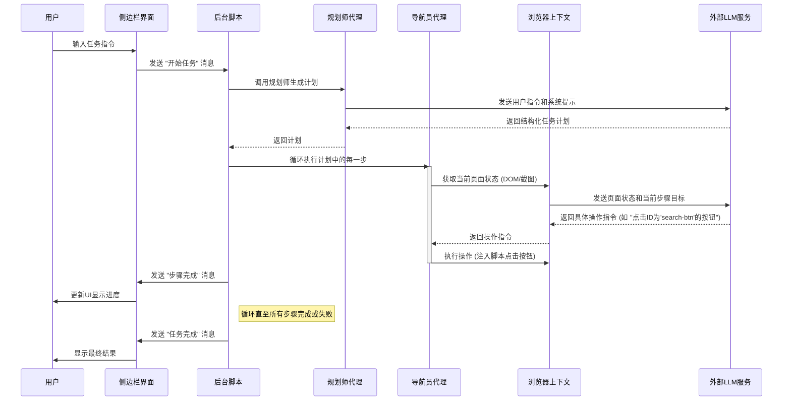
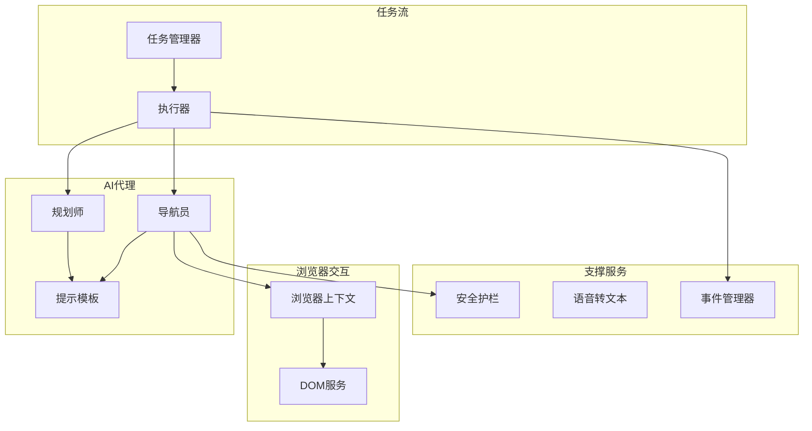

# NanoBrowse
# 项目概述
NanoBrowser 是一个开源的、由人工智能驱动的浏览器自动化Chrome扩展程序。它旨在通过自然语言指令，将繁琐、重复的网页操作任务自动化，从而彻底改变用户与网络的交互方式。该项目的核心理念是利用大型语言模型（LLM）的强大理解和推理能力，将人类的意图直接转化为精确的浏览器行为。用户不再需要编写复杂的脚本或进行繁琐的手动点击，只需用日常语言描述他们的需求，NanoBrowser 就能像一个智能助手一样，自主地规划步骤、理解页面内容并执行相应的操作。

该项目的主要功能体现在其先进的自主代理（Agent）架构上。它包含一个“规划师”（Planner）代理和一个“导航员”（Navigator）代理。当用户输入一个任务时（例如，“在亚马逊上搜索‘人体工学椅’，并把价格低于500元的前三个商品加入购物车”），“规划师”会首先将这个宏大目标分解成一系列逻辑清晰、可执行的子任务。随后，“导航员”代理接管工作，它负责执行每一个具体的步骤。它能够分析当前页面的DOM结构和视觉截图（如果启用了视觉模式），识别出可交互的元素（如输入框、按钮、链接等），并决定下一步最合适的操作，如输入文本、点击、滚动页面或切换标签页。

NanoBrowser 的目标用户非常广泛，从希望自动执行日常任务（如在线购物、数据录入、信息搜集）的普通用户，到需要进行网页数据抓取、自动化测试的开发人员和数据分析师，都可以从中受益。它极大地降低了网页自动化的技术门槛，为非技术用户提供了一个强大而直观的工具。同时，项目对安全和隐私给予了高度重视，所有代码开源透明，用户的凭据和API密钥等敏感信息仅存储在本地浏览器中，并且提供了详细的隐私策略和可配置的安全防火墙，确保了用户数据的安全。通过将AI的智能与浏览器的功能无缝结合，NanoBrowser 致力于打造一个更智能、更高效、更个性化的网络浏览体验。

## 技术栈
*   **编程语言**:
    *   TypeScript

*   **框架与库**:
    *   **前端框架**: React
    *   **AI与机器学习**: LangChain (用于集成和编排各类大型语言模型)
    *   **UI组件库**: 自定义UI组件，使用 `clsx` 和 `tailwind-merge` 进行样式管理
    *   **浏览器扩展**: `webextension-polyfill`

*   **构建与工具**:
    *   **包管理器**: PNPM
    *   **Monorepo管理**: Turbo
    *   **构建工具**: Vite
    *   **代码检查与格式化**: ESLint, Prettier
    *   **Git钩子**: Husky, lint-staged

*   **主要外部依赖**:
    *   **数据验证**: Zod, zod-to-json-schema
    *   **大型语言模型提供商 (通过LangChain)**: OpenAI, Anthropic, Google Gemini, Ollama, OpenRouter, DeepSeek, Groq 等
    *   **分析服务**: PostHog (可选，用于匿名使用情况分析)

## 可视化图表
### 系统架构图

```mermaid
graph TD
    subgraph 用户界面
        A1[侧边栏 SidePanel]
        A2[选项页 Options]
    end

    subgraph 核心后台 (Background Service Worker)
        B1[任务管理器 TaskManager]
        B2[事件管理器 EventManager]
        B3[AI代理系统 Agent System]
        B4[浏览器上下文 BrowserContext]
        B5[服务层 Services]
    end

    subgraph AI代理系统
        C1[规划师 Planner]
        C2[导航员 Navigator]
        C3[执行器 Executor]
    end

    subgraph 服务层
      B5_1[安全护栏 Guardrails]
      B5_2[语音转文本 SpeechToText]
    end

    subgraph 浏览器API
        D1[存储 API<br>chrome.storage]
        D2[脚本 API<br>chrome.scripting]
        D3[调试器 API<br>chrome.debugger]
        D4[消息传递 API<br>chrome.runtime]
    end

    subgraph 外部服务
        E1[大语言模型 LLM Services]
        E2[分析服务 PostHog]
    end

    A1 -- 用户指令 --> D4
    D4 -- 传递消息 --> B1
    B1 -- 创建任务 --> C3
    C3 -- 调用规划师 --> C1
    C1 -- 制定计划 --> C3
    C3 -- 逐步执行 --> C2
    C2 -- 分析页面状态<br>生成操作 --> B4
    B4 -- 获取页面DOM/截图 --> D2 & D3
    B4 -- 将状态发送至 --> E1
    E1 -- 返回决策 --> B4
    B4 -- 执行操作 --> D2 & D3
    B1 -- 更新任务状态 --> B2
    B2 -- 派发事件 --> D4
    D4 -- 更新UI --> A1
    A2 -- 配置 --> D1
    B3 & B5 -- 读取/写入配置 --> D1
    B5_1 -- 过滤内容 --> C2
    B5_2 -- 处理音频 --> A1
    B5 -- 发送分析数据 --> E2
```

### 模块依赖图

```mermaid
graph TD
    subgraph 应用页面 (Pages)
        P_SidePanel["@extension/sidepanel"]
        P_Options["@extension/options"]
        P_Content["@extension/content-script"]
    end

    subgraph 核心逻辑
        CE["chrome-extension"]
    end

    subgraph 共享包 (Packages)
        Pkg_Storage["@extension/storage"]
        Pkg_Shared["@extension/shared"]
        Pkg_UI["@extension/ui"]
        Pkg_I18N["@extension/i18n"]
        Pkg_Vite["@extension/vite-config"]
        Pkg_HMR["@extension/hmr"]
        Pkg_DevUtils["@extension/dev-utils"]
        Pkg_Tailwind["@extension/tailwindcss-config"]
    end

    CE --> Pkg_Storage
    CE --> Pkg_Shared
    CE --> Pkg_I18N
    CE --> Pkg_DevUtils
    CE --> Pkg_HMR
    CE --> Pkg_Vite

    P_SidePanel --> Pkg_Storage
    P_SidePanel --> Pkg_Shared
    P_SidePanel --> Pkg_I18N
    P_SidePanel --> Pkg_Vite
    P_SidePanel --> Pkg_Tailwind

    P_Options --> Pkg_Storage
    P_Options --> Pkg_Shared
    P_Options --> Pkg_UI
    P_Options --> Pkg_I18N
    P_Options --> Pkg_Vite
    P_Options --> Pkg_Tailwind

    P_Content --> Pkg_Shared
    P_Content --> Pkg_Storage
    P_Content --> Pkg_Vite
    P_Content --> Pkg_HMR
    
    Pkg_Shared --> Pkg_Storage

    Pkg_UI --> Pkg_Tailwind
```
### 关键调用流程图 (执行自动化任务)


## 模块解析
### 1. 核心后台模块 (`chrome-extension`)
*   **核心职责**:
    此模块是整个扩展的心脏，负责管理应用生命周期、编排AI代理、处理与浏览器的所有底层交互以及实现核心业务逻辑。它作为后台服务工作线程（Service Worker）运行，是连接用户界面、浏览器API和外部AI服务的中枢。

*   **关键文件/组件/功能**:
    *   **AI代理系统 (`src/background/agent/`)**:
        *   **功能**: 实现了项目的核心智能。这是一个多代理系统，协同工作以理解和执行用户指令。
        *   `agents/planner.ts`: **规划师代理**，负责接收用户的高级指令，并将其分解为一系列逻辑清晰、可执行的宏观步骤。
        *   `agents/navigator.ts`: **导航员代理**，负责执行规划师制定的每一步。它接收当前步骤目标，分析网页的当前状态（DOM和视觉信息），并决定需要执行的原子操作（如点击、输入、滚动）。
        *   `executor.ts`: **执行器**，驱动整个任务流程。它调用规划师获取计划，然后循环执行计划中的每个步骤，并调用导航员获取具体操作。
        *   `prompts/`: **提示工程目录**，定义了与LLM交互的模板。这些提示指导LLM的行为，确保其输出格式正确、行为安全。`common.ts` 中包含了关键的**安全规则**，用于防止来自网页内容的指令注入攻击。
    *   **浏览器交互层 (`src/background/browser/`)**:
        *   **功能**: 封装了与浏览器进行交互的复杂API，为上层代理提供了一个简洁、统一的接口来控制和查询浏览器状态。
        *   `context.ts` & `page.ts`: 管理浏览器标签页、窗口状态、页面导航和等待页面加载完成的逻辑。
        *   `dom/service.ts`: 负责注入脚本到目标页面，以构建一个简化的、对LLM友好的DOM树表示。它能识别页面上的所有可交互元素，并为其分配唯一的标识，供导航员代理进行操作决策。
    *   **任务管理 (`src/background/task/manager.ts`)**:
        *   **功能**: 管理用户发起的每个自动化任务的完整生命周期，包括任务的启动、暂停、恢复、取消和状态跟踪。
    *   **支持服务 (`src/background/services/`)**:
        *   **功能**: 提供通用的后台服务以支持核心逻辑。
        *   `guardrails/`: **安全护栏**，包含一系列用于清理和验证输入内容的安全机制。`sanitizer.ts` 使用 `patterns.ts` 中定义的正则表达式来检测和移除潜在的恶意指令（如提示注入），确保代理只听从用户的原始指令。
        *   `speechToText.ts`: **语音转文本服务**，集成Google Gemini的多模态能力，将用户的语音输入转换为文本指令。

### 2. 用户界面模块 (`pages`)
*   **核心职责**:
    为用户提供与NanoBrowser扩展进行交互的所有可视化界面，包括输入任务、监控进度和配置设置。

*   **关键文件/组件/功能**:
    *   **侧边栏 (`pages/side-panel/`)**:
        *   **功能**: 这是用户与AI代理交互的主界面。它采用聊天式界面，用户可以在此输入任务指令，并实时查看代理的思考过程和执行动作。
        *   `SidePanel.tsx`: 核心React组件，管理侧边栏的UI状态，处理用户输入，并通过 `chrome.runtime` API与后台脚本进行双向通信。
        *   `components/MessageList.tsx`: 用于渲染对话历史，清晰地展示来自用户、系统和各个AI代理的消息。
        *   `components/ChatInput.tsx`: 用户输入框组件，支持文本和语音输入。
    *   **选项页 (`pages/options/`)**:
        *   **功能**: 允许用户对扩展进行详细配置。
        *   `Options.tsx`: 主组件，通过标签页导航的形式组织了不同的设置项。
        *   `components/ModelSettings.tsx`: 模型设置界面，用户可以在此添加和管理不同LLM提供商（如OpenAI, Anthropic）的API密钥，并为规划师和导航员代理分别指定所使用的模型。
        *   `components/GeneralSettings.tsx`: 通用设置，如任务最大步数、是否启用视觉模式等。
        *   `components/FirewallSettings.tsx`: 防火墙设置，允许用户配置网站访问的白名单和黑名单，增强安全性。
    *   **内容脚本 (`pages/content/`)**:
        *   **功能**: 注入到目标网页中运行的脚本。它是后台脚本与网页DOM之间的桥梁，但当前实现较为简单，主要作为未来功能的入口点。

### 3. 数据存储模块 (`packages/storage`)
*   **核心职责**:
    提供一个统一、类型安全的数据持久化层，封装了 `chrome.storage` API，使得在扩展的不同部分（如后台、选项页、侧边栏）之间存取数据变得简单和可靠。

*   **关键文件/组件/功能**:
    *   `base/base.ts`: **通用存储创建器**。这是一个非常核心的工具函数，它创建了一个标准的存储对象，该对象包含 `get`、`set`、`subscribe` 等方法，并支持在不同扩展上下文之间进行实时数据同步 (`liveUpdate`)。
    *   `settings/`: **配置存储**。此目录下的每个文件都定义了一个独立的、专门的存储实例，用于管理不同类型的用户设置。
        *   `llmProviders.ts`: 存储用户添加的LLM提供商及其API密钥。
        *   `agentModels.ts`: 存储为每个代理（规划师、导航员）选择的模型配置。
        *   `generalSettings.ts`: 存储通用运行参数。
    *   `chat/history.ts`: **聊天历史存储**。负责管理所有聊天会话的创建、读取、更新和删除，包括会话元数据和其中的消息列表。

### 4. 共享与工具模块 (`packages`)
*   **核心职责**:
    遵循Monorepo的最佳实践，此模块集合了所有可跨项目复用的代码、配置和开发脚本，以提升开发效率、确保代码一致性。

*   **关键文件/组件/功能**:
    *   `@extension/ui`: **共享UI库**。包含在多个界面（如选项页和侧边栏）中复用的基础React组件，例如 `Button.tsx`。
    *   `@extension/shared`: **共享逻辑与Hooks**。提供跨UI包共享的React Hooks，最核心的是 `useStorage.tsx`，它与 `storage` 模块紧密配合，让React组件能够响应式地订阅存储数据的变化。
    *   `@extension/i18n`: **国际化 (i18n)**。管理多语言翻译资源和逻辑，使扩展能够支持不同语言。
    *   `@extension/vite-config` & `@extension/tsconfig`: **共享构建与编译配置**。为整个项目提供了统一的Vite和TypeScript配置，确保所有子包的构建和类型检查标准一致。
    *   `@extension/hmr` & `@extension/dev-utils`: **开发工具**。提供了开发环境下的热模块重载（HMR）功能，极大地改善了开发体验。

## 各个模块内文件/组件/功能关系图

### 核心后台模块 (`chrome-extension`) 内部关系图


### 用户界面模块 (`pages`) 内部关系图
```mermaid
graph TD
    subgraph 侧边栏 (SidePanel)
        SidePanelApp[SidePanel.tsx]
        MessageList[MessageList.tsx]
        ChatInput[ChatInput.tsx]
        ChatHistory[ChatHistoryList.tsx]
    end

    subgraph 选项页 (Options)
        OptionsApp[Options.tsx]
        ModelSettings[ModelSettings.tsx]
        GeneralSettings[GeneralSettings.tsx]
        FirewallSettings[FirewallSettings.tsx]
    end

    subgraph 依赖
        ChromeAPI[Chrome通信API]
        Storage[数据存储模块]
        UI_Lib[@extension/ui]
    end

    SidePanelApp --> MessageList
    SidePanelApp --> ChatInput
    SidePanelApp --> ChatHistory
    SidePanelApp --> ChromeAPI
    SidePanelApp --> Storage

    OptionsApp --> ModelSettings
    OptionsApp --> GeneralSettings
    OptionsApp --> FirewallSettings
    OptionsApp --> Storage
    OptionsApp --> UI_Lib
```

## 典型应用场景
**场景：自动收集并收藏热门技术文章**

一位软件开发者希望每天早晨快速浏览知名技术社区 Hacker News 的首页，并将当天排名前三的热门文章在浏览器中打开，同时将它们的链接收藏到浏览器的书签中，以便后续深度阅读。

**使用 NanoBrowser 的操作流程：**

1.  **启动与输入指令**:
    开发者在浏览器中打开 Hacker News (news.ycombinator.com)。然后，他点击浏览器工具栏上的 NanoBrowser 图标，打开侧边栏界面。在输入框中，他输入了如下的自然语言指令：
    > “访问 Hacker News 首页，找到排名前三的文章，在新标签页中分别打开它们，然后把这三篇文章的链接都添加到我的书签里。”

2.  **任务规划 (Planner Agent)**:
    NanoBrowser 的后台接收到该指令后，**规划师代理**立即开始工作。它将这个任务分解成一个清晰的、多步骤的计划：
    *   **步骤 1**: 确认当前页面是否为 Hacker News 首页 (news.ycombinator.com)，如果不是则导航至该网址。
    *   **步骤 2**: 识别并定位页面上代表文章列表的区域。
    *   **步骤 3**: 从列表中提取排名前三的文章的标题和对应的链接URL。
    *   **步骤 4**: 循环三次，每次都在一个新的浏览器标签页中打开一篇文章的链接。
    *   **步骤 5**: 循环三次，每次都使用浏览器书签功能，保存一篇文章的链接和标题。
    *   **步骤 6**: 任务完成，向用户报告结果。

3.  **任务执行 (Navigator Agent)**:
    *   **执行步骤 1-3**: **导航员代理**开始执行计划。它首先检查当前URL，确认无误。然后，它分析页面的DOM结构，轻松地识别出带有 `class="titleline"` 的 `<span>` 标签作为文章标题和链接的容器。它提取了前三个此类元素的链接地址（href属性）。
    *   **执行步骤 4**: 导航员代理连续发出三次“创建新标签页并导航到指定URL”的指令。浏览器在后台立即响应，瞬间打开了三个新的标签页，每个页面都加载了一篇热门文章。
    *   **执行步骤 5**: 接着，导航员代理调用浏览器扩展的 `chrome.bookmarks.create` API，将之前提取的三个URL和标题逐一创建为新的书签。
    *   **执行步骤 6**: 所有操作完成后，系统在侧边栏输出一条信息：“任务已完成。已为您打开并收藏了3篇热门文章。”

**用户体验**:
整个过程在几秒钟内自动完成。开发者无需手动点击任何链接，也无需复制粘贴URL来创建书签。他只需给出一条简单的指令，NanoBrowser 便像一位高效的个人助理一样，准确无误地完成了所有操作。侧边栏中还会实时显示代理的当前动作，例如“正在提取文章链接...”、“正在打开新标签页...”，让整个自动化过程透明且可控。这个场景充分展示了 NanoBrowser 如何将复杂的、多步骤的网页任务简化为一次简单的自然语言对话，极大地提升了信息获取和管理的效率。