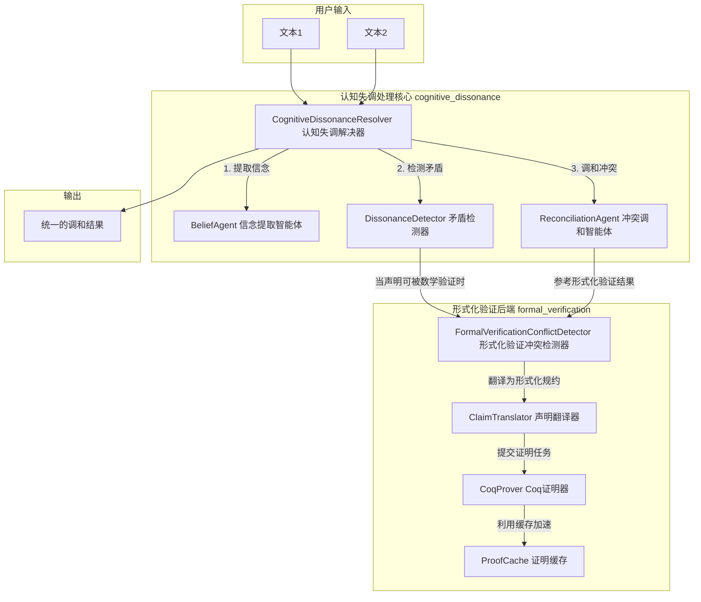
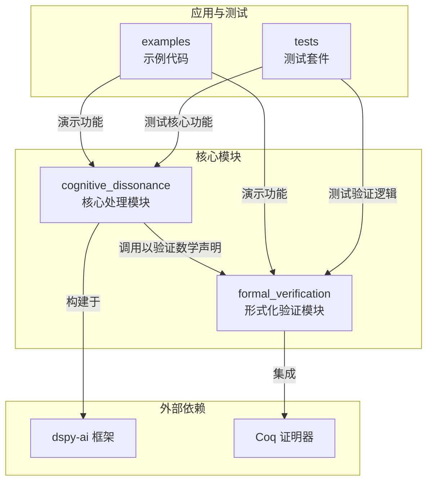
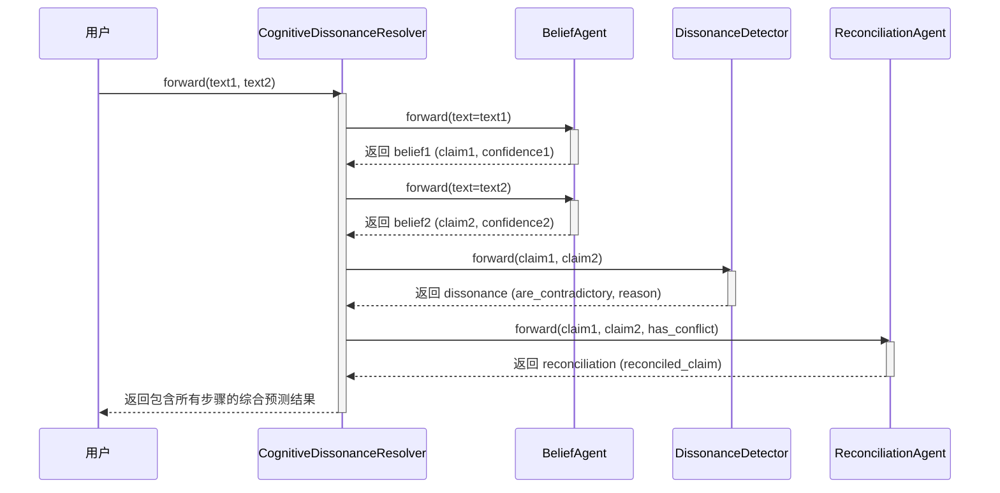
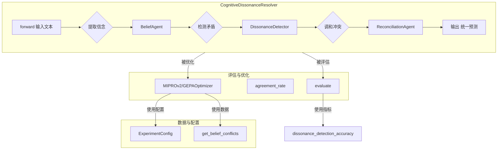
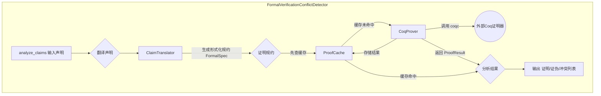

# cognitive-dissonance-dspy

***

# 项目概述

`cognitive-dissonance-dspy` 是一个基于 DSPy 框架构建的先进系统，旨在识别、分析并解决多智能体（Multi-Agent）语言模型系统中的“认知失调”问题。在复杂的 AI 系统中，不同智能体或同一智能体在不同时间点可能会产生相互矛盾的观点、信念或事实陈述。这种不一致性即为认知失调，它会严重影响系统的可靠性、一致性和决策质量。该项目的核心目标就是提供一个自动化、可评估且高效的框架来处理这种矛盾。

项目不仅仅停留在检测矛盾，更致力于通过智能化的方式解决这些冲突。它主要包含两大核心功能：
1.  **基于 DSPy 的认知失调检测与调和**：项目利用 DSPy（一个用于算法化优化语言模型提示和权重的编程框架）构建了一套流水线。该流水线首先通过 `BeliefAgent` 从不同文本中提取核心事实或信念，然后由 `DissonanceDetector` 判断这些信念是否存在矛盾。一旦检测到冲突，`ReconciliationAgent` 会介入，生成一个统一、协调的新观点来化解矛盾。整个过程是模块化的，并且可以通过 DSPy 的优化器（如 `MIPROv2` 或项目自定义的 `GEPAOptimizer`）进行端到端的优化和微调，以提升在特定任务上的表现。

2.  **基于形式化验证的数学真理决议**：这是项目最引人注目的创新点。当认知失调涉及数学、逻辑或可形式化验证的软件属性时，项目不再依赖于语言模型的概率性猜测，而是引入了一个强大的形式化验证（Formal Verification）后端。该后端能够将自然语言形式的数学声明（如 "5! = 120"）或软件属性声明（如“快速排序的最坏时间复杂度是 O(n^2)”）翻译成严格的数学规范，并调用像 Coq 这样的定理证明器进行机器证明。如果一个声明被证明为真，它的置信度就是 1.0；如果被证明为假，则可以被明确排除。这种“用证明代替争论”的方法为解决特定类型的冲突提供了绝对的确定性，极大地提升了系统在处理可验证事实时的可靠性。

该项目的目标用户主要是 AI 研究人员、多智能体系统开发者以及需要构建高可靠性、事实一致性 AI 应用的工程师。它解决了在多智能体协作、信息聚合、自动化事实核查等场景中，如何有效管理和解决信息冲突的关键痛枝术节，为构建更加鲁棒和可信的 AI 系统提供了创新的解决方案。

## 技术栈

*   **编程语言**:
    *   Python 3.8+

*   **框架与库**:
    *   **dspy-ai**: 核心框架，用于构建、优化和评估语言模型管道。
    *   **ollama**: 用于与本地运行的语言模型（如 Llama 3.1）进行交互。
    *   **numpy**: 用于潜在的数值计算和数据处理。
    *   **requests**: 用于进行 HTTP 请求，例如与外部知识源交互。

*   **构建与工具**:
    *   **setuptools**: 用于项目打包和分发。
    *   **pip**: 依赖管理工具。
    *   **pytest**: 用于编写和执行单元测试、集成测试。
    *   **ruff**, **black**, **isort**: 用于代码风格检查、格式化和导入排序，保证代码质量。
    *   **Makefile**: 提供了一系列便捷的命令行任务，如安装、测试、格式化等。

*   **主要外部依赖**:
    *   **Python-dotenv**: 用于管理环境变量。
    *   **Coq Theorem Prover**: (外部工具) 作为形式化验证后端，用于证明数学和逻辑定理。
    *   **Z3 SMT Solver**: (外部工具，根据文档提及) 可能作为混合证明策略的一部分，用于约束求解。

## 可视化图表

### 系统整体架构图

### 模块依赖关系图

### 关键调用流程图：认知失调处理

## 模块解析

项目主要由两个核心模块 `cognitive_dissonance` 和 `formal_verification`，以及支撑性的 `examples` 和 `tests` 目录构成。

### `cognitive_dissonance` - 认知失调处理核心模块

该模块是整个系统的核心业务逻辑所在，负责实现基于 DSPy 的认知失调检测与解决流程。

*   **核心职责**:
    1.  从输入的文本中提取结构化的信念（Claim）。
    2.  判断两个信念之间是否存在逻辑矛盾。
    3.  当存在矛盾时，生成一个协调一致的新信念。
    4.  提供实验运行、评估和优化的框架。

*   **关键文件/组件/功能**:
    *   `verifier.py`: 定义了流水线中的核心智能体。
        *   `BeliefAgent`: 接收一段文本，输出一个简洁的事实性声明（`claim`）和对应的置信度（`confidence`）。它使用 `ExtractClaim` 签名来指导语言模型完成此任务。
        *   `DissonanceDetector`: 接收两个声明，判断它们是否相互矛盾（`are_contradictory`），并给出解释（`reason`）。它使用 `DetectDissonance` 签名。
        *   `ReconciliationAgent`: 接收两个声明及它们是否存在冲突的标志，然后生成一个统一、调和后的声明（`reconciled_claim`）。它使用 `ReconcileClaims` 签名。
        *   `CognitiveDissonanceResolver`: 这是一个顶层模块，它将上述三个智能体串联起来，形成一个完整的从输入文本到最终调和结果的端到端流水线。

    *   `metrics.py`: 定义了用于评估模型性能的各种指标。
        *   `dissonance_detection_accuracy`: 衡量矛盾检测的准确率。
        *   `reconciliation_quality`: 评估调和后声明的质量，通常通过与标准答案的重叠度来计算。
        *   `combined_metric`: 结合了检测准确率和调和质量的加权综合指标。
        *   `agreement_metric_factory`: 一个工厂函数，用于创建衡量两个不同智能体预测结果一致性的指标。

    *   `experiment.py`, `evaluation.py`, `optimization.py`: 提供了运行、评估和优化实验的工具。
        *   `cognitive_dissonance_experiment`: 主实验函数，负责设置优化器（如 `MIPROv2`），加载数据，并进行多轮次的训练和评估。
        *   `evaluate`: 一个通用的评估函数，用于在开发集上测试模块性能。
        *   `GEPAOptimizer`: 项目自定义的高级优化器，通过“生成、评估、规划、应用”（Generate, Evaluate, Plan, Apply）的循环来迭代式地优化模块的提示或指令。

    *   `config.py`: 通过 `ExperimentConfig` 数据类集中管理所有实验参数，如模型名称、API 地址、温度、优化轮次等，并支持从环境变量加载配置。

### `formal_verification` - 形式化验证模块

这是一个高度专业化的模块，为系统提供了处理可验证声明的“杀手锏”。它将模糊的自然语言转换为精确的数学逻辑，并用定理证明器来裁决真伪。

*   **核心职责**:
    1.  将自然语言的数学或软件属性声明翻译成 Coq 语言的形式化规约。
    2.  调用外部 Coq 编译器（`coqc`）来尝试证明这些规约。
    3.  缓存证明结果，以极大地提升重复验证的效率。
    4.  检测不同声明之间的形式化冲突，并根据证明结果进行裁决。

*   **关键文件/组件/功能**:
    *   `detector.py`: 包含了模块的入口点。
        *   `FormalVerificationConflictDetector`: 接收一系列 `Claim` 对象，对每个对象进行翻译和证明，最终报告哪些声明被证实、哪些被证伪，以及哪些声明之间存在冲突。

    *   `translator.py` (推断): 负责将自然语言声明（如 `"factorial 5 = 120"`）转换为 Coq 代码（如 `Theorem fact5: Factorial.fact 5 = 120. Proof. auto. Qed.`）。这是连接自然语言和形式化世界的桥梁。

    *   `prover.py`: 封装了与 Coq 证明器的交互逻辑。
        *   `CoqProver`: 核心组件，它接收一个包含 Coq 代码的 `FormalSpec` 对象，将其写入临时文件，然后通过子进程调用 `coqc` 命令。它会捕获 `coqc` 的返回码和输出，从而判断证明是否成功。

    *   `proof_cache.py`: 实现了一个高效的证明缓存系统。
        *   `ProofCache`: 在证明一个规约之前，它会先根据 Coq 代码的哈希值在缓存（内存和磁盘）中查找。如果命中，则直接返回缓存结果，避免了耗时的重复计算。文档中提到这可以带来高达 **2900x** 的性能提升。

    *   `types.py`: 定义了模块中使用的数据结构。
        *   `Claim`: 表示一个由智能体提出的声明，包含文本、属性类型、置信度等信息。
        *   `FormalSpec`: 表示从 `Claim` 生成的形式化规约，包含 Coq 代码。
        *   `ProofResult`: 封装了证明尝试的结果，包括是否成功、耗时、错误信息等。

    *   `README.md` 中提及的先进功能:
        *   **Necessity-Based Proving**: 系统的创新核心，它不采用传统的暴力策略搜索，而是通过分析声明的数学结构来推断其“必然性”，从而直接构建证明。这极大地提高了证明效率和成功率。
        *   **Proof Strategy Learning**: 利用机器学习分析声明的特征（如操作符数量、量词深度等），来预测最优的证明策略。
        *   **Automated Lemma Discovery**: 当证明失败时，系统能分析失败原因并自动生成所需的辅助引理，以帮助修复证明。

## 各个模块内文件/组件/功能关系图

### `cognitive_dissonance` 模块核心组件关系

### `formal_verification` 模块核心组件关系

## 典型应用场景

### 场景一：多智能体协作中的事实核查与统一

**背景**: 一个由多个研究型 AI 智能体组成的系统正在合作撰写一份关于“排序算法”的技术报告。其中一个智能体（Agent A）基于一篇博客文章生成了“快速排序的平均时间复杂度是 O(n^2)”，而另一个智能体（Agent B）在分析教科书后生成了“快速排序的平均时间复杂度是 O(n log n)”。

**应用**:
1.  系统接收到这两个相互矛盾的声明。`CognitiveDissonanceResolver` 启动。
2.  `BeliefAgent` 分别从两段描述中提取出核心声明 `claim_A: "quicksort has time complexity O(n^2)"` 和 `claim_B: "quicksort has time complexity O(n log n)"`。
3.  `DissonanceDetector` 识别出这两个关于同一属性（时间复杂度）的声明是矛盾的。
4.  由于该声明涉及算法属性，系统将此冲突路由到 `FormalVerificationConflictDetector` 模块。
5.  `ClaimTranslator` 将这两个声明翻译成 Coq 或类似形式化语言的规约。对于 claim_B，它可能会生成一个需要标准库中排序复杂性定理来证明的引理。对于 claim_A，它同样会生成一个对应的规约。
6.  `CoqProver` 尝试证明这两个规约。它会成功证明 claim_B 对应的规约（因为这是公认的算法理论），而 claim_A 的证明则会失败，甚至可以找到一个反例。
7.  `FormalVerificationConflictDetector` 返回结论：claim_B 已被数学证明，claim_A 被证伪。
8.  最终，系统采纳了 claim_B 作为最终的“地面真理”，并可能在报告中标记 claim_A 的来源信息不可靠。

### 场景二：自动化代码审查中的争议解决

**背景**: 在一个软件开发团队中，两位开发者对一段新提交的阶乘函数实现有不同看法。开发者 Alice 提交了代码，并声称 `factorial(5) equals 120`。在代码审查中，另一位开发者 Bob 凭感觉评论说 `factorial(5) equals 100`。

**应用**:
1.  一个集成了 `cognitive-dissonance-dspy` 的代码审查机器人监测到了这两个冲突的评论。
2.  机器人将这两个声明（`claim_alice: "factorial(5) equals 120"` 和 `claim_bob: "factorial(5) equals 100"`）送入形式化验证模块。
3.  `ClaimTranslator` 将它们翻译成两个具体的 Coq 定理：`Theorem t1: fact 5 = 120.` 和 `Theorem t2: fact 5 = 100.`。
4.  `CoqProver` 调用 `coqc`。`t1` 的证明会立即通过（`Proof. auto. Qed.`）。`t2` 的证明则会失败，并报告一个数学矛盾（例如，`Error: Unable to unify "100" with "120"`）。
5.  审查机器人自动在代码审查评论区回复：“形式化验证结果：`factorial(5) = 120` 已被数学证明。@Alice 的声明是正确的。@Bob 的声明与数学计算不符。” 从而以无可辩驳的方式解决了争议，提高了审查效率和准确性。

这些场景展示了该项目如何将先进的 AI 技术（DSPy）与经典的计算机科学理论（形式化验证）相结合，为解决 AI 系统中的信息一致性问题提供了强大而可靠的工具。