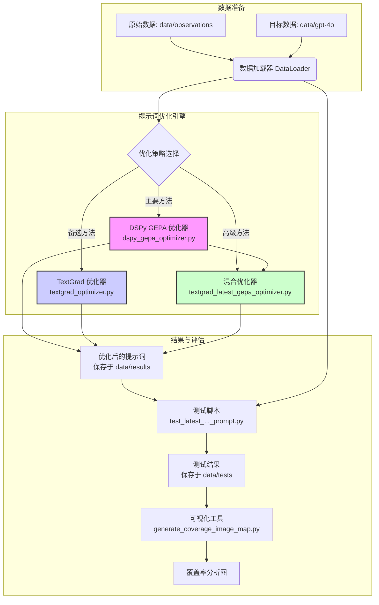
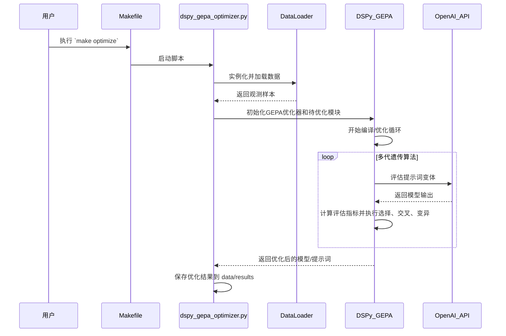
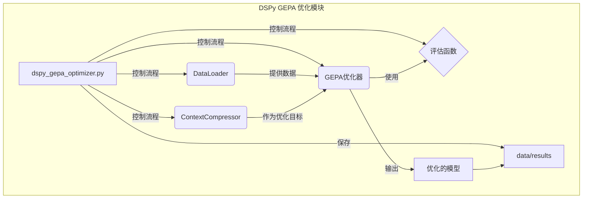
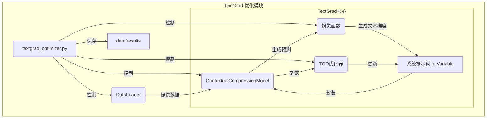
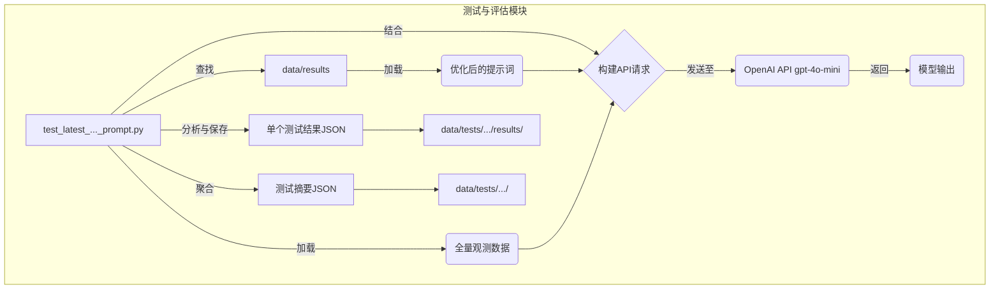

# Laurian_context-compression-experiments-2508

***

# 项目概述

本项目是一个针对**Agentic RAG（检索增强生成）系统**中**上下文压缩（Context Compression）**任务的优化实验。其核心目标是利用先进的提示词工程技术，提升 `GPT-4o-mini` 模型在特定任务上的性能，使其达到甚至超越更强大的 `GPT-4o` 模型的水平，从而在保证服务质量的同时，显著降低生产环境中的运营成本和用户体验的波动。

**核心问题与动机：**
在实际的 Agentic RAG 系统中，上下文压缩是一个关键环节。它负责从检索到的海量文档中，根据用户查询精确地提取出最相关的片段。该项目发现，一个为 `GPT-4o` 设计的、性能优越的上下文压缩提示词，在迁移到更经济的 `GPT-4o-mini` 模型上时，表现急剧下降。`GPT-4o-mini` 常常无法提取任何有效信息，直接返回 "NO_OUTPUT"，这导致系统必须回退到昂贵的 `GPT-4o` 模型进行重试，不仅增加了API调用成本，也影响了系统的响应延迟和用户体验的稳定性。

**项目目标与解决方案：**
为解决这一痛点，本项目建立了一套完整的、数据驱动的提示词优化与评估流程。它不仅仅是手动调整提示词，而是采用系统化的、自动化的优化方法论，主要实现了三种先进的优化策略：

1.  **DSPy GEPA 优化**：利用 `DSPy` 框架的遗传算法与帕累托最优相结合的 `GEPA`（Genetic-Pareto）优化器，自动生成和迭代大量的提示词变体，并在真实数据集上进行评估，以寻找在**准确率**和**成本**之间达到最佳平衡的帕aretto最优解。
2.  **TextGrad 优化**：引入 `TextGrad` 库，该库将“文本梯度”的概念应用于提示词工程。它通过大模型生成对不良输出的“损失反馈”（即文本形式的梯度），并利用这些反馈自动地、迭代式地修正和完善系统提示词，整个过程如同机器学习中的梯度下降，但操作对象是自然语言。
3.  **混合优化（TextGrad+GEPA）**：将以上两种方法结合，构建一个两阶段的优化管线。首先使用 `GEPA` 进行全局搜索，找到一个高质量的提示词作为基准；然后利用 `TextGrad` 在此基础上进行更精细的“微调”，实现优化的强强联合。

该项目不仅仅是一个实验，更是一个可复现、可扩展的工程范例，展示了如何系统性地解决大模型在实际应用中的能力差异问题，为模型选型、成本控制和性能优化提供了宝贵的实践经验和工具集。目标用户主要是从事大语言模型应用开发、AI系统优化以及提示词工程研究的工程师和研究人员。

## 技术栈

以下是根据项目文件 `pyproject.toml` 和代码结构分析得出的技术栈：

*   **编程语言**:
    *   Python (>=3.9)

*   **框架与库**:
    *   **机器学习与优化**:
        *   `dspy-ai`: 用于实现 DSPy GEPA 遗传算法提示词优化的核心框架。
        *   `textgrad`: 用于实现基于文本梯度的提示词优化。
        *   `scikit-learn`: 用于机器学习任务，如此处的 `cosine_similarity` 计算。
        *   `sentence-transformers`: 用于生成文本嵌入，实现语义相似度匹配。
    *   **数据处理**:
        *   `pandas`: 用于数据处理和分析。
        *   `numpy`: 用于数值计算。
    *   **模型与API**:
        *   `openai`: 用于与 OpenAI API（如 GPT-4o-mini, GPT-4o）进行交互。
        *   `tiktoken`: 用于精确计算 OpenAI 模型的 token 数量。
    *   **可视化与分析**:
        *   `matplotlib`, `seaborn`, `plotly`: 用于数据可视化和结果分析。
        *   `Pillow`: 用于图像处理，如此项目中的覆盖率图像生成。
    *   **开发与实验**:
        *   `jupyterlab`, `ipywidgets`: 用于交互式开发和实验。

*   **构建与工具**:
    *   `uv`: 用于项目依赖管理和虚拟环境创建（通过 `Makefile` 调用）。
    *   `hatchling`: 项目的构建后端。
    *   `pytest`, `pytest-cov`: 用于单元测试和代码覆盖率检查。
    *   `black`, `isort`, `flake8`: 用于代码格式化和风格检查。
    *   `mypy`: 用于静态类型检查。
    *   `pre-commit`: 用于在代码提交前自动运行代码检查工具。
    *   `Makefile`: 提供了一系列便捷的命令来简化开发、测试和优化流程（如 `make setup`, `make optimize`）。

*   **主要外部依赖**:
    *   `python-dotenv`: 用于管理环境变量（如 API 密钥）。
    *   `tqdm`: 用于在命令行中显示优雅的进度条。
    *   `loguru`: 用于提供更强大和灵活的日志记录功能。
    *   `wandb` (Weights & Biases), `weave`: 用于实验跟踪、日志记录和结果可视化。

## 可视化图表

### 系统整体架构图

此图展示了项目的核心工作流程，从数据加载到多种优化策略，再到最终的测试与评估。



### 关键调用流程图 (以 DSPy GEPA 优化为例)

此序列图描绘了用户执行 `make optimize` 命令后，系统内部发生的一系列关键交互和处理步骤。



## 模块解析

项目的核心逻辑主要集中在 `scripts` 目录中，可以划分为以下几个核心模块：

### 1. 数据处理与加载模块
*   **模块名称**: `DataLoader`
*   **核心职责**: 负责从 `data/observations` 和 `data/gpt-4o` 目录中读取、解析和预处理数据，为后续的优化和测试流程准备格式化的输入样本。
*   **关键文件/组件**:
    *   `scripts/dspy_gepa_optimizer.py` (内置 `DataLoader` 类)
    *   `scripts/textgrad_optimizer.py` (内置 `DataLoader` 类)
    *   `scripts/textgrad_latest_gepa_optimizer.py` (内置 `DataLoader` 类)
*   **功能详解**:
    *   **数据加载**: 遍历指定的目录，读取所有 JSON 格式的观测文件。
    *   **内容提取**: 使用正则表达式从原始输入的 `content` 字段中精确提取 `<context>` 和 `<query>` 标签内的文本内容。这是构建训练样本的关键步骤。
    *   **目标关联**: 检查 `data/gpt-4o` 目录中是否存在与观测文件ID对应的成功压缩案例。如果存在，则将其作为 "黄金标准" 或 "目标输出" (target\_output) 加载，为监督式优化提供依据。
    *   **数据清洗**: 对过长的上下文进行截断处理（如限制在25000字符），以确保优化过程的稳定性和效率。
    *   **格式转换**: 将解析后的数据转换为 `dspy.Example` 对象（用于DSPy优化）或字典格式（用于TextGrad优化），统一数据结构。

### 2. DSPy GEPA 优化模块
*   **模块名称**: `DSPyGEPAOptimizer`
*   **核心职责**: 使用 DSPy 的 GEPA（遗传算法-帕累托）优化器，自动搜索并优化用于上下文压缩任务的系统提示词。
*   **关键文件/组件**:
    *   `scripts/dspy_gepa_optimizer.py`: 模块主实现文件。
    *   `ContextCompressor(dspy.Module)`: 一个 DSPy 模块，封装了待优化的提示词（即 `dspy.Predict` 的 `instructions`）。
    *   `evaluate_compression`: 评估函数（Metric），用于在优化过程中量化每个提示词变体的性能。
*   **功能详解**:
    *   **环境配置**: 初始化 `dspy` 环境，配置语言模型（`gpt-4o-mini` 作为优化目标）和缓存目录。同时，配置 `wandb` 和 `weave` 进行实验跟踪。
    *   **优化流程**:
        1.  **数据准备**: 调用 `DataLoader` 加载并准备训练集和验证集。
        2.  **模型初始化**: 创建 `ContextCompressor` 实例，其初始提示词来自项目定义的 `BASE_COMPRESSION_PROMPT`。
        3.  **优化器配置**: 实例化 `GEPA` teleprompter，并传入 `evaluate_compression` 作为评估指标。此评估函数基于模型输出与目标输出的比较（例如，是否错误地输出了 "NO_OUTPUT"）来计算得分。
        4.  **执行编译**: 调用 `teleprompter.compile()` 方法启动优化过程。GEPA 会在后台自动执行多代遗传算法，生成、评估、选择和变异提示词。
        5.  **结果保存**: 优化完成后，将性能最佳的模型（包含最优提示词）序列化为 JSON 文件，并保存到 `data/results` 目录下一个带时间戳的文件夹中。

### 3. TextGrad 优化模块
*   **模块名称**: `TextGradOptimizer` & `TextGradGepaOptimizer`
*   **核心职责**: 使用 TextGrad 框架通过文本梯度下降（TGD）的方法优化系统提示词。此模块分为两个子变体：一个从基础提示词开始优化，另一个从 GEPA 优化后的提示词开始进行二次优化。
*   **关键文件/组件**:
    *   `scripts/textgrad_optimizer.py`: 从零开始优化的实现。
    *   `scripts/textgrad_latest_gepa_optimizer.py`: 在 GEPA 基础上优化的实现。
    *   `ContextualCompressionModel`: 封装了 TextGrad 的 `BlackboxLLM`，并将系统提示词定义为可训练的 `tg.Variable`。
    *   `create_contextual_compression_loss_fn`: 损失函数工厂，动态生成一个 `tg.TextLoss` 实例。这个损失函数会指导一个更强大的模型（`gpt-4o`）生成关于当前输出质量的反馈（即 "文本梯度"）。
*   **功能详解**:
    *   **模型与梯度引擎**: 配置两个语言模型引擎：一个 `target_engine` (`gpt-4o-mini`) 用于执行前向传播（生成压缩结果），一个 `critic_engine` (`gpt-4o`) 用于反向传播（生成损失反馈/梯度）。
    *   **优化循环 (TGD)**:
        1.  **初始化**: 将系统提示词封装成 `tg.Variable`，并设定 `requires_grad=True`。
        2.  **前向传播**: 对于每个训练样本，模型使用当前的系统提示词生成上下文压缩结果。
        3.  **损失计算**: `TextLoss` 函数将模型的输出与期望输出进行对比，并利用 `critic_engine` 生成一段描述如何改进系统提示词的自然语言反馈。
        4.  **反向传播**: 调用 `loss.backward()`，TextGrad 会将这份自然语言反馈作为“梯度”附加到系统提示词变量上。
        5.  **优化器步进**: 调用 `optimizer.step()`，TGD 优化器会再次调用大模型，根据原始提示词和“文本梯度”来生成一个更新、更优化的新版提示词。
    *   **结果评估与保存**: 在每次迭代后，在验证集上评估当前提示词的性能，并保存历史最佳提示词。最终结果同样保存在 `data/results` 目录中。

### 4. 提示词测试与评估模块
*   **模块名称**: `PromptTester`
*   **核心职责**: 加载最新优化出的提示词，并将其应用到**全部**观测数据集上，以全面评估其在真实场景中的泛化性能和成功率。
*   **关键文件/组件**:
    *   `scripts/test_latest_gepa_prompt.py`
    *   `scripts/test_latest_textgrad_prompt.py`
    *   `scripts/test_latest_textgrad_gepa_prompt.py`
*   **功能详解**:
    *   **自动发现最新提示词**: 脚本会自动扫描 `data/results` 目录，根据目录名称和时间戳找到对应优化方法（GEPA、TextGrad等）的最新产出。
    *   **加载提示词**: 从结果目录中解析并加载优化后的系统提示词。
    *   **全量数据测试**: 遍历 `data/observations` 目录下的所有文件，对每一个观测样本，使用加载的优化提示词和 `gpt-4o-mini` 模型进行一次推理。
    *   **结果记录**:
        *   将每个样本的测试结果（包括ID、成功与否、模型输出、Token用量等）保存为一个独立的 JSON 文件，存放在 `data/tests/{test_run_name}/results/` 中。
        *   生成一个总的 `test_summary.json` 文件，包含成功率、失败数、总Token消耗等宏观统计指标。
    *   **结构化输出**: 测试结果以结构化的方式保存，为后续的深入分析和可视化提供了便利。

### 5. 内容匹配与可视化模块
*   **模块名称**: `CoverageVisualizer`
*   **核心职责**: 通过语义匹配算法，度量模型生成的压缩文本覆盖了原始上下文中的哪些部分，并将覆盖情况可视化为图像。
*   **关键文件/组件**:
    *   `scripts/MatchLines.py`: 提供了核心的语义匹配逻辑。
    *   `scripts/generate_coverage_image.py`: 生成单个样本的覆盖图。
    *   `scripts/generate_coverage_image_map.py`: 为整个测试集生成一个聚合的覆盖图谱。
*   **功能详解**:
    *   **语义匹配 (`MatchLines.py`)**:
        1.  **文本切分**: 将原始上下文和模型输出都切分为句子列表。
        2.  **向量嵌入**: 使用 `sentence-transformers` 模型（`all-MiniLM-L6-v2`）将每个句子转换为向量嵌入。
        3.  **相似度计算**: 计算模型输出的每个句子与上下文中所有句子之间的余弦相似度。
        4.  **匹配逻辑**: 通过贪心算法和相似度阈值，确定输出文本中的句子匹配到了上下文中的哪些行。
    *   **图像生成**:
        *   将上下文的每一行映射为图像中的一个垂直像素条。
        *   如果某一行被成功匹配到，则用指定的颜色（如红色）填充该像素条；否则使用背景色（如黑色或灰色）。
        *   `generate_coverage_image_map.py` 将测试集中的所有样本并排渲染，形成一个长条图，每一行代表一个测试样本，每一列代表上下文中的一行，从而可以直观地观察不同样本的压缩覆盖模式。

## 各个模块内文件/组件/功能关系图

### DSPy GEPA 优化模块关系图



### TextGrad 优化模块关系图



### 提示词测试与评估模块关系图




## 典型应用场景

**场景：** 一家初创公司基于 `GPT-4o` 构建了一款智能研究助手，其核心功能之一是帮助用户快速从上传的PDF文档中提取与特定问题相关的信息。该功能（即上下文压缩）在 `GPT-4o` 上表现出色。然而，随着用户量增长，`GPT-4o` 的高昂API成本成为公司沉重的负担。为了降本增效，团队决定将此功能迁移到成本更低的 `GPT-4o-mini` 模型上。

**问题：** 迁移后，团队发现研究助手的回答质量大幅下降。对于许多之前能精准提取信息的查询，`GPT-4o-mini` 现在频繁返回空结果（"NO_OUTPUT"），导致用户体验极差。

**解决方案：** AI工程师利用本项目来系统性地解决此问题。

**步骤：**

1.  **数据准备与环境设置**
    *   工程师首先从生产环境的日志系统（如 LangFuse）中，导出所有 `GPT-4o-mini` 调用失败（返回 "NO_OUTPUT"）的记录，并将它们处理成项目要求的 JSON 格式，存放在 `data/observations/` 目录中。
    *   同时，他们选取了其中约300个失败案例，使用表现良好的 `GPT-4o` 模型重新运行，将其成功的输出结果作为“黄金标准”存放在 `data/gpt-4o/` 目录。
    *   最后，工程师克隆本项目仓库，执行 `make setup`，自动创建虚拟环境并安装所有依赖。并在 `.env` 文件中配置好自己的 `OPENAI_API_KEY`。

2.  **执行自动化提示词优化**
    *   为了快速找到一个高性能的提示词，工程师首先采用 **DSPy GEPA** 策略。他直接在终端运行核心命令：
        ```bash
        make optimize
        ```
    *   该命令启动 `dspy_gepa_optimizer.py` 脚本。脚本自动加载准备好的数据，并开始长达数小时的遗传算法优化过程。工程师可以通过日志观察到优化器正在不断迭代和评估新的提示词变体。

3.  **评估优化效果**
    *   优化完成后，一个带有时间戳的新目录（例如 `gepa_context_compression_20250919_103000`）出现在 `data/results/` 中，里面包含了优化后的提示词。
    *   接着，工程师运行测试命令来全面评估这个新提示词的性能：
        ```bash
        make test-gepa
        ```
    *   该命令会加载最新的GEPA优化提示词，并对 `data/observations/` 中的**所有** 1700 多个失败案例进行测试。测试完成后，在 `data/tests/` 目录下生成了详细的测试报告，`test_summary.json` 显示成功率从接近0%大幅提升到了 **85%**。

4.  **（可选）进行二次精细优化**
    *   为了追求极致性能，工程师决定在 GEPA 的基础上再进行 TextGrad 的精细优化。他运行：
        ```bash
        make optimize-textgrad-gepa
        ```
    *   这个脚本会加载刚才 GEPA 的最佳结果作为起点，利用文本梯度进行几轮微调。
    *   完成後，再运行对应的测试命令 `make test-textgrad-gepa`，发现成功率进一步提升到了 **88%**。

5.  **部署与监控**
    *   工程师将最终优化出的提示词部署到生产环境中，替换掉原有的提示词。
    *   通过监控，他们确认 `GPT-4o-mini` 的失败率显著降低，系统不再需要频繁回退到 `GPT-4o`，API成本在一个月内下降了约60%，同时用户满意度也恢复到了原有水平。

通过这个流程，该项目不仅解决了一个具体的工程问题，还为团队沉淀了一套未来可持续使用的、数据驱动的提示词优化方法论。