### Dolphin 项目代码库分析说明1

### **目录**

1.  **项目概览**
    *   1.1. 项目目的与边界
    *   1.2. 顶层结构与技术栈
2.  **模块与分层**
    *   2.1. 核心模块职责
    *   2.2. 模块依赖关系图
3.  **核心功能说明**
    *   3.1. 核心模型架构
    *   3.2. 页面级解析流程 (Analyze-then-Parse)
    *   3.3. 元素级解析流程
    *   3.4. 模型部署与服务化
4.  **数据结构与 API**
    *   4.1. 核心领域对象 (Python Classes)
    *   4.2. 配置文件数据模型 (`Dolphin.yaml`)
    *   4.3. 中间数据结构 (Layout String)
    *   4.4. 最终输出数据模型 (JSON/Markdown)
    *   4.5. 服务化 API 定义

---

### **1. 项目概览**

#### **1.1. 项目目的与边界**

**项目目的**:
Dolphin (`Do`cument `I`mage `P`arsing via `H`eterogeneous Anchor `in`g) 是一个多模态文档图像解析模型。其核心目标是将包含复杂布局（如文本段落、图、表、公式等）的文档图像，解析为机器可读的结构化数据（JSON 和 Markdown 格式）。从 `README.md` 文件描述可知，项目采用了创新的“先分析后解析 (analyze-then-parse)”两阶段范式。

**项目边界**:

*   **输入**: 支持单张图片（JPG, PNG 等）、多页 PDF 文档，或包含这些文件的目录。
*   **输出**:
    1.  结构化的 JSON 文件，详细描述每个文档元素的类型、内容、位置和阅读顺序。
    2.  格式化的 Markdown 文件，用于人类阅读。
    3.  提取出的图片元素会作为独立文件存放在 `figures` 目录下。
*   **核心能力**:
    *   **页面级布局分析**: 识别页面中的所有元素并确定其自然阅读顺序。
    *   **元素级内容解析**: 对识别出的各元素（文本、表格、公式）进行内容提取和结构化。
*   **非目标 (推断)**:
    *   项目不涉及文档的从头训练，主要提供预训练模型和推理代码。
    *   项目不处理手写文本识别。
    *   项目不进行文档内容的语义理解或问答，其重点是结构和内容的精准提取。

#### **1.2. 顶层结构与技术栈**

**顶层结构**:
该项目是一个单体的 Python 应用/库，围绕一个核心的 PyTorch 模型 (`DonutModel`) 构建。代码结构清晰地分离了模型定义、工具函数、演示/入口脚本和部署服务。项目提供了两种使用方式：

1.  **原生框架**: 通过 `chat.py` 和 `demo_*.py` 脚本，使用 `OmegaConf` 加载 `Dolphin.yaml` 配置文件来运行。
2.  **Hugging Face 框架**: 通过 `demo_*_hf.py` 脚本，直接加载 Hugging Face Hub 上的模型进行推理，简化了集成。

**技术栈**:

*   **核心框架**: Python 3
*   **深度学习**:
    *   `torch`: 核心计算框架。
    *   `transformers`: 用于加载和使用 MBart 解码器。
    *   `timm`: 用于构建 Swin Transformer 编码器。
*   **图像与文档处理**:
    *   `Pillow (PIL)`: 核心图像处理。
    *   `opencv-python`: 用于图像坐标处理和边缘调整。
    *   `pymupdf`: 用于高效地将 PDF 页面渲染为图像。
*   **配置管理**: `omegaconf`: 用于加载和管理 YAML 配置文件。
*   **部署与服务**:
    *   `vLLM` & `TensorRT-LLM`: 提供高性能推理后端支持。
    *   `FastAPI` & `uvicorn`: 用于将模型封装为 HTTP API 服务。
*   **开发运维**:
    *   `pre-commit`: 集成了 `isort`, `black`, `flake8` 等工具，用于保证代码质量和风格一致性。

---

### **2. 模块与分层**

#### **2.1. 核心模块职责**

| 模块/文件        | 路径                        | 职责                                                         | 对外接口               | 向内依赖                                   |
| :--------------- | :-------------------------- | :----------------------------------------------------------- | :--------------------- | :----------------------------------------- |
| **模型定义**     | `utils/model.py`            | 定义核心的 `DonutModel`，它由 `SwinEncoder` 和 `BARTDecoder` 组成。这是整个项目的基石。 | `DonutModel` 类        | `timm`, `torch`, `transformers`            |
| **数据处理**     | `utils/processor.py`        | 定义 `DolphinProcessor` 类，负责图像的预处理（缩放、填充、归一化）和提示文本的 Tokenization。 | `DolphinProcessor` 类  | `torchvision`, `numpy`, `PIL`              |
| **核心工具集**   | `utils/utils.py`            | 包含大量核心辅助功能：PDF转图片、坐标映射、布局字符串解析、结果保存、图像边缘调整等。 | 多个功能函数           | `cv2`, `pymupdf`, `utils.markdown_utils`   |
| **Markdown转换** | `utils/markdown_utils.py`   | `MarkdownConverter` 类，负责将解析后的 JSON 结构化数据转换为人类可读的 Markdown 格式。 | `MarkdownConverter` 类 | `re`, `base64`                             |
| **原生推理封装** | `chat.py`                   | 定义 `DOLPHIN` 类，封装了原生框架下的模型加载和 `chat` 推理流程。是 `demo_page.py` 和 `demo_element.py` 的核心依赖。 | `DOLPHIN` 类           | `utils.model`, `utils.processor`           |
| **演示脚本**     | `demo_*.py`, `demo_*_hf.py` | 作为用户使用的入口点，演示了页面级和元素级的解析，并处理命令行参数。 | 命令行接口             | `chat.py`, `utils.utils` 或 `transformers` |
| **部署模块**     | `deployment/`               | 包含了使用 vLLM 和 TensorRT-LLM 进行模型加速和服务化部署的完整解决方案。 | HTTP API               | `FastAPI`, `vllm`, `tensorrt_llm`          |
| **配置**         | `config/`                   | 存储 `Dolphin.yaml` 配置文件，定义了模型路径、结构参数等。   | YAML 文件              | -                                          |

#### **2.2. 模块依赖关系图**

使用 Mermaid 格式绘制的依赖关系图如下：

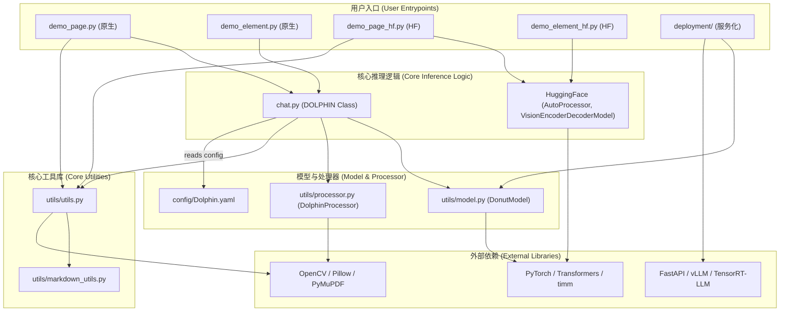

---

### **3. 核心功能说明**

#### **3.1. 核心模型架构**

该项目模型 (`DonutModel`) 是一个典型的视觉编码器-语言解码器架构。

*   **编码器 (`SwinEncoder`)**: 基于 Swin Transformer，负责将输入的文档图像编码为一系列高维特征向量。它将图像分割成小块（patches），并通过多层自注意力机制捕捉局部和全局的视觉信息。
*   **解码器 (`BARTDecoder`)**: 基于 MBart (Multilingual BART) 的仅解码器部分，是一个自回归的 Transformer 模型。它接收编码器输出的视觉特征（通过交叉注意力机制）和文本提示（prompt），并逐个生成 token，最终形成完整的解析结果字符串。

#### **3.2. 页面级解析流程 (Analyze-then-Parse)**

这是 Dolphin 的核心创新点，在 `demo_page.py` 和 `demo_page_hf.py` 中实现。

*   **业务目标**: 将整个文档页面解析为结构化的 JSON 和 Markdown。
*   **输入**: 单个文档图像或 PDF 页面对应的 PIL Image 对象。
*   **输出**: 包含所有页面元素信息的 `recognition_results` 列表。
*   **主要流程**:
    1.  **阶段一：布局分析 (Analyze)**
        *   `process_single_image` 函数调用 `model.chat` 方法，并传入一个固定的高级提示: `"Parse the reading order of this document."`。
        *   模型（`DonutModel`）接收整个页面图像，其解码器生成一个描述页面布局的字符串。该字符串包含了页面上所有元素的边界框（bounding box）坐标和类型标签（如 `para`, `tab`, `fig`）。
    2.  **阶段二：并行元素解析 (Parse)**
        *   `process_elements` 函数接收第一阶段生成的布局字符串。
        *   **解析与分组**: 使用正则表达式 (`parse_layout_string`) 解析该字符串，得到一个 `(bbox, label)` 元组列表。
        *   **图像裁剪**: 遍历该列表，根据每个 `bbox` 从（经过填充的）原始图像中裁剪出对应的元素图像。
        *   **任务分派**:
            *   如果 `label` 是 `fig` (图片)，则直接将裁剪的图像保存到本地，并在结果中记录其路径。
            *   如果 `label` 是 `tab` (表格)、`para` (段落) 或 `formula` (公式)，则将裁剪的图像和对应的任务特定提示（如 `"Parse the table in the image."` 或 `"Read text in theimage."`）存入一个待处理列表 (`text_table_elements`)。
        *   **批量推理**: 将待处理列表中的所有元素图像和提示组织成一个批次 (batch)。再次调用 `model.chat` 方法，但这次输入是裁剪后的小图像批次。模型对每个小图像并行执行内容识别。
        *   **结果聚合**: 将并行解析的结果与之前处理的图片信息合并，并根据阅读顺序 (`reading_order`) 排序，生成最终的 `recognition_results`。
*   **状态变化**: 整个流程是无状态的转换过程。唯一的微状态是在 `process_coordinates` 中使用 `previous_box` 变量来处理相邻元素的Y轴重叠问题，确保按顺序裁剪时不会出现交叉。

#### **3.3. 元素级解析流程**

在 `demo_element.py` 和 `demo_element_hf.py` 中实现。

*   **业务目标**: 对一个已经裁剪好的、独立的文档元素图像进行内容识别。
*   **输入**: 单个元素图像路径和元素类型 (`--element_type`)。
*   **输出**: 识别出的文本或结构化字符串。
*   **主要流程**:
    1.  根据用户指定的 `element_type`（'text', 'table', 'formula'），选择一个对应的提示。
    2.  调用 `model.chat` 方法，输入为该元素图像和选定的提示。
    3.  直接返回模型生成的结果。这是一个简化版的、仅包含“解析”阶段的流程。

#### **3.4. 模型部署与服务化**

`deployment/` 目录提供了两种高性能服务化方案。

*   **vLLM 方案**:
    *   **目标**: 利用 vLLM 的 PagedAttention 等技术实现高吞吐量的在线服务。
    *   **实现**: 项目为此开发了两个 vLLM 插件 `vllm-dolphin` 和 `vllm-mbart`，以支持 `VisionEncoderDecoderModel` 架构。
    *   **流程**: `api_server.py` 启动一个 FastAPI 服务，接收包含图片 base64 编码和解码器提示的 POST 请求。它将请求转换为 `ExplicitEncoderDecoderPrompt` 格式，并交由 vLLM 引擎处理。
*   **TensorRT-LLM 方案**:
    *   **目标**: 将模型转换为 TensorRT 引擎，以在 NVIDIA GPU 上获得极致的低延迟推理性能。
    *   **实现**: 提供了完整的转换、构建和运行脚本。
        *   `convert_dolphin.sh`: 自动化脚本，将 Hugging Face 模型权重转换为 TRT-LLM checkpoints，并构建视觉编码器和 LLM 解码器的 TRT 引擎。
        *   `dolphin_runner.py`: 封装了加载 TRT 引擎和执行推理的逻辑。
        *   `api_server.py`: 与 vLLM 方案类似，提供 FastAPI 服务接口。

---

### **4. 数据结构与 API**

#### **4.1. 核心领域对象 (Python Classes)**

*   **`DonutModel`** (`utils/model.py`):
    *   是项目的核心模型对象，继承自 `transformers.PreTrainedModel`。
    *   **字段**: `self.vpm` (SwinEncoder), `self.llm` (BARTDecoder), `self.config` (DonutConfig)。
    *   **关系**: 组合了视觉编码器和语言解码器。
*   **`DOLPHIN`** (`chat.py`):
    *   原生框架的推理引擎封装。
    *   **字段**: `self.model` (DonutModel), `self.processor` (DolphinProcessor), `self.tokenizer`。
    *   **核心方法/API**: `chat(question, image, ...)`，这是执行单次推理的核心接口，支持批量处理。

#### **4.2. 配置文件数据模型 (`Dolphin.yaml`)**

这是用于原生框架的模型和运行时的静态配置。

```yaml
model:
  model_name_or_path: string # 预训练模型权重路径
  tokenizer_path: string # Tokenizer 文件路径
  extra_answer_tokens: boolean # 是否添加 <Answer/> token
  max_length: int # 解码器最大序列长度
  decoder_layer: int # 解码器层数
  max_position_embeddings: int # 最大位置编码
  hidden_dimension: int # 隐藏层维度
  swin_args: # Swin Transformer 编码器参数
    name: string
    img_size: [int, int] # 输入图像尺寸 [H, W]
    patch_size: int
    embed_dim: int
    align_long_axis: boolean
    window_size: int
    encoder_layer: [int, int, int, int]
    num_heads: [int, int, int, int]
```

#### **4.3. 中间数据结构 (Layout String)**

这是连接“分析”和“解析”两个阶段的关键数据，是一个字符串。

*   **格式**: 由多个 `"[x1, y1, x2, y2] label"` 模式的子字符串拼接而成。
    *   `[x1, y1, x2, y2]`: 浮点数数组，表示元素在整个页面中的归一化坐标。
    *   `label`: 字符串，表示元素类型，如 `para`, `tab`, `fig`, `formula` 等。
*   **示例**: `"[0.176, 0.848, 0.826, 0.873] para [0.176, 0.74, 0.824, 0.82] tab ..."`
*   **生产者**: `DonutModel` 在第一阶段（布局分析）生成。
*   **消费者**: `utils.utils.parse_layout_string` 函数消费此字符串，并将其转换为 `(bbox, label)` 元组列表。

#### **4.4. 最终输出数据模型 (JSON/Markdown)**

这是项目最终交付给用户的核心数据模型，以 JSON 文件形式存在。

*   **结构**: 一个 JSON 数组，每个元素是一个代表文档元素的字典。
*   **元素字典字段**:
    *   `label` (string): 元素类型 (e.g., "para", "tab", "fig", "cap", "title")。
    *   `text` (string): 识别出的内容。对于表格，是 HTML 字符串；对于图片，是 Markdown 格式的引用 `"`。
    *   `bbox` ([float, float, float, float]): 元素在 **原始** 图像中的 **绝对** 坐标 `[x1, y1, x2, y2]`。**注意**: `utils.utils.py` 中的 `map_to_original_coordinates` 负责将处理过程中的填充坐标转换回原始坐标，这对于下游应用至关重要。
    *   `reading_order` (int): 元素在文档中的阅读顺序索引，从 0 开始。
    *   `figure_path` (string,可选): 如果 `label` 是 "fig"，此字段存储图片的相对路径。
*   对于多页 PDF，此结构会嵌套在 `pages` 数组中，每个页面一个条目。

#### **4.5. 服务化 API 定义**

项目通过 `deployment` 目录下的脚本提供了 HTTP API。

* **vLLM 服务 API (`deployment/vllm/api_server.py`)**

  * **Endpoint**: `POST /generate`

  * **Request Body (JSON)**:

    ```json
    {
      "encoder_prompt": "string", // 编码器提示, Dolphin中可为空
      "decoder_prompt": "string", // 解码器提示 (e.g., "Parse the table...")
      "image_base64": "string", // 图像的 Base64 编码
      "temperature": 0.0,
      "max_tokens": 2048,
      "stream": false
    }
    ```

  * **Response Body (JSON)**:

    ```json
    {
      "text": ["string"] // 包含生成结果的字符串数组
    }
    ```

* **TensorRT-LLM 服务 API (`deployment/tensorrt_llm/api_server.py`)**

  * **Endpoint**: `POST /generate`

  * **Request Body (JSON)**:

    ```json
    {
      "prompt": "string", // 统一的提示 (e.g., "Parse the table...")
      "image_base64": "string" // 图像的 Base64 编码
    }
    ```

  * **Response Body (JSON)**:

    ```json
    {
      "text": "string" // 生成的结果字符串
    }
    ```

* **API 数据模型分析**:

  *   两种部署方案的 API 设计略有不同，vLLM 的设计更贴近其 `ExplicitEncoderDecoderPrompt` 的概念，而 TensorRT-LLM 的则更简化。
  *   两者都使用 `image_base64` 传输图像，这是多模态服务中常见的做法，避免了文件存储的复杂性。
  *   API 的数据模型非常简单，主要关注输入（提示+图像）和输出（文本），隐藏了所有内部复杂的处理流程，符合微服务设计原则。
  *   **未知/待确认**: API 是否支持批量请求（batching）在 `api_client.py` 中没有明确体现，但服务端的 `max_batch_size` 参数表明后端引擎具备批量处理能力。客户端如何构造批量请求待确认。


# Dolphin项目-分析2

Dolphin (全称 **Do**cument **I**mage **P**arsing via **H**eterogeneous Anchor **in**g) 是一个由字节跳动开源的、创新的多模态文档图像解析模型。该项目的核心目标是解决现代文档图像解析中的关键挑战：如何精准、高效地将包含复杂布局（如文本段落、图表、数学公式、表格等多种元素交织）的非结构化文档图像，转化为机器可读的、结构化的数据格式（如 JSON 和 Markdown）。

传统文档解析方法通常难以处理元素的多样性和复杂的阅读顺序。Dolphin 为此提出了一种新颖的“**先分析后解析 (analyze-then-parse)**”两阶段范式，这构成了其核心竞争力。

1.  **第一阶段 - 页面布局分析 (Analyze)**: 模型首先对整个文档页面进行宏观分析，像人类阅读一样，识别出页面中所有逻辑元素（段落、图片、表格等）的位置，并生成它们的自然阅读顺序。
2.  **第二阶段 - 并行元素解析 (Parse)**: 在确定了布局和顺序后，模型将各个元素从页面中独立“裁剪”出来，并利用异构锚点和针对性的任务提示（例如，“解析这张表格”或“读取这段文字”），对这些元素进行高效的并行内容识别。

这种设计范式带来了显著优势：它不仅通过全局分析保证了输出内容的逻辑连贯性，还通过并行处理各个独立的元素，大幅提升了处理效率。

该项目的目标用户主要是从事文档数字化、信息提取、知识库构建和自动化数据处理领域的开发者、研究人员和系统架构师。Dolphin 提供了一个强大的预训练模型和一套完整的推理及部署工具链，使用户能够轻松地将先进的文档解析能力集成到自己的应用程序或服务中。无论是需要将扫描的学术论文转换为可编辑的 Markdown 文档，还是从财务报告的截图中自动提取表格数据，Dolphin 都旨在提供一个高精度、高效率的解决方案。

---

## 技术栈

以下是 Dolphin 项目所采用的主要技术和依赖库的整理：

*   **编程语言**:
    *   Python

*   **框架与库**:
    *   **深度学习**:
        *   `torch`: 核心的神经网络与张量计算框架。
        *   `transformers`: 来自 Hugging Face，用于加载和使用 MBart 解码器模型。
        *   `timm` (PyTorch Image Models): 用于构建 Swin Transformer 视觉编码器。
    *   **图像与文档处理**:
        *   `Pillow (PIL)`: Python 图像处理库，用于图像的读取、裁剪和操作。
        *   `opencv-python`: 用于高级图像处理，如坐标调整和边缘检测。
        *   `pymupdf`: 高效的 PDF 处理库，用于将 PDF 页面渲染成图像。
    *   **配置管理**:
        *   `omegaconf`: 用于加载和管理 YAML 格式的配置文件。
    *   **服务化与部署**:
        *   `FastAPI`: 用于构建高性能的异步 API 服务。
        *   `uvicorn`: ASGI 服务器，用于运行 FastAPI 应用。
        *   `vLLM`: 用于大语言模型的高吞吐量服务化框架。
        *   `TensorRT-LLM`: NVIDIA 官方工具，用于将模型编译为 TensorRT 引擎以实现极致推理加速。

*   **构建与工具**:
    *   `pre-commit`: 用于在代码提交前自动运行代码质量检查。
    *   `isort`: 自动对 Python 的 import 语句进行排序。
    *   `black`: 强制统一 Python 代码格式。
    *   `flake8`: Python 代码的静态检查工具，用于发现潜在的逻辑错误和代码风格问题。

*   **主要外部依赖**:
    *   `Hugging Face Hub`: 用于模型权重的托管和分发。
    *   `Git LFS`: 用于处理 Git 仓库中的大文件（如模型权重）。

---

## 可视化图表

#### 系统高级架构图

此图展示了 Dolphin 系统的整体架构和数据流。

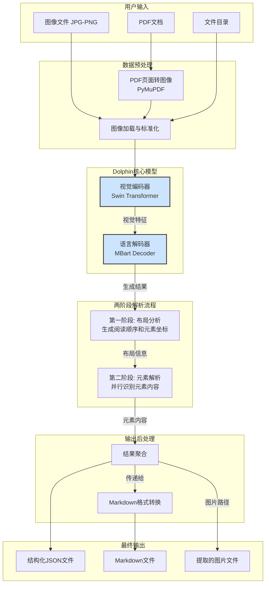

#### 模块依赖关系图

此图描绘了项目内部主要逻辑模块之间的依赖关系。

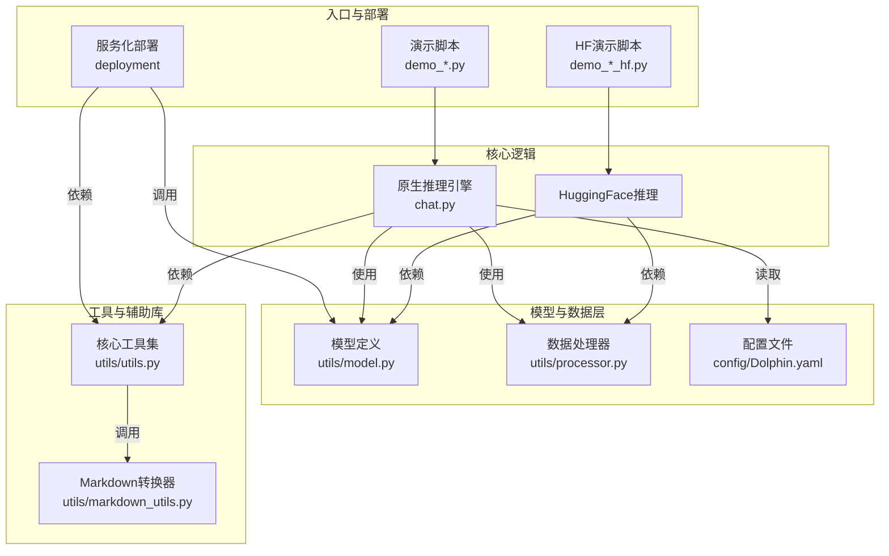

#### 页面级解析核心调用流程图

此图详细展示了“先分析后解析”两阶段范式的关键步骤和交互过程。

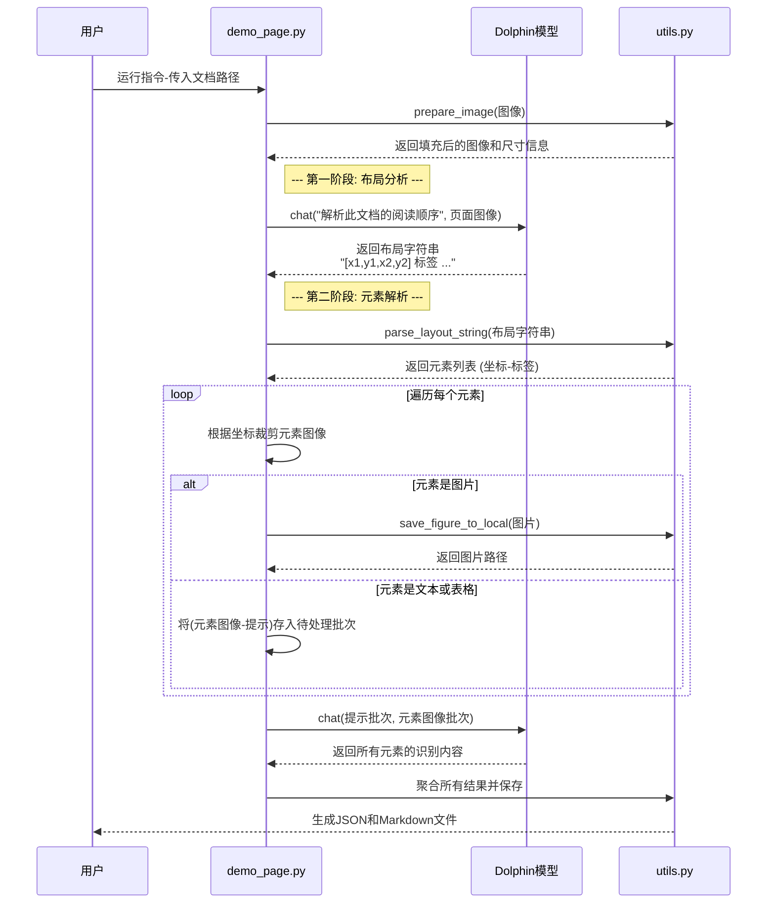

---

## 模块解析

Dolphin 项目的代码结构清晰，可以划分为以下几个核心逻辑模块：

### 模块1：入口与演示 (Entrypoint & Demos)

*   **核心职责**:
    该模块是用户与 Dolphin 系统交互的直接入口。它负责解析命令行参数（如输入文件路径、模型路径、批处理大小等），调用核心推理引擎来执行文档解析任务，并管理最终结果的保存。它为原生框架和 Hugging Face 框架分别提供了页面级和元素级的演示脚本。

*   **关键文件/组件**:
    *   `demo_page.py`: **页面级解析（原生）**。协调完成“先分析后解析”的完整流程。它首先调用模型获取整个页面的布局，然后根据布局信息裁剪出各个元素，最后批量调用模型进行内容识别。
    *   `demo_element.py`: **元素级解析（原生）**。用于处理单个、已经分离的元素图像（如一个表格截图）。它根据用户指定的元素类型选择合适的提示，并直接调用模型进行识别。
    *   `demo_page_hf.py` & `demo_element_hf.py`: 这两个文件功能与原生版本对应，但它们使用 `transformers` 库直接从 Hugging Face 加载模型和处理器，简化了环境配置和模型加载过程，更便于快速集成和使用。
    *   `chat.py`: **原生推理引擎**。定义了 `DOLPHIN` 类，这是原生演示脚本的核心依赖。它封装了从配置文件加载模型、图像预处理、批量推理和结果后处理的全部逻辑。其 `chat` 方法是核心的推理接口，能够智能地处理单个或批量的图像和提示输入。

*   **交互过程**:
    用户通过命令行运行 `demo_*.py` 脚本。脚本首先实例化一个 `DOLPHIN` 对象（或 Hugging Face 模型）。接着，它会根据输入路径是文件还是目录，收集所有待处理的文档。对于每个文档，它调用 `process_document` 函数，该函数进一步调用 `DOLPHIN.chat` 方法来执行一个或多个推理步骤。最后，脚本调用 `utils.utils` 中的函数将返回的结构化数据保存为 JSON 和 Markdown 文件。

### 模块2：模型定义 (Model Definition)

*   **核心职责**:
    该模块定义了 Dolphin 的核心神经网络架构。它是整个项目的基石，包含了视觉编码器、语言解码器以及将它们组合在一起的顶层模型。

*   **关键文件/组件**:
    *   `utils/model.py`:
        *   `SwinEncoder`: 基于 `timm` 库的 `SwinTransformer` 实现。它负责接收预处理后的图像张量，并将其编码为一系列高维的视觉特征向量，作为解码器的输入。
        *   `BARTDecoder`: 基于 `transformers` 库的 `MBartForCausalLM` 实现。这是一个自回归的语言模型，它通过交叉注意力机制融合 `SwinEncoder` 输出的视觉特征，并根据输入的文本提示（prompt），逐个生成 token，最终构成解析结果。
        *   `DonutModel`: 顶层模型类，继承自 `PreTrainedModel`。它将 `SwinEncoder` (作为 `self.vpm`) 和 `BARTDecoder` (作为 `self.llm`) 组合在一起，并定义了模型的完整前向传播逻辑 (`forward` 方法) 和推理逻辑 (`inference` 方法)。`inference` 方法是执行生成任务的核心，它管理着从编码到解码、再到最终 token 序列生成的全过程。

*   **代码特性解读**:
    `DonutModel.inference` 方法是整个推理流程的核心。它首先通过视觉编码器 `self.vpm` 从输入图像中提取特征，然后将这些特征和提示 `prompt_ids` 一起送入语言模型解码器 `self.llm.model.generate`。此 `generate` 方法是 Hugging Face `transformers` 库的标准功能，它以自回归的方式生成 token 序列，直到遇到结束符或达到最大长度。Dolphin 在此基础上集成了自定义的 `StoppingCriteriaScores`，用于在生成内容质量下降时（例如，模型开始重复或产生无意义内容）提前终止生成，从而提高效率和结果质量。

### 模块3：数据处理与工具集 (Data Processing & Utilities)

*   **核心职责**:
    该模块提供了一系列支持性的功能，涵盖了从原始数据输入到最终结果输出的整个生命周期。它负责数据预处理、PDF 解析、坐标转换、结果格式化等所有脏活累活。

*   **关键文件/组件**:
    *   `utils/processor.py`:
        *   `DolphinProcessor`: 负责将输入的 PIL 图像转换为模型所需的张量格式。这包括图像的缩放、填充（以保持宽高比）、归一化以及将文本提示转换为 token ID。
    *   `utils/utils.py`:
        *   `convert_pdf_to_images`: 使用 `pymupdf` 库将多页 PDF 文档的每一页高效地渲染成高质量的图像，这是处理 PDF 输入的第一步。
        *   `parse_layout_string`: 使用正则表达式解析第一阶段模型输出的布局字符串，将其从非结构化文本转换为 `(坐标, 标签)` 的结构化列表。
        *   `prepare_image` & `process_coordinates`: 这组函数是坐标处理的核心。`prepare_image` 将任意尺寸的输入图像填充成一个正方形，并记录下原始尺寸和填充尺寸。`process_coordinates` 则负责将模型输出的相对坐标（基于填充后图像）转换回原始图像上的绝对坐标，这对于确保输出的 `bbox` 准确无误至关重要。
        *   `save_outputs` & `save_combined_pdf_results`: 负责将内存中的结构化结果写入磁盘，同时生成 JSON 和 Markdown 两种格式的文件。
    *   `utils/markdown_utils.py`:
        *   `MarkdownConverter`: 这是一个强大的转换器，它接收最终的 JSON 格式结果，并根据每个元素的 `label`（如 `title`, `tab`, `list`）将其转换为语义正确的 Markdown 语法。例如，它会将 `label: "tab"` 的 HTML 表格字符串转换为 Markdown 表格，将 `label: "sec"` 的文本转换为二级标题。

*   **组件交互**:
    `demo_page.py` 首先使用 `utils.py` 的 `convert_pdf_to_images` 处理 PDF。然后，`chat.py` 中的 `DOLPHIN` 类使用 `processor.py` 的 `DolphinProcessor` 对图像和文本进行预处理。推理完成后，`demo_page.py` 使用 `utils.py` 的 `process_coordinates` 来校正坐标，并最终调用 `save_outputs`。`save_outputs` 内部会实例化并调用 `markdown_utils.py` 的 `MarkdownConverter` 来生成 Markdown 文件。

### 模块4：高性能部署 (High-Performance Deployment)

*   **核心职责**:
    该模块专注于将训练好的 Dolphin 模型部署为可用于生产环境的高性能、低延迟的在线服务。它提供了两种业界领先的加速方案：vLLM 和 TensorRT-LLM。

*   **关键文件/组件**:
    *   `deployment/vllm/`:
        *   `README.md`: 提供了详细的 vLLM 部署指南，包括如何安装专为 Dolphin 架构开发的 `vllm-dolphin` 插件。
        *   `api_server.py`: 一个基于 FastAPI 和 vLLM 的异步 API 服务器。它接收包含 Base64 编码图像和文本提示的 HTTP 请求，并将其高效地送入 vLLM 引擎进行推理。
        *   `api_client.py`: 一个示例客户端，演示了如何调用上述 API 服务。
    *   `deployment/tensorrt_llm/`:
        *   `convert_dolphin.sh`: 这是一个关键的自动化脚本，它负责将 Hugging Face 格式的模型权重转换为 TensorRT-LLM 所需的格式，并进一步构建和优化为 TensorRT 引擎文件 (`.engine`)。
        *   `dolphin_runner.py`: 封装了加载 TensorRT 引擎和执行推理的逻辑，是 TensorRT-LLM 部署方案的核心。
        *   `api_server.py`: 与 vLLM 方案类似，提供了一个 FastAPI 服务接口，但其后端调用的是 `dolphin_runner`。

*   **交互与逻辑**:
    无论是 vLLM 还是 TensorRT-LLM，其部署流程都遵循“模型转换 -> 服务封装 -> 客户端调用”的模式。
    1.  **转换**: 首先，开发者需要运行 `convert_dolphin.sh` (对于 TensorRT-LLM) 或安装特定插件 (对于 vLLM) 来准备模型。
    2.  **服务**: 接着，运行 `api_server.py` 脚本，它会加载优化后的模型，并启动一个 HTTP 服务器来监听请求。
    3.  **调用**: 最终，外部应用可以通过发送 HTTP 请求到该服务的 `/generate` 端点来使用 Dolphin 的文档解析能力，请求体中包含图像和提示，并获得 JSON 格式的返回结果。这种架构将复杂的模型推理逻辑与上层业务应用完全解耦。

## 各个模块内文件/组件/功能关系图

#### 模块2：模型定义 (内部关系图)

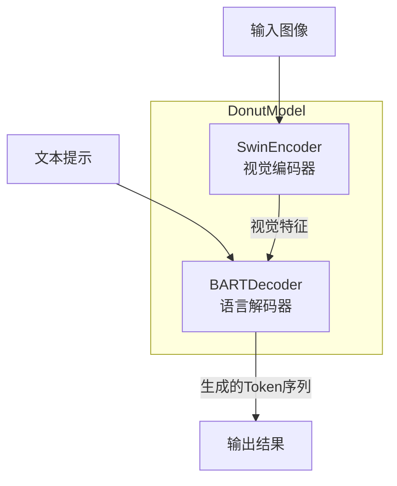

#### 模块3：数据处理与工具集 (内部关系图)

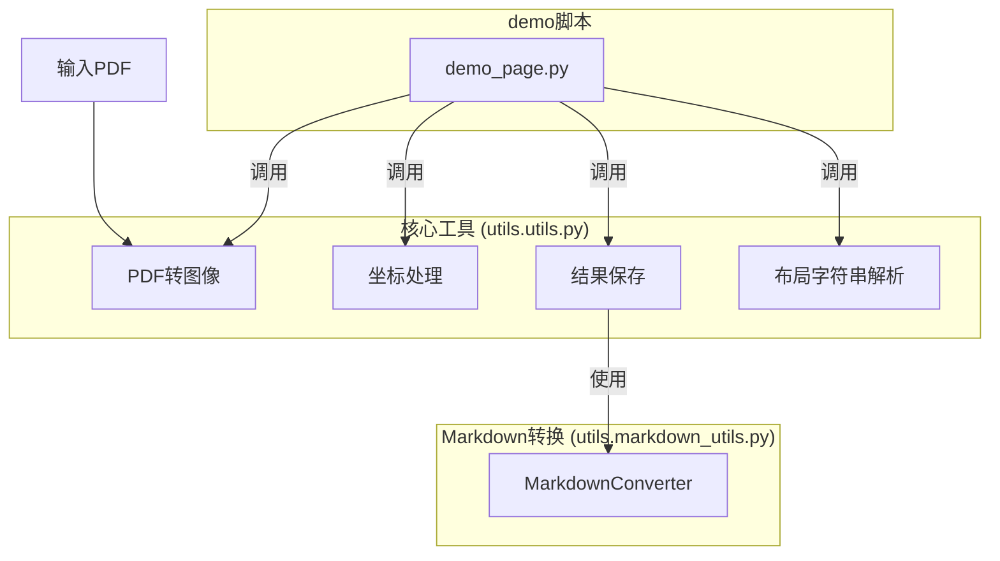

#### 模块4：高性能部署 (TensorRT-LLM 方案关系图)

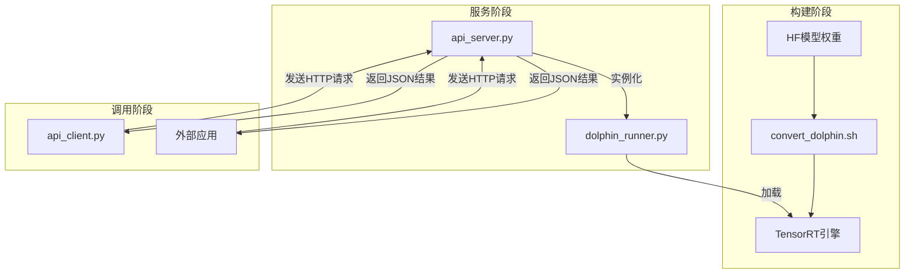

---

## 典型应用场景

Dolphin 的设计使其能够灵活应对多种文档处理需求。以下是几个典型的应用场景示例：

#### 场景1：学术论文数字化与归档

* **需求**: 一家研究机构需要将大量扫描版的 PDF 格式学术论文转换为结构化、可搜索的数据库。他们希望保留论文的原始结构，包括标题、作者、摘要、章节标题、正文、表格、图和参考文献。

* **使用示例**:
  管理员运行一个批处理脚本，遍历存放 PDF 论文的文件夹，并对每个文件执行以下命令：

  ```bash
  python demo_page.py --config ./config/Dolphin.yaml --input_path ./papers/paper_01.pdf --save_dir ./output/
  ```

* **产出**:

  *   在 `./output/recognition_json/` 目录下，会生成一个 `paper_01.json` 文件。该文件详细记录了论文每一页的所有元素，包括其类型（`title`, `sec`, `para`, `tab` 等）、在页面上的精确坐标、阅读顺序以及识别出的内容。
  *   在 `./output/markdown/` 目录下，会生成一个 `paper_01.md` 文件。这是一个格式精美的 Markdown 文档，论文的标题和章节被转换为 Markdown 标题，表格被转换为 Markdown 表格语法，图片被提取并链接到 `./output/markdown/figures/` 目录下对应的文件中。
  *   这个 Markdown 文件可以直接用于知识库展示，而 JSON 文件则可以被导入数据库，用于后续的全文检索和数据分析。

#### 场景2：从财务报表截图中快速提取表格数据

* **需求**: 一位金融分析师需要从一张包含年度财务摘要的网页截图中，快速提取出关键的表格数据，以便在 Excel 中进行进一步分析。

* **使用示例**:
  分析师将截图保存为 `financial_table.jpeg`，然后运行以下命令，明确指出这是一个表格解析任务：

  ```bash
  python demo_element.py --config ./config/Dolphin.yaml --input_path ./screenshots/financial_table.jpeg --element_type table
  ```

* **产出**:
  程序将在控制台直接输出一个 HTML 格式的 `<table>...</table>` 字符串。分析师可以直接将这段 HTML 字符串复制并粘贴到 Excel 中，Excel 会自动将其解析为一个格式化的电子表格，完美还原原始表格的行列结构，极大地节省了手动录入数据的时间。

#### 场景3：构建企业级文档自动化处理微服务

* **需求**:一家大型企业希望在其内部工作流系统（如 OA、合同管理系统）中集成文档解析能力。该服务需要支持高并发请求，并能处理用户上传的各类文档（如发票、合同、报告）的实时解析。

* **使用示例**:

  1. **部署服务**: IT 部门选择 vLLM 方案以获得高吞吐量。他们首先根据 `deployment/vllm/README.md` 的指引安装好环境和 `vllm-dolphin` 插件，然后启动 API 服务器：

     ```bash
     python deployment/vllm/api_server.py --model="ByteDance/Dolphin" --hf-overrides "{\"architectures\": [\"DolphinForConditionalGeneration\"]}"
     ```

  2. **服务集成**: 工作流系统的后端服务现在可以通过发送 HTTP POST 请求来调用这个部署好的 Dolphin 服务。例如，当用户上传一张发票图片时，系统后端会读取图片文件，将其编码为 Base64 字符串，然后构造一个 JSON 请求体发送到 Dolphin 服务的 `/generate` 端点。

     ```python
     # 伪代码 - 在企业后端服务中调用Dolphin API
     import requests
     import base64
     
     image_path = "path/to/invoice.png"
     prompt = "Parse the reading order of this document." # 或者更具体的提示，如 "提取发票的关键信息"
     
     with open(image_path, "rb") as f:
         image_base64 = base64.b64encode(f.read()).decode("utf-8")
     
     response = requests.post(
         "http://dolphin-service:8000/generate",
         json={
             "decoder_prompt": prompt,
             "image_base64": image_base64,
             "max_tokens": 4096
         }
     )
     # 解析返回的JSON结果，提取所需信息
     parsed_data = response.json() 
     ```

* **产出**:
  Dolphin 微服务返回一个结构化的 JSON 对象，包含了对发票图像的完整解析结果。企业的后端服务可以轻松地解析这个 JSON，提取出如发票号码、金额、日期、商品列表等关键信息，并自动填充到数据库或后续的审批流程中，实现了端到端的自动化。


# 数据处理与工具集 (Data Processing & Utilities)深入解析。

---

### **模块3：数据处理与工具集 - 深度解析**

#### **概述**

该模块是 Dolphin 项目的“数据管道”和“引擎室”，承担着承上启下的关键作用。它负责将用户提供的原始、异构的输入（如 PDF、不同尺寸的图片）转化为神经网络模型能够理解的高度标准化、格式化的张量数据；同时，它也负责将模型输出的、相对抽象的 token 序列和坐标数据，反向处理成用户友好、结构清晰的 JSON 和 Markdown 文件。

在这个复杂的 ETL (Extract, Transform, Load) 过程中，`Pillow (PIL)` 和 `opencv-python` 扮演着不可或缺的角色。可以这样理解它们的分工：

*   **`Pillow (PIL)`**: 主要负责图像的 **I/O、内存表示和面向模型的预处理**。它作为系统中图像对象的标准格式，负责图像的打开、保存、尺寸调整和几何变换，是与 `torchvision` 直接交互的桥梁。
*   **`opencv-python`**: 主要负责 **高级图像分析和像素级操作**。它被用于更精细的任务，如基于图像内容微调边界框（bounding box）、在不同色彩空间之间转换，以及处理底层的 NumPy 数组表示，为坐标的精准定位提供算力支持。

下面，我们将沿着一条图像数据的完整处理链路，详细拆解每个环节以及两大工具库在其中的具体应用。

#### **详细数据处理流程**

##### **第一步：原始输入处理与标准化**

当用户提供一个输入时，系统的第一项任务是将其统一为标准的内存对象。

*   **涉及文件**: `demo_page.py` (逻辑编排), `utils/utils.py` (功能实现)

1.  **输入判断**: `demo_page.py` 的主逻辑首先判断输入路径是单个文件还是目录。如果是文件，则判断其扩展名。

2.  **PDF 处理**: 如果输入是 `.pdf` 文件，系统调用 `utils/utils.py` 中的 `convert_pdf_to_images` 函数。
    *   该函数使用 `pymupdf` 库，这是一个高性能的 PDF 解析库。它会遍历 PDF 的每一页，将页面内容**渲染**成一个像素图（pixmap）。
    *   渲染过程中可以指定缩放比例，以保证输出图像的清晰度。
    *   渲染后的原始像素数据通过 `io.BytesIO` 被加载到内存中。
    *   **`Pillow` 的作用**: 此时，`Image.open()` 函数从内存中读取这些像素数据，并将其解码成一个 `Pillow (PIL).Image` 对象。至此，无论输入是 PDF 还是图片，都被统一成了标准的 `PIL.Image` 对象，方便后续流程处理。

##### **第二步：图像预处理（为第一阶段“布局分析”准备）**

模型需要固定尺寸的输入。这个阶段的目标是将任意尺寸的 `PIL.Image` 对象转换为符合模型输入要求的 `torch.Tensor`。

*   **涉及文件**: `utils/processor.py` -> `DolphinProcessor.process_image_for_inference`

1.  **尺寸调整**:
    *   **`Pillow` 的作用**: 函数首先使用 `torchvision.transforms.functional.resize`（其底层依赖 `Pillow`）来调整图像尺寸，同时保持其原始的宽高比。接着，`image.thumbnail()` 方法（同样来自 `Pillow`）确保图像的长和宽都不会超过模型输入尺寸（例如 896x896）。

2.  **填充 (Padding)**:
    *   **`Pillow` 的作用**: 为了将调整后（但通常非正方形）的图像变为模型所需的正方形输入，而不扭曲图像内容，需要进行填充。`ImageOps.expand()` 函数在此处发挥作用，它计算出需要在图像的上下左右添加多少像素的黑边，才能使其最终尺寸恰好是 896x896，从而将图像居中放置在一个黑色的背景上。

3.  **张量转换与归一化**:
    *   此时图像仍然是 `PIL.Image` 对象。`torchvision.transforms.Compose` 流水线接管后续处理。
    *   `transforms.ToTensor()`: 将 `PIL.Image` 对象转换为 `torch.Tensor`，并将像素值从 `[0, 255]` 范围缩放到 `[0.0, 1.0]`。
    *   `transforms.Normalize()`: 使用 ImageNet 的标准均值和标准差对张量进行归一化。这是训练深度学习视觉模型的标准实践，可以加速模型收敛。

经过这一系列步骤，原始图像就变成了一个格式标准、尺寸固定的张量，可以被送入 `SwinEncoder` 进行特征提取。

##### **第三步：布局解析与元素裁剪（“分析”与“解析”的衔接）**

在第一阶段的推理完成后，模型返回一个包含多个元素坐标和标签的字符串。现在，系统需要根据这些信息，从原始图像中精确地裁剪出每个元素，以供第二阶段的并行解析。

*   **涉及文件**: `utils/utils.py` -> `prepare_image`, `process_coordinates`, `adjust_box_edges`

1.  **准备高分辨率图像**:
    *   为了保证裁剪出的元素图像尽可能清晰，系统不会使用之前为第一阶段缩放过的图像，而是重新加载原始 `PIL.Image` 对象，并调用 `prepare_image` 函数。
    *   **`OpenCV` 的作用**: 在 `prepare_image` 函数中，`PIL.Image` 对象通过 `np.array()` 转换为 NumPy 数组。`cv2.cvtColor()` 函数将其从 `Pillow` 的 RGB 色彩空间转换为 `OpenCV` 习惯的 BGR 色彩空间。然后，`cv2.copyMakeBorder()` 函数执行与 `ImageOps.expand` 类似的功能，对这个高分辨率图像进行填充，创建一个用于精确裁剪的“画布”。

2.  **坐标处理与微调**:
    *   `process_coordinates` 函数是此阶段的核心。它接收模型输出的归一化坐标（例如 `[0.1, 0.1, 0.5, 0.5]`）。
    *   首先，它将这些归一化坐标乘以填充后高分辨率图像的尺寸，得到绝对像素坐标。
    *   **`OpenCV` 的高级应用**: 关键步骤是对这个初步的边界框进行微调。`adjust_box_edges` 函数被调用：
        *   它首先使用 `cv2.cvtColor` 将裁剪区域转为灰度图，然后用 `cv2.threshold` 进行二值化处理，使得文字或线条区域变为白色，背景变为黑色。
        *   接着，它沿着边界框的四条边进行“扫描”。通过计算二值化图像在线上的像素值变化率（梯度），它可以判断当前边缘是否正好切在文本/线条的边界上，还是切在了空白区域。
        *   如果边缘在空白区域，它会逐步移动边缘，直到找到一个变化率急剧增加的位置（即内容边界），从而实现对模型预测框的**像素级校正**。这一步极大地提升了裁剪质量。

3.  **元素裁剪与格式转换**:
    *   **`OpenCV` 的作用**: 使用校正后的绝对坐标，通过简单的 NumPy 数组切片 (`padded_image[y1:y2, x1:x2]`) 从填充后的高分辨率 `OpenCV` 图像中裁剪出元素。
    *   **`Pillow` 的作用**: 裁剪出的结果是一个 `OpenCV` 的图像数组（NumPy array）。为了送入第二阶段的并行推理（其输入处理器同样是 `DolphinProcessor`），需要将其转换回标准的 `PIL.Image` 对象。`Image.fromarray()` 函数完成了这个转换，同时 `cv2.cvtColor` 再次用于将色彩空间从 BGR 转回 RGB。

##### **第四步：结果生成与格式化**

第二阶段推理完成后，所有元素的内容都被识别出来。最后一步是将这些结构化信息保存为文件。

*   **涉及文件**: `utils/utils.py` -> `save_outputs`, `utils/markdown_utils.py` -> `MarkdownConverter`

*   **坐标反算**: 在保存到 JSON 文件之前，系统会调用 `map_to_original_coordinates` 函数。该函数利用在 `prepare_image` 步骤中记录的原始图像尺寸和填充尺寸，将裁剪时使用的、基于填充图像的坐标，反向计算出在**原始未填充图像**上的精确坐标。这确保了输出的 `bbox` 字段对于下游应用是有意义的。

*   **格式转换**: `MarkdownConverter` 类负责将这份包含精确坐标和识别内容的结构化数据，转换为人类可读的 Markdown。它不直接使用图像处理库，但其工作成果（如 Markdown 中引用的图片路径）直接依赖于前序步骤中对 `fig` 标签元素的正确裁剪和保存。

#### **数据流可视化图表**

此图总结了上述详细流程中，一份图像数据的完整生命周期。

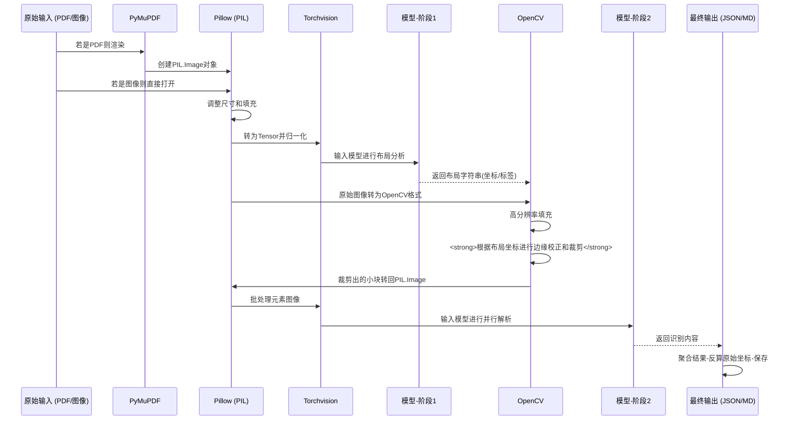


# 数据处理流程的三个核心步骤伪代码详细拆解。

---

### **步骤一：原始输入处理与标准化**

此步骤的目标是将不同来源（PDF、各类图片文件）的输入，统一处理成后续流程可以接收的标准 `Pillow (PIL).Image` 对象。

#### **伪代码**

```python
FUNCTION load_and_standardize_input(filePath):
    # 1. 检查文件类型
    IF filePath ends with ".pdf":
        # 2. 如果是 PDF 文件
        // 使用 pymupdf 打开文档
        pdf_document = pymupdf.open(filePath)
        
        // 假设我们只处理第一页作为示例
        first_page = pdf_document.load_page(0)
        
        // 将页面渲染为像素图，并转换为内存中的字节流
        pixmap = first_page.get_pixmap()
        image_bytes = pixmap.tobytes("png")
        
        // 使用 Pillow 从内存字节流中加载图像
        // 这一步完成了从 PDF 页面到 PIL 对象的转换
        pil_image = Pillow.Image.open(io.BytesIO(image_bytes))
        
        // 清理资源
        pdf_document.close()
    ELSE:
        # 3. 如果是图像文件 (JPG, PNG, etc.)
        // 直接使用 Pillow 打开图像文件
        pil_image = Pillow.Image.open(filePath)

    # 4. 统一色彩空间
    // 确保所有图像都转换为 RGB 格式，以消除例如灰度图或带Alpha通道的PNG等差异
    IF pil_image.mode != "RGB":
        pil_image = pil_image.convert("RGB")
        
    # 5. 返回标准化的 PIL 对象
    RETURN pil_image
ENDFUNCTION
```

#### **流程图**

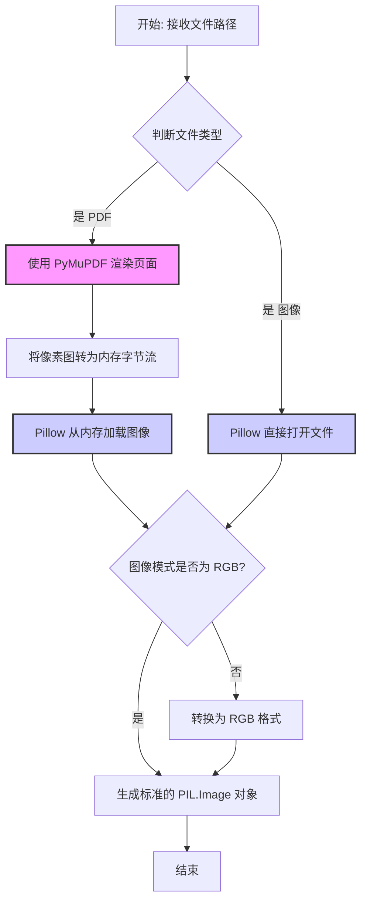

---

### **步骤二：图像预处理（为第一阶段“布局分析”准备）**

此步骤接收一个标准的 `PIL.Image` 对象，通过一系列变换，将其转换为一个尺寸固定、经过归一化的 `torch.Tensor`，以满足 `SwinEncoder` 模型的输入要求。

#### **伪代码**

```python
FUNCTION preprocess_for_layout_analysis(pil_image, target_size=[896, 896]):
    # 1. 按比例缩放
    // 使用 Pillow 的功能，在保持原始宽高比的前提下，
    // 将图像的最长边缩放至 target_size 的大小
    image_copy = pil_image.copy()
    image_copy.thumbnail((target_size[1], target_size[0]))
    
    # 2. 计算填充尺寸
    // 计算需要填充的黑边宽度和高度，以使图像成为正方形
    delta_width = target_size[1] - image_copy.width
    delta_height = target_size[0] - image_copy.height
    padding_left = delta_width // 2
    padding_top = delta_height // 2
    padding_right = delta_width - padding_left
    padding_bottom = delta_height - padding_top
    
    # 3. 执行填充
    // 使用 Pillow 的 ImageOps.expand 将图像居中放置在一个黑色背景上
    padded_image = Pillow.ImageOps.expand(
        image_copy, 
        border=(padding_left, padding_top, padding_right, padding_bottom),
        fill='black'
    )
    
    # 4. 定义 Torchvision 变换流水线
    transforms_pipeline = Torchvision.transforms.Compose([
        // 将 PIL 对象像素值从 [0, 255] 转为 [0.0, 1.0] 的浮点型 Tensor
        Torchvision.transforms.ToTensor(),
        // 使用 ImageNet 标准的均值和标准差进行归一化
        Torchvision.transforms.Normalize(
            mean=[0.485, 0.456, 0.406],
            std=[0.229, 0.224, 0.225]
        )
    ])
    
    # 5. 应用变换并增加批次维度
    image_tensor = transforms_pipeline(padded_image)
    image_tensor = image_tensor.unsqueeze(0) // 形状变为 [1, C, H, W]
    
    # 6. 返回最终的张量
    RETURN image_tensor
ENDFUNCTION
```

#### **流程图**

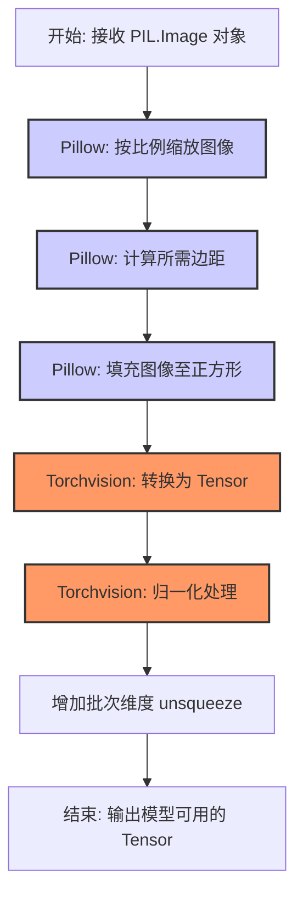

---

### **步骤三：布局解析与元素裁剪**

这是连接“分析”与“解析”两个阶段的核心步骤。它利用第一阶段的输出（布局字符串），通过 `OpenCV` 的高级功能对坐标进行精调，并从高分辨率图像中裁剪出各个元素，为第二阶段的并行推理做准备。

#### **伪代码**

```python
FUNCTION crop_elements_from_layout(layout_string, original_pil_image):
    # 1. 解析布局字符串
    // 将 "[x1,y1,x2,y2] label ..." 格式的字符串解析为结构化列表
    elements = parse_layout_string(layout_string)
    
    # 2. 准备高分辨率画布
    // Pillow -> OpenCV: 将原始 PIL 图像转为 OpenCV 使用的 NumPy 数组 (BGR 格式)
    original_cv_image = cv2.cvtColor(np.array(original_pil_image), cv2.COLOR_RGB2BGR)
    // OpenCV: 对高分辨率图像进行填充，为精确裁剪做准备
    padded_cv_image, dimensions = prepare_image_with_opencv(original_cv_image)
    
    cropped_elements_batch = []
    
    # 3. 遍历并处理每个元素
    FOR each (normalized_bbox, label) in elements:
        // a. 计算在填充后画布上的绝对像素坐标
        abs_x1 = normalized_bbox[0] * dimensions.padded_w
        abs_y1 = normalized_bbox[1] * dimensions.padded_h
        abs_x2 = normalized_bbox[2] * dimensions.padded_w
        abs_y2 = normalized_bbox[3] * dimensions.padded_h
        initial_bbox = [abs_x1, abs_y1, abs_x2, abs_y2]
        
        // b. **关键步骤: 使用 OpenCV 微调边界框**
        //    此函数内部使用灰度转换、二值化和边缘梯度分析来校正坐标
        adjusted_bbox = adjust_box_edges_with_opencv(padded_cv_image, initial_bbox)
        
        // c. OpenCV: 使用 NumPy 数组切片进行精确裁剪
        x1, y1, x2, y2 = adjusted_bbox
        cropped_cv_element = padded_cv_image[y1:y2, x1:x2]
        
        // d. OpenCV -> Pillow: 将裁剪出的 BGR NumPy 数组转回 RGB PIL 对象
        cropped_rgb_element = cv2.cvtColor(cropped_cv_element, cv2.COLOR_BGR2RGB)
        pil_element = Pillow.Image.fromarray(cropped_rgb_element)
        
        // e. 将处理好的元素图像添加到批处理列表
        //    同时可以附带其标签和提示，为第二阶段推理做准备
        cropped_elements_batch.append({"image": pil_element, "label": label})
    
    # 4. 返回包含所有待解析元素图像的列表
    RETURN cropped_elements_batch
ENDFUNCTION
```

#### **流程图**

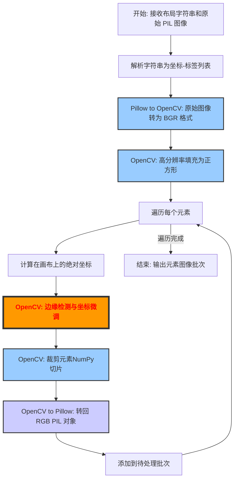


