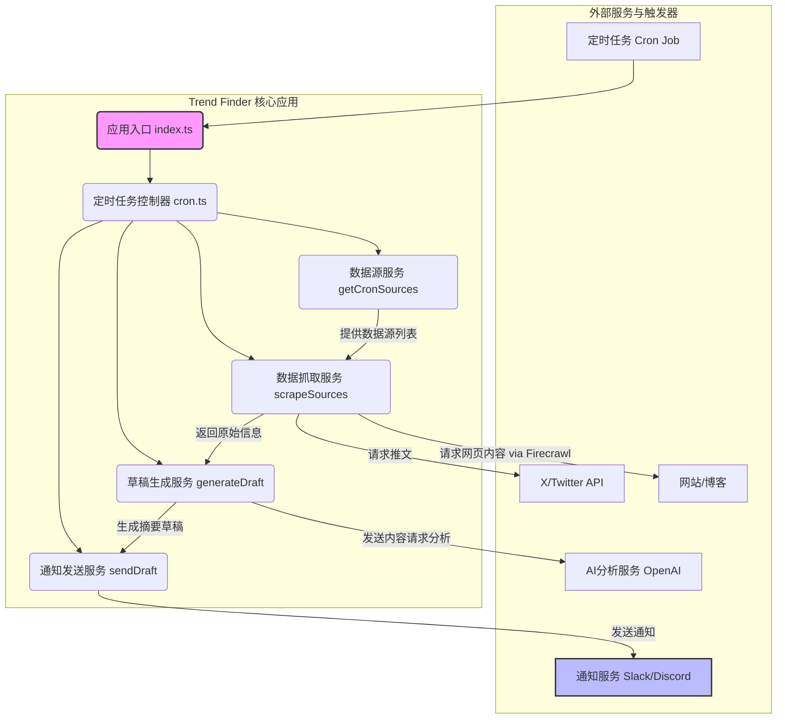
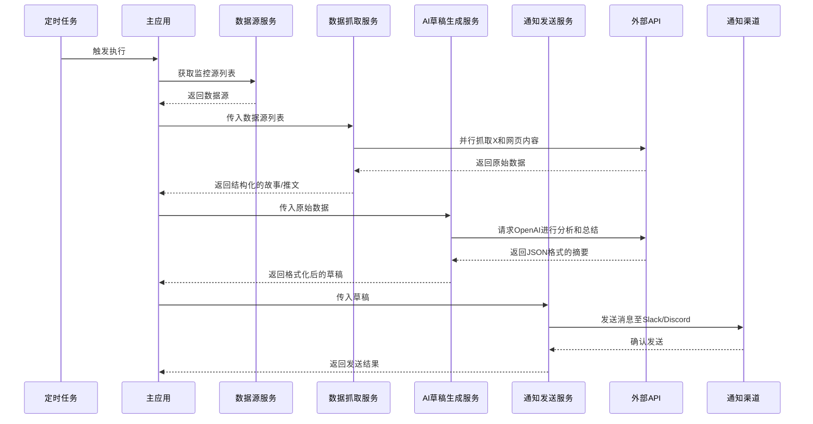
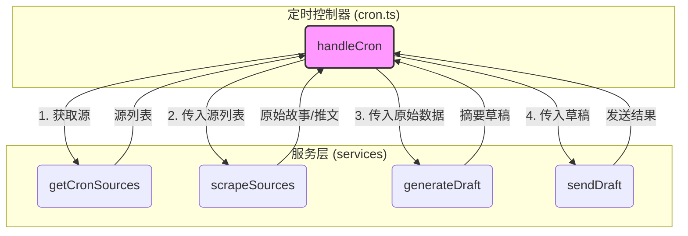
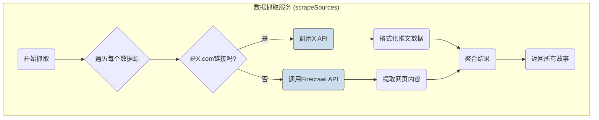
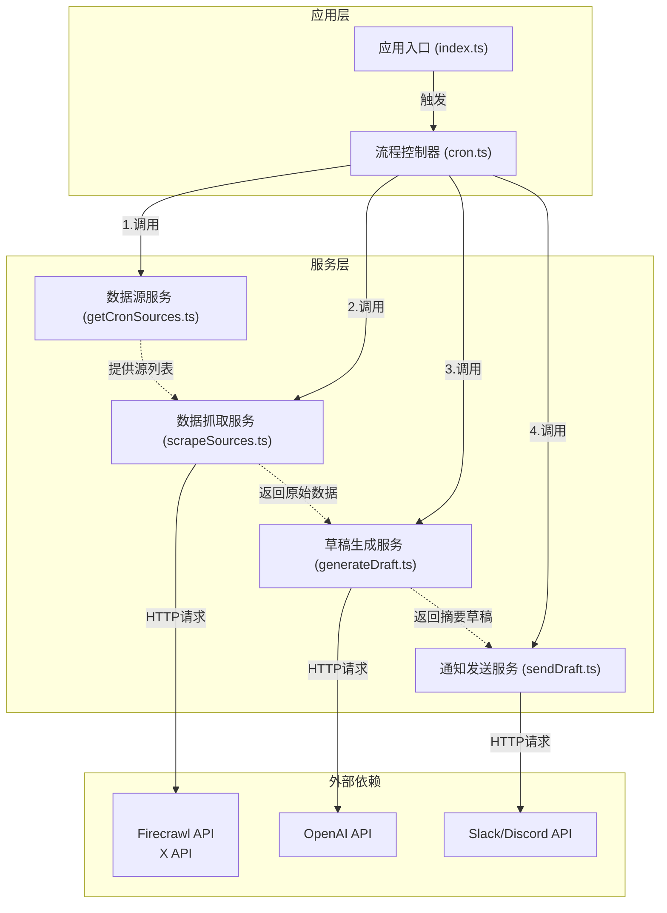

# Trend Finder 项目分析

Trend Finder 是一个自动化趋势发现与分析工具，旨在帮助用户，特别是营销和内容创作团队，高效地追踪社交媒体和关键信息源上的热门话题。该项目通过自动化的方式，解决了信息过载和人工搜寻效率低下的核心痛痛点。在当今快节奏的数字环境中，行业趋势、产品发布和关键对话瞬息万变，手动跟进不仅耗时耗力，而且容易错失良机。Trend Finder 通过集成化的工作流，将数据收集、AI分析和即时通知无缝衔接，使用户能够从繁琐的信息筛选中解放出来，专注于创造有价值的内容和市场活动。

该项目的核心功能是聚合来自多个信息渠道的数据。它能够通过 X（前身为 Twitter）的 API 监控指定行业影响者（Influencers）的最新帖子，也能利用 Firecrawl 服务抓取指定网站（如公司博客、新闻门户）的最新发布和新闻。所有数据收集过程都由可定制的定时任务（Cron Job）驱动，确保信息获取的及时性和规律性。

在收集到原始数据后，Trend Finder 会调用强大的大型语言模型（LLM）服务（如 OpenAI、Together AI）对这些信息进行智能分析和处理。AI模型会识别出新兴的趋势、重要的产品发布以及行业新闻，并对信息的关联性和情绪进行初步分析。最核心的是，它能将杂乱无章的原始帖子和文章，提炼成结构清晰、重点突出的摘要草稿。

最终，当系统检测到重要的趋势或生成了新的内容摘要后，会通过即时通讯工具（支持 Slack 和 Discord）将结果推送到指定频道。这不仅为团队提供了关于趋势的上下文和来源，更重要的是，它创造了一个快速响应新兴机会和行业变化的通路。对于像 Firecrawl 这样的营销团队而言，这意味着能够更快地捕捉到市场热点，从而制定出更具影响力的营销策略，真正做到“花更少的时间寻找趋势，用更多的时间创造价值”。

### 1. 技术栈

*   **编程语言**:
    *   TypeScript

*   **框架与库**:
    *   **Express**: 用于构建Web服务的后端框架。
    *   **Node-cron**: 用于在Node.js中实现定时任务（Cron Job）。
    *   **Dotenv**: 用于管理环境变量，实现配置与代码的分离。
    *   **Axios**: 用于发送HTTP请求，与外部API进行通信。
    *   **Zod**: 用于数据校验和Schema定义，确保数据结构的正确性。

*   **构建与工具**:
    *   **npm**: Node.js的包管理器，用于依赖管理和脚本执行。
    *   **TypeScript Compiler (tsc)**: 用于将TypeScript代码编译为JavaScript。
    *   **ts-node / ts-node-dev / nodemon**: 用于在开发环境中直接运行TypeScript代码并支持热重载。
    *   **Docker / Docker Compose**: 用于应用的容器化部署和管理。

*   **主要外部依赖**:
    *   **AI & LLM 服务**:
        *   **OpenAI API**: 用于分析抓取到的内容并生成摘要草稿。
        *   **Together AI API** (可选): 作为备选的AI分析服务。
        *   **DeepSeek API** (可选): 作为备选的AI分析服务。
    *   **数据抓取服务**:
        *   **Firecrawl API**: 用于抓取和提取网页内容。
        *   **X (Twitter) API**: 用于监控指定用户的推文。
    *   **通知服务**:
        *   **Slack Webhook**: 用于将生成的报告发送到Slack频道。
        *   **Discord Webhook**: 用于将生成的报告发送到Discord频道。

### 2. 可视化图表

#### 系统架构图



#### 关键调用流程图



### 3. 模块解析

项目代码结构清晰，主要逻辑集中在 `src` 目录下，可以划分为以下几个核心模块：

#### 3.1 调度与流程控制模块

*   **核心职责**: 作为应用的入口和总指挥，负责初始化应用、设置定时任务，并编排各个服务模块的调用顺序。
*   **关键文件**:
    *   `src/index.ts`: 应用的启动入口。它负责加载 `.env` 文件中的环境变量，并设置一个 `node-cron` 定时任务。默认情况下，代码提供了一个每天下午5点执行的定时器（`0 17 * * *`），同时为了方便调试，也提供了立即执行一次 `main` 函数的逻辑。
    *   `src/controllers/cron.ts`: 核心的业务流程控制器。`handleCron` 函数是整个流程的核心，它定义了任务执行的完整步骤：
        1.  调用 `getCronSources` 获取需要监控的信息源。
        2.  将获取到的源列表传递给 `scrapeSources` 来抓取原始数据。
        3.  将抓取到的数据（字符串化后）传递给 `generateDraft` 进行AI分析和草稿生成。
        4.  最后调用 `sendDraft` 将生成的草稿发送到指定的通知渠道。
        5.  同时包含完善的错误处理机制，确保单个环节的失败不会导致整个应用崩溃。

#### 3.2 数据源管理模块

*   **核心职责**: 动态地管理和提供需要监控的信息源列表。
*   **关键文件**:
    *   `src/services/getCronSources.ts`: 该服务负责根据环境变量中配置的API密钥，智能地决定启用哪些数据源。
        *   **逻辑说明**: 它会检查 `X_API_BEARER_TOKEN` 和 `FIRECRAWL_API_KEY` 是否存在。如果存在对应的API密钥，它就会将预设的X平台账号或网站URL添加到返回的源列表中。这种设计使得应用的配置非常灵活，用户只需通过环境变量就能轻松增删监控范围，而无需修改代码。
        *   **数据源**: 默认配置了多个高质量的信息源，如 Firecrawl 博客、OpenAI 新闻、Y Combinator News 等，同时也支持监控指定的X账号。

#### 3.3 数据抓取模块

*   **核心职责**: 从不同的数据源（网页和X平台）抓取原始信息，并将其统一格式化。
*   **关键文件**:
    *   `src/services/scrapeSources.ts`: 这是项目中最复杂的服务之一，负责实际的数据获取工作。
    *   **功能细分**:
        1.  **源类型判断**: 遍历传入的源列表，通过URL中是否包含 "x.com" 来区分是X平台账号还是普通网页。
        2.  **X推文抓取**:
            *   **API调用**: 如果是X源，它会解析出用户名，并构建一个指向 X API v2 `recent search` 端点的请求。该请求会查找指定用户在过去24小时内发布的、包含媒体且非转推/回复的推文。
            *   **数据处理**: 获取到的推文数据会被格式化为统一的 `Story` 对象，包含推文内容（headline）、链接和发布日期。
        3.  **网页内容抓取 (Firecrawl)**:
            *   **AI驱动提取**: 对于普通网页，它使用 Firecrawl 的 `extract` 功能。这不仅仅是简单的HTML抓取，而是通过一个精心设计的`prompt`，指示Firecrawl的AI模型只提取页面中当天发布的、与AI或LLM相关的头条新闻和链接。
            *   **Schema约束**: 为了确保返回数据的质量和格式，它使用了 `Zod` 定义的 `StoriesSchema`。Firecrawl会根据这个Schema返回结构化的JSON数据，大大简化了后续处理。
        4.  **数据聚合**: 所有来源的数据最终被聚合并返回一个 `Story[]` 数组。

#### 3.4 AI内容生成模块

*   **核心职责**: 利用大型语言模型（LLM）将抓取到的原始、杂乱的数据提炼成一份简洁、易读的摘要草稿。
*   **关键文件**:
    *   `src/services/generateDraft.ts`: 该服务负责与OpenAI API进行交互。
    *   **核心逻辑**:
        1.  **Prompt设计**: 它构建了一个非常具体的 `system` prompt，要求AI扮演一个“乐于助手的助理”角色，将输入的故事和推文整理成一个要点式的摘要。最关键的是，它强制要求AI返回**严格的JSON格式**，包含一个 `interestingTweetsOrStories` 键，其值为一个包含 `description` 和 `story_or_tweet_link` 的对象数组。
        2.  **API调用**: 使用 `openai` 库调用 `chat.completions.create` 方法，并指定使用 `o3-mini` 模型。
        3.  **JSON解析与格式化**: 收到AI返回的JSON字符串后，它会进行解析，并遍历其中的内容数组，最终格式化成一个带有标题和项目符号列表的、适合在Slack或Discord中阅读的文本字符串。
        4.  **容错处理**: 如果AI没有返回有效内容或内容数组为空，它会生成一条友好的提示信息，如“暂时没有发现热门故事”。

#### 3.5 通知发送模块

*   **核心职责**: 将最终生成的草稿发送到用户配置的通知渠道。
*   **关键文件**:
    *   `src/services/sendDraft.ts`: 一个灵活的通知分发器。
    *   **核心逻辑**:
        1.  **渠道选择**: 首先，它会读取 `NOTIFICATION_DRIVER` 环境变量，以确定目标渠道是 'slack' 还是 'discord'。
        2.  **适配不同平台**: 使用 `switch` 语句，根据渠道调用不同的发送函数 (`sendDraftToSlack` 或 `sendDraftToDiscord`)。
        3.  **API请求**: 每个发送函数内部都使用 `axios` 向相应的Webhook URL发送一个POST请求。它会根据不同平台的要求构建请求体（payload），例如Slack需要 `{"text": "..."}`，而Discord则使用 `{"content": "..."}`。这种适配层设计使得未来扩展到其他通知渠道（如Telegram、Email）变得非常容易。

### 4. 各个模块内文件/组件/功能关系图

#### 主流程控制与服务交互图



#### 数据抓取模块内部逻辑图



### 5. 典型应用场景

**场景：一家AI SaaS公司的市场营销团队希望实时追踪竞争对手动态和行业热点，以便快速响应并调整内容策略。**

1. **配置与部署**：

   *   公司的技术负责人克隆了 `Trend Finder` 仓库。
   *   在 `.env` 文件中，他们配置了公司的 `FIRECRAWL_API_KEY` 用于网页抓取，以及一个专门申请的 `X_API_BEARER_TOKEN`。
   *   他们还配置了 `OPENAI_API_KEY` 以使用AI分析功能。
   *   `NOTIFICATION_DRIVER` 被设置为 `discord`，并填入了团队核心讨论组的 `DISCORD_WEBHOOK_URL`。
   *   在 `src/services/getCronSources.ts` 文件中，他们保留了 `openai.com/news` 和 `anthropic.com/news` 等行业巨头的官方新闻页面，并额外添加了几个主要竞争对手的博客URL。同时，他们也添加了几个行业知名分析师的X账号URL。
   *   最后，他们使用 Docker Compose 将应用部署到公司内部的服务器上，让它在后台静默运行。

2. **日常运作**：

   *   每天下午5点，`Trend Finder` 的定时任务自动触发。
   *   它首先获取到配置好的所有网站和X账号列表。
   *   接着，`scrapeSources` 服务开始工作：
       *   它通过 Firecrawl 访问了 OpenAI 和 Anthropic 的新闻页，并利用AI提取功能，发现 OpenAI 刚刚发布了一篇关于其最新模型在代码生成能力上取得突破的博客。
       *   同时，它调用X API，发现一位行业分析师发帖评论了这一突破，并预测这将对现有代码辅助工具市场产生巨大冲击。
       *   所有这些信息被统一格式化为结构化数据。
   *   这些原始数据被传递给 `generateDraft` 服务。OpenAI模型接收到这些信息后，迅速生成了一份JSON摘要，指出了“OpenAI发布代码生成新模型”这一核心事件，并附上了博客链接和分析师的评论链接。
   *   `sendDraft` 服务接收到格式化后的草稿。

3. **成果与响应**：

   *   下午5:01，团队的Discord频道里，`Trend Finder` Bot发出了一条新消息：

   ```
   🚀 AI and LLM Trends on X for 2025-09-29
   
   • OpenAI发布了其在代码生成方面取得重大突破的新模型，显著提升了复杂算法的生成精度。
     https://openai.com/news/new-code-generation-model
   
   • 行业分析师认为，OpenAI的新模型可能会改变现有AI编程助理的市场格局。
     https://x.com/analyst/status/123456789
   ```

   *   团队成员立刻注意到了这条消息。市场经理立即组织内容团队开会，决定在半小时内发布一篇解读文章，分析新模型对开发者的影响，并巧妙地将自家产品与这一趋势联系起来。
   *   通过这种方式，团队成功地在新闻发酵的早期阶段就参与了讨论，展示了其行业洞察力，并吸引了大量关注。他们不再需要每天花费数小时手动刷新网页和社交媒体，而是能将精力集中在更高价值的策略制定和内容创作上。


# `Trend Finder` 项目代码库分析

***

### 目录

1.  [项目概览](#1-项目概览)
    -   [1.1 项目目的与边界](#11-项目目的与边界)
    -   [1.2 顶层结构与技术栈](#12-顶层结构与技术栈)
2.  [模块与分层](#2-模块与分层)
    -   [2.1 模块清单](#21-模块清单)
    -   [2.2 模块依赖关系图](#22-模块依赖关系图)
3.  [核心功能说明](#3-核心功能说明)
    -   [3.1 定时任务调度与主流程控制](#31-定时任务调度与主流程控制)
    -   [3.2 数据源管理](#32-数据源管理)
    -   [3.3 多渠道数据抓取与整合](#33-多渠道数据抓取与整合)
    -   [3.4 AI驱动的内容生成](#34-ai驱动的内容生成)
    -   [3.5 多平台通知发送](#35-多平台通知发送)
4.  [数据结构与关系](#4-数据结构与关系)
    -   [4.1 核心领域对象](#41-核心领域对象)
    -   [4.2 数据模型演进](#42-数据模型演进)
5.  [接口与集成](#5-接口与集成)
    -   [5.1 内部接口](#51-内部接口)
    -   [5.2 外部服务集成](#52-外部服务集成)
6.  [配置、环境与部署](#6-配置-环境与部署)
    -   [6.1 环境变量与配置](#61-环境变量与配置)
    -   [6.2 构建与部署流程](#62-构建与部署流程)

***

### 1. 项目概览

#### 1.1 项目目的与边界

**项目目的**：
`Trend Finder` 是一个自动化的信息聚合与分析工具，其核心目标是监控指定的数据源（社交媒体、网站博客、新闻门户），利用大型语言模型（LLM）对新发布的内容进行分析与提炼，并最终将生成的趋势摘要推送到团队的即时通讯工具（如 Slack 或 Discord）。该项目旨在解决营销和内容团队在信息爆炸时代面临的手动追踪行业动态效率低下、响应滞后的痛点，通过自动化流程实现“无人值守”的趋势发现，从而节省人力成本并赋能团队快速响应市场变化。

**项目边界（推断）**：

*   **输入边界**: 项目的输入是预先配置好的一系列URL（指向网站或X.com用户主页）。配置是静态的，在代码（`getCronSources.ts`）和环境变量中定义。
*   **处理边界**: 项目的核心处理逻辑包括：1）基于定时器触发；2）通过第三方API（Firecrawl, X API）抓取数据；3）调用第三方LLM服务（OpenAI）进行内容处理；4）将结果通过Webhook推送到外部通知服务。项目本身不存储任何业务数据（如历史抓取记录、趋势分析结果），所有处理都是无状态的、一次性的。
*   **输出边界**: 项目的最终输出是格式化后的文本消息，发送到Slack或Discord频道。它不提供API供其他系统调用，也没有用户交互界面。

#### 1.2 顶层结构与技术栈

*   **顶层结构**:
    该项目是一个基于 **Node.js** 的 **单体应用（Monolithic Application）**。其结构简单、职责明确，所有功能均在一个代码库中实现，通过 `npm start` 命令启动一个独立的进程来执行任务。

*   **主要技术栈与运行时**:
    *   **运行时**: Node.js v22 (根据 `Dockerfile` 定义)。
    *   **编程语言**: TypeScript。
    *   **核心框架**:
        *   **Express**: `package.json` 中包含此依赖，但从现有代码看，并未实际用于启动一个HTTP服务器来接收外部请求，可能是为未来扩展API接口预留的。
        *   **Node-cron**: 用于实现核心的定时任务调度功能。
    *   **关键库**:
        *   `@mendable/firecrawl-js`: Firecrawl 服务的官方SDK，用于抓取和智能提取网页内容。
        *   `openai`: OpenAI 官方SDK，用于与GPT系列模型进行交互。
        *   `axios`: 用于向Slack/Discord的Webhook URL发送HTTP POST请求。
        *   `zod`: 用于定义和校验从Firecrawl服务返回的JSON数据结构，确保了数据处理的类型安全。
        *   `dotenv`: 用于从 `.env` 文件加载环境变量。
    *   **开发与构建工具**:
        *   `typescript (tsc)`: 用于将TypeScript代码编译为JavaScript。
        *   `ts-node-dev` / `nodemon`: 开发工具，提供实时编译和应用热重载功能。
        *   `Docker` & `Docker Compose`: 提供容器化的构建和部署方案。

### 2. 模块与分层

项目的代码结构遵循了简单的分层思想，主要逻辑位于 `src` 目录下，可分为控制器（`controllers`）和服务（`services`）两个层次。

#### 2.1 模块清单

*   **模块名称**: **应用入口与调度层 (Application Entry & Scheduling)**
    *   **路径**: `src/index.ts`
    *   **职责**:
        1.  初始化应用，加载环境变量。
        2.  设置并启动 `node-cron` 定时任务。
        3.  定义任务触发时调用的主逻辑入口 (`handleCron`)。
        4.  提供一个立即执行的 `main` 函数，方便调试和单次运行。
    *   **对外接口**: 无。
    *   **向内依赖**: `src/controllers/cron.ts`。

*   **模块名称**: **核心流程控制器 (Core Flow Controller)**
    *   **路径**: `src/controllers/cron.ts`
    *   **职责**: 编排整个业务流程，按顺序调用各个服务模块，实现从数据源获取到最终通知发送的完整工作流。
    *   **对外接口**: `handleCron()`: 供调度层调用。
    *   **向内依赖**:
        *   `../services/getCronSources`
        *   `../services/scrapeSources`
        *   `../services/generateDraft`
        *   `../services/sendDraft`

*   **模块名称**: **服务层 (Services)**
    *   **路径**: `src/services/`
    *   **职责**: 包含所有具体的业务逻辑实现，每个服务文件负责一项独立的任务。
        *   `getCronSources.ts`: **数据源管理服务**。根据环境变量中API Key的配置情况，动态生成待抓取的URL列表。
        *   `scrapeSources.ts`: **数据抓取服务**。负责从不同类型的数据源（网页、X平台）获取原始数据，并进行初步的格式化和统一。
        *   `generateDraft.ts`: **AI草稿生成服务**。调用LLM，将原始数据转化为结构化的、人类可读的摘要草稿。
        *   `sendDraft.ts`: **通知发送服务**。将生成的草稿通过Webhook发送到Slack或Discord。
    *   **对外接口**: 每个文件导出一个核心功能函数。
    *   **向内依赖**: 各服务模块之间无直接依赖，均由控制器统一调用。

#### 2.2 模块依赖关系图



### 3. 核心功能说明

#### 3.1 定时任务调度与主流程控制

*   **业务目标**: 按照预设的时间表（Cron Expression）自动触发整个趋势发现流程。
*   **输入**: Cron时间表达式（硬编码在 `src/index.ts` 中，当前为 `0 17 * * *`，即每日17:00）。
*   **输出**: 在控制台打印任务启动日志，并执行 `handleCron` 函数。
*   **主要流程**:
    1.  `src/index.ts` 启动时，`node-cron` 模块根据设定的时间表达式注册一个定时任务。
    2.  到达指定时间，定时任务的回调函数被触发。
    3.  回调函数调用 `src/controllers/cron.ts` 中的 `handleCron` 函数。
    4.  `handleCron` 按顺序执行以下子流程：`getCronSources` -> `scrapeSources` -> `generateDraft` -> `sendDraft`。
    5.  整个流程被包裹在 `try...catch` 块中，任何步骤的异常都会被捕获并打印到控制台，防止进程崩溃。
*   **状态变化**: 无持久化状态。
*   **边界条件**:
    *   如果应用启动后，未到执行时间就被关闭，任务不会执行。
    *   如果 `handleCron` 的执行时间超过一个调度周期，`node-cron` 默认不会并行执行，会等待上一次任务完成后再开始下一次调度。

#### 3.2 数据源管理

*   **业务目标**: 根据当前环境配置，动态提供一份有效的、待抓取的数据源列表。
*   **输入**: 进程环境变量 (`process.env`)。
*   **输出**: 一个对象数组，每个对象格式为 `{ identifier: string }`，其中 `identifier` 是一个URL。
*   **主要流程**:
    1.  函数 `getCronSources` 被调用。
    2.  检查 `process.env.X_API_BEARER_TOKEN` 是否存在且非空。如果存在，将X平台用户的URL（如 `https://x.com/skirano`）添加到源列表中。
    3.  检查 `process.env.FIRECRAWL_API_KEY` 是否存在且非空。如果存在，将一系列预设的网站URL（如 `https://www.firecrawl.dev/blog`, `https://openai.com/news/` 等）添加到源列表中。
    4.  返回合并后的完整列表。
*   **状态变化**: 无。
*   **边界条件**: 如果两个关键API Key都未配置，将返回一个空数组，后续流程将不会抓取任何数据。

#### 3.3 多渠道数据抓取与整合

*   **业务目标**: 接收数据源列表，并从这些源中获取最新的、相关的内容，整合成统一格式的数据结构。
*   **输入**: 数据源对象数组，如 `[{ identifier: '...' }, ...]`。
*   **输出**: 一个 `Story` 对象数组的Promise (`Promise<Story[]>`)。`Story` 对象的结构见[4.1 核心领域对象](#41-核心领域对象)。
*   **主要流程**:
    1.  初始化一个空的 `stories` 数组。
    2.  异步遍历输入的数据源列表。
    3.  对每个源的 `identifier` (URL) 进行判断：
        *   **如果URL包含 "x.com" (X平台)**:
            a.  从URL中提取用户名。
            b.  构建X API v2的 `recent search` 请求URL，查询条件为 `from:{username} has:media -is:retweet -is:reply`，并设置 `start_time` 为过去24小时。
            c.  携带 `X_API_BEARER_TOKEN` 发起 `fetch` 请求。
            d.  如果请求成功且返回了推文数据，将每条推文映射为一个 `Story` 对象，并推入 `stories` 数组。
        *   **如果URL是其他网站**:
            a.  构建一个给Firecrawl的 `prompt`，明确要求它仅提取当天发布的、与AI/LLM相关的、包含标题和链接的故事，并以指定的JSON格式返回。
            b.  调用 `firecrawlApp.extract` 方法，传入URL、`prompt` 和用于校验返回结果的 `StoriesSchema` (Zod Schema)。
            c.  如果抓取成功，将返回的 `stories` 数组中的内容合并到主 `stories` 数组中。
    4.  遍历结束后，返回包含所有来源故事的 `stories` 数组。
*   **状态变化**: 无。
*   **边界条件**:
    *   任何单个源的抓取失败（如API限流、URL无法访问）都会被捕获并记录日志，但不会中断对其他源的抓取。
    *   如果推文或文章链接是相对路径，Firecrawl的prompt中明确指示了需要拼接源URL，但X API返回的链接是完整的。
    *   如果某个源当天没有符合条件的内容，它将返回空数组，这是正常行为。

#### 3.4 AI驱动的内容生成

*   **业务目标**: 将一系列原始、可能杂乱的故事/推文数据，通过LLM提炼成一份简洁、结构化的JSON摘要。
*   **输入**: 经过 `JSON.stringify` 的 `Story[]` 数组字符串。
*   **输出**: 一个格式化后的、准备发送给用户的字符串。
*   **主要流程**:
    1.  初始化OpenAI客户端。
    2.  构建一个包含 `system` 和 `user` 角色的 `messages` 数组。
        *   **System Prompt**: 这是该模块的核心。它非常精确地定义了AI的角色（一个有用的助理）、任务（创建简洁的、要点式的草稿）以及最重要的——**输出格式**。它强制要求AI返回一个严格的JSON对象，该对象必须包含一个名为 `interestingTweetsOrStories` 的键，其值是一个对象数组，每个对象包含 `description` 和 `story_or_tweet_link` 两个键。
        *   **User Prompt**: 包含所有抓取到的原始故事的JSON字符串。
    3.  调用 `openai.chat.completions.create` 方法，将 `messages` 发送给 `o3-mini` 模型进行处理。
    4.  获取模型返回的 `content`（即AI生成的JSON字符串）。
    5.  解析该JSON字符串。
    6.  检查解析后的对象中是否存在 `interestingTweetsOrStories` 或 `stories` 键，并确认其内容不为空。
    7.  遍历内容数组，将每个条目的 `description` 和 `link` 格式化为 "• description\n  link" 的形式。
    8.  将所有条目用换行符连接，并在开头加上一个动态生成的日期标题，最终形成完整的草稿。
*   **状态变化**: 无。
*   **边界条件**:
    *   如果AI返回的不是有效的JSON字符串，`JSON.parse` 会抛出异常，该异常会被捕获，函数返回错误信息。
    *   如果AI返回了有效的JSON，但 `interestingTweetsOrStories` 数组为空，函数会返回一个“未找到趋势”的提示信息。

#### 3.5 多平台通知发送

*   **业务目标**: 将生成的文本草稿发送到由环境变量指定的通知平台。
*   **输入**: 字符串格式的草稿 (`draft_post`)。
*   **输出**: 成功时返回一个成功信息字符串，失败时抛出异常。
*   **主要流程**:
    1.  `sendDraft` 函数读取 `process.env.NOTIFICATION_DRIVER` 环境变量。
    2.  使用 `switch` 语句判断 `driver` 的值：
        *   **case 'slack'**: 调用 `sendDraftToSlack`。该函数使用 `axios.post` 向 `SLACK_WEBHOOK_URL` 发送请求，请求体为 `{"text": draft_post}`。
        *   **case 'discord'**: 调用 `sendDraftToDiscord`。该函数使用 `axios.post` 向 `DISCORD_WEBHOOK_URL` 发送请求，请求体为 `{"content": draft_post, "flags": 4}`。其中 `flags: 4` 用于禁止链接预览（SUPPRESS_EMBEDS），确保消息格式整洁。
    3.  如果 `driver` 是不支持的值，抛出一个错误。
*   **状态变化**: 无。
*   **边界条件**:
    *   如果对应的Webhook URL环境变量未设置，请求会失败。
    *   网络问题或Webhook URL失效会导致请求失败，异常会被捕获并记录。

### 4. 数据结构与关系

#### 4.1 核心领域对象

该项目的核心数据模型在代码中通过Zod Schema定义，用于规范化从数据源抓取的信息。

*   **实体名称**: `Story`
    *   **定义位置**: `src/services/scrapeSources.ts`
    *   **用途**: 作为数据抓取和整合阶段的标准数据传输对象（DTO）。
    *   **字段**:
        *   `headline`:
            *   **类型**: `string`
            *   **描述**: 故事、新闻或推文的标题/正文。
            *   **约束**: 必需。
        *   `link`:
            *   **类型**: `string`
            *   **描述**: 指向原始故事或推文的URL。
            *   **约束**: 必需。
        *   `date_posted`:
            *   **类型**: `string`
            *   **描述**: 内容发布的日期（格式为 "YYYY-MM-DD"）。
            *   **约束**: 必需。

*   **实体名称**: `Stories`
    *   **定义位置**: `src/services/scrapeSources.ts`
    *   **用途**: 定义了Firecrawl服务在抓取网页时应返回的顶层JSON结构。
    *   **字段**:
        *   `stories`:
            *   **类型**: `z.array(StorySchema)` (即 `Story` 对象的数组)
            *   **描述**: 一个包含当天所有相关故事的列表。
            *   **约束**: 必需，可以为空数组。

#### 4.2 数据模型演进

*   **未知/待确认**: 当前项目中没有数据库或持久化层，因此不存在数据模型的版本演进历史。所有数据结构都是在运行时内存中定义的。

### 5. 接口与集成

#### 5.1 内部接口

项目内部模块间的交互通过函数调用完成，不涉及网络API。关键的函数接口如下：

*   `handleCron(): Promise<void>`
*   `getCronSources(): Promise<{ identifier: string }[]>`
*   `scrapeSources(sources: { identifier: string }[]): Promise<Story[]>`
*   `generateDraft(rawStories: string): Promise<string>`
*   `sendDraft(draft_post: string): Promise<string | undefined>`

#### 5.2 外部服务集成

*   **服务名称**: **Firecrawl API**
    *   **调用点**: `src/services/scrapeSources.ts`, `app.extract()`
    *   **配置参数**: `FIRECRAWL_API_KEY` (来自 `.env`)。
    *   **接口说明**: 调用其 `extract` 接口，该接口不仅能抓取网页，还能基于提供的 `prompt` 和 `schema` 利用AI模型进行结构化数据提取。

*   **服务名称**: **X (Twitter) API v2**
    *   **调用点**: `src/services/scrapeSources.ts`, `fetch()`
    *   **配置参数**: `X_API_BEARER_TOKEN` (来自 `.env`)。
    *   **接口说明**: 调用 `tweets/search/recent` 端点。
        *   **路径**: `https://api.x.com/2/tweets/search/recent`
        *   **方法**: `GET`
        *   **关键查询参数**:
            *   `query`: `from:{username} has:media -is:retweet -is:reply`
            *   `max_results`: `10`
            *   `start_time`: 过去24小时的ISO 8601格式时间戳。
        *   **鉴权**: `Authorization: Bearer {X_API_BEARER_TOKEN}`。

*   **服务名称**: **OpenAI API**
    *   **调用点**: `src/services/generateDraft.ts`, `openai.chat.completions.create()`
    *   **配置参数**: `OPENAI_API_KEY` (来自 `.env`)。
    *   **接口说明**: 调用 `chat completions` 接口。
        *   **模型**: `o3-mini` (未知/待确认: 选择此模型的具体原因和`o3-mini`的详细信息待确认)。
        *   **入参**:
            *   `messages`: 包含system和user角色的对话历史。
            *   `reasoning_effort`: "medium" (未知/待确认: 此参数非OpenAI标准API参数，可能是某个特定版本或封装库的参数，其具体作用待确认)。
            *   `store`: `true` (未知/待确认: 同上，非标准参数)。
        *   **出参**: 包含AI生成内容的JSON对象。

*   **服务名称**: **Slack Webhook API**
    *   **调用点**: `src/services/sendDraft.ts`, `axios.post()`
    *   **配置参数**: `SLACK_WEBHOOK_URL` (来自 `.env`)。
    *   **接口说明**:
        *   **方法**: `POST`
        *   **请求体**: `Content-Type: application/json`, `{"text": "..."}`。

*   **服务名称**: **Discord Webhook API**
    *   **调用点**: `src/services/sendDraft.ts`, `axios.post()`
    *   **配置参数**: `DISCORD_WEBHOOK_URL` (来自 `.env`)。
    *   **接口说明**:
        *   **方法**: `POST`
        *   **请求体**: `Content-Type: application/json`, `{"content": "...", "flags": 4}`。

### 6. 配置、环境与部署

#### 6.1 环境变量与配置

所有配置均通过根目录的 `.env` 文件管理，模板见 `.env.example`。

*   **AI服务**:
    *   `TOGETHER_API_KEY` (可选)
    *   `DEEPSEEK_API_KEY` (可选)
    *   `OPENAI_API_KEY` (可选，但当前代码实现中为必需)
*   **抓取服务**:
    *   `FIRECRAWL_API_KEY` (必需，如果需要监控网页)
    *   `X_API_BEARER_TOKEN` (必需，如果需要监控X平台)
*   **通知服务**:
    *   `NOTIFICATION_DRIVER`: 指定通知渠道，支持 `"slack"` 或 `"discord"`。
    *   `SLACK_WEBHOOK_URL`: 当 `NOTIFICATION_DRIVER` 为 `"slack"` 时必需。
    *   `DISCORD_WEBHOOK_URL`: 当 `NOTIFICATION_DRIVER` 为 `"discord"` 时必需。

#### 6.2 构建与部署流程

项目提供了基于Docker和npm脚本的标准化部署流程。

*   **本地开发**:
    1.  复制 `.env.example` 为 `.env` 并填入API密钥。
    2.  运行 `npm install` 安装依赖。
    3.  运行 `npm run start` 启动应用，`ts-node-dev` 会提供热重载功能。

*   **生产构建**:
    1.  运行 `npm run build`，`tsc` 会将 `src` 目录下的TypeScript代码编译为JavaScript，并输出到 `dist` 目录。
    2.  编译后，可以通过 `node dist/index.js` 启动应用。

*   **Docker 部署**:
    *   **Dockerfile**:
        1.  使用 `node:22` 作为基础镜像。
        2.  设置工作目录为 `/app`。
        3.  复制 `package.json` 并运行 `npm install` 安装依赖。
        4.  复制全部项目代码。
        5.  运行 `npm run build` 进行编译。
        6.  设置启动命令为 `CMD ["npm", "start"]` (此处`start`脚本实际运行的是`nodemon src/index.ts`，在生产环境中建议修改为 `node dist/index.js` 以获得更佳性能和稳定性)。
    *   **构建镜像**: `docker build -t trend-finder .`
    *   **运行容器**: `docker run -d --env-file .env trend-finder` (未暴露端口，因为此应用是后台任务，不提供HTTP服务)。

*   **Docker Compose 部署**:
    *   `docker-compose.yml` 文件定义了一个名为 `app` 的服务。
    *   它会自动根据 `Dockerfile` 构建镜像。
    *   通过 `environment` 字段，它将宿主机的环境变量（在 `.env` 文件中定义，Compose会自动加载）传递给容器内部。
    *   **启动**: `docker-compose up --build -d`
    *   **停止**: `docker-compose down`


