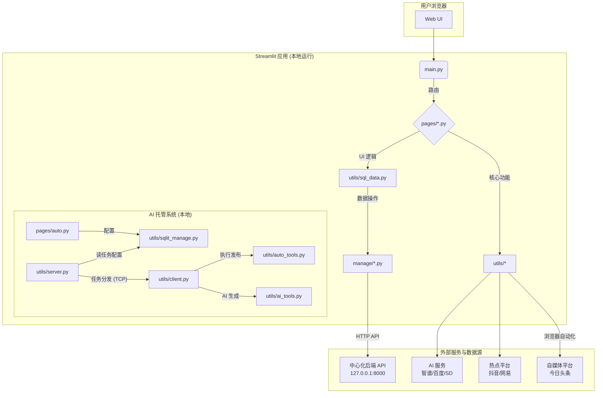
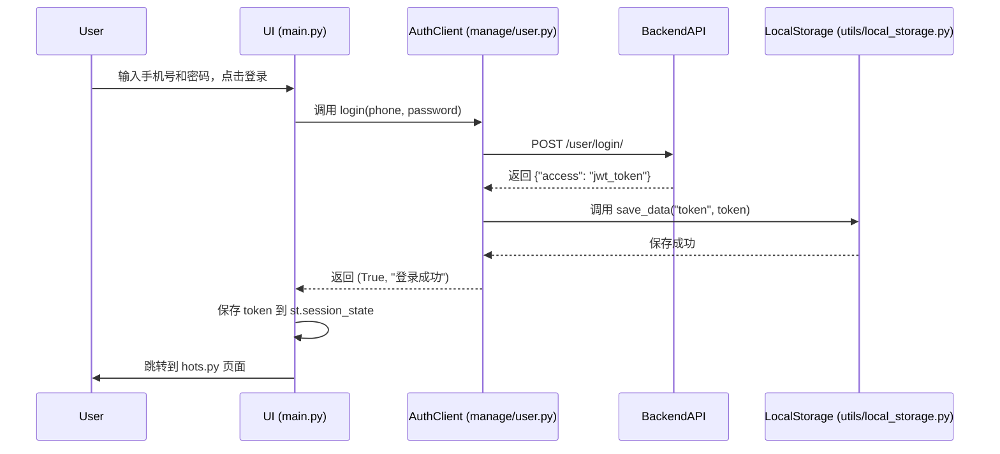
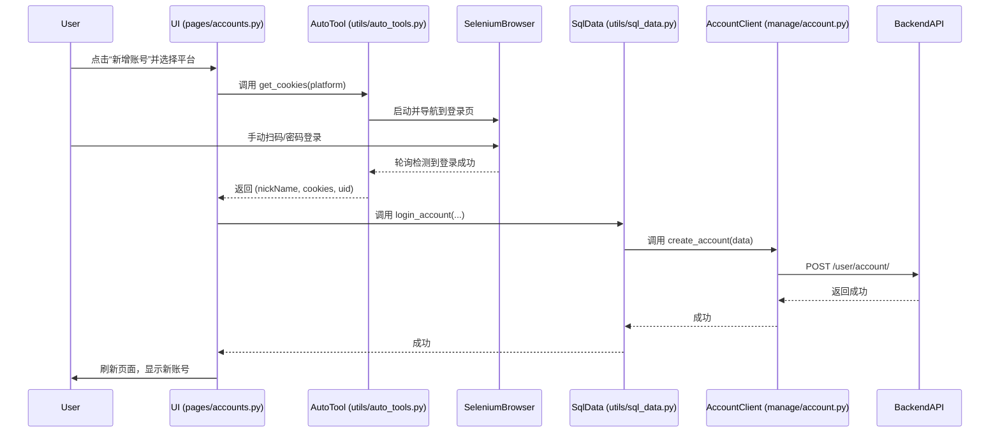
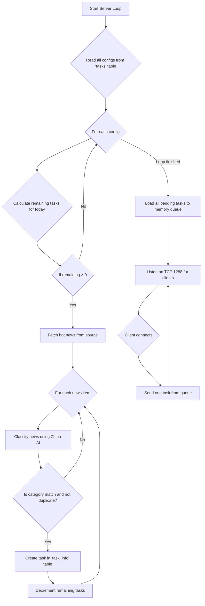
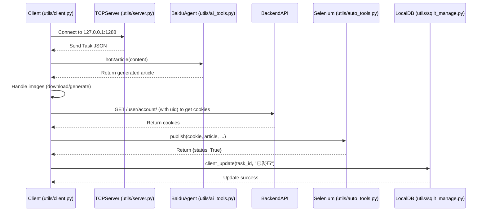

# AIMedia 项目代码分析报告**

### **目录**

1.  [**项目概览**](#1-项目概览)
    1.1. [项目目的与边界](#11-项目目的与边界)
    1.2. [顶层结构与技术栈](#12-顶层结构与技术栈)
2.  [**模块与分层**](#2-模块与分层)
    2.1. [模块清单](#21-模块清单)
    2.2. [模块依赖关系图](#22-模块依赖关系图)
3.  [**核心功能说明**](#3-核心功能说明)
    3.1. [用户认证与会话管理](#31-用户认证与会話管理)
    3.2. [自媒体账号管理](#32-自媒体账号管理)
    3.3. [热点获取与手动任务创建](#33-热点获取与手动任务创建)
    3.4. [AI 托管（自动化内容工作流）](#34-ai-托管自动化内容工作流)
4.  [**数据结构与关系**](#4-数据结构与关系)
    4.1. [后端服务数据模型（推断）](#41-后端服务数据模型推断)
    4.2. [本地 SQLite 数据模型](#42-本地-sqlite-数据模型)
5.  [**接口与集成**](#5-接口与集成)
    5.1. [内部接口](#51-内部接口)
    5.2. [外部接口与第三方服务](#52-外部接口与第三方服务)

---

### **1. 项目概览**

#### **1.1. 项目目的与边界**

根据 `README.md` 文件及代码功能推断，AIMedia 是一个旨在实现自媒体内容生产和发布全流程自动化的软件。

*   **核心目的**: 帮助用户自动抓取互联网热点，利用 AI 技术生成文章和配图，并自动将内容发布到多个主流自媒体平台。
*   **项目边界**:
    *   **输入**: 从抖音、网易新闻等平台抓取热点资讯。
    *   **处理**:
        1.  通过 AI 模型（智谱 AI、百度智能体、Stable Diffusion）将热点话题转化为文章内容。
        2.  （可选）为纯文本内容生成配图。
        3.  管理用户的多平台自媒体账号凭据 (Cookies)。
    *   **输出**: 将生成的图文内容自动发布到今日头条等平台。
    *   **用户交互**: 提供一个基于 Streamlit 的 Web UI，用于用户登录、管理账号、查看热点、配置和监控自动化任务。
    *   **部署环境**: 明确限定仅支持 Windows 操作系统。

#### **1.2. 顶层结构与技术栈**

该项目采用了复杂的 **客户端-服务器 (Client-Server) 混合架构**。

*   **顶层结构**:
    1.  **前端应用 (胖客户端)**: 一个使用 Streamlit 构建的本地 Web 应用，承担了 UI 展示、用户交互、浏览器自动化和 AI 任务执行等多种职责。
    2.  **中心化后端服务 (Central Backend)**: 前端应用通过 HTTP API 与一个**未在本代码库中提供**的后端服务进行通信（地址硬编码为 `http://127.0.0.1:8000`）。该后端负责核心的用户、账号、任务和会员权限管理。
    3.  **本地任务分发系统**: 项目内置一个基于 TCP Socket 的轻量级主从 (Master-Worker) 任务分发系统，用于“AI 托管”功能。主节点 (Server) 负责从热点源生成任务并存入本地数据库，然后分发给连接的从节点 (Client)。从节点执行具体的 AI 内容生成和发布流程。

*   **主要技术栈**:
    *   **语言/运行时**: Python 3.12.4
    *   **前端框架**: Streamlit
    *   **浏览器自动化**: Selenium
    *   **HTTP 客户端**: requests
    *   **本地数据库**: SQLite
    *   **AI 模型接口**:
        *   智谱 AI SDK (`zhipuai`)
        *   通过 HTTP POST 直接调用百度智能体 (Baidu Agent)
        *   通过 HTTP POST 调用 Stable Diffusion API (兼容 A1111 WebUI)
    *   **代码依赖管理**: `requirements.txt`
    *   **运行环境**: 仅支持 Windows，通过 `.bat` 脚本启动。

---

### **2. 模块与分层**

#### **2.1. 模块清单**

| 模块名称              | 路径           | 职责                                                         | 对外接口                                          | 向内依赖                                     |
| :-------------------- | :------------- | :----------------------------------------------------------- | :------------------------------------------------ | :------------------------------------------- |
| **Streamlit UI 配置** | `/.streamlit/` | 配置应用的页面导航、主题等。                                 | 无                                                | `main.py`, `pages/*`                         |
| **主应用入口**        | `/main.py`     | Streamlit 应用的启动入口，负责处理用户登录、注册的 UI 逻辑和页面路由。 | Web UI                                            | `manage/user`, `utils/auth`                  |
| **UI 页面**           | `/pages/`      | 包含各个功能页面的 UI 和交互逻辑，如账号管理、任务中心、AI 托管配置等。 | Web UI                                            | `manage/*`, `utils/*`                        |
| **后端 API 客户端**   | `/manage/`     | 封装了对中心化后端服务 (`127.0.0.1:8000`) 的所有 HTTP API 请求。 | `get_account_list`, `create_task_`, `login`, etc. | `requests`, `streamlit` (session state)      |
| **核心工具与逻辑**    | `/utils/`      | 项目的核心功能实现，包括浏览器自动化、AI 工具调用、数据获取、本地数据库管理和任务分发系统。 | 各工具类和函数                                    | `selenium`, `zhipuai`, `sqlite3`, `requests` |
| **应用配置**          | `/config.py`   | 定义了所有第三方服务的 API Key、URL 和其他应用级配置。       | 全局配置变量                                      |                                              |
| **启动与更新脚本**    | `*.bat`        | 提供在 Windows 环境下更新依赖、清理环境和启动应用的便捷脚本。 | 命令行                                            | `git`, `pip`, `streamlit`                    |

#### **2.2. 模块依赖关系图**



---

### **3. 核心功能说明**

#### **3.1. 用户认证与会话管理**

*   **业务目标**: 保护应用访问，识别用户身份，并维持会话状态。
*   **输入**: 用户手机号、密码。
*   **输出**: JWT (JSON Web Token) 访问令牌，存储于浏览器 Local Storage。
*   **状态变化**:
    *   `st.session_state`: `token` 键被赋值。
    *   浏览器 Local Storage: `token` 键被赋值。
    *   页面状态: 从登录/注册页 (`main.py`) 跳转到功能页 (`pages/hots.py`)。

##### **流程图**



##### **详细流程**

1.  **UI 渲染与交互 (`main.py`)**:
    *   应用启动时，`main.py` 检查 `utils.auth.is_login()` 的返回值。
    *   若未登录，根据 `st.session_state.page` 渲染 `login_page()` 或 `register_page()`。
    *   用户输入凭据后点击 "登录" 按钮。
2.  **API 请求 (`manage/user.py`)**:
    *   UI 调用 `login(phone, password)`。
    *   **函数定义**: `def login(phone, password)`
    *   **逻辑**:
        a.  实例化 `manage.common.BaseRequest`。
        b.  调用 `base_request.post("user/login/", json={"phone": phone, "password": password})`。
        *   **接口**: `POST http://127.0.0.1:8000/user/login/`
        *   **请求体**: `{"phone": "string", "password": "string"}`
3.  **响应处理与令牌持久化**:
    *   后端服务（未知/待确认）验证凭据，成功则返回包含 `access` 令牌的 JSON。
    *   **响应体 (成功)**: `{"access": "jwt_token_string", ...}`
    *   `login` 函数检查响应中是否存在 `access` 键。
    *   若存在，调用 `utils.local_storage.save_data("token", access)`。
        *   **函数定义**: `def save_data(key, value)`
        *   **逻辑**: 内部调用 `LocalStorage().setItem(key, value)`，将令牌写入浏览器 Local Storage。
4.  **会话状态建立与页面跳转 (`main.py`)**:
    *   `login` 函数返回 `(True, "登录成功")`。
    *   UI 收到成功信号，将 `token` 存入 `st.session_state.token`，这使得 `BaseRequest` 类可以在当前会话中为后续所有 API 请求添加认证头。
    *   调用 `st.switch_page("pages/hots.py")` 实现页面跳转。

*   **边界条件**:
    *   **密码错误**: 后端返回错误信息，`login` 函数返回 `(False, response_json)`，UI 在页面上显示错误。
    *   **未登录访问**: 各页面顶部的 `is_login()` 检查会捕获未认证访问，并强制跳转回登录页。

#### **3.2. 自媒体账号管理**

*   **业务目标**: 允许用户通过扫码登录的方式，安全地将其在不同自媒体平台的账号凭据 (Cookies) 添加到系统中，并进行管理。
*   **输入**: 用户选择的目标平台（如 "头条号"）。
*   **输出**: 加密的账号凭据（Cookies、昵称、UID）被持久化到中心化后端服务。
*   **状态变化**:
    *   **前端**: 浏览器中会短暂存在一个由 Selenium 控制的独立 Chrome 实例。
    *   **后端数据库**: `Account` 表中新增一条记录。

##### **流程图**



##### **详细流程**

1. **UI 交互 (`pages/accounts.py`)**:

   *   用户点击“新增账号”，选择平台（如 "头条号"），点击“确定”。

2. **启动隔离浏览器 (`utils/auto_tools.py`)**:

   *   调用 `AutoTools().get_cookies(platform)`。
   *   **函数定义**: `def get_cookies(self, platform)`
   *   **逻辑**:
       a.  通过 `self.get_driver()` 创建一个全新的、独立的 Selenium WebDriver 实例。该实例通过配置 `excludeSwitches: ["enable-automation"]` 和 `Page.addScriptToEvaluateOnNewDocument` 来隐藏自动化特征。
       b.  浏览器导航到 `self.platform_url[platform]`（例如 `https://mp.toutiao.com/auth/page/login`）。

3. **用户手动登录**: 用户在弹出的浏览器窗口中，使用手机扫码或账号密码完成登录。

4. **凭据抓取与轮询**:

   *   `get_cookies` 方法进入一个 `while True` 循环，每秒尝试从页面中提取登录成功后的信息。
   *   **成功标识**: 通过 `driver.find_element("class name", "auth-avator-name")` 查找特定元素。
   *   **数据提取**:
       *   **`nickName`**: `.text` 属性。
       *   **`cookies`**: `driver.get_cookies()`，返回一个包含多个字典的列表。
       *   **`uid`**: 通过模拟点击“设置”链接，然后从新页面的特定 XPath 提取文本并清洗。
   *   循环直到所有信息都获取成功后 `break`。

5. **数据封装与持久化 (`utils/sql_data.py`)**:

   * `get_cookies` 返回 `(nickName, cookies, uid)`。

   * `pages/accounts.py` 调用 `login_account(nickName, cookies, uid, platform)`。

   * **函数定义**: `def login_account(nickName, cookies, uid, platform)`

   * **逻辑**:
     a.  计算一个15天后的 `expiry_time`。
     b.  构造一个字典 `data`。

     * **`data` 结构**:

       ```python
       {
           "nickname": nickName, # "张三"
           "uid": uid, # "123456789"
           "cookie": cookies, # [{"name": "sessionid", "value": "..."}, ...]
           "platform": platform, # "头条号"
           "expiry_time": "2025-10-14 10:00:00",
           "classify": "全部"
       }
       ```

6. **提交至后端 (`manage/account.py`)**:

   *   `login_account` 调用 `create_account(data)`。
   *   **函数定义**: `def create_account(data)`
   *   **逻辑**:
       a.  实例化 `BaseRequest`（此时已包含认证 `token`）。
       b.  调用 `base_request.post("user/account/", json=data)`。
       *   **接口**: `POST http://127.0.0.1:8000/user/account/`
       *   **请求体**: 上述 `data` 字典。

*   **边界条件**:
    *   **登录超时**: 如果用户长时间未登录，`get_cookies` 的循环不会退出。**未知/待确认**: 代码中没有明确的超时中断逻辑。
    *   **平台 UI 变更**: 抓取 `nickName` 和 `uid` 的 class name 或 XPath 是硬编码的，如果平台前端更新，抓取会失败。

#### **3.3. 热点获取与手动任务创建**

*   **业务目标**: 向用户展示最新的互联网热点，并允许用户基于这些热点手动创建内容发布任务。
*   **输入**: 用户选择的热点平台（抖音/网易）、热点分类。
*   **输出**: 一个新的“手动任务”记录被创建并存储在后端数据库。
*   **状态变化**:
    *   **后端数据库**: `Task` 表中新增一条记录，初始状态为 "已配置"。

##### **详细流程**

1. **获取抖音密钥 (`pages/hots.py`)**:

   *   对于抖音热点，首次使用时需要获取 `sessionid_douhot`。
   *   用户点击“点击扫码”，触发 `get_scrt_douyin()`，其内部逻辑与添加账号类似，但只为获取和保存 `sessionid` 到 Local Storage。

2. **获取热点数据 (`utils/get_hot_data.py`)**:

   * UI 调用 `hot_data(category, page, sessionid)`。

   * **函数定义**: `def hot_data(category, page, sessionid)`

   * **逻辑**: 构造 `GET` 请求，携带从 Local Storage 读取的 `sessionid` 作为 `Cookie`，以及日期、分页和分类参数，请求抖音热点宝 API。

   * **返回数据 (单项)**:

     ```json
     {
       "sentence": "热点事件标题",
       "sentence_id": "热点ID",
       "sentence_tag_name": "分类标签",
       "hot_score": "热力值 (万)",
       "video_count": 100
     }
     ```

3. **UI 配置与账号选择 (`pages/hots.py`)**:

   *   热点列表展示后，用户点击“配置”，触发 `vote()` 对话框。
   *   对话框内调用 `manage.account.get_account_list()`，从后端获取并展示用户的所有账号。

4. **创建任务 API 调用 (`utils/sql_data.py`)**:

   *   用户选择账号并确定后，调用 `create_task(classify, content, selected_account, img_list)`。
   *   **函数定义**: `def create_task(classify, content, selected_account, img_list)`
   *   **逻辑**:
       a.  **幂等性检查**: 调用 `get_task_list(params={"task_opt": content})` 查询后端是否已存在相同内容的任务。
       b.  **构造请求体**: 如果是新任务，则构造一个字典。
           *   **`task_data` 结构**:
               ```python
               {
                 "account": selected_account["id"], # 后端数据库中的账号主键 ID
                 "nickname": selected_account["nickname"],
                 "uid": selected_account["uid"],
                 "platform": selected_account["platform"],
                 "classify": classify,
                 "status": "已配置",
                 "task_opt": content,
                 "img_list": json.dumps(img_list) # 通常为空列表 "[]"
               }
               ```
       c.  **发送请求**: 调用 `manage.task.create_task_(task_data)`，向 `/task/tasks/` 端点发送 `POST` 请求。

*   **边界条件**:
    *   **重复配置**: 如果用户对同一个热点重复点击配置，幂等性检查会阻止创建重复任务，`create_task` 返回 `False`。

#### **3.4. AI 托管（自动化内容工作流）**

此功能是项目的核心，通过本地主从架构实现全自动内容生产与发布。

##### **子功能: 服务端 (任务生成)**

*   **业务目标**: 扫描热点源，根据用户配置自动筛选并生成待执行的任务，放入队列等待客户端处理。
*   **输入**: 本地 `tasks` 表中的配置。
*   **输出**: 待执行的任务被写入本地 `task_info` 表，并加载到内存任务队列。
*   **状态变化**: `task_info` 表中新增记录，`Service.queue` 中增加任务。

###### **流程图**



##### **子功能: 客户端 (任务执行)**

*   **业务目标**: 从服务端接收任务，并执行完整的内容生成与发布流程，最后更新任务状态。
*   **输入**: 服务端通过 TCP 发送的任务 JSON 数据。
*   **输出**: 内容被发布到目标平台，本地任务状态被更新为“已发布”。
*   **状态变化**: 目标自媒体平台新增一篇文章，本地 `task_info` 表中对应任务的 `status` 和 `publish_time` 被更新。

###### **流程图**



##### **详细流程**

**阶段一: 配置 (`pages/auto.py`, `utils/sqlit_manage.py`)**

1.  **用户操作**: 用户在 `pages/auto.py` UI 界面为每个账号设置“账号分类”和“发文周期”。
2.  **数据持久化**: 点击“确认”后，调用 `utils.sqlit_manage.create_task(...)`，执行 `INSERT OR REPLACE` SQL 命令，将配置写入本地 `tasks` 表，并删除该 `uid` 在 `task_info` 表中的旧任务。

**阶段二: 服务端 - 任务生成 (`utils/server.py`)**

1. **启动**: 用户点击“开启服务”，通过 `subprocess` 在新窗口中启动 `server.py`。

2. **读取配置**: `server.py` 的主循环首先调用 `get_all_data()` 从 `tasks` 表读取所有配置。

3. **计算任务配额**: 对每个配置，调用 `get_publish_num_today(uid)` 查询 `task_info` 表，计算当天还需生成的任务数。

4. **获取与筛选热点**:
   a.  调用热点源函数（如 `wangyi(page_idx)`）获取新闻列表。
   b.  对每条新闻，调用 `title_clas(item['article_info'])`，使用智谱 AI 进行分类。
   c.  调用 `is_repeat(item['article_info'])` 检查 `task_info` 表中是否存在相同内容，防止重复生产。

5. **创建本地任务**: 如果分类匹配且内容不重复，则调用 `create_task_info(...)`。

   * **函数定义**: `def create_task_info(uid, task_id, content, img_url_list, platform)`

   * **逻辑**: 在 `task_info` 表中插入一条新记录。

   * **`task_info` 数据项 (示例)**:

     ```
     uid: "123456", platform: "头条号", task_id: "123456_...",
     content: "网易新闻原文...", img_url_list: "[\"url1\", \"url2\"]",
     status: "已配置", publish_time: "2023-01-01 00:00:00", create_date: "..."
     ```

6. **任务入队与分发**:
   a.  调用 `load_tasks_to_queue()` 从 `task_info` 表加载所有符合条件的待办任务到内存队列。
   b.  启动 TCP Server 在 `127.0.0.1:1288` 监听，等待客户端连接并分发任务 JSON。

**阶段三: 客户端 - 任务执行 (`utils/client.py`)**

1.  **启动**: 用户点击“启动托管”，`client.py` 启动，并通过 `os.environ.get('token')` 获取认证令牌。
2.  **接收任务**: `client.py` 连接到 TCP Server，接收任务数据 JSON。
3.  **内容生成**:
    *   调用 `utils.ai_tools.hot2article(...)`，向百度智能体 API 发送 `POST` 请求，生成文章。
    *   调用 `self.save_image_from_url(...)`，下载/生成并处理图片。
4.  **获取发布凭据**:
    *   客户端使用 `token` 向中心化后端 `/user/account/` 发送带 `uid` 参数的 `GET` 请求，获取最新的 Cookie。
5.  **自动化发布 (`utils/auto_tools.py`)**:
    *   调用 `AutoTools().publish(cookie, article, platform, imgs_path)`。
    *   **核心逻辑**: 启动一个独立的、带远程调试端口的 Chrome 浏览器；连接该浏览器；加载 Cookie 以恢复登录状态；通过 Selenium 模拟所有 UI 操作完成发布。
6.  **状态更新 (`utils/sqlit_manage.py`)**:
    *   发布成功后，调用 `client_update(task_id, "已发布")`。
    *   **逻辑**: 执行 `UPDATE task_info SET status = '已发布', publish_time = '...' WHERE task_id = '...'`，更新任务状态和发布时间。

---

### **4. 数据结构与关系**

#### **4.1. 后端服务数据模型（推断）**

以下是根据 `/manage` 目录下的 API 客户端代码推断出的后端数据库模型。

*   **User (用户表)**
    *   `id` (PK, int)
    *   `phone` (varchar, unique)
    *   `password` (varchar, hashed)
    *   `level` (int, default: 0) - 会员等级
    *   `expiry_time` (datetime) - 会员到期时间

*   **Account (自媒体账号表)**
    *   `id` (PK, int)
    *   `user_id` (FK -> User.id)
    *   `nickname` (varchar)
    *   `uid` (varchar)
    *   `platform` (varchar) - 如 "头条号"
    *   `cookie` (text, JSON)
    *   `expiry_time` (datetime) - Cookie 预计过期时间
    *   `classify` (varchar)

*   **Task (手动任务表)**
    *   `id` (PK, int)
    *   `account_id` (FK -> Account.id)
    *   `status` (varchar) - "已配置", "已生产", "已发布"
    *   `task_opt` (text) - 热点原文
    *   `classify` (varchar)
    *   `img_list` (text, JSON)
    *   `created_time` (datetime)

*   **TaskInfo (手动任务详情表)**
    *   `id` (PK, int)
    *   `task_id` (FK -> Task.id)
    *   `content` (longtext) - AI 生成的文章
    *   ... (其他字段未知/待确认)

#### **4.2. 本地 SQLite 数据模型**

定义于 `utils/sqlit_manage.py`，数据库文件为 `article_task.db`。

*   **tasks (AI 托管配置表)**
    *   `nickname` (TEXT)
    *   `uid` (TEXT, PRIMARY KEY) - 账号 UID
    *   `classify` (TEXT NOT NULL) - 期望发布的内容分类
    *   `platform` (TEXT NOT NULL)
    *   `task_num` (INTEGER NOT NULL) - 每日期望发布数量
    *   `status` (BOOLEAN, DEFAULT: FALSE) - **未知/待确认**，该字段在代码中未见使用。
    *   `create_date` (DATETIME, DEFAULT: CURRENT_TIMESTAMP)

*   **task_info (AI 托管任务详情表)**
    *   `uid` (TEXT NOT NULL) - **逻辑外键**, 关联到 `tasks.uid`
    *   `platform` (TEXT NOT NULL)
    *   `task_id` (TEXT, PRIMARY KEY) - 格式如 `uid_nickname_random8`
    *   `content` (TEXT NOT NULL) - 原始热点内容
    *   `img_url_list` (TEXT NOT NULL) - JSON 字符串格式的图片 URL 列表
    *   `status` (TEXT NOT NULL) - "已配置", "已发布"
    *   `publish_time` (DATETIME, DEFAULT: '2024-01-01 00:00:00') - 上次成功发布时间，用于计算1小时发布间隔。
    *   `create_date` (DATETIME, DEFAULT: CURRENT_TIMESTAMP)

---

### **5. 接口与集成**

#### **5.1. 内部接口**

##### **5.1.1. 中心化后端 REST API (位于 `127.0.0.1:8000`)**

| 路径                  | 方法   | 鉴权   | 描述                   | 主要请求/响应体（推断）                                      |
| :-------------------- | :----- | :----- | :--------------------- | :----------------------------------------------------------- |
| `/user/register/`     | POST   | 无     | 用户注册               | **Req**: `{"phone", "password", "password2"}` <br> **Res**: `{"access": "token"}` |
| `/user/login/`        | POST   | 无     | 用户登录               | **Req**: `{"phone", "password"}` <br> **Res**: `{"access": "token"}` |
| `/user/user/`         | GET    | Bearer | 获取当前用户信息       | **Res**: `[{"phone", "level", "expiry_time"}]`               |
| `/user/check_member/` | GET    | Bearer | 检查会员状态           | **Res**: `{"result": bool, "message": str}`                  |
| `/user/use_code/`     | POST   | Bearer | 使用激活码             | **Req**: `{"code": "string"}`                                |
| `/user/account/`      | GET    | Bearer | 获取用户绑定的账号列表 | **Res**: `[Account Object]`                                  |
| `/user/account/`      | POST   | Bearer | 新增一个自媒体账号     | **Req**: `Account Object`                                    |
| `/user/account/{id}/` | DELETE | Bearer | 删除一个自媒体账号     |                                                              |
| `/task/tasks/`        | GET    | Bearer | 获取手动任务列表       | **Query**: `created_time__date`, `status_not`                |
| `/task/tasks/`        | POST   | Bearer | 创建一个手动任务       | **Req**: `Task Object`                                       |
| `/task/tasks/{id}/`   | PATCH  | Bearer | 更新任务状态           | **Req**: `{"status": "new_status"}`                          |
| `/task/tasks/{id}/`   | DELETE | Bearer | 删除一个手动任务       |                                                              |

##### **5.1.2. 本地任务分发 TCP 接口 (位于 `127.0.0.1:1288`)**

* **协议**: 纯 TCP Socket

* **流程**:

  1.  客户端 (`utils/client.py`) 连接到服务端 (`utils/server.py`)。
  2.  服务端从任务队列中取出一个任务，将其序列化为 JSON 字符串，编码为 UTF-8，然后发送给客户端。
  3.  服务端立即关闭连接。

* **数据结构 (示例)**:

  ```json
  {
    "status": true,
    "message": "success",
    "data": {
      "uid": "123456",
      "platform": "头条号",
      "task_id": "123456_test_user_..._87654321",
      "content": "这里是热点新闻的原文...",
      "img_url_list": "[\"http://example.com/img1.jpg\"]",
      "status": "已配置",
      "publish_time": "2024-01-01 00:00:00",
      "create_date": "..."
    }
  }
  ```

  如果无任务，`status` 为 `false`，`data` 字段不存在。

#### **5.2. 外部接口与第三方服务**

| 服务/平台              | 调用点                         | 配置参数/方式                                                | 用途                                                         |
| :--------------------- | :----------------------------- | :----------------------------------------------------------- | :----------------------------------------------------------- |
| **智谱 AI**            | `utils/ai_tools.title_clas`    | `config.py: zhipu_aip_key`                                   | 对热点内容进行分类，以匹配用户配置。                         |
| **百度智能体 (Agent)** | `utils/ai_tools.hot2article`   | 硬编码 URL 和 AppId                                          | 根据热点话题生成完整的文章。                                 |
| **百度智能体 (Agent)** | `utils/ai_tools.del_watermark` | 硬编码 URL 和 AppId                                          | 移除图片水印。                                               |
| **Stable Diffusion**   | `utils/text_to_image.py`       | `config.py: enable`, `sd_url`, `firstphase_width`, `firstphase_height`, `negative_prompt` | 当文章缺少配图时，根据内容生成图片。                         |
| **阿里云翻译**         | `utils/translation.py`         | `config.py: access_key`, `secret`, `language`                | **未知/待确认**，代码中存在翻译功能，但在主要业务流程中未见明显调用点。 |
| **抖音热点宝**         | `utils/get_hot_data.py`        | 硬编码 URL                                                   | 抓取抖音平台的热点新闻。                                     |
| **网易新闻**           | `utils/get_hot_data.py`        | 硬编码 URL                                                   | 抓取网易新闻的要闻。                                         |
| **今日头条**           | `utils/auto_tools.py`          | 硬编码 URL                                                   | 通过 Selenium 自动化发布图文内容。                           |