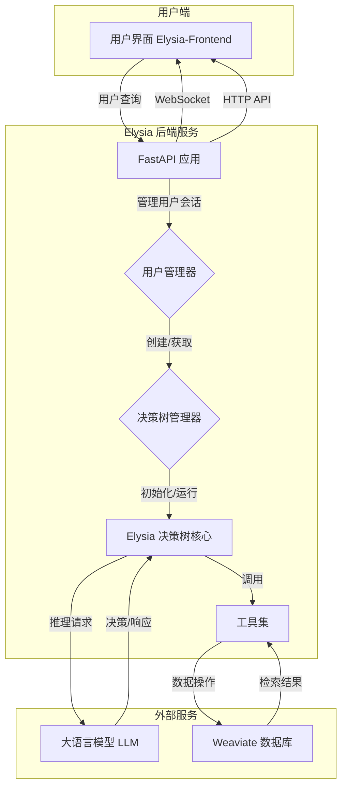
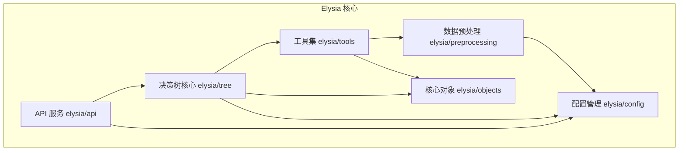
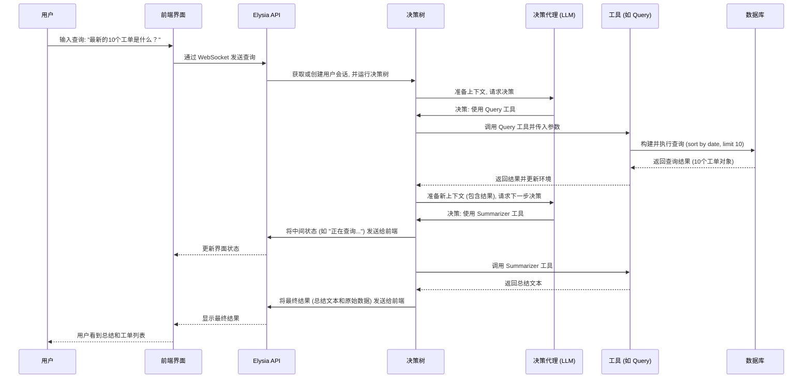
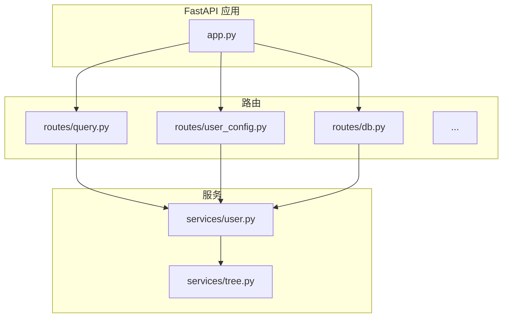
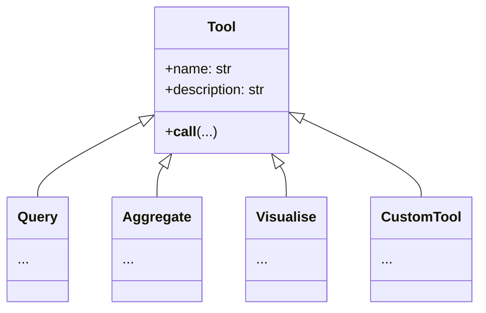
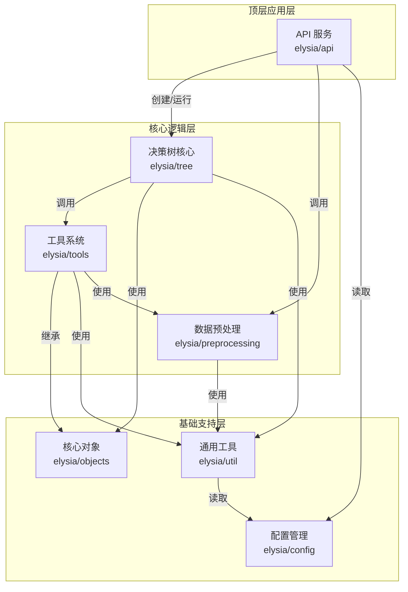

# Elysia项目概述

Elysia 是一个开源的、基于代理（Agent）的智能平台，其核心设计理念是通过一个动态决策树来驱动工具的使用。与传统的基于固定逻辑或链式调用的代理不同，Elysia 的决策代理能够根据当前的环境、上下文信息以及用户输入，动态地选择并执行最合适的工具。这种设计赋予了 Elysia 极高的灵活性和可扩展性，使其不仅能执行简单任务，还能处理需要多步骤、多工具协作的复杂工作流。

项目的核心用途是作为连接语言模型与外部数据和服务的桥梁，特别是与 Weaviate 向量数据库的深度集成。Elysia 提供了一套预置的工具，专门用于检索、聚合和分析存储在 Weaviate 集群中的数据。这使得开发者可以快速构建能够与自有数据进行智能对话的应用，例如智能知识库问答、数据分析助手或自动化报告生成器。

主要功能包括：
1.  **动态决策树**：项目的灵魂所在。它由一个语言模型驱动的决策代理控制，该代理在每一步都会评估当前状态（包括对话历史、已检索数据等），然后从可用的工具或子分支中选择下一步行动。
2.  **可扩展的工具系统**：Elysia 允许开发者轻松创建和集成自定义工具。通过简单的 `Tool` 类继承或 `@tool` 装饰器，任何 Python 函数都可以被封装成一个可供代理调用的工具，无论是调用内部 API、执行数据计算还是与其他第三方服务交互。
3.  **深度 Weaviate 集成**：项目内置了强大的 `Query` 和 `Aggregate` 工具，能够将自然语言查询智能地转换为 Weaviate 的复杂查询语句，包括过滤、排序和聚合操作。
4.  **环境与状态管理**：Elysia 维护一个“环境（Environment）”状态，用于存储工具执行过程中检索到的所有数据和元数据。这个环境对整个决策树可见，使得后续的工具调用可以利用之前步骤的结果，实现了上下文感知和多步推理。
5.  **数据预处理**：为了让语言模型能“理解”用户的数据库结构，Elysia 提供了一个预处理模块。它可以分析 Weaviate 集合的模式（Schema），并生成描述性元数据，从而帮助代理更准确地构建查询。

该项目主要面向需要构建复杂、数据驱动型 AI 应用的开发者。它解决了从零开始构建智能代理时面临的诸多挑战，如状态管理复杂、工具调用逻辑僵化、与数据库交互困难等。通过提供一个结构化、可定制的框架，Elysia 大大降低了开发门槛，让开发者能更专注于业务逻辑和工具功能的实现，而非底层的代理编排。

## 技术栈

*   **编程语言**:
    *   Python

*   **框架与库**:
    *   **FastAPI**: 用于构建高性能的 Web API，提供与前端交互的接口。
    *   **dspy-ai**: 一个强大的语言模型编程框架，用于构建和优化与大语言模型（LLM）的交互逻辑，是决策代理的核心。
    *   **Weaviate-client**:官方的 Weaviate 数据库 Python 客户端，用于数据检索和管理。
    *   **LiteLLM**: 一个用于统一调用 OpenAI、Anthropic、Google Gemini 等多种大语言模型 API 的中间层。
    *   **Pydantic**: 用于 API 和内部对象的数据验证和模型定义。
    *   **uvicorn**: ASGI 服务器，用于运行 FastAPI 应用。
    *   **spaCy**: 用于自然语言处理（NLP），如命名实体识别（NER）。
    *   **APScheduler**: 用于在 API 服务中执行定时任务，例如清理超时的用户会话。

*   **构建与工具**:
    *   **Hatchling**: Python 项目的构建后端。
    *   **Pytest**: 用于编写和执行单元测试及集成测试。
    *   **MkDocs**: 用于生成项目文档，使用了 `mkdocs-material` 主题。
    *   **GitHub Actions**: 用于实现持续集成和持续部署（CI/CD），自动化测试、文档发布和 PyPI 包发布。

*   **主要外部依赖**:
    *   **Weaviate**: 核心依赖的向量数据库，用于存储和检索数据。
    *   **大语言模型 (LLMs)**: 项目通过 LiteLLM 支持多种外部 LLM 服务，如 OpenAI、Google Gemini、Anthropic 等，是决策智能的来源。

## 可视化图表

#### 系统架构图



#### 模块依赖图



#### 关键调用流程图 (用户查询)



## 模块解析

Elysia 的代码结构清晰，可以划分为以下几个核心模块：

### 1. API 服务 (API Service)

*   **模块名称**: `APIService`
*   **核心职责**: 作为项目的前端网关，负责处理所有外部请求。它使用 FastAPI 构建 Web 服务，通过 WebSocket 与前端进行实时、双向的通信。该模块还负责管理用户会话、决策树实例的生命周期以及配置的加载与保存。
*   **关键文件/组件/功能**:
    *   `elysia/api/app.py`: FastAPI 应用的入口和主配置，包括中间件、路由注册和定时任务（如清理超时会话）。
    *   `elysia/api/routes/`: 定义了所有 API 端点，如 `query.py` (处理 WebSocket 查询)、`user_config.py` (管理用户配置) 和 `db.py` (保存/加载决策树)。
    *   `elysia/api/services/user.py`: 包含 `UserManager`，这是一个关键的单例类，用于在内存中管理所有活跃的用户及其关联的决策树管理器，是实现多用户会话隔离的核心。
    *   `elysia/api/services/tree.py`: 包含 `TreeManager`，负责管理单个用户的所有对话（即决策树实例），处理树的创建、获取和销毁。
*   **交互逻辑**: 当一个新用户连接时，`UserManager` 会为其创建一个会话。当用户发起一个查询时，`query` 路由会通过 `UserManager` 找到对应的 `TreeManager`，再由后者找到或创建一个 `Tree` 实例来处理该查询。整个处理过程中的所有中间状态和最终结果都通过 WebSocket 流式返回给前端。

### 2. 决策树核心 (Decision Tree Core)

*   **模块名称**: `DecisionTreeCore`
*   **核心职责**: 这是 Elysia 代理的“大脑”，负责执行动态的决策流程。它编排了语言模型、工具和内部状态之间的交互，以完成用户指定的任务。
*   **关键文件/组件/功能**:
    *   `elysia/tree/tree.py`: 定义了 `Tree` 类，这是整个代理的执行引擎。它包含了运行决策循环 (`run` 和 `async_run` 方法)、管理工具和分支、维护状态的核心逻辑。
    *   `elysia/tree/objects.py`: 定义了核心数据结构，如 `TreeData` (包含了代理决策所需的所有信息，如对话历史、环境、代理人设等) 和 `Environment` (用于存储工具执行的结果)。
    *   `elysia/util/elysia_chain_of_thought.py`: 一个 `dspy` 的增强版模块，用于执行带有“不可能”判断和理由生成的思维链推理，是决策代理选择工具的基础。
*   **交互逻辑**: `Tree.run()` 方法启动一个循环。在每次循环中，它会收集当前的 `TreeData`，并将其传递给一个由 `dspy` 驱动的决策节点。该节点向大语言模型发起请求，询问下一步应该调用哪个工具以及使用什么参数。获取决策后，`Tree` 实例会执行相应的工具。工具的执行结果（数据、文本或错误）会更新 `TreeData` 中的 `Environment` 和任务历史。这个循环会一直持续，直到满足结束条件（如任务完成或无法继续）。

### 3. 工具集 (Tooling System)

*   **模块名称**: `ToolingSystem`
*   **核心职责**: 定义了代理可以执行的所有具体“动作”。Elysia 提供了一套丰富的内置工具，并允许开发者方便地扩展自定义工具。
*   **关键文件/组件/功能**:
    *   `elysia/objects.py`: 定义了 `Tool` 基类和 `@tool` 装饰器。所有工具都必须继承自 `Tool` 类，或者使用 `@tool` 装饰器进行封装。这提供了一个统一的接口，包含了工具的名称、描述、输入参数等元数据。
    *   `elysia/tools/retrieval/`: 包含了与 Weaviate 交互的工具。`query.py` 实现了将自然语言转换为结构化查询的 `Query` 工具；`aggregate.py` 实现了 `Aggregate` 工具，用于执行聚合操作。
    *   `elysia/tools/text/`: 包含文本处理工具，如 `Summarizer` (总结文本) 和 `TextResponse` (生成直接的文本回复)。
    *   `elysia/tools/visualisation/`: 包含数据可视化工具，如 `Visualise`，可以将环境中的数据生成图表。
*   **交互逻辑**: 决策代理根据工具的描述 (`description`) 来选择使用哪个工具。一旦选定，`Tree` 核心会调用该工具的 `__call__` 方法，并将决策代理生成的参数传递给它。工具执行后，会 `yield` 一个或多个结果对象（如 `Result`, `Response`, `Error`），这些对象会被 `Tree` 核心捕获并用于更新状态和向用户反馈。

### 4. 数据预处理 (Data Preprocessing)

*   **模块名称**: `DataPreprocessor`
*   **核心职责**: 解决语言模型不了解特定数据库结构的问题。该模块通过分析 Weaviate 集合的模式，生成易于模型理解的元数据，从而使代理能够准确地针对用户数据构建查询。
*   **关键文件/组件/功能**:
    *   `elysia/preprocessing/collection.py`: 包含了 `preprocess` 和 `preprocess_async` 函数。这些函数是该模块的核心。
*   **交互逻辑**: 在 Elysia 首次访问一个新的 Weaviate 集合之前，开发者会调用 `preprocess` 函数。该函数会连接到 Weaviate，读取集合的属性、数据类型和关系。然后，它可能会利用 LLM 为每个字段生成更自然的描述。处理后的元数据（如字段描述、可用过滤器等）被存储起来，当用户查询该集合时，这些元数据会作为上下文信息提供给决策代理，帮助其生成正确的查询参数。

## 各个模块内文件/组件/功能关系图

#### API 服务模块



#### 决策树核心模块

```mermaid
graph TD
    Tree[Tree 类<br>elysia/tree/tree.py]
    TreeData[TreeData 对象<br>elysia/tree/objects.py]
    Environment[Environment<br>elysia/tree/objects.py]
    Atlas[Atlas (人设)<br>elysia/tree/objects.py]
    DecisionNode[决策节点 (dspy 模块)]
    LLM[大语言模型]

    Tree -- 包含 --> TreeData
    Tree -- 运行 --> DecisionNode
    TreeData -- 包含 --> Environment
    TreeData -- 包含 --> Atlas
    DecisionNode -- 使用 --> TreeData
    DecisionNode -- 调用 --> LLM
    LLM -- 返回决策 --> DecisionNode
```

#### 工具集模块



## 典型应用场景

假设一家电商公司使用 Weaviate 存储其产品信息，集合名为 `Ecommerce`，包含 `productName`, `price`, `category`, `description` 等字段。他们希望构建一个智能客服，帮助运营人员快速查询和分析产品数据。

**场景：运营人员想了解“价格最高的10件时尚类商品是什么，并总结它们的特点。”**

1.  **用户输入**: 运营人员在 Elysia 的前端界面输入：“找出 `Ecommerce` 集合里 `category` 是 'fashion' 且价格最高的10件商品，并给我一个总结。”

2.  **启动决策树**:
    *   Elysia API 接收到请求，启动一个 `Tree` 实例。
    *   `Tree` 将用户的请求和 `Ecommerce` 集合的元数据（经过预处理）打包成 `TreeData`。

3.  **第一步决策：数据检索**:
    *   决策代理 (LLM) 分析输入和上下文，识别出核心意图是“查询数据”。
    *   它查看可用工具，发现 `Query` 工具的描述（“从 Weaviate 集合中检索数据，支持过滤和排序”）与意图最匹配。
    *   代理进一步生成调用 `Query` 工具所需的参数：
        *   `collection_name`: "Ecommerce"
        *   `filters`: 一个基于 `category` 等于 'fashion' 的过滤器对象。
        *   `sort`: 按 `price` 字段降序排列。
        *   `limit`: 10

4.  **执行查询工具**:
    *   `Tree` 调用 `Query` 工具。
    *   `Query` 工具将这些参数翻译成 Weaviate Python 客户端的查询语句，并向 Weaviate 数据库发送请求。
    *   Weaviate 返回价格最高的10件时尚商品的详细信息。
    *   `Query` 工具将这些商品对象封装成一个 `Result` 对象，并将其 `yield` 回 `Tree`。

5.  **更新环境**:
    *   `Tree` 接收到 `Result` 对象，并将其中的10个商品对象添加到 `Environment` 中。现在，决策树的后续步骤可以访问这些数据了。
    *   同时，`Tree` 向前端发送一个 `Status` 更新，例如：“已成功为您检索到10件商品。”

6.  **第二步决策：数据总结**:
    *   `Tree` 再次调用决策代理，此时的上下文中包含了刚刚检索到的10件商品。
    *   代理分析用户的次要需求“给我一个总结”。
    *   它选择了 `CitedSummarizer` 工具，该工具擅长根据环境中的数据生成总结。

7.  **执行总结工具**:
    *   `CitedSummarizer` 工具访问 `Environment` 中的10件商品数据，并调用 LLM 生成一段总结性文字，描述这些高端时尚商品的共同特点（如品牌、材质、价格范围等）。
    *   工具返回一个 `Response` 对象，其中包含总结文本。

8.  **完成并返回**:
    *   `Tree` 接收到总结文本。决策代理判断用户的所有要求均已满足，决定结束本次运行。
    *   Elysia API 将最终的总结文本和包含10件商品详细信息的原始数据对象一起发送给前端。
    *   运营人员在界面上看到了清晰的总结，并可以展开查看每件商品的详情。

## 产品研发参考

### 作为产品经理

*   **应借鉴的设计和思路**:
    1.  **“代理即平台” (Agent as a Platform) 的产品思路**: Elysia 最出色的产品设计是它不仅仅是一个单一功能的代理，而是一个可扩展的平台。它将核心的“决策能力”与具体的“执行能力”（工具）解耦。这使得产品可以作为一个基础框架，快速适应不同行业和场景的需求，极大地增强了产品的生命力和市场广度。
    2.  **流式交互体验**: 通过 WebSocket 实现的流式响应，让用户能实时看到代理的“思考”过程（如“正在查询数据…”、“正在为您总结…”）。这种透明化的交互方式显著提升了用户体验，减少了等待焦虑，并增强了用户对 AI 的信任感。
    3.  **配置与能力的解耦**: 项目将代理的行为（风格、目标）和核心配置（LLM 模型、API 密钥）与代码逻辑分离，允许用户通过配置界面（尽管需要前端配合）进行定制。这使得非技术用户（如业务分析师）也能在一定程度上调整代理的行为，降低了使用门槛。

*   **如何应用这些思路**:
    *   在规划新的 AI 应用时，应优先考虑平台化设计。思考哪些是应用的核心能力（如 Elysia 的决策树），哪些是可插拔的功能（如各种工具）。为这些可插拔功能设计统一的接口标准（类似 Elysia 的 `Tool` 类），并开放给内部其他团队甚至第三方开发者，构建应用生态。
    *   设计 AI 交互界面时，必须将流式响应作为核心特性。将任务分解为多个阶段，并在每个阶段完成后立即向用户反馈，即使只是简单的状态更新。这对于所有耗时较长的 AI 任务（如代码生成、报告分析）都至关重要。
    *   为产品设计一个分层的配置系统。将底层的技术配置（如模型选择）和上层的业务配置（如代理的“人设”或业务规则）分开，为不同角色的用户提供符合其技术背景的定制化选项。

### 作为技术架构师

*   **应复用的设计和技术**:
    1.  **基于 DSPy 的声明式代理逻辑**: 项目使用 `dspy` 来定义与 LLM 的交互，而不是拼接复杂的字符串提示。这种声明式的方法（定义输入/输出的 Signature）将提示工程（Prompt Engineering）转化为了更接近软件开发的模块化编程，使代码更易于维护、测试和优化。
    2.  **单例模式管理会话状态 (`UserManager`)**: 在 FastAPI 这种无状态的 Web 框架中，使用一个全局单例对象来管理有状态的用户会话（如 Elysia 的 `Tree` 实例）是一种非常有效且简洁的架构模式。它避免了使用外部缓存（如 Redis）带来的复杂性，适用于中小型规模的部署。
    3.  **异步化和上下文管理器**: 项目广泛使用 `asyncio` 来处理 I/O 密集型任务（如调用 LLM API 和数据库查询），并通过上下文管理器 (`async with`) 优雅地管理资源（如 Weaviate 客户端连接）。这确保了系统的高性能和资源的有效利用。
    4.  **数据预处理“接地气”**: 在 RAG 或数据代理应用中，`preprocessing` 模块的设计思想至关重要。它在代理运行时动态地将相关的 schema 信息注入上下文，而不是一次性将所有 schema 信息塞给 LLM。这是一种高效的“接地”（Grounding）技术，确保了模型在处理复杂数据库时的准确性。

*   **如何使用这些设计和技术**:
    *   **实例 (DSPy)**: 当需要构建一个能稳定生成特定格式 JSON 的服务时，可以定义一个 `dspy.Signature`，其中 `OutputField` 的类型直接就是一个 Pydantic 模型。然后使用 `dspy.TypedPredictor` 来调用 LLM。这比手动进行提示和解析 JSON 字符串要可靠得多。
        ```python
        import dspy
        from pydantic import BaseModel

        class UserInfo(BaseModel):
            name: str
            age: int

        class TextToUser(dspy.Signature):
            """Extract user information from text."""
            text_input: str = dspy.InputField()
            user_info: UserInfo = dspy.OutputField()

        # 使用 dspy.TypedPredictor(TextToUser) 来保证输出符合 UserInfo 结构
        ```
    *   **实例 (会话管理)**: 在构建一个需要为每个用户维持独立状态（如购物车、游戏存档）的 FastAPI 应用时，可以借鉴 `UserManager` 的设计。创建一个全局字典来存储用户状态，并使用 `APScheduler` 定期扫描并清理不活跃的会话，以防止内存泄漏。
    *   **实例 (预处理)**: 在构建一个企业级 RAG 系统时，可以设计一个离线的预处理流程。该流程定期扫描公司的内部数据库（如 PostgreSQL），使用 LLM 为每个表和字段生成业务含义清晰的注释，并将这些注释向量化后存入 Weaviate。当 RAG 系统接收到查询时，它首先检索相关的表/字段注释，再将这些信息连同用户问题一起发送给 LLM，以生成更精确的 SQL 查询。


# Elysia 项目代码库分析报告

## 1) 项目概览

### 项目目的与边界

**项目目的**：
Elysia 是一个开源的、基于代理（Agent）的智能平台，其核心设计是通过一个动态决策树来驱动各种工具（Tools）的使用。其主要目标是作为一个可扩展的后端框架，将大型语言模型（LLM）的推理能力与外部数据源（特别是 Weaviate 向量数据库）和功能进行深度整合。用户可以通过自然语言与系统交互，系统能动态地选择、组合并执行最合适的工具来完成复杂任务，如数据查询、聚合、分析和可视化。

**项目边界（推断）**：
- **输入**：主要通过 WebSocket 接口接收来自客户端（如 `elysia-frontend`）的 JSON 格式指令，核心指令是用户的自然语言查询。
- **输出**：通过 WebSocket 流式返回多种类型的 JSON 载荷（Payload），包括状态更新、查询结果、文本响应、图表数据和错误信息。
- **核心领域**：专注于代理的决策编排、工具的定义与执行、以及与 Weaviate 数据库的智能交互。它本身不包含用户界面（UI），UI 是一个独立的项目（`elysia-frontend`）。
- **外部依赖**：项目运行强依赖于两个外部系统：
    1.  **大型语言模型（LLM）**：用于驱动决策代理的推理过程。通过 `dspy-ai` 和 `litellm` 库支持多种模型提供商（如 OpenAI, Google Gemini, Anthropic）。
    2.  **Weaviate 数据库**：作为首选的数据存储和检索引擎。项目内置了与 Weaviate 交互的专用工具。

### 顶层结构与技术栈

-   **顶层结构**：
    项目是一个**单体（Monolithic）**的 Python 后端应用，但内部遵循了清晰的模块化设计。其核心 `elysia` 包内部分为 API 服务、决策树逻辑、工具集、预处理等多个逻辑层。

-   **主要技术栈与运行时**：
    -   **运行时**：Python 3.10+
    -   **Web 框架**：**FastAPI**，用于构建高性能的异步 API 服务。通过 **Uvicorn** 作为 ASGI 服务器运行。
    -   **代理与 LLM 编排**：**dspy-ai**，一个用于语言模型编程的框架，是实现决策代理和思维链（Chain-of-Thought）逻辑的核心。**LiteLLM** 用于统一对多种 LLM API 的调用。
    -   **数据库交互**：**weaviate-client**，官方 Python 客户端，用于与 Weaviate 向量数据库进行所有交互。
    -   **自然语言处理**：**spaCy**，用于执行命名实体识别（NER）等 NLP 任务。
    -   **数据验证**：**Pydantic**，广泛用于 API 的请求/响应模型以及内部复杂数据结构的定义和验证。
    -   **定时任务**：**APScheduler**，用于在后台执行周期性任务，例如检查和清理超时的用户会T话。
    -   **构建与打包**：**Hatchling** (`pyproject.toml` 中定义)。
    -   **测试**：**Pytest**，包含针对纯逻辑（`no_reqs`）和需要外部环境（`requires_env`）的两套测试。

## 2) 模块与分层

### 模块清单

| 模块名称 | 路径 | 核心职责 | 主要对外接口/导出 | 主要向内依赖 |
| :--- | :--- | :--- | :--- | :--- |
| **API 服务** | `elysia/api` | 提供 Web 服务，管理 WebSocket 连接，处理用户请求，并管理用户会话和决策树实例的生命周期。 | FastAPI 应用实例、WebSocket 端点、RESTful API 路由。 | `elysia.tree`, `elysia.preprocessing`, `elysia.config` |
| **决策树核心** | `elysia/tree` | 包含代理的决策循环逻辑，管理环境状态（Environment），并编排决策代理与工具之间的交互。 | `Tree` 类，用于创建和运行代理实例。 | `elysia.tools`, `elysia.objects`, `elysia.util` |
| **工具系统** | `elysia/tools` | 定义了代理可以执行的各种具体动作，如数据检索、聚合、文本生成和可视化。 | `Tool` 基类、内置工具类（`Query`, `Aggregate` 等）。 | `elysia.objects`, `elysia.util.client` |
| **数据预处理** | `elysia/preprocessing` | 分析 Weaviate 集合的模式（Schema），生成 LLM 可理解的元数据，以辅助查询构建。 | `preprocess()` 和 `preprocess_async()` 函数。 | `elysia.util.client`, `dspy` |
| **核心对象** | `elysia.objects` | 定义了系统中最基础和通用的数据结构，如 `Tool`, `Result`, `Response` 等，是模块间通信的契约。 | `Tool`, `Result`, `Response`, `Error`, `Update` 等基类。 | (无核心依赖) |
| **配置管理** | `elysia.config` | 管理应用的全局和局部配置，包括 LLM 模型、API 密钥和 Weaviate 连接信息。 | `settings` 全局实例, `configure()` 函数, `Settings` 类。 | `dspy`, `dotenv` |
| **通用工具** | `elysia.util` | 提供跨模块使用的辅助功能，如 Weaviate 客户端管理、异步运行帮助函数、数据解析等。 | `ClientManager` 类, `asyncio_run()` 函数。 | `weaviate-client`, `nest_asyncio` |

### 模块依赖关系图



## 3) 核心功能说明

### 模块一：API 服务 (`elysia.api`)

-   **业务目标**：作为 Elysia 代理的网关，实现多用户、多会话（对话）的管理，并提供与前端实时交互的能力。
-   **输入/输出**：
    -   输入：WebSocket 消息（JSON）、HTTP 请求。
    -   输出：WebSocket 消息（JSON）、HTTP 响应。
-   **主要流程：处理用户查询**
    1.  **连接建立**：客户端通过 `/ws/query` 端点建立 WebSocket 连接。`elysia.api.routes.query.query_websocket` 函数处理该连接。
    2.  **用户初始化**：在首次交互时，前端会发送一个初始化用户的请求到 `/init/{user_id}`。`elysia.api.routes.init.initialise_user` 会调用 `UserManager.add_user_local()` 创建一个用户会话，该会话包含一个 `TreeManager` 实例和一个 `ClientManager` 实例。
    3.  **接收查询**：当用户发送查询时，`query_websocket` 接收到一个 `QueryData` 类型的 JSON 数据。
        -   **`QueryData` 数据结构** (`elysia/api/api_types.py`):
            ```python
            class QueryData(BaseModel):
                user_id: str          # 用户唯一标识
                conversation_id: str  # 当前对话唯一标识
                query_id: str         # 本次查询唯一标识
                query: str            # 用户输入的自然语言查询
                collection_names: list[str] # 此次查询相关的 Weaviate 集合名称
            ```    4.  **获取/创建决策树**：`UserManager.get_tree()` 方法被调用，它首先找到 `user_id` 对应的 `TreeManager`，然后 `TreeManager` 根据 `conversation_id` 获取或创建一个新的 `Tree` 实例。
    4.  **异步执行决策树**：调用 `tree.async_run()` 方法。这是一个异步生成器，它会逐步执行决策树的逻辑。
    5.  **流式返回结果**：`for` 循环遍历 `tree.async_run()` 的 `yield` 结果。每个 `yield` 出的对象（如 `Status`, `Result`, `Response`）都被转换为前端可识别的 JSON 格式（通过其 `.to_frontend()` 方法）并通过 WebSocket 发送。
        -   **前端载荷（Payload）结构** (`docs/API/payload_formats.md`):
            ```json
            {
                "type": "string", // 如 'status', 'retrieval', 'response'
                "id": "string",     // 载荷唯一 ID
                "user_id": "string",
                "conversation_id": "string",
                "query_id": "string",
                "payload": {
                    "type": "string",
                    "metadata": {},
                    "objects": [{}],
                    // ... 其他字段
                }
            }
            ```
    6.  **任务完成**：当 `async_run()` 执行完毕，一个 `type: "completed"` 的消息会被发送，标志着本次查询处理结束。

-   **子功能模块：用户配置管理 (`elysia.api.routes.user_config`)**
    -   **业务目标**：允许用户创建、保存、加载和切换不同的代理配置（包括 LLM 模型、API 密钥、代理人设等）。
    -   **流程**：
        1.  `GET /user/config/{user_id}/current`：获取用户当前激活的配置。
        2.  `POST /user/config/{user_id}/save/{config_id}`：接收 `SaveConfigUserData` 数据，更新或保存一个配置。API 密钥等敏感信息在保存前会通过 `elysia/api/utils/encryption.py` 中的 `encrypt_api_keys` 函数进行加密。
        3.  `GET /user/config/{user_id}/load/{config_id}`：加载指定配置，并将其设置为用户的当前激活配置。加载时会使用 `decrypt_api_keys` 解密。

### 模块二：决策树核心 (`elysia.tree`)

-   **业务目标**：实现代理的自主决策循环，通过 LLM 推理动态选择并执行工具，最终完成用户任务。
-   **输入/输出**：
    -   输入：用户查询、相关集合名称。
    -   输出：一个异步生成器，产生 `Result`, `Response`, `Status`, `Error` 等对象。
-   **主要流程：决策循环 (`Tree.async_run`)**
    1.  **初始化**：准备 `TreeData` 对象，这是传递给决策代理的“世界状态”。
        -   **`TreeData` 数据结构** (`elysia/tree/objects.py`):
            -   `user_prompt` (str): 当前用户的查询。
            -   `conversation_history` (list): 对话历史。
            -   `environment` (`Environment`): 存储所有工具执行后返回的数据对象。
            -   `atlas` (`Atlas`): 代理的人设、风格和最终目标。
            -   `tasks_completed` (list): 已完成的任务及其结果（成功或失败）。
    2.  **决策**：调用内部的 `DecisionNode`（一个 `dspy` 模块）。该节点接收 `TreeData` 和可用工具列表作为输入，然后向 LLM 发起请求，要求其选择一个工具（`function_name`）并提供调用该工具所需的参数（`inputs`）。
    3.  **工具查找与执行**：根据 LLM 返回的 `function_name`，`Tree` 实例在 `self.tools` 字典中查找对应的 `Tool` 对象。
    4.  **调用工具**：执行 `tool.__call__()` 方法，这是一个异步生成器。
    5.  **处理工具产出**：`Tree` 循环接收工具 `yield` 的每个对象：
        -   如果对象是 `Result` 或 `Retrieval`，其包含的数据被添加到 `TreeData.environment` 中。
        -   如果对象是 `Response` 或 `Text`，其文本内容被添加到 `conversation_history` 中。
        -   如果对象是 `Error`，错误信息被记录到 `tasks_completed` 中，代理会在下一步决策时看到这个错误，并可能尝试“自我修复”（例如，换一个工具或参数重试）。
        -   所有对象都会被 `yield` 出 `async_run`，供上层（API 服务）消费。
    6.  **状态更新**：工具执行后，`tasks_completed` 会被更新，记录下此次调用的工具、参数和结果。
    7.  **循环或终止**：检查 LLM 是否决定终止（`end=True`），或是否已达到最大循环次数。如果不终止，则返回步骤 2，开始新的决策循环；否则，生成器执行完毕。

### 模块三：工具系统 (`elysia.tools`)

-   **业务目标**：提供一系列可被代理调用的具体功能，实现与外部世界的交互。
-   **子功能模块：Weaviate 查询工具 (`elysia.tools.retrieval.query.Query`)**
    -   **业务目标**：将自然语言查询意图转换为精确的 Weaviate 数据库查询。
    -   **输入**：由决策代理生成的 `dict`，包含 `collection_name`, `query` (用于向量搜索), `filters`, `sort`, `limit` 等键。
    -   **输出**：`yield` 一个 `Retrieval` 对象，其中包含从 Weaviate 检索到的数据。
    -   **主要流程**：
        1.  **参数解析**：工具接收 LLM 生成的结构化参数。
        2.  **查询构建**：`_build_query_components` 方法是关键。它将 `filters` 字典（例如 `{"price": {"operator": "GreaterThan", "value": 100}}`）转换为 `weaviate-client` 的 `Filter` 对象。类似地，它处理排序和限制参数。
        3.  **执行查询**：使用 `weaviate-client` 的异步客户端 `client.collections.get(collection_name).query.near_text(...)` 或 `.fetch_objects(...)` 来执行查询。
        4.  **结果封装**：将查询结果封装在一个 `Retrieval` 对象中。
            -   **`Retrieval` 数据结构** (`elysia/objects.py`):
                -   `payload_type` (str): 通常是 'retrieval'。
                -   `objects` (list[dict]): 检索到的原始数据对象列表。
                -   `metadata` (dict): 包含集合名称、查询参数等元数据。
        5.  **返回**：`yield` 该 `Retrieval` 对象。

## 4) 数据结构与关系

### 核心 API 数据模型 (`elysia.api.api_types`)

这些是 Pydantic 模型，用于定义 API 的请求体。

| 模型名称 | 用途 | 关键字段 |
| :--- | :--- | :--- |
| `QueryData` | WebSocket 查询请求 | `user_id`, `conversation_id`, `query`, `collection_names` |
| `SaveConfigUserData` | 保存用户配置 | `name` (配置名), `config` (dict, 包含 settings 等), `default` (bool) |
| `AddFeedbackData` | 添加用户反馈 | `query_id`, `feedback` (int, 评分) |
| `InitialiseTreeData` | 初始化决策树 | `low_memory` (bool) |
| `UpdateCollectionMetadataData` | 更新预处理元数据 | `summary`, `mappings`, `fields` |

### 核心内部数据模型 (`elysia.objects`, `elysia.tree.objects`)

这些是在代理内部流转的核心数据结构。

| 模型名称 | 路径 | 核心职责 | 关键字段 |
| :--- | :--- | :--- | :--- |
| `Tool` | `elysia.objects` | 所有工具的基类 | `name`, `description`, `inputs` |
| `Result` | `elysia.objects` | 工具成功执行后返回的数据的通用容器 | `objects` (list), `metadata` (dict) |
| `Retrieval` | `elysia.objects` | `Result` 的子类，专门用于表示数据检索的结果 | (同 `Result`) |
| `Response` | `elysia.objects` | 表示一个纯文本的响应 | `text` (str) |
| `Error` | `elysia.objects` | 表示工具执行失败 | `text` (str) |
| `TreeData` | `elysia.tree.objects` | 决策代理的完整上下文/世界状态 | `user_prompt`, `conversation_history`, `environment`, `atlas` |
| `Environment` | `elysia.tree.objects` | 存储决策树运行期间所有 `Result` 对象的数据 | `objects` (dict) |

### Weaviate 存储模型 (推断)

Elysia 使用 Weaviate 存储自身的元数据，而不仅仅是查询用户数据。

-   **用户配置 (`ELYSIA_CONFIG__`)**:
    -   `user_id` (text): 用户 ID。
    -   `config_id` (text): 配置的唯一 ID。
    -   `config_name` (text): 配置的显示名称。
    -   `config_data` (text): 加密后的完整配置 JSON 字符串。
    -   `is_default` (boolean): 是否为该用户的默认配置。

-   **用户反馈 (`ELYSIA_FEEDBACK__`)**:
    -   `user_id` (text): 用户 ID。
    -   `conversation_id` (text): 对话 ID。
    -   `query_id` (text): 查询 ID。
    -   `feedback` (number): 用户评分（例如 1 代表好，2 代表非常好）。
    -   `modules_used` (text[]): 本次查询中使用的模块/工具名称列表。
    -   `training_updates` (text): 一个 JSON 字符串，存储了用于未来微调的 `dspy` 示例（输入-输出对）。
    -   **向量化**: 整个反馈对象（尤其是关联的用户查询）会被向量化，以便通过 `retrieve_feedback` 函数进行语义相似性检索，实现从反馈中学习（in-context learning）。

-   **版本演进**：未知/待确认。代码库中未包含数据库迁移脚本，因此无法追踪这些内部表的结构演进。

## 5) 接口与集成

### 外部 API (FastAPI)

#### WebSocket 接口

-   **`/ws/query`**:
    -   **职责**: 主要的实时交互端点，用于处理用户查询。
    -   **消息格式**: 双向 JSON。客户端发送 `QueryData`，服务器流式返回前端载荷（Payload）对象。
-   **`/ws/process_collection`**:
    -   **职责**: 实时处理数据预处理任务。
    -   **消息格式**: 客户端发送 `{ "user_id": "...", "collection_name": "..." }`，服务器流式返回进度更新。

#### RESTful API

| 方法 | 路径 | 职责 | 请求体 | 响应体 | 鉴权 |
| :--- | :--- | :--- | :--- | :--- | :--- |
| `GET` | `/api/health` | 健康检查 | - | `{"status": "healthy"}` | 无 |
| `POST` | `/init/{user_id}` | 初始化用户会话 | - | `{"error": "", "user_exists": bool, ...}` | 无 |
| `POST` | `/init/{user_id}/{conversation_id}` | 初始化对话/决策树 | `InitialiseTreeData` | `{"error": ""}` | 无 |
| `GET` | `/user/config/{user_id}/current` | 获取当前用户配置 | - | `{"config": {...}, "error": ""}` | 无 |
| `POST`| `/user/config/{user_id}/save/{config_id}`| 保存用户配置 | `SaveConfigUserData`| `{"config": {...}, "error": ""}` | 无 |
| `DELETE`| `/db/{user_id}/delete_tree/{conversation_id}`| 删除已保存的对话历史| - | `{"error": ""}` | 无 |
| `POST`| `/feedback/add` | 提交正面/负面反馈 | `AddFeedbackData` | `{"error": ""}` | 无 |

**鉴权**：未知/待确认。在 `elysia/api/app.py` 中未发现明确的认证/授权中间件（如 JWT 或 OAuth2）。推断鉴权可能是在部署层面通过反向代理（如 Nginx）处理，或者当前版本面向本地或受信任环境部署，未实现应用层鉴权。

### 内部接口与调用

-   **`Tree` 与 `Tool` 的接口**：`Tree` 通过 `tool.__call__(tree_data, inputs, ...)` 调用工具。这是系统内部最核心的接口，`inputs` 字典的内容由 LLM 动态生成，其结构约定在 `Tool` 的 `__init__` 方法中定义。
-   **`dspy` 模块与 LLM 的接口**：所有与 LLM 的通信都通过 `dspy` 模块（如 `ElysiaChainOfThought`）的 `forward` 或 `aforward` 方法进行。这些方法负责构建提示、调用 LLM 并解析其输出。

### 第三方服务集成

-   **大型语言模型 (LLMs)**：
    -   **调用点**：所有 `dspy` 模块的执行点。
    -   **配置参数**：通过 `elysia.config.Settings` 类进行配置。关键环境变量（来自 `.env.example`）包括：
        -   `BASE_MODEL`, `COMPLEX_MODEL`: 指定用于简单和复杂任务的模型名称。
        -   `BASE_PROVIDER`, `COMPLEX_PROVIDER`: 指定模型提供商（如 `openai`, `openrouter/google`）。
        -   各种 API 密钥：`OPENAI_API_KEY`, `ANTHROPIC_API_KEY`, `OPENROUTER_API_KEY` 等。

-   **Weaviate 数据库**：
    -   **调用点**：主要在 `elysia.util.client.ClientManager` 类中，以及所有调用该类的工具中（如 `Query`, `Aggregate` 工具）。
    -   **配置参数**：
        -   `WCD_URL` / `WEAVIATE_URL`: Weaviate 实例的 URL。
        -   `WCD_API_KEY` / `WEAVIATE_API_KEY`: Weaviate 的认证密钥。
        -   `ClientManager` 还会将 LLM 提供商的 API 密钥作为额外的 HTTP 头部传递给 Weaviate，以支持 Weaviate 的生成式搜索等功能。