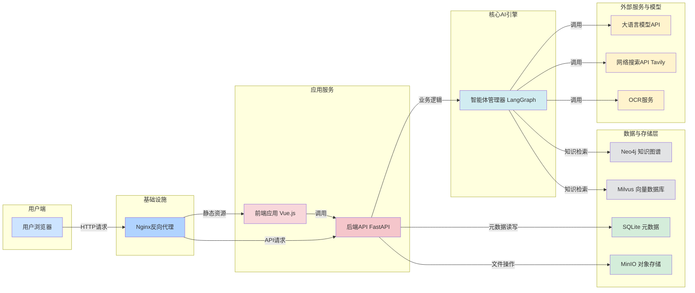
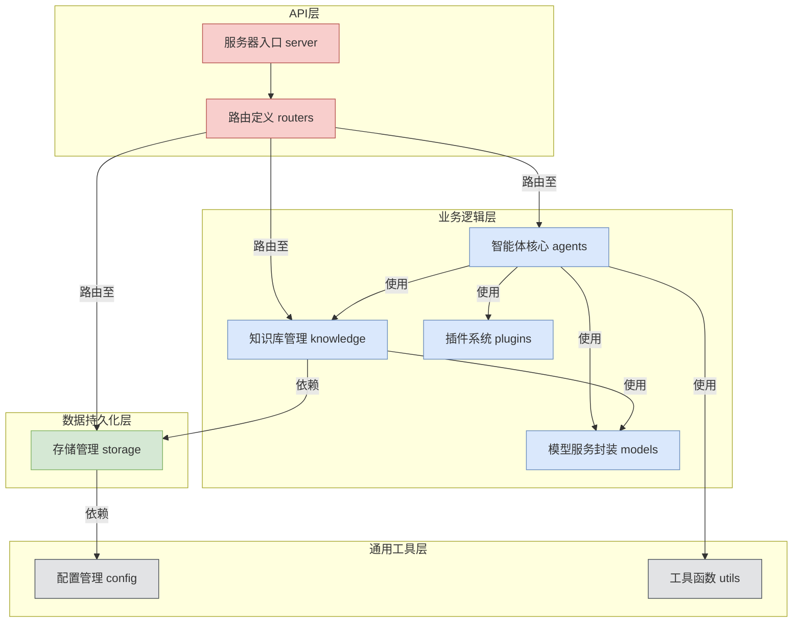
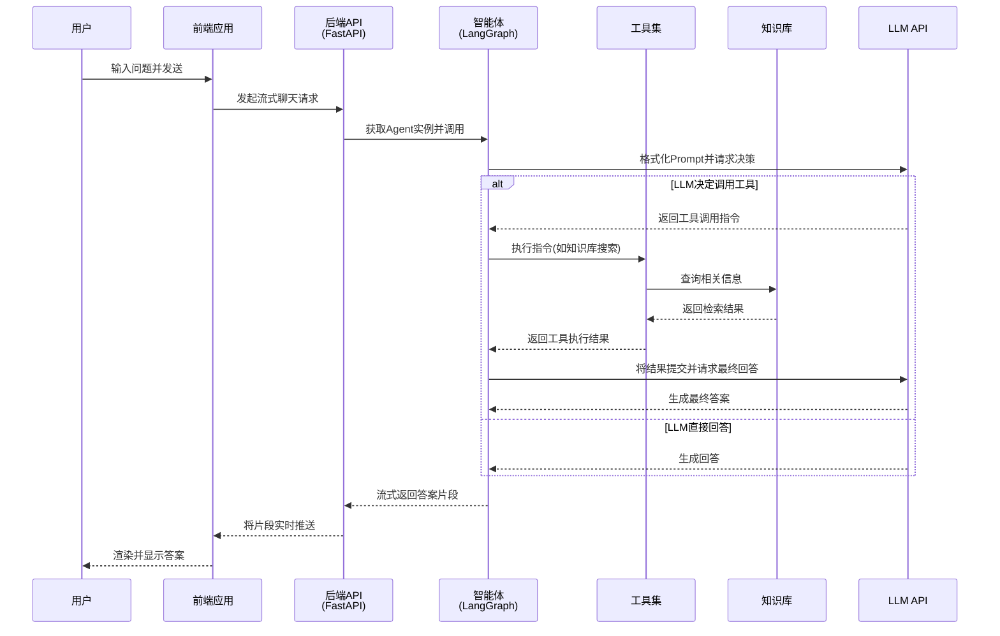
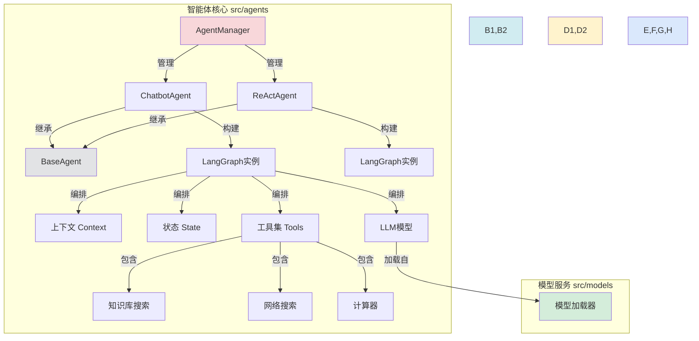
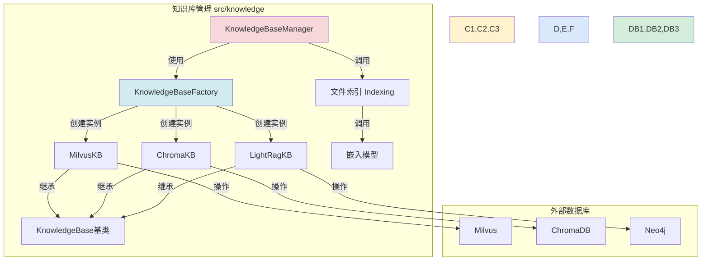

# Yuxi-Know

***

# 项目概述

`Yuxi-Know` 是一个先进的、基于大语言模型（LLM）的智能知识库管理与应用平台。该项目的核心目标是解决传统知识管理系统中信息检索效率低下、上下文理解能力不足以及无法处理复杂推理任务的痛痛点。它通过深度整合前沿的AI技术，包括向量数据库、知识图谱和智能体（Agent）框架，旨在为企业或个人用户打造一个能够深度理解、主动推理并能执行复杂任务的“第二大脑”。

项目的核心功能可以概括为以下几点：
1.  **混合式知识检索**：系统创造性地融合了两种主流的检索增强生成（RAG）技术。一方面，它利用Milvus或ChromaDB等向量数据库，将非结构化文档（如PDF、Word文档）转换为高维向量，实现基于语义相似度的快速内容定位。另一方面，它引入了Neo4j图数据库构建知识图谱，用于存储和查询实体间的精确关系。这种混合模式使得系统既能理解文本的深层含义，又能进行精准的关系推理，为用户提供更全面、更准确的答案。
2.  **强大的智能体框架**：基于业界先进的 `LangGraph` 框架，`Yuxi-Know` 构建了一个灵活、可扩展的智能体系统。这些智能体不仅能与用户进行对话，更能作为任务执行的中枢，自主调用多种工具来完成复杂指令。例如，它可以调用计算器进行数学运算，调用数据库工具查询结构化数据，调用网络搜索工具获取实时信息，甚至可以调用图像生成模型来创作图片。这种“思考-行动”的循环（ReAct模式）赋予了系统超越简单问答的行动能力。
3.  **企业级多服务架构**：项目采用了现代化的多服务架构，通过Docker Compose进行全面的容器化编排。前后端分离的设计（Vue.js + FastAPI）、独立的数据库服务（Neo4j、Milvus）、对象存储（MinIO）以及可选的OCR服务，确保了系统的高可用性、可伸缩性和可维护性。这种架构不仅便于开发和调试，也为私有化部署和未来的功能扩展奠定了坚实的基础。

项目的目标用户主要是需要高效处理和利用海量知识的开发者、企业知识管理人员以及对构建高级AI应用感兴趣的技术爱好者。它解决了在信息爆炸时代，如何从繁杂的数据中快速提取价值、进行深度分析并自动化执行任务的核心需求，是构建下一代企业级智能应用的理想基石。

## 技术栈

*   **编程语言**:
    *   Python 3.12+
    *   JavaScript (Vue.js)

*   **框架与库**:
    *   **后端**:
        *   `FastAPI`: 高性能的Python Web框架，用于构建API。
        *   `LangChain` & `LangGraph`: 核心AI应用框架，用于构建和编排智能体、模型及工具链。
        *   `SQLAlchemy`: Python SQL工具包和对象关系映射器（ORM），用于与SQLite数据库交互。
        *   `Pydantic`: 数据验证和设置管理库。
    *   **前端**:
        *   `Vue.js 3`: 渐进式JavaScript框架，用于构建用户界面。
        *   `Vite`: 新一代前端构建工具，提供极速的开发体验。
        *   `Pinia`: Vue的官方状态管理库。
        *   `Ant Design Vue`: 企业级UI组件库。

*   **构建与工具**:
    *   `Docker` & `Docker Compose`: 用于容器化应用的构建、部署和管理。
    *   `uv`: 一个非常快的Python包安装器和解析器。
    *   `pnpm`: 快速、节省磁盘空间的前端包管理器。
    *   `Nginx`: 高性能Web服务器，用作前端静态资源服务和后端API反向代理。

*   **主要外部依赖**:
    *   **数据库**:
        *   `Neo4j`: 业界领先的图数据库，用于知识图谱存储。
        *   `Milvus` / `ChromaDB`: 高性能的开源向量数据库，用于语义检索。
        *   `SQLite`: 轻量级数据库，用于存储系统元数据（如用户信息、知识库配置等）。
    *   **存储与服务**:
        *   `MinIO`: 高性能的对象存储服务，兼容Amazon S3 API。
        *   `Tavily AI`: AI驱动的搜索引擎API，为智能体提供网络搜索能力。
    *   **AI模型**:
        *   通过API集成了多种第三方大语言模型提供商，如 `OpenAI`, `DeepSeek`, `ZhipuAI`, `SiliconFlow` 等。
    *   **数据处理**:
        *   `unstructured`, `pymupdf`, `python-docx`: 用于解析和提取多种文档格式的内容。

## 可视化图表

### 系统架构图

此图展示了`Yuxi-Know`项目的整体架构，描绘了从用户请求到服务响应的完整路径。



### 后端模块依赖图

该图详细说明了后端代码中核心模块之间的依赖关系。



### 关键调用流程图（用户聊天请求）

此序列图展示了当用户发送一条聊天消息时，系统内部各组件的交互流程。



## 模块解析

### 1. API服务层 (`server/`)
*   **核心职责**: 作为项目的Web入口，负责接收HTTP请求、进行路由分发、执行中间件逻辑（如认证），并将处理结果返回给客户端。它是连接前端与后端业务逻辑的桥梁。
*   **关键文件/组件/功能**:
    *   `server/main.py`: FastAPI应用的根文件。它初始化FastAPI实例，加载CORS（跨域资源共享）中间件和自定义的认证中间件 (`AuthMiddleware`)，并挂载所有API路由。
    *   `server/routers/__init__.py`: 路由聚合文件。它将不同功能模块的路由（如 `auth_router`, `chat_router`）统一到一个 `APIRouter` 实例下，方便集中管理和添加统一前缀 `/api`。
    *   `server/routers/*.py` (e.g., `chat_router.py`, `knowledge_router.py`): 各个功能域的路由定义。它们使用FastAPI的装饰器（如 `@router.get`, `@router.post`）将HTTP端点与具体的业务处理函数关联起来。例如，`chat_router.py` 定义了所有与聊天、智能体、线程管理相关的API。
    *   `server/utils/auth_middleware.py`: 认证与授权的核心。定义了 `oauth2_scheme` 来提取Bearer Token，`get_current_user` 函数通过验证Token从数据库中获取当前用户信息。同时，它还提供了依赖注入函数，如 `get_required_user`, `get_admin_user`，用于在路由层面进行权限控制。

### 2. 智能体核心 (`src/agents/`)
*   **核心职责**: 这是系统的“大脑”，负责定义、管理和执行AI智能体。它封装了与大语言模型交互、进行工具调用和维护对话状态的复杂逻辑。
*   **关键文件/组件/功能**:
    *   `src/agents/__init__.py`: 模块入口，定义了 `AgentManager` 类。这是一个单例工厂，负责在系统启动时注册和初始化所有可用的智能体。它提供了 `get_agent` 方法，使得API层可以根据ID获取具体的智能体实例。
    *   `src/agents/common/base.py`: 定义了 `BaseAgent` 抽象基类。所有智能体都必须继承自该类，它提供了获取智能体信息、配置、历史记录以及执行流式调用的标准接口，确保了所有智能体行为的一致性。
    *   `src/agents/chatbot/graph.py`: `ChatbotAgent` 的实现。这是一个高度可配置的通用聊天智能体。
        *   **动态图构建**: 它的 `get_graph` 方法会动态构建一个 `LangGraph` 实例。这个图定义了智能体的核心工作流：接收消息、调用LLM、解析LLM的输出、执行工具、将工具结果返回给LLM，如此循环直到生成最终答案。
        *   **上下文管理 (`context.py`)**: `Context` 数据类定义了该智能体的所有可配置项，如使用哪个LLM模型、启用哪些工具、连接哪个MCP服务器等。这些配置可以通过前端UI动态修改。
        *   **工具集 (`tools.py`)**: 定义了 `ChatbotAgent` 可用的所有工具，包括内置工具（如网络搜索、知识库搜索）和自定义工具（如计算器 `calculator`、文本到图像 `text_to_img_qwen`）。
    *   `src/agents/react/graph.py`: `ReActAgent` 的实现。这是一个使用 `langgraph.prebuilt.create_react_agent` 快速创建的标准ReAct（推理与行动）智能体。它的特点是内置了对话历史记录的持久化（使用 `AsyncSqliteSaver`），适用于需要长期记忆的场景。

### 3. 知识库管理 (`src/knowledge/`)
*   **核心职责**: 提供一个统一的接口来管理和操作不同类型的知识库（向量数据库和图数据库）。它抽象了底层数据库的复杂性，为上层智能体提供了简单的“创建、添加、搜索”功能。
*   **关键文件/组件/功能**:
    *   `src/knowledge/manager.py`: `KnowledgeBaseManager` 是该模块的核心控制器。它管理所有知识库实例的生命周期，负责知识库的创建、删除、加载和文件添加。它通过与数据库中的 `KnowledgeDatabase` 模型交互来持久化知识库的元数据。
    *   `src/knowledge/factory.py`: `KnowledgeBaseFactory` 是一个工厂类，应用了设计模式。它允许系统在运行时根据指定的类型（如 'milvus', 'chroma'）动态创建不同的知识库实例，使得新增一种知识库类型变得非常容易，只需注册新的实现类即可。
    *   `src/knowledge/implementations/*.py`: 包含了各种知识库的具体实现。
        *   `milvus.py`: 实现了与Milvus向量数据库的交互逻辑，包括集合的创建、数据的插入（向量化后）、以及向量相似度搜索。
        *   `chroma.py`: 实现了与ChromaDB的交互，功能类似Milvus，但更轻量，适合开发和小型部署。
        *   `lightrag.py`: **推断**：这是一个基于图检索的知识库实现，可能与 `LightRAG` 库或Neo4j集成，用于执行更精确的实体和关系查询。
    *   `src/knowledge/indexing.py`: 负责文件处理和索引的核心逻辑。当一个文件被添加到知识库时，该模块的函数会被调用，执行文本提取、分块（`split_text_into_chunks`）、调用嵌入模型进行向量化、最后将向量和元数据写入目标数据库。

### 4. 模型服务封装 (`src/models/`)
*   **核心职责**: 适配和封装对多种外部AI模型API的调用。它提供了一个统一的、简洁的接口，使得上层应用（主要是智能体）无需关心不同模型提供商API的具体差异。
*   **关键文件/组件/功能**:
    *   `src/models/chat.py`: 负责加载聊天模型（LLM）。`select_model` 函数是其核心，它根据传入的提供商和模型名称，从 `models.yaml` 配置文件中读取API地址和凭证信息，然后使用相应的LangChain适配器（如 `ChatOpenAI`, `ChatDeepSeek`）来创建一个可调用的模型实例。
    *   `src/models/embed.py`: 负责加载嵌入模型。逻辑与 `chat.py` 类似，`select_embedding_model` 函数根据配置创建用于文本向量化的模型实例。
    *   `src/models/rerank.py`: 负责加载重排模型。`get_reranker` 函数用于创建一个 `OnlineReranker` 实例，该实例可以接收一个查询和多个文档，并返回一个经过重新排序的相关性得分列表，用于优化检索结果的质量。

### 5. 持久化存储层 (`src/storage/`)
*   **核心职责**: 管理应用的所有数据持久化需求，包括关系型元数据和非结构化文件对象。
*   **关键文件/组件/功能**:
    *   `src/storage/db/manager.py`: `DBManager` 负责管理SQLite数据库连接。它使用SQLAlchemy Core和ORM，在应用启动时自动创建所有定义的表（`Base.metadata.create_all`），并提供了获取数据库会话（`get_session`）的标准方法。
    *   `src/storage/db/models.py`: 使用SQLAlchemy声明式基类定义了所有数据库表模型，如 `User`, `Thread`, `KnowledgeDatabase`, `KnowledgeFile`。这是系统领域模型的核心体现。
    *   `src/storage/minio/client.py`: 封装了与MinIO对象存储服务的交互。`MinIOClient` 提供了文件上传、下载、删除等基本操作。`upload_image_to_minio` 是一个便捷函数，专门用于处理图片上传并返回可公开访问的URL。

### 6. 前端应用 (`web/`)
*   **核心职责**: 提供完整的用户交互界面，包括用户登录、智能体对话、知识库管理、系统设置等功能。它是一个独立的单页应用（SPA），通过API与后端进行数据交互。
*   **关键文件/组件/功能**:
    *   `web/src/main.js`: 前端应用的入口文件。它创建Vue应用实例，并注册 `Pinia` (状态管理)、`vue-router` (路由) 和 `Ant Design Vue` (UI库)。
    *   `web/src/router/index.js`: 定义了应用的所有页面路由和导航守卫。全局前置守卫 (`router.beforeEach`) 在这里实现了页面访问的权限控制，例如，未登录用户访问受保护页面时会自动跳转到登录页。
    *   `web/src/stores/*.js`: Pinia状态管理模块。每个文件定义了一个Store，用于管理一部分全局状态。
        *   `user.js`: 存储当前用户的登录状态、Token和个人信息。
        *   `agent.js`: 存储智能体列表、当前选择的智能体、对话历史等。
        *   `database.js`: 管理知识库列表和当前正在查看的知识库详情。
    *   `web/src/apis/*.js`: API客户端模块。这些文件将所有对后端API的HTTP请求封装成易于调用的JS函数，实现了API层的分离。例如，`agent_api.js` 中包含了 `sendAgentMessage` (发送聊天消息)、`getAgents` (获取智能体列表) 等函数。
    *   `web/src/views/*.vue`: 页面级组件。每个文件对应一个完整的页面视图，如 `LoginView.vue`, `AgentView.vue`, `DataBaseView.vue`。
    *   `web/src/components/*.vue`: 可复用的UI组件。例如 `AgentChatComponent.vue` 是核心的聊天界面组件，`FileTable.vue` 是用于显示文件列表的表格组件，`GraphCanvas.vue` 是用于知识图谱可视化的组件。这些组件实现了功能的内聚和UI的复用。

## 各个模块内文件/组件/功能关系图

### 智能体核心模块内部关系图



### 知识库管理模块内部关系图



## 典型应用场景

**场景：企业内部新员工入职培训与合规查询**

一家大型金融公司希望利用 `Yuxi-Know` 为新员工提供一个智能的入职助手，帮助他们快速了解公司制度、产品知识和合规要求。

**1. 知识库构建阶段：**

*   **管理员操作**：公司的HR和合规部门管理员登录 `Yuxi-Know` 系统。
*   **创建知识库**：他们创建一个名为“新员工入职知识库”的知识库，选择 `Milvus` 作为后端，并指定使用 `bge-m3` 这种高效的中英文嵌入模型。
*   **上传文档**：管理员将大量的内部文档上传到该知识库，包括：
    *   《员工手册.pdf》
    *   《公司产品介绍全集.docx》
    *   《信息安全与合规红线.md》
    *   历史邮件中关于“报销流程”的讨论记录.txt
*   **系统处理**：`Yuxi-Know` 的后端服务自动接收这些文件，将它们存入 `MinIO`。接着，索引任务启动，系统自动解析每个文档的内容，将其分割成合适的文本块，调用嵌入模型将文本块转换为向量，最后将这些向量存入 `Milvus` 数据库中，并建立文本与源文件的关联。

**2. 新员工使用阶段：**

*   **用户**：一位刚入职的产品经理小张。
*   **场景一：查询具体规章**
    *   小张打开 `Yuxi-Know` 的聊天界面，向名为“入职助手”的智能体提问：“公司对于出差的住宿标准是多少？另外，如果我需要招待客户，餐费报销有什么限制？”
    *   **系统响应流程**：
        1.  智能体接收到问题，识别出这是一个需要查询内部知识库的任务。
        2.  它调用 **`knowledge_base_searcher`** 工具，将问题“出差住宿标准”和“客户招待餐费报销限制”作为查询语句，在“新员工入职知识库”中进行语义搜索。
        3.  `Milvus` 数据库快速返回了《员工手册.pdf》中关于差旅政策的几个段落，以及报销流程文档中的相关规定。
        4.  智能体将这些检索到的文本片段作为上下文，连同小张的原始问题一起发送给大语言模型（LLM）。
        5.  LLM 在理解了上下文后，生成了一段清晰、总结性的回答：“根据《员工手册》第8.3节，国内出差一线城市的住宿标准为每晚800元，其他城市为600元。关于客户招待，餐费人均不得超过300元，且需要事先获得部门主管的批准。详细流程请参考《费用报销指南》。” 并且，回答下方会附上原文来源的引用链接，小张可以点击查看文档原文。

*   **场景二：复杂产品信息对比**
    *   小张继续提问：“我们公司的‘稳健增长型’理财产品和‘灵活收益型’理财产品在风险等级和目标客户上有何不同？”
    *   **系统响应流程**：
        1.  智能体再次调用知识库工具，分别搜索“稳健增长型理财产品”和“灵活收益型理财产品”的信息。
        2.  系统从《公司产品介绍全集.docx》中检索到这两种产品的详细描述。
        3.  LLM 接收到这些分散的信息后，不仅是简单地罗列，而是进行 **对比和总结**，最终生成一个表格化的回答，清晰地展示了两种产品在风险等级、预期收益、投资周期和目标客户画像上的差异。

通过这种方式，`Yuxi-Know` 极大地提升了新员工获取信息的效率和准确性，将原本需要花费数小时查阅多个文档才能了解的内容，在几秒钟内以对话的形式精准地提供给员工。


***

# Yuxi-Know 项目代码技术分析文档

## 目录
1.  **项目概览**
    *   1.1. 项目目的与边界
    *   1.2. 顶层结构与技术栈
2.  **模块与分层**
    *   2.1. 模块职责划分
    *   2.2. 模块依赖关系图
3.  **核心功能说明**
    *   3.1. 后端服务 (`server` & `src`)
    *   3.2. 前端应用 (`web`)
4.  **数据结构与关系**
    *   4.1. 领域对象实体 (ORM 模型)
    *   4.2. 数据模型版本演进
    *   4.3. 核心配置模型
5.  **接口与集成**
    *   5.1. 内部 RESTful API
    *   5.2. 第三方服务集成

---

## 1. 项目概览

### 1.1. 项目目的与边界

根据项目文档 (`AGENTS.md`)、依赖项 (`pyproject.toml`, `package.json`) 及 Docker 服务编排 (`docker-compose.yml`)，可以分析出本项目的核心目的与边界如下：

*   **项目目的**：`Yuxi-Know` 是一个基于知识图谱和向量数据库的智能知识库系统。其核心目标是构建一个能够深度理解、整合、并基于海量内部知识进行智能问答与复杂任务执行的高级AI应用平台。**（推断）** 该项目旨在为企业或开发者提供一套完整的、可私有化部署的解决方案，用于构建具备高级推理和工具调用能力的定制化AI智能体（Agent）。

*   **解决的需求**：
    1.  **深度知识检索**：传统关键词搜索无法理解语义，本项目通过结合向量检索（语义相似度）和知识图谱（实体关系），实现了对知识的“深度理解”，能回答更复杂、更具推理性的问题。
    2.  **任务自动化**：项目不仅限于问答，其基于 `LangGraph` 的智能体框架能够调用外部工具（如数据库查询、网络搜索、计算器），从而自动化执行多步骤的复杂任务。
    3.  **异构数据整合**：系统设计了对多种文档格式（PDF, DOCX, TXT等）的解析和索引能力，并具备OCR插件处理图片，能够将企业内部的异构数据统一纳入知识体系。
    4.  **可扩展与定制化**：通过配置文件和模块化设计，用户可以方便地接入不同的大语言模型、扩展新的工具、定义新的智能体，满足特定业务场景的需求。

*   **项目边界**：
    *   **输入**：用户通过Web UI提交的自然语言查询、待处理的文档文件（PDF, DOCX, TXT等）、图片文件（通过OCR）。
    *   **输出**：由AI智能体生成的流式文本响应、工具调用结果（如知识图谱可视化、数据库查询结果、生成的图片URL）、知识库管理界面等。
    *   **范围**：项目本身是一个**编排和集成**平台，它不自研大语言模型、数据库或OCR引擎，而是通过强大的架构将这些成熟的第三方服务和模型有机地组织起来，形成一个协同工作的整体。

### 1.2. 顶层结构与技术栈

*   **顶层结构**：项目采用**多服务（Multi-Service）分离架构**，并通过 `docker-compose.yml` 进行容器化编排，属于典型的现代Web应用架构。前后端职责清晰，数据层与应用层分离。

*   **主要技术栈**：
    *   **后端**：
        *   语言：`Python 3.12`
        *   框架：`FastAPI` (Web服务), `LangChain` & `LangGraph` (AI应用编排)
        *   数据库ORM：`SQLAlchemy`
        *   依赖管理：`uv`
    *   **前端**：
        *   框架：`Vue.js 3`
        *   状态管理：`Pinia`
        *   UI组件库：`Ant Design Vue`
        *   构建工具：`Vite`
        *   依赖管理：`pnpm`
    *   **数据存储**：
        *   元数据：`SQLite`
        *   向量数据：`Milvus`, `ChromaDB`
        *   图数据：`Neo4j`
        *   对象存储：`MinIO`
    *   **部署与运维**：
        *   容器化：`Docker`, `Docker Compose`
        *   Web服务器/反向代理：`Nginx`
    *   **核心第三方集成**：
        *   LLM服务：OpenAI, DeepSeek, ZhipuAI, SiliconFlow 等
        *   网络搜索：`Tavily`
        *   OCR服务：`MinerU`, `PaddleX`

---

## 2. 模块与分层

### 2.1. 模块职责划分

项目代码结构清晰，遵循关注点分离原则，主要模块职责如下：

| 模块/路径 | 核心职责 | 对外接口/主要导出 | 向内依赖 |
| :--- | :--- | :--- | :--- |
| **`docker/`** | 定义所有服务的Dockerfile和相关配置（如Nginx），负责构建和运行环境。 | Docker镜像 | `src/`, `server/`, `web/` |
| **`server/`** | **API服务入口**。基于FastAPI，定义路由、中间件和应用生命周期。 | RESTful API (`server.routers`) | `src/` (所有核心业务逻辑) |
| `server/routers/` | **API路由定义**。将HTTP请求映射到具体的业务处理函数。 | API端点 (e.g., `/api/chat/agent/{agent_id}`) | `src/agents`, `src/knowledge` |
| **`src/`** | **核心业务逻辑**。包含所有与领域相关的代码，是后端的"大脑"。 | 各子模块的类和函数 | - |
| `src/agents/` | **智能体实现**。定义和管理AI Agent，封装其状态、工具和执行逻辑。 | `agent_manager` 单例 | `src/models`, `src/knowledge` |
| `src/knowledge/` | **知识库管理**。提供对向量数据库和图数据库的统一抽象和管理。 | `knowledge_base`, `graph_base` 单例 | `src/models/embed`, `pymilvus` |
| `src/models/` | **模型封装**。封装对外部LLM、Embedding和Reranker模型的调用。 | `select_model`, `select_embedding_model` | `langchain-*` 系列库 |
| `src/storage/` | **数据持久化**。定义与SQLite（元数据）和MinIO（对象存储）的交互。 | `db_manager`, `get_minio_client` | `sqlalchemy`, `minio` |
| `src/config/` | **应用配置**。加载和管理应用的静态与动态配置。 | `config` 对象 | `pyyaml`, `dotenv` |
| `src/utils/` | **通用工具**。提供日志、Web搜索等与业务无关的辅助函数。 | `logger`, `WebSearcher` | `loguru`, `tavily` |
| **`web/`** | **前端应用**。基于Vue.js的单页应用(SPA)，负责用户界面。 | 静态Web资源 | - |
| `web/src/apis/` | **前端API客户端**。封装对后端API的HTTP请求。 | API调用函数 (e.g., `agentApi.getAgents`) | `fetch` API |
| `web/src/stores/` | **前端状态管理**。使用Pinia管理全局状态。 | Pinia Stores (e.g., `useUserStore`) | `pinia`, `web/src/apis` |
| `web/src/views/` | **前端页面级组件**。每个文件对应一个完整的页面视图。 | Vue组件 | `web/src/stores`, `web/src/apis` |
| **`scripts/`** | **辅助脚本**。包含数据迁移、预处理等一次性或周期性执行的工具。 | - (通过命令行执行) | `src/storage` |

### 2.2. 模块依赖关系图

下图展示了后端核心模块之间的依赖关系。`server` 作为入口，依赖于 `src` 中的各个业务模块，形成了一个典型的分层结构。


---

## 3. 核心功能说明

### 3.1. 后端服务 (`server` & `src`)

#### 3.1.1. 智能体模块 (`src/agents`)

这是系统的核心，负责处理用户的请求并编排工具以生成响应。

*   **业务目标**：提供一个可扩展的、支持多智能体的框架，每个智能体具备不同的能力和配置。
*   **输入/输出**：
    *   **输入**: 来自API层的聊天请求，包含消息列表、线程ID和运行时配置。
        *   **请求数据结构** (`POST /api/chat/agent/{agent_id}`):
            ```json
            {
              "query": "你好，请问你是谁？",
              "thread_id": "thread_abc123", // 可选，用于延续对话
              "meta": {} // 可选，传递额外元数据
            }
            ```
    *   **输出**: 通过HTTP流式响应返回的一系列事件，包括消息文本块、工具调用信息和最终完成信号。
*   **主要流程**：
    1.  **初始化**：服务启动时，`AgentManager` (`src/agents/__init__.py`) 实例化并注册所有在代码中定义的Agent类（如`ChatbotAgent`, `ReActAgent`）。
    2.  **请求分发**：`chat_router.py`中的API端点接收到请求后，从`agent_manager`获取对应的Agent实例。
    3.  **上下文构建**：Agent从其模块目录下的配置文件 (`src/agents/{module_name}/config.yaml` - **未知/待确认**, 路径推断) 加载静态配置，并结合用户传入的运行时参数，构建一个`Context`对象。
    4.  **图执行**：将用户消息和上下文输入到预编译的`LangGraph`实例中，调用其`astream`方法。
    5.  **LLM推理与工具调用循环**：
        *   `LangGraph`中的节点调用配置好的LLM（通过`src/agents/common/models.py:load_chat_model`加载）进行思考和决策。
        *   若LLM决定使用工具，图会执行相应的工具函数（定义在`src/agents/chatbot/tools.py`或`src/agents/common/tools.py`），并将结果返回给LLM进行下一步思考。这个过程会循环进行，直到任务完成。
    6.  **状态持久化**：如果Agent配置了`checkpointer` (如`ReActAgent`使用`AsyncSqliteSaver`)，`LangGraph`会自动将每一步的状态（包括消息历史）保存到SQLite数据库中，实现对话记忆。
    7.  **流式响应**：`astream`方法以事件流的形式逐步返回生成的消息块(chunk)或工具调用结果，最终通过FastAPI的`StreamingResponse`返回给前端。
*   **边界条件**:
    *   如果LLM的API Key未配置或无效，模型加载会失败。
    *   工具执行可能失败（如数据库连接超时），Agent需要有能力处理这些异常。
    *   `LangGraph`的递归限制（`recursion_limit`）防止Agent陷入无限循环。

#### 3.1.2. 知识库模块 (`src/knowledge`)

*   **业务目标**：提供对异构知识源（向量、图）的统一管理和检索接口，为RAG提供支持。
*   **主要流程**：
    1.  **创建知识库** (`knowledge_router.py:create_kb`):
        *   **输入**: API请求体，包含`name`, `kb_type`, `embed_model`等。
            *   **数据结构**:
                ```json
                {
                  "name": "公司规章制度库",
                  "description": "包含所有内部规章制度文档",
                  "kb_type": "milvus", // 'chroma', 'milvus', 'lightrag'
                  "embed_model": "siliconflow/BAAI/bge-m3"
                }
                ```
        *   `KnowledgeBaseManager` (`manager.py`) 调用`KnowledgeBaseFactory` (`factory.py`)创建对应类型的知识库实例。
        *   在工作目录 (`saves/knowledge_base_data/{db_id}`)下初始化知识库。
        *   将知识库元数据存入SQLite的`knowledge_databases`表。
        *   **输出**: 新创建的知识库元数据JSON对象。
    2.  **文件上传与索引** (`knowledge_router.py:upload_file`):
        *   **输入**: `multipart/form-data`文件上传请求。
        *   文件首先被存入MinIO对象存储。
        *   在`knowledge_files`表中创建一条记录，**状态**初始为`waiting`。
        *   一个后台任务被触发，执行`indexing.py`中的逻辑：
            a.  **状态变化**: 文件状态变为`processing`。
            b.  根据文件类型选择解析器（如`pymupdf` for PDF）。
            c.  将文本分割成块 (`split_text_into_chunks`)。
            d.  调用`select_embedding_model`将文本块向量化。
            e.  将向量和元数据存入对应的向量数据库（如Milvus）。
            f.  **状态变化**: 文件状态变为`done`。若出错，则为`failed`并记录错误信息。
    3.  **知识检索** (由Agent工具`knowledge_base_searcher`调用):
        *   **输入**: 知识库ID (`db_id`) 和查询语句 (`query`)。
        *   `KnowledgeBaseManager`找到对应的知识库实例并调用其`search`方法。
        *   实例执行相似度搜索，并可能使用`reranker` (`src/models/rerank.py`)对结果进行重排。
        *   **输出**: 检索到的文本块及其元数据列表。

---

## 4. 数据结构与关系

### 4.1. 领域对象实体 (ORM 模型)

以下数据模型定义在 `src/storage/db/models.py`，通过SQLAlchemy ORM映射到SQLite数据库。

#### `User` (用户表)
存储系统用户信息、凭证和角色。

| 字段名 | 类型 | 约束/索引 | 描述 |
| :--- | :--- | :--- | :--- |
| `id` | Integer | Primary Key | 自增ID |
| `username` | String(255) | Not Null, Unique | 用户名 |
| `password` | String(255) | Not Null | 哈希后的密码 (格式: `hash:salt`) |
| `role` | String(50) | Not Null, Default: 'user' | 角色: 'user', 'admin', 'superadmin' |
| `created_at` | DateTime | Default: `utcnow` | 创建时间 |
| `user_id` | String(255) | Unique | 用户的唯一业务ID，默认为username |
| `phone_number` | String(255) | Unique | 手机号 |
| `avatar` | String(500) | Nullable | 头像URL |

#### `Thread` (对话线程表)
存储用户与Agent的对话会话信息。

| 字段名 | 类型 | 约束/关系 | 描述 |
| :--- | :--- | :--- | :--- |
| `id` | Integer | Primary Key | 自增ID |
| `thread_id` | String(255) | Not Null, Unique | LangGraph使用的线程ID |
| `user_id` | Integer | Foreign Key -> `users.id` | 所属用户ID |
| `agent_id` | String(255) | Not Null | 关联的Agent ID (类名) |
| `title` | String(255) | Not Null | 对话标题 |
| `description` | Text | Nullable | 对话描述 |

#### `KnowledgeDatabase` (知识库元数据表)
| 字段名 | 类型 | 约束/索引 | 描述 |
| :--- | :--- | :--- | :--- |
| `id` | Integer | Primary Key | 自增ID |
| `db_id` | String(255) | Not Null, Unique | 知识库业务ID (e.g., `kb_xxxx`) |
| `user_id` | Integer | Foreign Key -> `users.id` | 创建者用户ID |
| `name` | String(255) | Not Null | 知识库名称 |
| `kb_type` | String(50) | Not Null | 类型: 'chroma', 'milvus', 'lightrag' |
| `embed_model` | String(255) | Not Null | 使用的嵌入模型ID |

#### `KnowledgeFile` (知识文件表)
| 字段名 | 类型 | 约束/关系 | 描述 |
| :--- | :--- | :--- | :--- |
| `id` | Integer | Primary Key | 自增ID |
| `file_id` | String(255) | Not Null, Unique | 文件业务ID |
| `db_id` | Integer | Foreign Key -> `knowledge_databases.id` | 所属知识库ID |
| `filename` | String(255) | Not Null | 原始文件名 |
| `file_path` | String(500) | Not Null | 在MinIO中的存储路径 |
| `status` | String(50) | Not Null, Default: 'waiting' | 处理状态: 'waiting', 'processing', 'done', 'failed' |
| `error_message`| Text | Nullable | 错误信息 |

#### `OperationLog`
*   **未知/待确认**: 该模型已在`src/storage/db/__init__.py`中导入，但其具体字段定义未在提供的文件中找到。从`server/utils/common_utils.py:log_operation`函数推断，它至少包含`user_id`, `operation`, `details`, `ip_address`和时间戳字段。线索: `src/storage/db/models.py`。

### 4.2. 数据模型版本演进

`scripts/migrate_user_fields.py`脚本揭示了一次关键的数据库结构变更：

*   **变更内容**: 为已存在的`users`表添加了三个新字段：`user_id`, `phone_number`, `avatar`。
*   **数据迁移**:
    *   脚本会遍历所有`user_id`为空的用户。
    *   将每个用户的`username`字段的值赋给新的`user_id`字段，作为默认值，确保了数据的向后兼容性。
*   **索引变更**: 脚本尝试为`user_id`和`phone_number`字段创建唯一索引，以保证数据的完整性。
*   **影响**: 这次演进极大地增强了用户模型的可扩展性，将登录凭证（`username`）与用户的稳定唯一标识（`user_id`）解耦，为未来集成更多身份验证方式（如手机号登录）或用户系统打下了基础。

### 4.3. 核心配置模型

配置文件 `src/config/static/models.yaml` 定义了系统可用的所有外部模型。

*   **`MODEL_NAMES`**: 定义聊天大语言模型。
    *   **结构**: 字典，键为提供商ID (e.g., `openai`, `siliconflow`)。
    *   **字段**: `name` (显示名称), `url` (文档链接), `base_url` (API基地址), `env` (API Key对应的环境变量名数组), `models` (可用模型列表)。
*   **`EMBED_MODEL_INFO`**: 定义嵌入模型。
    *   **结构**: 字典，键为模型唯一ID (e.g., `siliconflow/BAAI/bge-m3`)。
    *   **字段**: `name` (模型名), `dimension` (向量维度), `base_url` (API地址), `api_key` (环境变量名)。
*   **`RERANKER_LIST`**: 定义重排模型，结构与`EMBED_MODEL_INFO`类似。

---

## 5. 接口与集成

### 5.1. 内部 RESTful API

API前缀为`/api`。需要鉴权的接口均在Header中要求`Authorization: Bearer <token>`。

| 路径与方法 | 描述 | 鉴权 | 请求体/参数 | 成功响应 (200 OK) |
| :--- | :--- | :--- | :--- | :--- |
| `POST /auth/token` | 用户登录 | 公开 | `username`, `password` (form-data) | `{"access_token": "...", "token_type": "bearer"}` |
| `GET /auth/check-first-run` | 检查是否首次运行 | 公开 | - | `{"is_first_run": true/false}` |
| `GET /system/health` | 系统健康检查 | 公开 | - | `{"status": "ok"}` |
| `GET /system/config` | 获取系统动态配置 | 管理员 | - | `{"key": "value", ...}` |
| `POST /system/config/update` | 批量更新配置 | 管理员 | `{"key1": "new_value1", ...}` | 更新后的完整配置对象 |
| `POST /chat/agent/{agent_id}` | 与指定智能体流式聊天 | 已登录 | `{"query": "...", "thread_id": "..."}` | `text/event-stream`事件流 |
| `GET /chat/agent` | 获取所有智能体列表 | 已登录 | - | `[{"id": "ChatbotAgent", "name": "..."}, ...]` |
| `GET /chat/agent/{agent_id}/history` | 获取线程历史消息 | 已登录 | `?thread_id=...` | 消息对象列表 `[...]` |
| `POST /chat/thread` | 创建新对话线程 | 已登录 | `{"agent_id": "...", "title": "..."}` | 新创建的`Thread`对象 |
| `DELETE /chat/thread/{thread_id}` | 删除对话线程 | 线程所有者 | - | `{"message": "Thread deleted"}` |
| `POST /knowledge/` | 创建新知识库 | 管理员 | `{"name": "...", "kb_type": "..."}` | 新建的`KnowledgeDatabase`对象 |
| `GET /knowledge/` | 获取所有知识库列表 | 管理员 | - | `KnowledgeDatabase`对象列表 |
| `POST /knowledge/{db_id}/upload` | 上传文件到知识库 | 管理员 | `multipart/form-data`文件 | 已接收并等待处理的`KnowledgeFile`对象 |
| `GET /knowledge/{db_id}/files` | 获取知识库文件列表 | 管理员 | - | `KnowledgeFile`对象列表 |

### 5.2. 第三方服务集成

| 服务类型                | 服务/SDK                                   | 集成点/配置文件                                                                      | 配置参数 (来自`.env.template`)                                          |
| :------------------ | :--------------------------------------- | :---------------------------------------------------------------------------- | :---------------------------------------------------------------- |
| **LLM & Embedding** | OpenAI, DeepSeek, ZhipuAI, SiliconFlow,等 | `src/config/static/models.yaml` (定义), `src/models/chat.py` (加载), LangChain适配器 | `OPENAI_API_KEY`, `DEEPSEEK_API_KEY`, `SILICONFLOW_API_KEY`, 等    |
| **网络搜索**            | Tavily                                   | `src/utils/web_search.py`, `src/agents/common/tools.py`                       | `TAVILY_API_KEY`                                                  |
| **向量数据库**           | Milvus, ChromaDB                         | `src/knowledge/implementations/`, `docker-compose.yml`                        | `MILVUS_URI`, `MILVUS_TOKEN` (环境变量注入)                             |
| **图数据库**            | Neo4j                                    | `src/knowledge/graph.py`, `docker-compose.yml`                                | `NEO4J_URI`, `NEO4J_USERNAME`, `NEO4J_PASSWORD` (环境变量注入)          |
| **对象存储**            | MinIO                                    | `src/storage/minio/client.py`, `docker-compose.yml`                           | `MINIO_ENDPOINT`, `MINIO_ACCESS_KEY`, `MINIO_SECRET_KEY` (环境变量注入) |
| **OCR**             | MinerU, PaddleX                          | `src/plugins/_ocr.py`, `docker-compose.yml`                                   | `MINERU_URL`, `PADDLEX_URL` (环境变量注入)                              |