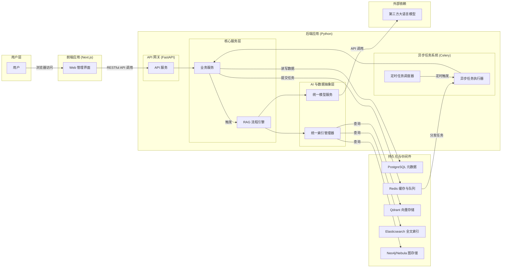
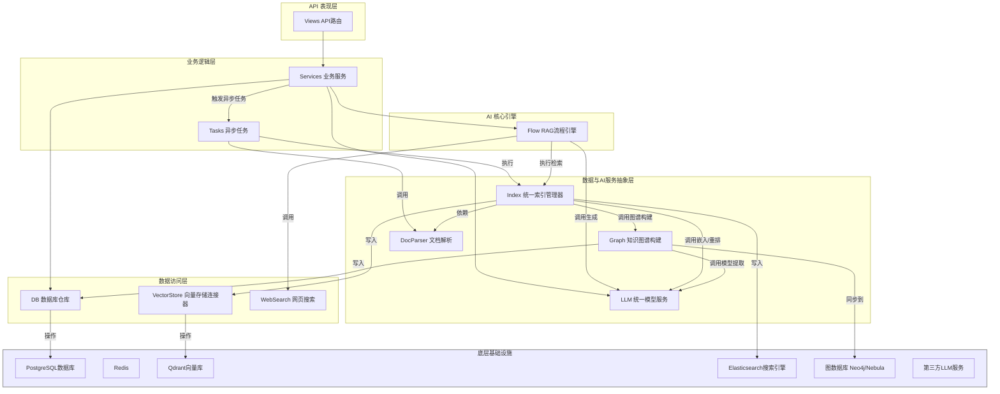
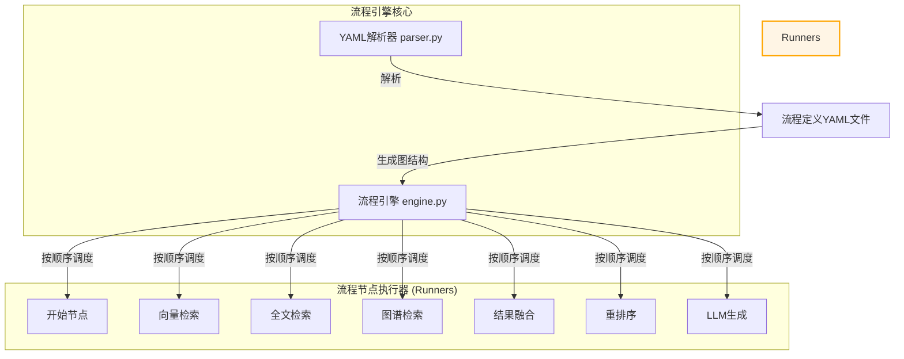
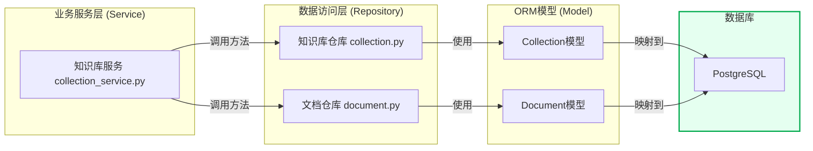
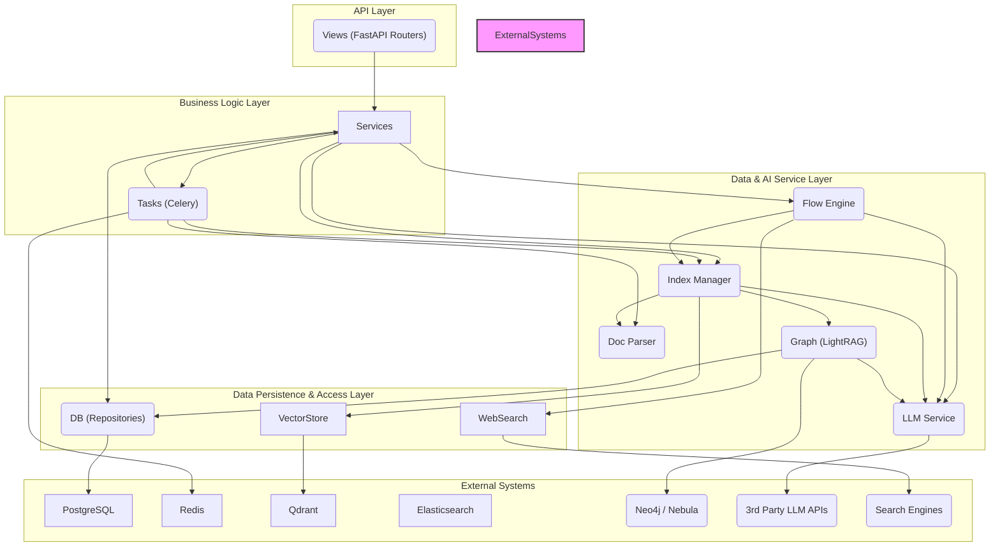

# ApeRAG

***

# 项目概述
ApeRAG 是一个面向生产环境的企业级、开源的检索增强生成（RAG）平台。它的核心目标是解决大型语言模型（LLM）在面对特定、私有或实时更新的知识领域时存在的“知识盲区”和“内容幻觉”问题。通过构建一个全栈式的解决方案，ApeRAG 允许开发者和企业将自身拥有的结构化和非结构化数据，转化为可供大模型精确利用的知识体系，从而开发出更加智能、可靠和可信的AI应用，例如企业知识库问答机器人、智能客户支持系统、以及需要深度领域知识的专业分析工具。

项目之所以被需要，是因为通用的大语言模型虽然知识广博，但其知识截止于训练日期，并且无法访问企业内部的私有数据。这导致它们在回答专业或内部问题时常常表现不佳。ApeRAG 通过“检索-增强-生成”的范式，首先从用户构建的知识库中精准地检索出与问题最相关的信息片段，然后将这些信息作为上下文（Context）提供给大语言模型，引导模型基于这些可靠的“事实”来生成答案，而非凭空捏造。

ApeRAG 平台的主要功能覆盖了构建一个先进 RAG 应用的全链路：
1.  **多源数据接入**：支持从本地文件、网页链接、FTP、S3 对象存储以及飞书等多种渠道接入数据，形成统一的知识来源。
2.  **高级文档解析**：内置强大的文档解析引擎，能够处理 Markdown、PDF、音频、图像等多种格式，并将其智能分块（Chunking），为后续的检索奠定基础。
3.  **混合检索能力**：这是 ApeRAG 的核心优势之一。它创新性地集成了向量检索、全文检索和知识图谱检索三种主流技术。向量检索擅长捕捉语义相似性，全文检索专注于关键词匹配，而知识图谱则能深刻理解实体间的复杂关系。这种多路召回（Multi-path Recall）机制确保了在不同类型的问题下，都能最大化地召回相关信息。
4.  **自动化知识图谱构建**：平台能够利用大语言模型从非结构化文本中自动提取实体和关系，构建知识图谱，将隐性的知识显性化、结构化。
5.  **灵活的流程编排引擎**：用户可以通过简单的 YAML 文件定义和定制 RAG 的执行流程（Flow），自由组合不同的检索、重排（Re-rank）、融合（Merge）和生成策略，以适应不同的业务场景，无需修改代码。
6.  **全面的管理界面**：提供了一个现代化的 Web UI，用户可以通过图形化界面完成知识库管理、机器人配置、对话测试、API 密钥管理、系统审计等所有操作。

ApeRAG 的目标用户是需要构建复杂、可靠的知识密集型 AI 应用的开发者、数据科学家和系统架构师。它不仅仅是一个工具库，更是一个包含了数据处理、模型集成、应用服务和部署运维的端到端平台，极大地降低了构建和维护生产级 RAG 系统的门槛。

## 技术栈
以下是 ApeRAG 项目所采用的主要技术栈：

*   **编程语言**:
    *   Python (后端核心逻辑)
    *   TypeScript (前端用户界面)

*   **框架与库**:
    *   **后端**:
        *   **FastAPI**: 高性能的 Python Web 框架，用于构建 RESTful API。
        *   **Celery**: 分布式任务队列，用于处理文档解析、索引构建等耗时的异步任务。
        *   **SQLAlchemy**: Python SQL 工具包和对象关系映射（ORM）框架，用于与 PostgreSQL 数据库交互。
        *   **LiteLLM**: 一个统一的接口层，用于调用 OpenAI、Gemini、Anthropic 等超过100种不同的大语言模型服务。
        *   **LlamaIndex**: AI 应用框架，项目部分组件（如向量存储）借鉴或使用了其核心类型。
    *   **前端**:
        *   **React**: 用于构建用户界面的 JavaScript 库。
        *   **Next.js**: 基于 React 的全栈框架，提供服务端渲染、静态站点生成等能力。
        *   **shadcn/ui**: 一套设计精良、可组合的 UI 组件库。
        *   **Tailwind CSS**: 一个功能类优先的 CSS 框架，用于快速构建自定义界面。

*   **构建与工具**:
    *   **Poetry**: Python 的依赖管理和打包工具。
    *   **Yarn**: 前端依赖管理工具。
    *   **Docker & Docker Compose**: 容器化技术，用于应用的打包、分发和本地开发环境编排。
    *   **Helm**: Kubernetes 的包管理器，用于在生产环境中部署和管理 ApeRAG 应用。
    *   **Alembic**: SQLAlchemy 的数据库迁移工具，用于管理数据库模式的演进。
    *   **OpenAPI Generator**: 根据后端的 OpenAPI 规范，自动生成类型安全的前端 API 客户端代码。

*   **主要外部依赖 (服务与中间件)**:
    *   **PostgreSQL**: 关系型数据库，存储用户、知识库、文档等核心元数据。
    *   **Redis**: 内存数据库，用作 Celery 的消息代理和 LLM 请求的缓存。
    *   **Qdrant**: 向量数据库，用于存储文本和图像的向量嵌入并进行高效的相似性搜索。
    *   **Elasticsearch**: 全文搜索引擎，提供强大的关键词检索和分析能力。
    *   **Neo4j / NebulaGraph**: 图数据库，用于存储和查询知识图谱。
    *   **Jaeger**: 开源的分布式追踪系统，用于监控和排查微服务架构中的请求链路。

## 可视化图表

#### 系统架构图
此图展示了 ApeRAG 平台的整体架构，从用户交互到后端服务处理，再到底层数据存储和外部依赖的完整流程。



#### 后端模块依赖图
此图详细描绘了 ApeRAG 后端内部核心模块之间的依赖关系和调用流程，体现了清晰的分层设计思想。



## 模块解析

ApeRAG 的后端代码（`aperag/`）结构清晰，逻辑模块划分明确，共同构成了一个强大的 RAG 服务核心。

#### 模块名称: API 与 Web 服务
*   **核心职责**: 作为系统的HTTP入口，负责定义和暴露所有 RESTful API 接口。它接收来自前端或外部客户端的请求，进行初步的验证和解析，然后将请求分发给相应的业务服务层进行处理。
*   **关键文件/组件**:
    *   `aperag/app.py`: FastAPI 应用的根实例，负责组装所有路由、中间件和异常处理器。
    *   `aperag/views/`: API 路由目录。每个文件对应一类资源，例如：
        *   `collections.py`: 管理知识库（Collection）的增删改查、文档上传等。
        *   `chat.py`: 处理机器人对话消息的接收和响应。
        *   `bot.py`: 管理机器人（Bot）的配置。
        *   `auth.py`: 处理用户登录、注册等认证相关的请求。
*   **代码特性解读**:
    *   **声明式路由**: 使用 FastAPI 的装饰器（如 `@router.post(...)`）来声明 API 路径、HTTP 方法和期望的请求/响应模型，代码直观且自带交互式文档（Swagger UI）。
    *   **依赖注入**: FastAPI 的依赖注入系统被广泛使用，例如通过 `Depends(get_current_user)` 来确保接口需要用户认证，并将用户信息注入到处理函数中，实现了认证逻辑的复用和解耦。
    *   **数据模型验证**: API 的请求体和响应体都与 Pydantic 模型（定义在 `aperag/schema/view_models.py` 或 `aperag/api/` 的 YAML 中）绑定，FastAPI 会自动进行数据验证和序列化，保证了接口的健壮性。

#### 模块名称: 业务服务层
*   **核心职责**: 封装和实现所有核心业务逻辑。它是连接上层 API 和底层数据/AI 服务的桥梁，负责编排复杂的业务流程，如创建一个完整的知识库、处理一次对话请求、管理用户配额等。
*   **关键文件/组件**:
    *   `aperag/service/`: 业务服务目录。命名清晰，与 API 资源一一对应：
        *   `collection_service.py`: 实现了创建、更新、删除知识库的完整逻辑，包括在底层数据库中创建相应索引。
        *   `document_service.py`: 负责文档的生命周期管理，包括暂存上传的文件、触发异步处理任务、更新文档状态等。
        *   `agent_chat_service.py`: 处理对话的核心服务。当收到用户消息时，它会调用 RAG 流程引擎（Flow Engine）来执行检索和生成，并管理对话历史。
        *   `quota_service.py` 和 `audit_service.py`: 分别实现了企业级的配额检查和审计日志记录功能。
*   **代码特性解读**:
    *   **逻辑集中**: 复杂的业务逻辑被集中在 Service 层，而不是散落在 API 视图中，这使得代码更易于维护和测试。
    *   **事务管理**: 在与数据库交互时，Service 层负责管理事务的边界，确保操作的原子性。
    *   **异步任务调度**: 当遇到耗时操作（如文档索引）时，Service 层不会直接执行，而是通过 Celery 客户端将任务（如 `process_document_task`）发送到消息队列中，实现了请求的快速响应。

#### 模块名称: RAG 流程引擎
*   **核心职责**: 这是 ApeRAG 最具创新和灵活性的模块。它负责解析用户定义的 RAG 工作流（以 YAML 格式表示的 DAG），并动态地执行这个流程，从而实现高度可定制的检索和生成策略。
*   **关键文件/组件**:
    *   `aperag/flow/engine.py`: 流程引擎的核心调度器。它接收一个解析后的流程图和初始输入（用户问题），然后按照图的拓扑顺序执行每个节点。
    *   `aperag/flow/parser.py`: YAML 流程文件的解析器，将 YAML 文本转换成内存中的图结构对象。
    *   `aperag/flow/runners/`: 流程节点执行器目录。每个文件代表一种原子操作：
        *   `vector_search.py`, `fulltext_search.py`, `graph_search.py`: 分别执行三种不同类型的检索。
        *   `merge.py`: 将多个上游节点的输出结果进行合并。
        *   `rerank.py`: 调用重排模型对检索结果进行优化排序。
        *   `llm.py`: 将最终的上下文和问题组装成 Prompt，并调用大模型生成答案。
*   **代码特性解读**:
    *   **声明式编排**: 将复杂的 RAG 逻辑从硬编码中解放出来，变为可配置的声明式 YAML。这使得业务人员或算法工程师可以快速试验不同的 RAG 策略（例如，是先合并再重排，还是各自重排再合并），而无需后端工程师介入。
    *   **可扩展性**: 添加一种新的流程节点（例如，一个调用外部 API 的节点）非常简单，只需在 `runners` 目录下创建一个新的执行器类，并在 `parser.py` 中注册即可。

#### 模块名称: 统一索引与数据处理层
*   **核心职责**: 抽象和管理底层异构数据源（向量库、搜索引擎、图数据库）的复杂性，为上层应用提供统一的索引创建和查询接口。同时，负责文档的解析和预处理。
*   **关键文件/组件**:
    *   `aperag/index/manager.py`: 统一索引管理器，是索引操作的入口。它会根据配置，将索引任务分发给具体的索引器。
    *   `aperag/index/vector_index.py`, `fulltext_index.py`, `graph_index.py`: 分别是向量、全文和图谱索引的实现。它们封装了与 Qdrant、Elasticsearch、Neo4j 等交互的细节。
    *   `aperag/docparser/`: 文档解析器目录。
        *   `doc_parser.py`: 解析器工厂，根据文件类型选择合适的解析器。
        *   `chunking.py`: 文本分块逻辑，支持按大小、分隔符等多种策略。
    *   `aperag/graph/lightrag/`: 轻量级知识图谱构建模块。它使用 LLM 从文本中提取实体和关系。
    *   `aperag/vectorstore/`: 向量存储连接器，目前主要实现了 `qdrant_connector.py`。
*   **代码特性解读**:
    *   **关注点分离**: `index` 模块关注“如何索引和查询”，`docparser` 模块关注“如何从源文件提取内容”，`vectorstore` 模块关注“如何与具体向量库交互”。这种分离使得每一部分都可以独立演进。
    *   **适配器模式**: `vectorstore` 和未来的其他数据存储连接器采用了适配器模式，使得替换底层的数据库技术变得相对容易，例如，从 Qdrant 切换到 Milvus 只需实现一个新的连接器。

## 各个模块内文件/组件/功能关系图

#### RAG 流程引擎 (Flow Engine) 内部关系图



#### 统一索引层 (Index) 内部关系图

```mermaid
graph TD
    IndexManager[统一索引管理器 manager.py]

    subgraph "具体索引器"
        VectorIndex[向量索引 vector_index.py]
        FulltextIndex[全文索引 fulltext_index.py]
        GraphIndex[图谱索引 graph_index.py]
    end

    subgraph "依赖服务"
        LLMService[LLM服务 (嵌入/提取)]
        VectorStoreConnector[向量存储连接器]
        ElasticsearchClient[ES客户端]
        LightRAG[LightRAG图谱构建]
    end
    
    IndexManager -- "分发任务" --> VectorIndex
    IndexManager -- "分发任务" --> FulltextIndex
    IndexManager -- "分发任务" --> GraphIndex

    VectorIndex -- "调用生成向量" --> LLMService
    VectorIndex -- "写入" --> VectorStoreConnector
    
    FulltextIndex -- "写入" --> ElasticsearchClient
    
    GraphIndex -- "调用" --> LightRAG
    LightRAG -- "调用模型" --> LLMService
```

#### 业务服务与数据持久化交互图



## 典型应用场景
为了更好地理解 ApeRAG 的实际价值，我们以一个典型的企业应用场景为例：**构建一个智能的、多源企业知识问答助手**。

**场景描述**：
一家大型科技公司希望为其内部员工（尤其是新员工和技术支持团队）创建一个 AI 助手。这个助手需要能够回答关于公司产品、技术架构、内部流程和项目历史的各种问题。这些知识目前分散在多个地方：
*   **产品文档**：以 PDF 和 Markdown 格式存储在内部服务器上。
*   **技术博客**：发布在公司的内部 Confluence 空间。
*   **人事政策**：以 Word 文档形式存放在共享文件夹中。
*   **项目负责人信息**：记录在一个内部人员数据库中。

**使用 ApeRAG 的实施步骤**：

1.  **第一步：创建并配置知识库**
    *   管理员登录 ApeRAG 的 Web 界面，创建一个名为“公司知识中心”的知识库（Collection）。
    *   在知识库的设置中，管理员启用了全部三种索引：向量、全文和知识图谱，以应对不同类型的查询。

2.  **第二步：接入异构数据源**
    *   **文件上传**：管理员通过界面将产品文档（PDF、Markdown）和人事政策（Word）直接上传到知识库中。
    *   **URL 接入**：管理员配置 URL 数据源，输入内部 Confluence 空间的根地址。ApeRAG 会自动爬取并同步该空间下的所有技术博客文章。
    *   **API 对接（通过脚本）**：开发人员编写一个简单的 Python 脚本，调用 ApeRAG 的 `/api/v1/collections/{id}/documents` 接口，定期从内部人员数据库中读取项目及其负责人信息，并将其作为结构化文本（例如：“项目'天穹系统'的技术负责人是'王伟'。”）推送到知识库中。

3.  **第三步：自动化处理与索引**
    *   数据接入后，ApeRAG 的后台异步任务（Celery Worker）自动开始工作。
    *   所有文档（PDF、网页、Word）都被 `DocParser` 解析成纯文本，并智能地切分成语义完整的段落（Chunks）。
    *   **向量索引**：每个段落被送入一个嵌入模型（如 `bge-large-zh`），生成向量并存入 Qdrant。
    *   **全文索引**：段落文本被送入 Elasticsearch，建立倒排索引。
    *   **知识图谱索引**：`GraphIndex` 模块利用大语言模型（如 GPT-4）分析文本，自动识别并提取出实体（如项目名“天穹系统”、人名“王伟”、技术“Kubernetes”）以及它们之间的关系（如“负责人是”、“使用技术”），并在 Neo4j 中创建出类似 `(王伟)-[:负责人是]->(天穹系统)`，`(天穹系统)-[:使用技术]->(Kubernetes)` 的知识图谱结构。

4.  **第四步：配置问答机器人并进行对话**
    *   管理员在 ApeRAG 中创建一个名为“企业小助手”的机器人（Bot），并将其与“公司知识中心”知识库关联。
    *   一名新员工向该机器人提问：“**天穹系统的负责人是谁？部署时需要注意哪些关于 Kubernetes 的关键配置？**”

5.  **第五步：RAG 流程执行与智能回答**
    *   机器人的 RAG 流程引擎接收到问题后，并发地启动多路检索：
        *   **图谱检索**：在知识图谱中直接查询“天穹系统”的“负责人是”关系，瞬间精准地找到“王伟”。
        *   **向量检索**：将“Kubernetes 关键配置”转化为向量，在 Qdrant 中找到语义上最相关的技术文档段落。
        *   **全文检索**：在 Elasticsearch 中搜索包含“天穹系统”和“Kubernetes”的段落，作为补充信息。
    *   `Merge` 和 `Rerank` 节点将这三路召回的结果进行融合和重排序，筛选出最关键、最相关的几条信息。
    *   最后，`LLM` 节点将原始问题和筛选出的上下文（例如：“图谱结果：天穹系统的负责人是王伟。文档片段1：...部署天穹系统时，Kubernetes的资源配额必须...。文档片段2：...请注意设置正确的 Ingress 规则...”）组合成一个丰富的 Prompt。
    *   大语言模型基于这个 Prompt，生成一段流畅、准确且包含来源的回答：“天穹系统的技术负责人是王伟。关于 Kubernetes 的关键配置，您需要注意以下几点：1. 设置合理的资源配额... [来源：天穹系统部署手册v2.1.pdf]。2. 配置正确的 Ingress 规则... [来源：技术博客-天穹系统网络实践]。”

通过这个流程，ApeRAG 成功地整合了多模态、多来源的内部知识，并通过混合检索和知识图谱的优势，为员工提供了一个远超传统搜索的智能问答体验。


***

# ApeRAG 项目代码文档分析报告

本文档旨在为架构师提供对 ApeRAG 项目的深度分析，重点关注其系统架构、核心功能、数据模型和 API 设计。所有分析均基于提供的代码库文件，任何推断或不明确之处都将明确标注。

## 目录

1.  [项目概览](#1-项目概览)
    *   1.1. [项目目的与边界](#11-项目目的与边界)
    *   1.2. [顶层结构与技术栈](#12-顶层结构与技术栈)
2.  [模块与分层](#2-模块与分层)
    *   2.1. [模块职责划分](#21-模块职责划分)
    *   2.2. [模块依赖关系图](#22-模块依赖关系图)
3.  [核心功能说明](#3-核心功能说明)
    *   3.1. [知识体系（Collection）管理](#31-知识体系collection管理)
    *   3.2. [数据源接入与文档处理](#32-数据源接入与文档处理)
    *   3.3. [多路召回索引构建](#33-多路召回索引构建)
    *   3.4. [RAG 对话流程（Flow Engine）](#34-rag-对话流程flow-engine)
    *   3.5. [模型服务（LLM）集成](#35-模型服务llm集成)
    *   3.6. [系统管理与认证](#36-系统管理与认证)
4.  [数据结构与关系](#4-数据结构与关系)
    *   4.1. [核心领域模型](#41-核心领域模型)
    *   4.2. [数据库版本演进](#42-数据库版本演进)
5.  [接口与集成](#5-接口与集成)
    *   5.1. [RESTful API 详述](#51-restful-api-详述)
    *   5.2. [第三方服务集成](#52-第三方服务集成)

---

## 1. 项目概览

### 1.1. 项目目的与边界

根据 `README.md`、`pyproject.toml` 及项目结构推断，ApeRAG 是一个面向生产环境的、功能完备的 RAG (Retrieval-Augmented Generation, 检索增强生成) 平台。

*   **项目目的 (推断)**：为企业或开发者提供一套完整的解决方案，用于构建、管理和部署基于私有知识的智能问答机器人或应用。它旨在通过整合多种检索技术（图、向量、全文）来提升大语言模型（LLM）回答的准确性和相关性。
*   **项目边界**：
    *   **涵盖**：从数据源接入、文档解析、多模态索引构建、混合检索、对话流程编排，到模型服务集成、API 密钥管理、用户权限、配额管理和审计日志的全链路功能。
    *   **不涵盖**：项目本身不包含自研的大语言模型（LLM）或向量数据库，而是通过可插拔的架构与第三方服务（如 OpenAI、Qdrant、Elasticsearch 等）集成。它是一个 RAG 平台的“框架”和“应用服务层”。

### 1.2. 顶层结构与技术栈

ApeRAG 采用典型的 **Monorepo** 模式，将前后端代码、部署脚本统一管理，结构清晰。

*   **顶层结构**：
    *   **后端 (`aperag/`)**：基于 Python 的单体应用，负责所有核心业务逻辑、API 服务和异步任务处理。
    *   **前端 (`web/`)**：基于 TypeScript 的现代化 Web 应用，为用户提供图形化管理界面。
    *   **部署 (`deploy/`)**：包含 Helm Charts 和数据库安装脚本，用于在 Kubernetes 等云原生环境中部署整个应用。
    *   **配置 (`envs/`, `docker-compose.yml`)**：提供不同环境（特别是 Docker）下的配置模板。

*   **主要技术栈**：
    *   **后端**：
        *   **Web 框架**: **FastAPI** (推断自 `scripts/start-api.sh` 中的 `uvicorn aperag.app:app`)，用于提供高性能的 RESTful API。
        *   **异步任务队列**: **Celery** (见 `config/celery.py` 和 `aperag/tasks/`)，用于处理耗时的任务，如文档索引、知识图谱构建等。
        *   **数据库 ORM**: **SQLAlchemy** (见 `aperag/db/models.py`)，用于与关系型数据库交互。
        *   **数据库迁移**: **Alembic** (见 `aperag/migration/`)，用于管理数据库模式的版本演进。
        *   **LLM 交互**: **LiteLLM** (见 `aperag/llm/litellm_*.py` and `scripts/uvicorn-log-config.yaml`)，作为一个中间层，统一调用多种 LLM 服务。
        *   **依赖管理**: **Poetry** (见 `pyproject.toml`)。
    *   **前端**：
        *   **框架**: **Next.js** (见 `web/next.config.ts`) 和 **React**。
        *   **UI 库**: **shadcn/ui** (见 `web/components.json`) 和 **Tailwind CSS**。
        *   **语言**: **TypeScript**。
        *   **API Client 生成**: **OpenAPI Generator** (见 `web/openapitools.json`)，根据后端的 OpenAPI 规范自动生成客户端代码。
    *   **运行时与中间件**：
        *   **容器化**: **Docker** (`Dockerfile`, `docker-compose.yml`)。
        *   **关系型数据库**: **PostgreSQL** (见 `deploy/databases/postgresql/` 和 `aperag/migration/sql/extensions_init.sql`)，用于存储核心元数据。
        *   **向量数据库**: **Qdrant** (见 `aperag/vectorstore/qdrant_connector.py` 和 `deploy/databases/qdrant/`)。
        *   **全文搜索引擎**: **Elasticsearch** (见 `aperag/index/fulltext_index.py` 和 `deploy/databases/elasticsearch/`)。
        *   **图数据库**: 支持 **Neo4j** 和 **Nebula** (见 `aperag/db/neo4j_sync_manager.py` 和 `aperag/db/nebula_sync_manager.py`)。
        *   **缓存/消息队列**: **Redis** (见 `aperag/db/redis_manager.py` 和 `deploy/databases/redis/`)，用于 Celery Broker 和应用缓存。
    *   **可观测性**：
        *   **Tracing**: **Jaeger** (见 `aperag/trace/` 和 `envs/docker.env.overrides`)。

## 2. 模块与分层

### 2.1. 模块职责划分

ApeRAG 后端遵循清晰的模块化和分层设计，各模块职责明确。

| 模块名称      | 路径                  | 核心职责                                                                                                        | 对外接口/调用点                                     | 内部依赖                                     |
|---------------|-----------------------|-----------------------------------------------------------------------------------------------------------------|-----------------------------------------------------|----------------------------------------------|
| **Views**     | `aperag/views/`       | API 路由层。接收 HTTP 请求，进行基础校验，并将其分发到 `Service` 层。                                             | FastAPI 应用 (`aperag/app.py`)                      | `Service` 层的服务                                   |
| **Services**  | `aperag/service/`     | 业务逻辑核心层。封装完整的业务流程，如创建知识库、处理聊天消息等。是连接 `Views` 和 `DB/Index` 的桥梁。         | `Views` 层调用                                      | `DB` (Repositories), `Index`, `LLM`, `Tasks` |
| **DB**        | `aperag/db/`          | 数据持久化层。包含 `models.py` (ORM 定义) 和 `repositories/` (数据访问逻辑，CRUD 操作)。                          | `Service` 层调用                                      | SQLAlchemy, 数据库驱动                           |
| **API Spec**  | `aperag/api/`         | OpenAPI 规范定义。使用 YAML 文件描述所有 API 的路径、参数和数据模型，是前后端协作的契约。                        | 前端 OpenAPI Generator 使用                           | -                                            |
| **Tasks**     | `aperag/tasks/`       | 异步任务定义。定义了由 Celery 执行的后台任务，如文档处理和索引构建。                                            | `Service` 层通过 Celery 客户端触发                    | `Service`, `Index`, `DocParser`                |
| **Index**     | `aperag/index/`       | 索引管理层。抽象并管理不同类型的索引（向量、全文、图、摘要、视觉），提供统一的索引创建和查询接口。           | `Service`, `Tasks`, `Flow`                          | `LLM`, `VectorStore`, `DocParser`, `Graph`     |
| **Flow**      | `aperag/flow/`        | RAG 流程引擎。负责解析和执行在 `YAML` 中定义的 RAG 流程，将检索、重排、生成等步骤串联起来。                    | `Service` (AgentChatService)                        | `Index`, `LLM`                                 |
| **DocParser** | `aperag/docparser/`   | 文档解析器。负责从不同格式的文件（MD, Audio, Image 等）中提取文本内容并进行分块（Chunking）。                  | `Index`, `Tasks`                                    | 第三方解析库 (e.g., MinerU)                   |
| **LLM**       | `aperag/llm/`         | 大语言模型适配层。封装了对不同 LLM 服务（补全、嵌入、重排）的调用，并提供了缓存等功能。                      | `Index`, `Flow`, `Service`                          | LiteLLM, 第三方 LLM SDK                      |
| **Graph**     | `aperag/graph/`       | 知识图谱构建与管理。核心是 `lightrag` 模块，负责从文本中提取实体和关系，并同步到图数据库中。                  | `Index` (GraphIndex)                                | `DB` (Repositories), `LLM`                     |
| **VectorStore** | `aperag/vectorstore/` | 向量存储连接器。提供了对具体向量数据库（如 Qdrant）的抽象接口，用于向量的存储和搜索。                         | `Index` (VectorIndex)                               | Qdrant 客户端                                  |
| **Auth**      | `aperag/auth/`        | 认证与授权。处理用户登录、JWT 生成与验证、API Key 认证等安全相关逻辑。                                         | FastAPI 中间件                                      | `DB` (User Repository)                         |
| **WebSearch** | `aperag/websearch/`   | 网页搜索模块。提供在线搜索能力，并能读取网页内容，作为 RAG 的一种动态知识源。                                   | `Flow` (未知/待确认，推断 Flow 引擎可调用)            | DuckDuckGo, Jina 等搜索提供商                    |

### 2.2. 模块依赖关系图

下图展示了后端核心模块之间的依赖关系，体现了典型的分层架构。请求从 `Views` 进入，经由 `Services` 处理，最终与 `DB` 和 `Index` 等底层模块交互。



## 3. 核心功能说明

### 3.1. 知识体系（Collection）管理

*   **业务目标**：为用户提供一个逻辑容器（`Collection`），用于组织和管理一组相关的文档和数据源，并在此基础上构建 RAG 应用。
*   **输入/输出**：
    *   **输入**：用户通过 API 或前端界面发起的创建/更新/删除 `Collection` 的请求。
    *   **输出**：在数据库中持久化的 `Collection` 记录，以及其关联的文档、索引和配置信息。
*   **主要流程（创建 Collection）**：
    1.  **API 接收**：`POST /api/v1/collections` 接口（`aperag/views/collections.py`）接收请求。请求体包含名称、描述、数据源等信息。
    2.  **业务处理**：`CollectionService.create_collection` (`aperag/service/collection_service.py`) 被调用。
    3.  **数据持久化**：`CollectionRepository.create` (`aperag/db/repositories/collection.py`) 在 `collections` 表中插入一条新记录。
    4.  **索引初始化**：服务会为该 `Collection` 在 Qdrant、Elasticsearch 等底层系统中创建对应的命名空间或索引。
    5.  **数据源同步（异步）**：如果请求中包含数据源信息（如 FTP、S3），系统会创建一个关联的 `DataSource` 记录，并可能触发一个 Celery 任务来异步拉取和处理数据。
*   **状态变化**：一个 `Collection` 的状态主要体现在其包含的文档和索引的完整性上。其生命周期包括：`创建 -> 添加文档 -> 索引构建中 -> 索引完成/失败 -> 可供查询 -> 删除`。
*   **边界条件**：
    *   `Collection` 名称需唯一。
    *   用户的 `Collection` 数量受配额（Quota）系统限制。

### 3.2. 数据源接入与文档处理

*   **业务目标**：支持从多种来源（本地上传、URL、FTP、S3、飞书等）获取文档，并将其统一处理成可供索引的标准格式。
*   **输入/输出**：
    *   **输入**：文件流（本地上传）或数据源配置（如 S3 桶名、FTP 地址）。
    *   **输出**：解析、分块后的文本/图像内容块（Chunks），以及元数据。
*   **子功能：文档上传**
    *   **流程**：
        1.  **API 接收**：`POST /api/v1/collections/{collection_id}/documents/upload` (`aperag/views/collections.py`) 接收文件上传请求。
        2.  **对象存储**：`DocumentService` (`aperag/service/document_service.py`) 将上传的文件暂存到对象存储中（本地文件系统或 S3，由配置 `OBJECT_STORE_TYPE` 决定）。
        3.  **创建记录**：在 `documents` 表中创建一条记录，状态为 `UPLOADED`。
        4.  **触发异步任务**：`DocumentService` 向 Celery 提交一个 `process_document_task` 任务，并传递 `document_id`。
*   **子功能：文档解析与分块 (DocParser)**
    *   **流程 (在 Celery Worker 中执行)**：
        1.  **任务执行**：Celery Worker 执行 `aperag.tasks.document.process_document_task`。
        2.  **获取文档**：任务根据 `document_id` 从数据库加载文档信息，并从对象存储下载原始文件。
        3.  **选择解析器**：`DocParserFactory` (`aperag/docparser/doc_parser.py`) 根据文件类型（MIME type）选择合适的解析器，如 `MarkitdownParser`、`AudioParser` 等。
        4.  **内容提取**：所选解析器从文件中提取原始文本和元数据。如果配置了 MinerU (`use_mineru` in `settings`)，会优先调用其 API 以获得更高质量的解析结果。
        5.  **文本分块**：`Chunking` 模块 (`aperag/docparser/chunking.py`) 将长文本切分为大小合适的、有意义的文本块（Chunks），这对于后续的向量嵌入至关重要。
        6.  **结果存储**：解析出的 Chunks 和元数据被暂存或直接传递给下一步的索引构建流程。

### 3.3. 多路召回索引构建

*   **业务目标**：为解析后的文档块创建多种类型的索引，以支持后续的混合检索策略，提升召回的全面性和准确性。
*   **输入/输出**：
    *   **输入**：文档解析后的 Chunks 列表。
    *   **输出**：在向量数据库、全文搜索引擎和图数据库中创建的索引数据。
*   **主要流程 (通常紧随文档处理之后)**：
    ```mermaid
    graph TD
        A[开始: 获得文档 Chunks] --> B{索引管理器 (IndexManager)};
        B --> C[向量索引 (VectorIndex)];
        B --> D[全文索引 (FulltextIndex)];
        B --> E[图谱索引 (GraphIndex)];
        B --> F[摘要索引 (SummaryIndex)];
        B --> G[视觉索引 (VisionIndex)];
        C --> C1[LLM Service 获取 Embedding];
        C1 --> C2[VectorStore 存储向量];
        D --> D1[写入 Elasticsearch];
        E --> E1[LightRAG 提取实体关系];
        E1 --> E2[写入图数据库 (Neo4j/Nebula)];
        F --> F1[LLM Service 生成摘要];
        F1 --> F2[存储摘要];
        G --> G1[LLM Service 获取多模态 Embedding];
        G1 --> G2[存储视觉向量];
    ```
    1.  **分发索引任务**：`IndexManager` (`aperag/index/manager.py`) 接收 Chunks，并根据 `Collection` 的配置，将任务分发给一个或多个具体的索引器。
    2.  **向量索引 (`VectorIndex`)**：
        *   调用 `LLM.EmbeddingService` (`aperag/llm/embed/`) 为每个 Chunk 生成向量嵌入（Embedding）。
        *   将 Chunk 文本、元数据和生成的向量一起存入 Qdrant (`aperag/vectorstore/qdrant_connector.py`)。
    3.  **全文索引 (`FulltextIndex`)**：
        *   将 Chunk 文本和元数据写入 Elasticsearch (`aperag/index/fulltext_index.py`)。利用 ES 的分词和倒排索引能力进行关键词检索。
    4.  **图谱索引 (`GraphIndex`)**：
        *   这是 ApeRAG 的核心特色之一。它调用 `LightRAG` 模块 (`aperag/graph/lightrag/`)。
        *   `LightRAG` 使用 LLM 根据预设的 prompt 从 Chunk 文本中提取实体（如人物、地点）和它们之间的关系。
        *   提取出的三元组（`主语-谓语-宾语`）被同步到图数据库（Neo4j 或 Nebula）中，形成知识图谱。
*   **状态变化**：`Document` 表中有多个索引状态字段，如 `vector_index_status`、`fulltext_index_status` 等，分别记录各种索引的构建状态（`PENDING`, `CREATING`, `ACTIVE`, `FAILED`）。

### 3.4. RAG 对话流程（Flow Engine）

*   **业务目标**：提供一个灵活、可配置的流程引擎，用于执行完整的 RAG 对话。它将用户问题进行多路检索、信息融合、重排序，并最终交由 LLM 生成答案。
*   **输入/输出**：
    *   **输入**：用户的问题（query）、对话历史、`Collection` ID。
    *   **输出**：流式或一次性的 AI 回复，包含答案文本和引用来源。
*   **主要流程**：
    1.  **API 接收**：`POST /api/v1/bots/{bot_id}/chats/{chat_id}/messages` 接口 (`aperag/views/chat.py`) 接收用户消息。
    2.  **服务调度**：`AgentChatService` (`aperag/service/agent_chat_service.py`) 负责处理该请求。
    3.  **流程解析**：`FlowEngine` (`aperag/flow/engine.py`) 加载并解析与该 `Bot` 关联的 `flow.yaml` 配置文件（如 `aperag/flow/examples/rag_flow.yaml`）。该 `YAML` 定义了一个有向无环图（DAG），每个节点是一个处理步骤（Runner）。
    4.  **流程执行 (按 `YAML` 定义的 DAG 顺序)**：
        *   **Start 节点**：接收初始的用户 query。
        *   **并行检索节点**：
            *   `VectorSearchRunner`：将 query 向量化，在 Qdrant 中进行相似度搜索。
            *   `FulltextSearchRunner`：使用 query 在 Elasticsearch 中进行关键词搜索。
            *   `GraphSearchRunner`：将 query 发送到知识图谱中，查找相关实体和子图。
        *   **Merge 节点**：`MergeRunner` 将来自不同检索路径的结果进行合并和去重。
        *   **Rerank 节点**：`RerankRunner` 调用 `LLM.RerankService`，使用更强大的重排模型对合并后的结果进行重新排序，选出与 query 最相关的 Top-K 个文档块。
        *   **LLM 节点**：`LLMRunner` 将原始 query 和经过重排的上下文（Context）拼接成一个完整的 Prompt，然后调用 `LLM.CompletionService`，将该 Prompt 发送给大语言模型（如 GPT-4）以生成最终答案。
    5.  **结果返回**：生成的答案通过 WebSocket 或 SSE 以流式方式返回给前端。

### 3.5. 模型服务（LLM）集成

*   **业务目标**：统一管理和调用不同厂商、不同类型的 AI 模型（补全、嵌入、重排），并提供缓存等优化措施。
*   **主要流程**：
    1.  **提供商管理**：管理员可以在系统中注册 `LLMProvider`，如 `openai`, `gemini` 等，并配置其 API Key (`aperag/service/llm_provider_service.py`)。
    2.  **模型注册**：在 `LLMProvider` 下注册具体的模型，如 `gpt-4`, `text-embedding-ada-002`，并标记其能力（`completion`, `embedding`, `rerank`）。
    3.  **统一调用**：上层服务（如 `Flow` 或 `Index`）不直接与具体 SDK 交互，而是调用统一的 `CompletionService`, `EmbeddingService`, `RerankService`。
    4.  **LiteLLM 路由**：这些服务内部使用 `LiteLLM` (`aperag/llm/completion/base_completion.py`)。LiteLLM 像一个代理，根据 `model_name` 将请求路由到正确的 LLM API 端点。这种设计使得添加新的 LLM 提供商变得非常容易。
    5.  **缓存**：系统为 LLM 调用实现了基于 Redis 的缓存 (`aperag/llm/litellm_cache.py`)，对于相同的请求（特别是 Embedding 请求），可以直接返回缓存结果，节省成本和时间。

### 3.6. 系统管理与认证

*   **用户与认证**：
    *   支持多种登录方式，包括本地密码、Auth0、Authing 等 (见 `aperag/api/components/schemas/config.yaml`)。
    *   认证通过 JWT (JSON Web Token) 实现，登录成功后颁发 token。后续请求需在 `Authorization` 头中携带 `Bearer token`。
*   **API 密钥管理**：
    *   用户可以创建自己的 API Key (`aperag/views/api_key.py`)，用于通过编程方式调用 ApeRAG 的服务。
    *   这对于将 ApeRAG 作为后端服务集成到其他应用中非常重要。
*   **配额系统 (Quota)**：
    *   管理员可以为用户设置资源使用配额，如最大知识库数量、最大文档数量等 (`aperag/service/quota_service.py`)。
    *   每次创建相关资源时，系统会检查配额是否超限。
*   **审计日志**：
    *   关键的 API 调用（特别是写操作）会被记录到审计日志中 (`aperag/service/audit_service.py`)，便于事后追踪和审查。

## 4. 数据结构与关系

### 4.1. 核心领域模型

核心数据模型定义在 `aperag/db/models.py` 中，使用 SQLAlchemy ORM。

| 模型 (表名)             | 核心字段                                                                 | 描述与关系                                                                                                                              |
|-------------------------|--------------------------------------------------------------------------|-----------------------------------------------------------------------------------------------------------------------------------------|
| `User` (`users`)        | `id`, `username`, `email`, `hashed_password`, `role`, `status`           | 存储用户信息。`role` 区分普通用户和管理员。                                                                                               |
| `Collection` (`collections`) | `id`, `name`, `description`, `config`, `user_id`, `created_at`             | 知识体系的核心实体。`user_id` 建立与用户的 N-1 关系。`config` (JSONB) 存储该知识库的特定配置，如索引类型、解析器设置等。         |
| `Document` (`documents`) | `id`, `title`, `source`, `status`, `collection_id`, `vector_index_status` | 代表一个文档或数据单元。`collection_id` 建立与知识库的 N-1 关系。包含多个 `*_index_status` 字段来跟踪不同索引的构建状态。       |
| `Bot` (`bots`)          | `id`, `name`, `description`, `config`, `user_id`                         | 对话机器人的定义。`config` (JSONB) 存储机器人的配置，如使用的 RAG Flow (`flow.yaml` 的内容)、引用的 `Collection` 列表等。        |
| `Chat` (`chats`)        | `id`, `title`, `bot_id`, `user_id`                                       | 一次完整的对话会话。关联到一个 `Bot` 和一个 `User`。                                                                                    |
| `ChatMessage` (`chat_messages`) | `id`, `chat_id`, `role` (`user`/`assistant`), `content`, `reference`     | 对话中的每一条消息。`reference` (JSONB) 字段用于存储 RAG 流程返回的引用来源信息，这是实现答案可溯源的关键。                     |
| `ApiKey` (`api_keys`)   | `id`, `key` (hashed), `description`, `user_id`, `last_used_at`            | 用户创建的用于程序化访问的 API 密钥。密钥本身经过哈希处理后存储。                                                                     |
| `LLMProvider` (`llm_provider`) | `id`, `provider_name`, `api_key` (encrypted)                             | LLM 服务提供商的配置，如 `openai`。API Key 经过加密存储。                                                                               |
| `LLMProviderModel` (`llm_provider_models`) | `id`, `provider_id`, `model_name`, `model_type` (`completion`/`embedding`) | 某个提供商下的具体模型。`model_type` 标记了模型的功能。                                                                             |
| `Quota` (`quotas`)      | `id`, `user_id`, `resource_type`, `limit`, `usage`                       | 用户的配额记录。`resource_type` (e.g., `collection_count`) 指明配额类型。                                                                 |

### 4.2. 数据库版本演进

数据库的 schema 变更由 `aperag/migration/versions/` 目录下的 Alembic 脚本管理。

*   **初始设置**:
    *   `db9c88848f52.py`: 创建 `pgvector` 扩展，这是进行向量运算的基础。
    *   `1c554c77c8e5.py` (文件名在 `b598e645b2ba.py` 的 `down_revision` 中指定): **未知/待确认**，但根据上下文推断，此脚本应为创建所有核心表的初始 schema。
    *   `b598e645b2ba.py`: 执行 `model_configs_init.sql`，插入系统预置的 LLM Provider 和 Model 配置。
*   **关键变更点**:
    *   `d112e0332219.py` (2025-09-05): 在 `searchhistory` 表中增加了 `vision_search` (JSON 类型) 列。这表明项目在此时增加了对视觉或多模态搜索功能的支持。

## 5. 接口与集成

### 5.1. RESTful API 详述

API 设计遵循 OpenAPI 规范，定义在 `aperag/api/` 目录。所有 API 路径均以 `/api/v1` (推断自 `web/src/middlewares/apiProxy.ts`) 为前缀。

#### **示例：Collections API**

*   **规范文件**: `aperag/api/paths/collections.yaml` 和 `aperag/api/components/schemas/collection.yaml`
*   **认证**: `BearerAuth` (JWT Token)

| 方法   | 路径                                  | 摘要                               | 请求体 (`application/json`)          | 成功响应 (`200 OK`)                   |
|--------|---------------------------------------|------------------------------------|--------------------------------------|---------------------------------------|
| `POST` | `/collections`                        | 创建一个新的知识库                 | `CollectionCreate`                   | `Collection`                          |
| `GET`  | `/collections`                        | 获取当前用户的知识库列表 (分页)    | -                                    | `CollectionViewList`                  |
| `GET`  | `/collections/{collection_id}`        | 获取指定知识库的详细信息           | -                                    | `CollectionView`                      |
| `PUT`  | `/collections/{collection_id}`        | 更新知识库信息                     | `CollectionUpdate`                   | `Collection`                          |
| `DELETE` | `/collections/{collection_id}`        | 删除一个知识库及其所有相关数据     | -                                    | `{"message": "success"}`              |
| `POST` | `/collections/{collection_id}/documents/upload` | 上传文件到知识库                   | `multipart/form-data` (file)         | `UploadDocumentResponse`              |
| `GET`  | `/collections/{collection_id}/documents`  | 获取知识库中的文档列表 (分页)      | -                                    | `DocumentList`                        |

#### **数据模型示例：`CollectionCreate`**

```yaml
# 来自 aperag/api/components/schemas/collection.yaml (经过整理)
CollectionCreate:
  type: object
  properties:
    name:
      type: string
      description: 知识库名称
    description:
      type: string
      description: 知识库描述
    config:
      $ref: '#/CollectionConfig' # 包含索引类型等配置
    source:
      $ref: '#/CollectionSource' # 包含 FTP, S3 等数据源配置
```

### 5.2. 第三方服务集成

| 服务/中间件     | 集成点/配置文件                                                                   | 作用                                                              |
|-----------------|-----------------------------------------------------------------------------------|-------------------------------------------------------------------|
| **PostgreSQL**  | `DATABASE_URL` 环境变量, `aperag/db/models.py`                                  | 存储所有核心业务元数据，如用户信息、知识库、文档记录等。         |
| **Redis**       | `CELERY_BROKER_URL`, `MEMORY_REDIS_URL` 环境变量                                | 作为 Celery 的消息代理 (Broker) 和结果后端；用于 LLM 请求缓存。      |
| **Qdrant**      | `VECTOR_DB_CONTEXT` 环境变量, `aperag/vectorstore/qdrant_connector.py`            | 存储文档块的向量嵌入，并提供高效的向量相似度检索。                 |
| **Elasticsearch** | `ES_HOST` 环境变量, `aperag/index/fulltext_index.py`                              | 存储文档块的文本内容，提供强大的全文搜索和关键词检索能力。         |
| **Neo4j/Nebula**| `NEO4J_HOST`, `NEBULA_HOST` 等环境变量, `aperag/db/*_sync_manager.py`                | 存储从文本中提取的知识图谱，支持图查询和关系推理。                 |
| **LiteLLM**     | `aperag/llm/` 模块                                                              | 作为统一的 LLM 服务网关，代理对 OpenAI, Azure, Gemini 等多种模型的调用。 |
| **MinerU**      | `use_mineru`, `mineru_api_token` in `Settings` (`aperag/api/components/schemas/settings.yaml`) | (可选) 高级文档解析服务，用于提升从复杂文档中提取文本的质量。 |
| **Jaeger**      | `JAEGER_ENABLED`, `JAEGER_ENDPOINT` 环境变量, `aperag/trace/`                      | 用于分布式追踪，监控请求在系统内部的完整调用链，便于调试和性能分析。 |

***