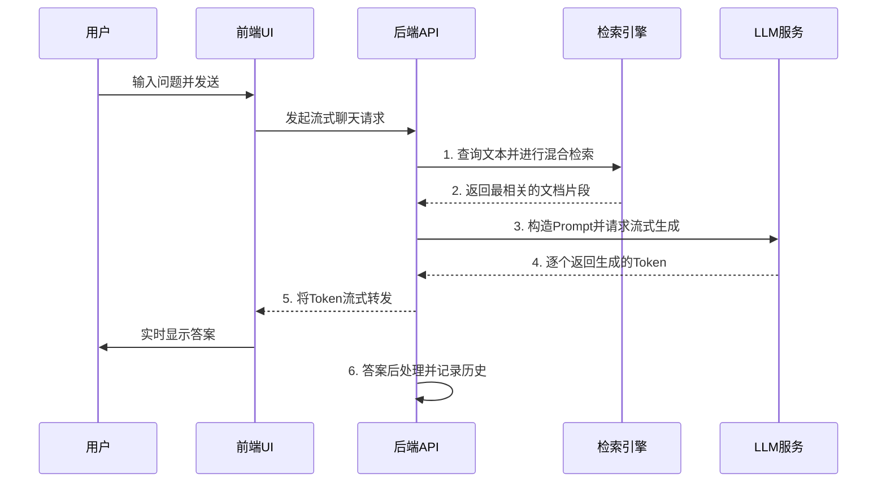
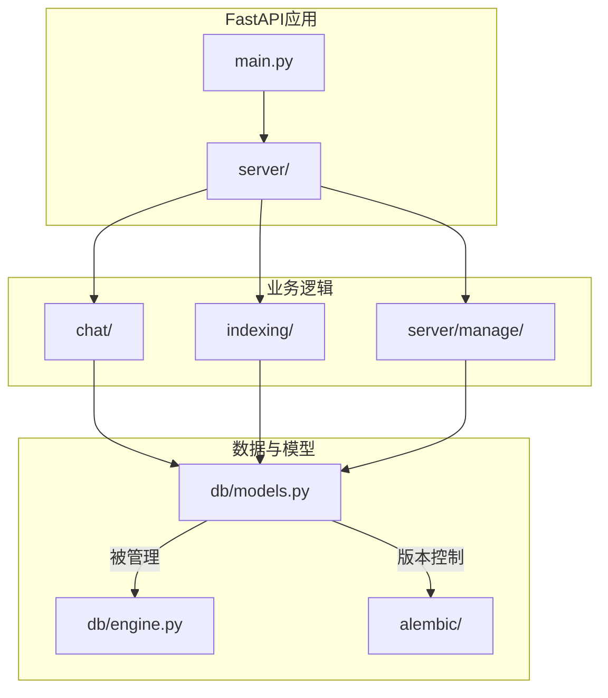
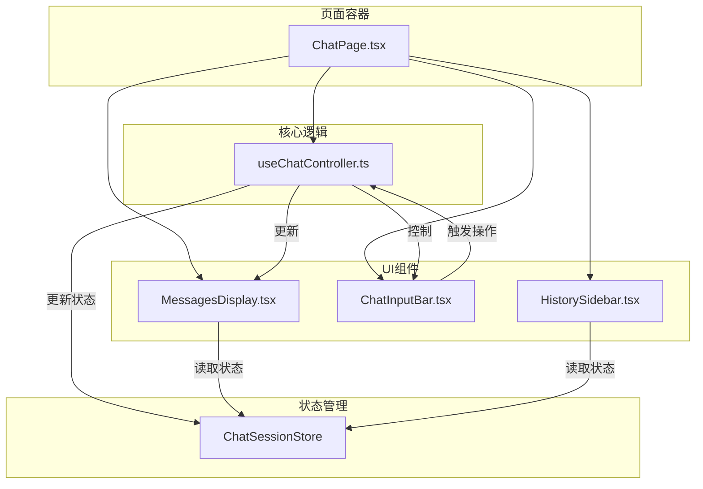
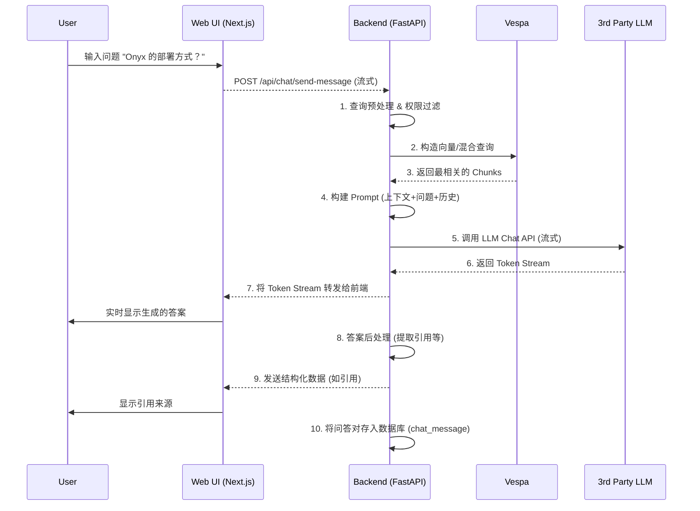

# Onyx

***

# 项目概述
Onyx 是一个专为企业环境设计的、开源的智能问答（Q&A）和知识管理平台。其核心目标是打破企业内部的数据孤岛，将分散在不同系统中的信息整合起来，通过先进的检索增强生成（Retrieval-Augmented Generation, RAG）技术，为用户提供一个统一、智能、自然语言驱动的知识入口。

该项目旨在解决现代企业面临的关键痛点：知识分散、信息检索效率低下以及员工难以快速获取准确答案。随着企业业务的扩展，知识和数据被存储在 Confluence、Jira、Slack、Google Drive、GitHub 等数十种不同的SaaS工具和内部系统中。员工为了解决一个问题，往往需要在多个系统之间频繁切换、搜索，过程耗时且结果参差不齐。Onyx 通过其强大的连接器框架，能够主动接入这些数据源，将文档、对话、工单等非结构化数据进行统一处理、向量化并建立索引。

Onyx 的主要功能包括：
1.  **广泛的数据源连接**：内置了对主流企业应用的连接器，支持快速配置和数据同步。
2.  **智能AI问答**：用户可以通过自然语言聊天界面提问，系统会理解问题意图，从知识库中检索最相关的信息，并利用大型语言模型（LLM）生成精准、连贯的答案。
3.  **可信的答案来源**：所有AI生成的答案都会附带清晰的引用来源链接，用户可以一键追溯到原始文档，确保了信息的准确性和可信度。
4.  **企业级权限管理**：与源系统权限打通，确保用户只能访问其在源系统中拥有权限的数据，保障了企业数据安全。
5.  **灵活的助手（Persona）定制**：管理员可以创建不同的AI助手，定义它们的角色、知识范围（绑定特定的文档集）和行为模式，以适应不同部门或业务场景的需求。
6.  **全面的管理后台**：提供了一个可视化的管理界面，用于配置连接器、管理用户、监控索引状态以及设置系统级的LLM和嵌入模型。

Onyx 的目标用户是那些希望提升内部知识管理效率、降低信息获取成本的企业，特别是技术、支持、运营和人力资源等知识密集型部门。通过将企业知识转化为一个可随时提问的“超级大脑”，Onyx 致力于赋能每一位员工，让他们能够更专注于创造性工作，而非耗费时间在寻找信息上。

## 技术栈
*   **编程语言**:
    *   **Python**: 后端服务、模型服务和所有核心业务逻辑。
    *   **TypeScript**: 前端Web应用。

*   **框架与库**:
    *   **后端**:
        *   **FastAPI**: 高性能的Web框架，用于构建API服务。
        *   **SQLAlchemy**: ORM框架，用于与PostgreSQL数据库交互。
        *   **Alembic**: 数据库迁移工具。
        *   **Celery**: 分布式任务队列，用于处理异步任务（如数据索引）。
        *   **Pydantic**: 数据验证和设置管理。
    *   **前端**:
        *   **Next.js**: React框架，用于构建服务端渲染和静态网站。
        *   **React**: 用于构建用户界面的JavaScript库。
        *   **Tailwind CSS**: 功能类优先的CSS框架，用于快速构建UI。
    *   **机器学习**:
        *   **PyTorch**: 核心深度学习框架。
        *   **Transformers / Sentence-Transformers**: 用于加载和使用预训练的语言模型，特别是嵌入模型。

*   **构建与工具**:
    *   **Docker / Docker Compose**: 容器化技术，用于应用的打包、分发和本地开发环境。
    *   **Kubernetes / Helm**: 容器编排工具和包管理器，用于生产环境的部署和管理。
    *   **pre-commit**: 用于在代码提交前自动运行代码检查和格式化。
    *   **pytest**: Python测试框架。
    *   **Playwright**: 用于端到端的Web应用测试。

*   **主要外部依赖**:
    *   **数据库**:
        *   **PostgreSQL**: 主要的关系型数据库，存储元数据、用户、配置等信息。
        *   **Redis**: 作为Celery的消息代理（Broker）和结果后端。
    *   **检索引擎**:
        *   **Vespa**: 高性能的搜索引擎，用于存储文本块的向量和元数据，并执行混合检索。
    *   **AI与模型服务**:
        *   **OpenAI, Cohere, Google Vertex AI, Anthropic**: 支持多种第三方大型语言模型（LLM）提供商。
    *   **数据源SDK**:
        *   集成了大量第三方服务的Python SDK，例如 `slack_sdk`, `atlassian-python-api`, `google-api-python-client` 等，用于与数据源进行API交互。

## 可视化图表

#### 系统整体架构图
```mermaid
graph TD
    subgraph 用户层
        用户浏览器
    end

    subgraph 应用层
        WebUI[前端应用 Next.js]
        Backend[后端核心 FastAPI]
        ModelServer[模型服务 FastAPI]
        CeleryWorkers[异步任务工作节点]
    end

    subgraph 基础服务层
        Postgres[PostgreSQL 数据库]
        Redis[Redis 缓存与消息队列]
        Vespa[Vespa 检索引擎]
    end

    subgraph 外部依赖
        LLMProviders[第三方LLM服务]
        DataSources[企业数据源]
    end

    用户浏览器 -- HTTPS --> WebUI
    WebUI -- REST API --> Backend

    Backend -- 推理请求 --> ModelServer
    Backend -- 数据读写 --> Postgres
    Backend -- 任务分发 --> Redis
    Backend -- 索引与检索 --> Vespa
    Backend -- API调用 --> LLMProviders

    CeleryWorkers -- 消费任务 --> Redis
    CeleryWorkers -- 更新状态 --> Postgres
    CeleryWorkers -- 获取数据 --> DataSources
    CeleryWorkers -- 文本向量化 --> ModelServer
    CeleryWorkers -- 写入索引 --> Vespa```

#### 后端核心模块依赖图
```mermaid
graph TD
    subgraph API层
        APIServer[API服务模块]
    end

    subgraph 业务逻辑层
        ChatLogic[聊天问答模块]
        IndexingPipeline[索引流水线模块]
        AdminLogic[管理逻辑模块]
    end

    subgraph 抽象与适配层
        Connectors[数据连接器模块]
        LLM_Abstraction[LLM抽象层]
        SearchAbstraction[检索抽象层]
    end
    
    subgraph 数据与基础设施层
        DBAccess[数据库访问模块]
        VespaClient[Vespa客户端]
        ModelServerClient[模型服务客户端]
    end

    APIServer --> ChatLogic
    APIServer --> IndexingPipeline
    APIServer --> AdminLogic

    ChatLogic --> LLM_Abstraction
    ChatLogic --> SearchAbstraction
    ChatLogic --> DBAccess

    IndexingPipeline --> Connectors
    IndexingPipeline --> DBAccess
    IndexingPipeline --> ModelServerClient
    IndexingPipeline --> SearchAbstraction

    AdminLogic --> DBAccess
    AdminLogic --> Connectors

    SearchAbstraction --> VespaClient
```

#### 关键调用流程：用户提问到获取答案


## 模块解析

#### 1. 后端核心 (Backend Core)
*   **模块名称**: `Backend Core`
*   **核心职责**: 作为整个应用的“大脑”，负责处理所有业务逻辑、API请求、数据持久化和对其他服务的协调调用。它是连接前端、数据源、AI模型和底层基础设施的枢M。
*   **关键文件/组件**:
    *   `backend/onyx/main.py`: FastAPI应用的入口点，整合所有API路由器。
    *   `backend/onyx/server/`: 包含了所有API的路由定义。例如，`query_and_chat/`处理聊天请求，`documents/`处理连接器和凭证管理，`manage/`处理管理员级别的配置。
    *   `backend/onyx/db/`: 定义了所有使用SQLAlchemy ORM创建的数据模型（如 `User`, `Persona`, `Connector` 等），并提供了数据库会话管理。
    *   `backend/alembic/`: 包含了Alembic的数据库迁移脚本，记录了数据模型的每一次演进，确保了数据库结构的版本控制。
*   **代码特性解读**:
    *   **分层设计**: `server`层负责API路由和请求/响应处理，`chat`或`indexing`等业务层负责具体逻辑，`db`层负责数据持久化，层次清晰。
    *   **依赖注入**: FastAPI的依赖注入系统被广泛使用，例如通过 `Depends(get_session)` 来获取数据库会话，通过 `Depends(current_user)` 来实现用户认证和授权，这使得代码解耦且易于测试。

#### 2. 数据连接器 (Data Connectors)
*   **模块名称**: `Data Connectors`
*   **核心职责**: 实现与各种内外部数据源的连接、认证和数据拉取。每个连接器都负责将特定数据源的文档转换为系统内部统一的 `Document` 格式。
*   **关键文件/组件**:
    *   `backend/onyx/connectors/interfaces.py`: 定义了所有连接器都必须实现的基类 `LoadConnector`，规范了如 `load_docs()` 和 `poll_source()` 等核心方法，确保了模块的可扩展性。
    *   `backend/onyx/connectors/factory.py`: 一个工厂模块，根据传入的数据源类型（`SourceType`），动态地创建并返回相应的连接器实例。
    *   `backend/onyx/connectors/[source_name]/connector.py`: 每个子目录代表一个具体的数据源（如 `confluence`, `slack`），其下的`connector.py`文件包含了该数据源的完整实现逻辑，包括API客户端初始化、数据分页拉取、错误处理和增量同步逻辑。
*   **代码特性解读**:
    *   **插件化架构**: 通过统一的接口和工厂模式，添加一个新的数据源变得非常简单，只需实现`LoadConnector`接口并将其注册到工厂中即可，对核心系统的侵入性极低。
    *   **增量同步**: 多数连接器都实现了检查点（checkpointing）机制，只拉取自上次同步以来的更新数据，极大地提高了同步效率。

#### 3. 索引与检索 (Indexing & Retrieval)
*   **模块名称**: `Indexing & Retrieval`
*   **核心职责**: 负责将从连接器获取的文档进行处理，并构建成可供AI模型检索的索引。这是实现RAG（检索增强生成）技术的核心环节。
*   **关键文件/组件**:
    *   `backend/onyx/indexing/indexing_pipeline.py`: 索引流水线的核心协调器。它接收文档列表，并依次调用分块、向量化和写入Vespa的步骤。
    *   `backend/onyx/indexing/chunker.py`: 文本分块器。将长文档按照一定的规则（如大小、句子边界）切分成更小的文本块，以便进行精确的向量检索。
    *   `backend/onyx/indexing/embedder.py`: 文本向量化器。它负责批量调用`Model Server`服务，将文本块转换为高维向量。
    *   `backend/onyx/document_index/vespa/`: 包含了与Vespa检索引擎交互的所有逻辑。`index.py`负责写入操作，`chunk_retrieval.py`负责查询操作，`vespa-app.zip`的生成逻辑则定义了Vespa的索引结构（schema）。
*   **代码特性解读**:
    *   **流水线设计**: 将复杂的索引过程分解为独立的、可替换的步骤，使得整个流程清晰可控，也便于未来对某个环节（如分块策略）进行优化。
    *   **批处理**: 在向量化和写入索引的环节，系统都采用了批处理（batching）的方式，显著提升了处理大量文档时的性能和吞吐量。

#### 4. 聊天与问答 (Chat & Q&A)
*   **模块名称**: `Chat & Q&A`
*   **核心职责**: 处理用户的聊天请求，执行完整的问答流程，包括查询理解、上下文检索、Prompt工程、调用LLM以及流式返回答案。
*   **关键文件/组件**:
    *   `backend/onyx/chat/process_message.py`: 聊天请求处理的主入口，协调整个问答流程。
    *   `backend/onyx/context/search/pipeline.py`: 负责执行检索步骤，它将用户的查询发送到Vespa，并对返回结果进行排序和筛选。
    *   `backend/onyx/chat/prompt_builder/`: Prompt工程模块。根据用户问题、检索到的上下文、聊天历史以及预设的`Persona`（助手）指令，动态构建最终发送给LLM的Prompt。
    *   `backend/onyx/chat/answer.py`: 负责与LLM进行交互，并处理LLM返回的流式响应。
    *   `backend/onyx/chat/stream_processing/`: 解析从LLM返回的token流，并将其中的结构化信息（如引用标记）提取出来，与文本内容一起打包发送给前端。
*   **代码特性解读**:
    *   **流式响应**: 从LLM调用到API返回，整个流程都是流式的。这使得用户几乎可以立即看到答案的生成过程，极大地改善了交互体验。
    *   **Persona驱动**: 整个问答流程的行为都受到`Persona`配置的影响，包括使用的LLM模型、系统提示、检索的文档范围等，这为系统提供了高度的灵活性和可定制性。

#### 5. 前端应用 (Frontend Application)
*   **模块名称**: `Frontend Application`
*   **核心职责**: 为最终用户和系统管理员提供一个功能完整、交互友好的Web界面。
*   **关键文件/组件**:
    *   `web/src/app/chat/`: 聊天页面的核心实现。
        *   `ChatPage.tsx`: 聊天界面的主组件。
        *   `useChatController.ts`: 一个核心的React Hook，封装了与后端进行聊天交互的所有逻辑，包括发送消息、处理流式响应、管理聊天状态等。
        *   `MessagesDisplay.tsx`: 负责渲染聊天消息列表，包括用户提问、AI回答和引用来源。
    *   `web/src/app/admin/`: 管理后台的所有页面。
        *   `connectors/`: 连接器管理页面，允许管理员创建、配置和监控数据源。
        *   `assistants/`: 助手（Persona）管理页面。
    *   `web/src/lib/`: 存放前端的通用工具函数、API客户端和类型定义。
*   **代码特性解读**:
    *   **组件化**: UI被拆分为大量可复用的React组件，例如`ChatInputBar`, `SourceIcon`, `Modal`等，提高了开发效率和代码一致性。
    *   **状态管理**: 通过React Hooks（如`useState`, `useContext`）和自定义Hooks进行状态管理，逻辑清晰。`SWR`被用于数据获取和缓存，以提升页面性能和数据同步的实时性。

## 各个模块内文件/组件/功能关系图

#### 1. 后端核心模块组件关系图


#### 2. 前端聊天页面组件关系图


## 典型应用场景

**场景：新入职的产品经理快速熟悉项目历史决策**

一家快速发展的科技公司刚刚迎来一位新产品经理，小王。他负责接手一个已经迭代了两年、技术和业务逻辑都非常复杂的项目。为了快速上手，他需要了解过去几个季度的产品规划、技术选型讨论、关键功能的设计文档以及相关的市场分析报告。

**传统方式的挑战：**
*   **信息分散**：产品规划在Jira史诗（Epics）中，技术讨论沉淀在Confluence的会议纪要里，市场报告作为PDF附件存储在Google Drive，而团队的日常即时讨论则散落在Slack的各个频道中。
*   **耗时巨大**：小王需要登录至少四个不同的系统，使用不同的关键词反复搜索，并手动筛选、阅读大量无关信息，才能拼凑出完整的决策背景。这个过程可能需要花费数天时间。

**使用Onyx的流程：**

1.  **知识库已就绪**：公司的IT部门早已将Onyx部署为内部知识平台，并配置好了Jira、Confluence、Google Drive和Slack的连接器。Onyx在后台持续、自动地同步这些系统中的新知识，并完成了索引。

2.  **提出复杂问题**：小王打开公司的Onyx聊天界面，直接用自然语言提出他的核心问题：
    > “关于‘奥丁计划’，最初立项时的核心目标是什么？在2.0版本重构时，为什么我们放弃了方案A而选择了基于微服务的方案B？把相关的产品文档、技术评审纪要和市场竞争力分析报告找出来给我。”

3.  **Onyx的智能处理**：
    *   **查询理解与检索**：Onyx的AI理解到这是一个复合问题，需要从不同类型和来源的文档中寻找答案。它将查询分解，并向Vespa检索引擎发出混合检索请求，同时在Confluence中寻找“技术评审纪要”，在Jira中匹配“奥丁计划”的史诗描述，在Google Drive中搜索“市场竞争力分析报告”，并在Slack历史中查找关于“方案A”和“方案B”的讨论。
    *   **信息整合与答案生成**：Vespa快速返回了十几个最相关的文档片段。Onyx的后端将这些高质量的上下文信息，连同小王的问题，一起构建成一个复杂的Prompt，发送给背后的大语言模型（如GPT-4）。
    *   **流式生成与引用**：LLM开始生成一个结构清晰、逻辑连贯的回答。Onyx将答案以流式的方式实时呈现在小王的屏幕上：
        > “关于‘奥丁计划’，根据立项文档，其核心目标是……
        >
        > 在2.0版本重构时，团队放弃方案A的主要原因是其扩展性不足。根据技术评审会议纪要，方案A在压力测试下表现不佳。同时，Slack的讨论记录 显示，核心开发者认为方案B的微服务架构更利于未来新功能的独立迭代。
        >
        > 相关的市场竞争力分析报告可以在这里找到。”

4.  **快速验证与深入研究**：
    *   回答中的 `[1]`, `[2]`, `[3]`, `[4]` 都是可点击的链接。
    *   小王点击 `[1]`，直接跳转到Confluence上的原始产品需求文档（PRD）。
    *   他点击 `[3]`，Onyx甚至能将他定位到Slack中那段关键讨论的具体消息。
    *   整个过程不到一分钟，小王就获得了过去需要几天才能整理出的核心信息，并且所有信息都有据可查。

通过这个场景，Onyx将繁琐、低效的“人肉信息检索”转变为高效、精准的“与知识对话”，极大地提升了新员工的融入速度和整个团队的知识流转效率。


***

# **Onyx 项目代码库技术分析文档**

**文档版本:** 1.0
**分析时间:** 2025-09-30
**目标读者:** 架构师

---

### **目录**

1.  [**项目概览**](#1-项目概览)
    1.1. [项目目的与边界](#11-项目目的与边界)
    1.2. [顶层结构与技术栈](#12-顶层结构与技术栈)
2.  [**模块与分层**](#2-模块与分层)
    2.1. [模块职责划分](#21-模块职责划分)
    2.2. [模块依赖关系图](#22-模块依赖关系图)
3.  [**核心功能说明**](#3-核心功能说明)
    3.1. [数据接入与索引 (Data Ingestion & Indexing)](#31-数据接入与索引)
    3.2. [问答与聊天 (Q&A & Chat)](#32-问答与聊天)
    3.3. [管理与配置 (Administration & Configuration)](#33-管理与配置)
4.  [**数据结构与关系**](#4-数据结构与关系)
    4.1. [核心领域模型](#41-核心领域模型)
    4.2. [数据库版本演进](#42-数据库版本演进)
5.  [**接口与集成**](#5-接口与集成)
    5.1. [核心后端 API](#51-核心后端-api)
    5.2. [第三方服务集成](#52-第三方服务集成)

---

### **1. 项目概览**

#### **1.1. 项目目的与边界**

Onyx 是一个企业级的问答（Q&A）和知识管理平台。

*   **核心目的 (推断):** 项目旨在通过连接多种企业内部和外部的数据源（如 Confluence, Jira, Slack, Google Drive 等），将非结构化数据统一索引，并提供一个由大型语言模型（LLM）驱动的自然语言聊天界面，让用户能够快速、准确地从中获取答案和洞见。
*   **项目边界:**
    *   **输入:** 支持多种数据源的连接器配置，接受用户的自然语言查询。
    *   **输出:** 提供带有引用来源的生成式答案，支持流式响应，并提供管理后台用于系统配置和监控。
    *   **核心处理:** 包括数据拉取、文档解析、文本分块、向量化（Embedding）、数据索引、自然语言查询理解、上下文检索、Prompt 构建、LLM 推理调用、答案生成与后处理等。
    *   **范围外 (推断):** 项目不负责自研大型语言模型或向量数据库，而是集成现有成熟的第三方服务（如 OpenAI/Cohere LLMs）和检索引擎（Vespa）。

该判断主要基于以下线索：`README.md` 的目标描述、庞大的 `backend/onyx/connectors` 目录、对 LLM 和 Vespa 的深度集成代码，以及 `web` 目录下的聊天和管理界面结构。

#### **1.2. 顶层结构与技术栈**

项目采用**多服务单体仓库 (Monorepo)** 架构，将前端、后端和模型服务置于同一代码库中，便于统一管理和部署。

*   **顶层结构:**
    *   **`backend`:** 核心后端服务，处理所有业务逻辑、数据持久化和外部服务协调。
    *   **`web`:** 前端 Web 应用，为用户提供交互界面。
    *   **`model_server`:** 独立的模型推理服务，专门用于执行计算密集型的机器学习任务（主要是文本向量化）。

*   **技术栈与运行时:**
    *   **后端 (Backend):**
        *   **语言/框架:** Python 3.11, FastAPI
        *   **数据持久化:** PostgreSQL (使用 SQLAlchemy ORM 和 Alembic进行迁移管理)
        *   **任务队列:** Celery (使用 Redis 作为 Broker)
        *   **检索引擎:** Vespa
        *   **部署:** Docker 容器化，支持 Docker Compose, Kubernetes (Helm), 和 AWS ECS Fargate 部署。
    *   **前端 (Frontend):**
        *   **框架:** Next.js (React)
        *   **语言:** TypeScript
        *   **UI:** Tailwind CSS, shadcn/ui
        *   **测试:** Playwright (E2E 测试)
    *   **模型服务 (Model Server):**
        *   **语言/框架:** Python, FastAPI
        *   **ML 库:** PyTorch, Transformers, Sentence-Transformers
        *   **部署:** Docker 容器化，设计为可独立扩展的微服务。

### **2. 模块与分层**

#### **2.1. 模块职责划分**

| 模块名称 | 路径 | 核心职责 | 主要对外接口 | 内部依赖 |
| :--- | :--- | :--- | :--- | :--- |
| **Web UI** | `web/` | 用户交互界面，包括聊天、搜索、管理后台等。 | - | `Backend API` |
| **Backend** | `backend/` | 核心业务逻辑处理中心。 | `RESTful API` | `Database`, `Redis`, `Model Server`, `Vespa`, 第三方 LLM/Connector API |
| ├─ **API Server** | `backend/onyx/server/` | 提供所有对外的 RESTful API 端点。 | API 端点 | `Database Access`, `LLM`, `Indexing`, `Chat` 模块 |
| ├─ **Database** | `backend/onyx/db/` | 定义数据模型 (ORM)，提供数据访问和持久化能力。 | `SQLAlchemy` 会话 | - |
| ├─ **Connectors** | `backend/onyx/connectors/` | 实现与各种第三方数据源的连接、数据拉取和同步逻辑。 | `load_docs` 等标准化接口 | 第三方服务 SDKs |
| ├─ **Indexing Pipeline** | `backend/onyx/indexing/` | 负责文档的处理流程，包括分块、向量化和写入检索引擎。 | `indexing_pipeline` 函数 | `Connectors`, `Model Server`, `Vespa` |
| ├─ **Background Jobs** | `backend/onyx/background/` | 定义并管理所有异步任务，如数据同步、索引更新、清理等。 | `Celery Tasks` | `Database`, `Indexing Pipeline` |
| ├─ **Chat & QA** | `backend/onyx/chat/` | 实现问答的核心逻辑，包括检索、Prompt构建和答案生成。 | - | `LLM`, `Vespa`, `Database` |
| ├─ **LLM Abstraction** | `backend/onyx/llm/` | 封装对不同 LLM Provider 的调用，提供统一接口。 | `ChatLLM` / `EmbeddingLLM` 接口 | 第三方 LLM APIs |
| ├─ **Enterprise (EE)** | `backend/ee/onyx/` | 包含企业版特有功能，如高级权限、SAML、计费等。 | (扩展 `API Server`) | `Backend` 核心模块 |
| **Model Server** | `model_server/` | 封装和提供机器学习模型（主要是 embedding 模型）的推理服务。 | `RESTful API` (e.g., `/api/encode`) | `PyTorch`, `Transformers` |

#### **2.2. 模块依赖关系图**

```mermaid
graph TD
    subgraph "用户端"
        Browser[Web Browser]
    end

    subgraph "Onyx 系统"
        WebUI[Web UI <br/> (Next.js)]
        Backend[Backend <br/> (FastAPI)]
        ModelServer[Model Server <br/> (FastAPI)]
        CeleryWorkers[Celery Workers]
    end

    subgraph "基础设施"
        Postgres[PostgreSQL DB]
        Redis[Redis]
        Vespa[Vespa Search Engine]
    end

    subgraph "外部服务"
        ThirdPartyLLMs[3rd Party LLMs <br/> (OpenAI, Cohere, etc.)]
        DataSources[Data Sources <br/> (Jira, Slack, etc.)]
    end

    Browser -- HTTPS --> WebUI
    WebUI -- API Calls --> Backend

    Backend -- Inference --> ModelServer
    Backend -- DB Operations --> Postgres
    Backend -- Task Queue --> Redis
    Backend -- Search/Index --> Vespa
    Backend -- API Calls --> ThirdPartyLLMs
    
    CeleryWorkers -- Consume Tasks --> Redis
    CeleryWorkers -- DB Operations --> Postgres
    CeleryWorkers -- Indexing --> Vespa
    CeleryWorkers -- Inference --> ModelServer
    CeleryWorkers -- Data Fetching --> DataSources

    %% 模块内依赖 (示意)
    subgraph Backend
        APIServer[API Server]
        ChatLogic[Chat & QA Logic]
        IndexingPipeline[Indexing Pipeline]
        DBAccess[DB Access]
        Connectors[Connectors]
        LLM_Abstraction[LLM Abstraction]

        APIServer --> ChatLogic
        APIServer --> DBAccess
        ChatLogic --> LLM_Abstraction
        ChatLogic -- "Retrieval" --> Vespa
        IndexingPipeline --> Connectors
        IndexingPipeline -- "Embedding" --> ModelServer
        IndexingPipeline -- "Storage" --> Vespa
    end

```

### **3. 核心功能说明**

#### **3.1. 数据接入与索引 (Data Ingestion & Indexing)**

*   **业务目标:** 将用户指定的外部数据源中的文档同步到 Onyx 系统中，并建立可供快速检索的索引。
*   **输入:** 用户在 `web/admin/connectors` 页面提交的连接器配置和凭证。
*   **输出:** 文档被处理并存储在 Vespa 检索引擎中，索引状态记录在 PostgreSQL 数据库。
*   **主要流程:**
    1.  **配置创建 (UI -> Backend):**
        *   用户在前端页面选择数据源类型（如 "Confluence"），填写表单（如 URL、认证信息等）。
        *   前端将配置提交到后端 API，例如 `POST /api/manage/connector`。
        *   后端在 `connector` 和 `credential` 表中创建记录，并组合成 `connector_credential_pair`。
    2.  **任务触发 (Backend):**
        *   一个连接器-凭证对 (`cc_pair`) 创建或更新后，后端会触发一个 Celery 异步任务来执行索引。参考 `abe7378b8217_add_indexing_trigger_to_cc_pair.py` 迁移脚本可知，系统有自动触发机制。
        *   任务被放入 Redis 消息队列。
    3.  **数据拉取 (Celery Worker):**
        *   `CeleryWorkers` 从 Redis 中获取任务，执行 `run_indexing_job` (位于 `backend/onyx/background/indexing/run_docfetching.py` (推断))。
        *   任务首先在 `index_attempt` 表中创建一条记录来跟踪本次索引的状态。
        *   根据 `cc_pair` 的配置，从 `backend/onyx/connectors/factory.py` 中实例化对应的连接器（如 `ConfluenceConnector`）。
        *   调用连接器的 `load_docs()` 方法，该方法会分页、增量地从第三方 API 拉取文档数据，并将其转换为内部 `Document` 对象。
    4.  **索引流水线 (Celery Worker):**
        *   获取到的 `Document` 对象被送入 `backend/onyx/indexing/indexing_pipeline.py`。
        *   **分块 (Chunking):** `chunker.py` 将长文档切分成更小的、语义完整的文本块 (chunks)。
        *   **向量化 (Embedding):** `embedder.py` 将文本块批量发送到 `Model Server` 的 `/api/encode` 接口。
            *   **`Model Server` 请求/响应 (推断):**
                *   `POST /api/encode`
                *   **请求体:** `{"texts": ["chunk1_text", "chunk2_text", ...], "text_type": "passage"}`
                *   **响应体:** `{"embeddings": [[0.1, 0.2, ...], [0.3, 0.4, ...], ...]}`
        *   **写入索引 (Insertion):** `vector_db_insertion.py` 将文本块内容、元数据及其对应的向量批量写入 Vespa。Vespa 的 schema 定义在 `backend/onyx/document_index/vespa/app_config/schemas/danswer_chunk.sd.jinja`。
    5.  **状态更新 (Celery Worker):**
        *   流水线执行过程中，会持续更新 `index_attempt` 表的状态，包括已处理文档数、错误信息等。
        *   完成后，将最终状态（成功/失败）写入数据库。
*   **状态变化:**
    *   `connector_credential_pair.status`: `NOT_STARTED` -> `IN_PROGRESS` -> `SUCCESS` / `FAILED`
    *   `index_attempt`: 记录每次索引的详细过程和结果。
*   **边界条件:**
    *   第三方 API 限流：连接器实现中包含重试和退避机制 (如 `rate_limit_wrapper.py`)。
    *   文档过大或格式不受支持：流水线会跳过这些文档并记录错误。
    *   任务中断：通过 `index_attempt` 的状态和 `checkpointing_utils.py` 中的检查点机制，支持任务的恢复和重试。

#### **3.2. 问答与聊天 (Q&A & Chat)**

*   **业务目标:** 理解用户提问，从已索引的知识库中检索最相关的信息，并利用 LLM 生成连贯、准确的回答。
*   **输入:** 用户在聊天框 (`web/src/app/chat/`) 输入的文本消息、附加文件、选择的 Persona (助手) 等。
*   **输出:** 流式返回的 AI 生成文本、引用来源、可能的追问建议等。
*   **主要流程:**



*   **详细步骤:**
    1.  **消息发送 (WebUI -> Backend):**
        *   用户在 `ChatInputBar.tsx` 中提交问题。
        *   前端通过 `useChatController.ts` 调用后端流式 API `POST /api/chat/send-message`。
        *   **请求体数据结构 (`ChatMessageRequest` - 推断自 `backend/onyx/server/query_and_chat/models.py`):**
            ```json
            {
              "message": "Onyx 的部署方式？",
              "chat_session_id": 123,
              "parent_message_id": 456,
              "persona_id": 7,
              "query_override": null,
              "files": [{"id": "file_uuid_1"}, ...]
            }
            ```
    2.  **查询预处理 (Backend):**
        *   `chat_backend.py` 接收请求。
        *   执行查询有效性检查、提取时间/来源过滤器等预处理步骤 (`backend/onyx/secondary_llm_flows/query_validation.py`)。
    3.  **文档检索 (Backend -> Vespa):**
        *   `backend/onyx/context/search/pipeline.py` 负责检索逻辑。
        *   将用户问题文本发送到 `Model Server` 进行向量化 (`text_type: "query"`)。
        *   使用得到的查询向量，结合关键词和元数据过滤器，向 Vespa 发送检索请求。
        *   `vespa_request_builders.py` 构造具体的查询体。
        *   Vespa 返回一个排序后的相关文档块 (chunks) 列表。
    4.  **Prompt 构建 (Backend):**
        *   `backend/onyx/chat/prompt_builder/answer_prompt_builder.py` 聚合检索到的 chunks、聊天历史和当前问题，根据 `Persona` 中定义的系统和任务提示，构建一个完整的 Prompt。
    5.  **LLM 调用 (Backend -> LLM):**
        *   `backend/onyx/chat/answer.py` 调用 `LLM Abstraction` 模块。
        *   根据用户或 `Persona` 的配置，选择并调用相应的 LLM 提供商（如 OpenAI）的流式聊天接口。
    6.  **流式响应处理 (Backend -> WebUI):**
        *   后端接收到 LLM 返回的 token 流，并将其包装成自定义的流式数据包（定义在 `streaming_models.py`），通过 HTTP 长连接实时发送给前端。数据包类型包括 `token`、`document`、`citation` 等。
        *   `process_streamed_packets.py` 负责解析和处理这些数据包。
    7.  **前端渲染 (WebUI):**
        *   前端 `useChatController.ts` 接收流式响应，实时更新聊天界面，逐字显示 AI 的回答，并在回答完毕后展示引用来源。
    8.  **持久化 (Backend):**
        *   当消息交换完成后，后端将用户问题和最终的 AI 回答（以及相关元数据）存入 `chat_message` 表。
*   **状态变化:** `chat_session` 表中会新增 `chat_message` 记录。
*   **边界条件:**
    *   无相关文档：系统可能回答“我不知道”或基于通用知识回答，取决于 `Persona` 配置。
    *   LLM API 错误或超时：后端会捕获异常并向前端返回错误信息。
    *   内容审查：未知/待确认，但 LLM 提供商通常会内置内容安全策略。

#### **3.3. 管理与配置 (Administration & Configuration)**

*   **业务目标:** 为管理员提供一个图形化界面，以管理系统的各项配置，包括用户、数据源、AI 模型和助手等。
*   **主要模块 (位于 `web/src/app/admin/`):**
    *   **连接器管理 (`connectors`, `indexing/status`):** 创建、监控和管理所有数据源连接。
    *   **助手/Persona 管理 (`assistants`):** 创建和编辑“助手”，定义它们的系统提示、描述、使用的工具和知识范围（文档集）。
    *   **LLM 管理 (`configuration/llm`):** 配置系统可用的 LLM 提供商和模型，包括 API 密钥和模型名称。
    *   **Embedding 模型管理 (`embeddings`):** 配置用于文档和查询向量化的模型。
    *   **用户与用户组管理 (`users`, `ee/admin/groups`):** 管理用户角色和访问权限。
    *   **API 密钥管理 (`api-key`):** 为外部应用生成和管理 API 访问密钥。

### **4. 数据结构与关系**

#### **4.1. 核心领域模型**

以下是基于 `backend/onyx/db/models.py` 和 `alembic/versions/` 推断的核心数据模型。

*   **`user` / `user_auth`:**
    *   **职责:** 存储用户信息及其认证方式。
    *   **关键字段:** `id` (UUID), `email` (String, unique), `role` (Enum: BASIC, ADMIN), `is_active`, `is_verified`。`user_auth` 表通过外键关联，存储密码哈希或 OAuth 信息。
    *   **关系:** `User` 1-N `APIKey`, `User` 1-N `ChatSession`, `User` 1-N `Persona` (as owner)。

*   **`connector`, `credential`, `connector_credential_pair`:**
    *   **职责:** 管理数据源的配置。
    *   **关键字段:**
        *   `connector`: `id`, `source` (Enum: confluence, jira, etc.), `name`, `config` (JSONB)。
        *   `credential`: `id`, `credential_json` (Encrypted JSONB), `admin_public` (Boolean)。
        *   `connector_credential_pair` (`cc_pair`): `id`, `connector_id` (FK), `credential_id` (FK), `name`, `is_public` (Boolean)。
    *   **关系:** `Connector` N-N `Credential` via `ConnectorCredentialPair`。`User` 1-N `ConnectorCredentialPair` (as creator)。

*   **`document`:**
    *   **职责:** 存储从数据源拉取的原始文档的元数据。
    *   **关键字段:** `id` (String, document_id from source), `semantic_identifier` (String), `link` (String), `source` (Enum), `cc_pair_id` (FK), `last_synced` (DateTime)。
    *   **关系:** `ConnectorCredentialPair` 1-N `Document`。

*   **`persona` (助手):**
    *   **职责:** 定义一个 AI 助手的行为和知识范围。
    *   **关键字段:** `id`, `name`, `description`, `system_prompt`, `task_prompt`, `is_public`, `owner_id` (FK to User), `num_chunks` (Integer), `llm_model_version_override` (String)。
    *   **关系:** `User` 1-N `Persona` (owner)。`Persona` N-N `DocumentSet`。

*   **`chat_session` / `chat_message`:**
    *   **职责:** 记录用户与 AI 的交互历史。
    *   **关键字段:**
        *   `chat_session`: `id`, `user_id` (FK), `persona_id` (FK), `description` (session title)。
        *   `chat_message`: `id`, `chat_session_id` (FK), `parent_message` (FK, self-referencing for threading), `message` (Text), `message_type` (Enum: user, assistant), `token_count` (Integer)。
    *   **关系:** `ChatSession` 1-N `ChatMessage`。

*   **`llm_provider`:**
    *   **职责:** 存储可用的 LLM 提供商及其配置。
    *   **关键字段:** `id`, `name`, `provider` (String, e.g., "openai"), `api_key` (Encrypted String), `api_base` (String), `default_model_name` (String)。

#### **4.2. 数据库版本演进**

通过分析 `alembic/versions` 目录，可以追溯数据模型的演变：

*   **功能添加:**
    *   `7da0ae5ad583_add_description_to_persona.py`: 为 `persona` 表添加 `description` 字段，增强了助手的可配置性。
    *   `475fcefe8826_add_name_to_api_key.py`: 为 `api_key` 表添加 `name` 字段，提升了密钥的可管理性。
    *   `767f1c2a00eb_count_chat_tokens.py`: 为 `chat_message` 表添加 `token_count` 字段，用于成本估算和使用量分析。
*   **重命名/重构:**
    *   `54a74a0417fc_danswerbot_onyxbot.py`: 将 `chat_session` 表中的 `danswerbot_flow` 列重命名为 `onyxbot_flow`，明确反映了项目从 "Danswer" 到 "Onyx" 的品牌重塑。
*   **性能优化:**
    *   `1a03d2c2856b_add_indexes_to_document__tag.py`: 在 `document__tag` 关联表上为 `tag_id` 添加索引，以加速按标签筛选文档的查询。
*   **数据类型变更:**
    *   `465f78d9b7f9_larger_access_tokens_for_oauth.py`: 将 `oauth_account` 表的 `access_token` 字段类型从 `String(1024)` 修改为 `Text`，以支持更长的 OAuth 令牌。
    *   `cf90764725d8_larger_refresh_tokens.py`: 类似地，将 `refresh_token` 也修改为 `Text`。

这些变更清晰地展示了项目在功能迭代、品牌重塑、性能优化和健壮性提升方面的发展轨迹。

### **5. 接口与集成**

#### **5.1. 核心后端 API**

API 设计遵循 RESTful 风格，主要通过 `backend/onyx/server/` 目录下的路由器进行组织。

*   **聊天 API (`/api/chat/send-message`):**
    *   **方法:** `POST`
    *   **鉴权:** Session Cookie
    *   **请求体:** `ChatMessageRequest` (见 3.2 节)
    *   **响应体:** `stream/event-stream`，分块传输多种类型的 JSON 对象。
    *   **错误码:** `400` (请求无效), `401` (未认证), `500` (服务器内部错误)。

*   **连接器管理 API (`/api/manage/connector`):**
    *   **方法:** `POST` (创建), `PATCH` (更新), `DELETE` (删除)
    *   **鉴权:** Session Cookie (需要管理员权限)
    *   **请求体 (创建):** 包含 `name`, `source`, `config` 等字段。
    *   **响应体 (创建):** 返回新创建的连接器对象。

*   **Persona 管理 API (`/api/persona`):**
    *   **方法:** `POST` (创建), `PATCH` (更新), `GET` (列表/详情)
    *   **鉴权:** Session Cookie
    *   **请求体 (创建/更新):** 包含 `name`, `description`, `system_prompt`, `document_set_ids` 等。
    *   **响应体 (GET 列表):** `List[MinimalPersonaSnapshot]`

*   **模型服务 API (`/api/encode` - 由 `model_server` 提供):**
    *   **方法:** `POST`
    *   **鉴权:** 未知/待确认 (可能是内部网络访问，无显式鉴权)。
    *   **请求体:** `{ "texts": [...], "text_type": "query" | "passage" }`
    *   **响应体:** `{ "embeddings": [[...], [...]] }`

#### **5.2. 第三方服务集成**

*   **LLM 提供商:**
    *   **集成点:** `backend/onyx/llm/factory.py` 和 `backend/onyx/llm/custom_llm.py`。
    *   **配置:** 通过 `llm_provider` 数据库表进行管理，支持 OpenAI, Azure OpenAI, Cohere, Google Vertex AI, Anthropic (via LiteLLM) 等。
    *   **参数:** API Key, API Base, Model Name, Deployment Name (for Azure)。

*   **检索引擎 (Vespa):**
    *   **集成点:** `backend/onyx/document_index/vespa/`。
    *   **配置:** 环境变量，如 `VESPA_HOST`, `VESPA_PORT`。
    *   **交互:** 通过 HTTP API 进行索引写入、更新、删除和查询。Schema 定义在 `.jinja` 模板中，支持动态部署。

*   **数据源连接器:**
    *   **集成点:** `backend/onyx/connectors/` 目录下的各个子模块。
    *   **配置:** 每个连接器都有特定的配置项，存储在 `connector.config` (JSONB) 字段中。
    *   **交互:** 通常使用官方或社区提供的 Python SDK（如 `slack_sdk`, `atlassian-python-api`）与第三方服务的 API 进行交互。凭证加密存储在 `credential` 表中。