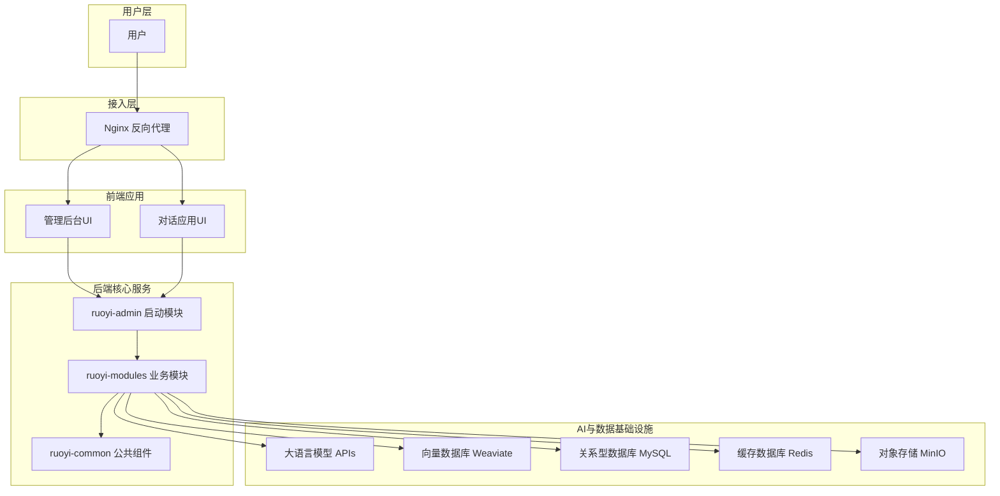
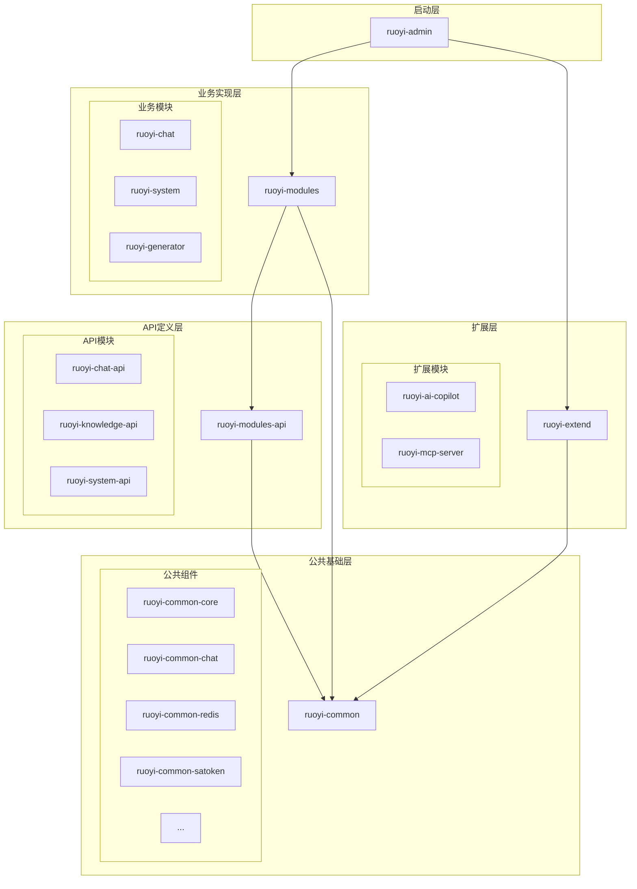
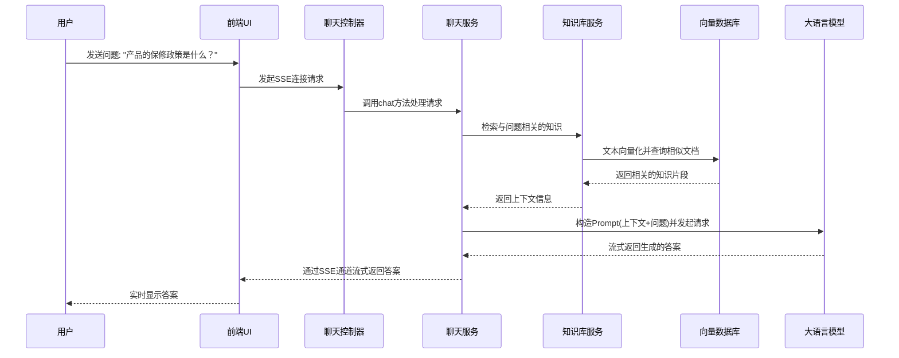
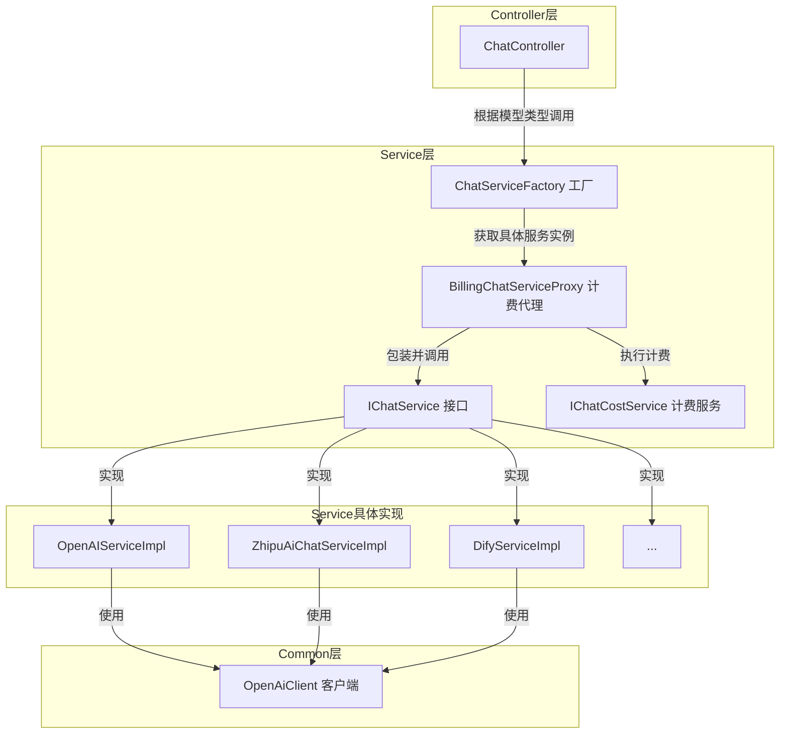
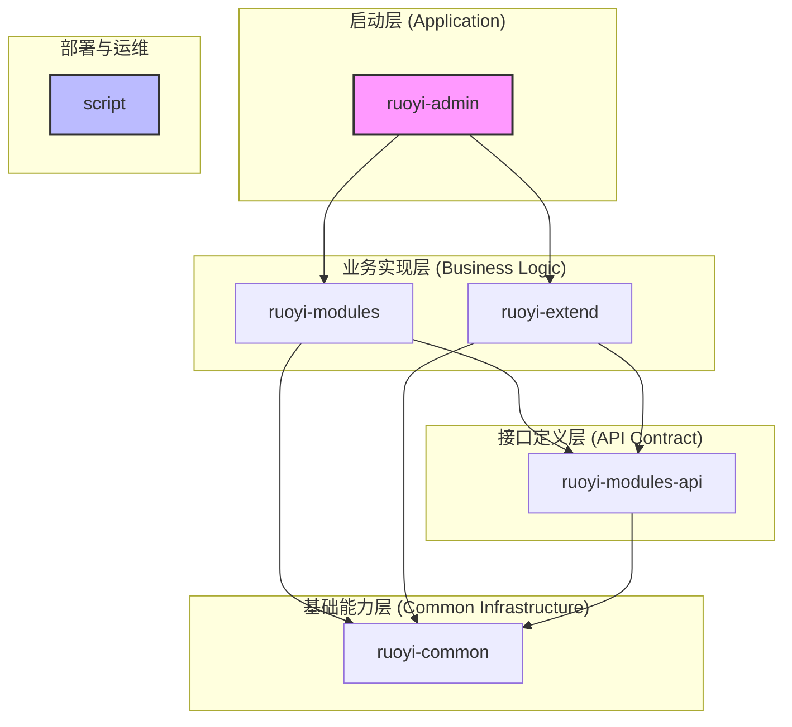

# RuoYi-AI
***

# 项目概述

RuoYi-AI 是一个基于广受欢迎的 RuoYi-Vue-Plus 后端框架深度整合AI能力的现代化、高性能的企业级应用平台。它不仅仅是一个简单的后台管理系统，更是一个面向未来的、具备强大AI原生功能的开发脚手架和解决方案。项目旨在帮助企业和开发者快速构建集成了大型语言模型（LLM）的智能应用，极大地降低了AI技术栈的集成门槛。

该项目的核心价值在于将传统企业级应用的稳定性、权限管理、工作流等核心功能，与前沿的AI技术（如多模型对话、知识库问答、AI工具调用等）无缝融合。它提供了一个统一的管理后台，允许管理员轻松配置和管理多种AI模型，包括但不限于OpenAI、智谱清言、通义千文、Dify、FastGPT等，实现了模型提供商的解耦和灵活切换。

主要功能方面，RuoYi-AI 平台提供了一套完整的AI应用解决方案。其**智能对话模块**是核心，支持流式响应，为用户带来流畅的交互体验。更进一步，项目内置了强大的**知识库管理与检索增强生成（RAG）**能力，用户可以轻松上传文档、网页等多种格式的资料，系统会自动进行切片、向量化并存入向量数据库（如 Weaviate），从而构建起能够回答特定领域问题的专家问答系统。此外，项目还探索了**AI Copilot（智能副驾）**和**AI Agent（智能体）**的应用，通过工具调用（Tool-use）机制，允许AI模型与外部系统进行交互，执行诸如文件读写、代码分析等复杂任务，展现了未来AI应用的巨大潜力。

项目的目标用户群体广泛，既包括希望为其现有业务系统（如CRM、ERP）注入AI能力的传统企业，也包括致力于开发新型AI原生应用的初创公司和独立开发者。通过提供一套成熟、可扩展的底层架构和丰富的AI功能模块，RuoYi-AI 极大地缩短了从概念到产品的开发周期，使开发者能够更专注于业务逻辑的创新，而非底层技术的复杂实现。

## 技术栈

*   **编程语言**:
    *   Java 17

*   **框架与库**:
    *   **后端核心**: Spring Boot, Spring Framework
    *   **持久层**: Mybatis-Plus
    *   **安全认证**: Sa-Token
    *   **AI集成**: Spring AI
    *   **缓存**: Redis
    *   **数据库**: MySQL
    *   **向量数据库**: Weaviate
    *   **对象存储**: MinIO
    *   **Websocket**: Spring WebSocket

*   **构建与工具**:
    *   **构建工具**: Maven
    *   **容器化**: Docker, Docker Compose
    *   **Web服务器/反向代理**: Nginx

*   **主要外部依赖**:
    *   **大语言模型 (LLM) API**:
        *   OpenAI
        *   智谱 (Zhipu)
        *   通义千问 (Qianwen)
        *   深度求索 (DeepSeek)
        *   Dify
        *   Coze
        *   FastGPT
        *   Ollama (本地模型)
    *   **前端框架**: (从部署脚本推断) Vue.js 或 React，使用 Vite 作为构建工具。

## 可视化图表

### 系统架构图

此图展示了 RuoYi-AI 平台的整体架构，从用户交互、前端应用、后端服务到基础设施的全貌。



### 模块依赖关系图

此图清晰地展示了项目各个Maven模块之间的层次和依赖关系。



### 关键调用流程图：知识库问答

此序列图详细描述了当用户提出一个与知识库相关的问题时，系统内部的数据流转和处理过程。



## 模块解析

RuoYi-AI 项目采用了清晰的模块化设计，每个模块职责分明，易于维护和扩展。

### 1. **`ruoyi-admin` (应用启动模块)**

*   **核心职责**:
    作为项目的唯一入口和启动模块，`ruoyi-admin`负责整合所有业务模块和公共组件，并启动整个Spring Boot应用。它也承载了后台管理的核心控制器，是所有HTTP请求的接入点。
*   **关键文件/组件/功能**:
    *   `RuoYiAIApplication.java`: 应用的Spring Boot主启动类，是整个程序的起点。
    *   `controller/`: 包含一些基础的控制器，如 `IndexController`，用于提供基础的API端点。
    *   `resources/application.yml`: 主配置文件，定义了服务端口、数据库连接、Redis配置等核心环境参数。

### 2. **`ruoyi-common` (公共基础模块)**

*   **核心职责**:
    提供整个项目可复用的通用功能和基础能力，包括核心工具类、配置、常量、以及对第三方服务的封装，实现了底层能力的标准化和共享。
*   **关键文件/组件/功能**:
    *   **`ruoyi-common-core`**: 定义了项目的基础结构，如 `R` 统一响应体、`BaseController`、全局异常、常量定义等。
    *   **`ruoyi-common-chat`**: 对AI聊天相关的能力进行了核心封装。`openai/OpenAiClient.java` 提供了与OpenAI兼容的API客户端，`entity/` 目录定义了与各类LLM交互时的数据结构（DTO）。这是实现多模型支持的基础。
    *   **`ruoyi-common-mybatis`**: 集成了 Mybatis-Plus，并实现了数据权限的切面（`DataPermissionAspect`），能够根据用户角色自动在SQL查询中加入数据过滤条件。
    *   **`ruoyi-common-satoken`**: 封装了Sa-Token认证框架，提供了`LoginHelper`等工具类，简化了登录认证和权限校验的逻辑。
    *   **`ruoyi-common-redis`**: 提供了Redis的配置和`RedisUtils`工具类，为系统提供了高性能的缓存能力。
    *   **`ruoyi-common-security`**: 安全模块，依赖 `satoken`，配置了全局的URL拦截规则和异常处理。

### 3. **`ruoyi-modules-api` (业务API定义模块)**

*   **核心职责**:
    定义了各个核心业务模块的领域模型（Domain）、数据传输对象（BO/VO）、数据库映射接口（Mapper）以及服务层接口（Service Interface）。它作为服务实现与服务调用之间的契约，实现了模块间的解耦。
*   **关键文件/组件/功能**:
    *   **`ruoyi-chat-api`**: 定义了聊天业务所需的所有实体类（如 `ChatMessage`）、Mapper接口（`ChatMessageMapper`）和服务接口（`IChatMessageService`），为聊天功能的实现提供了标准。
    *   **`ruoyi-knowledge-api`**: 定义了知识库功能的核心模型，如 `KnowledgeInfo` (知识库)、`KnowledgeFragment` (知识片段)等，并提供了相关的服务接口如 `IKnowledgeInfoService` 和 `VectorStoreService`，后者是与向量数据库交互的核心抽象。
    *   **`ruoyi-system-api`**: 包含了RuoYi框架原有的核心系统管理功能定义，如用户、角色、菜单、部门等。

### 4. **`ruoyi-modules` (业务逻辑实现模块)**

*   **核心职责**:
    这是项目的业务核心，包含了对`ruoyi-modules-api`中定义的接口的具体实现。
*   **关键文件/组件/功能**:
    *   **`ruoyi-chat`**:
        *   **核心职责**: 实现了所有AI聊天的业务逻辑。
        *   `controller/chat/ChatController.java`: 对话接口的入口，处理来自前端的SSE（Server-Sent Events）连接请求，实现流式输出。
        *   `factory/ChatServiceFactory.java`: **核心设计模式**。这是一个工厂类，它会根据用户请求的模型类型（如`zhipu`, `openai`），动态地从Spring容器中获取对应的`IChatService`实现类。这种设计使得添加新的模型支持变得非常简单，只需新增一个实现类即可。
        *   `service/chat/impl/`: 包含了对多种大语言模型的`IChatService`接口实现，例如 `OpenAIServiceImpl`, `ZhipuAiChatServiceImpl`等。每个实现类负责处理与特定模型API的通信逻辑。
        *   `service/chat/proxy/BillingChatServiceProxy.java`: **核心特性**。这是一个代理类，通过AOP或装饰器模式，在实际的聊天服务调用前后增加了计费逻辑（`IChatCostService`），实现了业务与计费的解耦。
    *   **`ruoyi-system`**: 实现了用户管理、权限控制、系统监控等后台管理系统的标准功能。
    *   **`ruoyi-generator`**: 提供了代码生成功能，可以根据数据库表结构快速生成包括前后端在内的全套代码，提升开发效率。

### 5. **`ruoyi-extend` (功能扩展模块)**

*   **核心职责**:
    提供非核心但具有前瞻性的实验性或扩展性功能，展示了项目的未来发展方向。
*   **关键文件/组件/功能**:
    *   **`ruoyi-ai-copilot`**:
        *   **核心职责**: 一个基于Spring AI实现的AI智能副驾示例，展示了如何构建一个具备工具调用能力的AI Agent。
        *   `config/SpringAIConfiguration.java`: 配置Spring AI，包括与模型和工具的集成。
        *   `tools/`: 包含了多个AI可以调用的工具类，如 `ReadFileTool.java`, `WriteFileTool.java`, `ListDirectoryTool.java`。这些工具通过函数描述被注册到AI模型中，当AI判断需要时，会调用这些Java方法来与本地文件系统交互，从而完成复杂任务。

### 6. **`script` (部署与运维模块)**

*   **核心职责**:
    提供了一整套用于自动化构建、部署和运维项目的脚本和配置文件。
*   **关键文件/组件/功能**:
    *   `docker/`: 包含了 `docker-compose.yml` 文件，用于一键启动项目所需的基础设施，如 `weaviate` 向量数据库和 `minio` 对象存储。
    *   `deploy/`: 提供了完整的容器化部署方案，包括：
        *   `Dockerfile-Resources/`: 为后端、管理后台前端、Web端分别准备了Dockerfile。
        *   `build-docker-images/`: 用于构建Docker镜像的脚本。
        *   `one-step-script/`: 一键部署脚本，自动化处理环境变量替换、镜像构建和容器启动，大大简化了部署流程。

## 4.1 各个模块内文件/组件/功能关系图

### `ruoyi-chat` 模块核心组件关系图

此图展示了聊天模块内部，从接收请求到调用不同AI模型服务并计费的完整流程。



### `ruoyi-knowledge` 知识库模块核心组件关系图

此图描述了知识库文档从上传、处理到最终可供检索的整个生命周期。

```mermaid
graph TD
    subgraph Controller层
        A[KnowledgeController]
    end
    subgraph Service层
        B[IKnowledgeInfoService 知识库服务]
        C[VectorStoreService 向量存储服务]
    end
    subgraph Chain (处理链)
        D[ResourceLoaderFactory 加载器工厂]
        E[TextSplitter 文本分割器]
    end
    subgraph 外部依赖
        F[向量数据库 Weaviate]
        G[对象存储 MinIO]
    end

    A -- "上传文件" --> B
    B -- "存储原始文件" --> G
    B -- "调用加载器" --> D
    D -- "根据文件类型创建加载器" --> E
    E -- "分割文本" --> C
    C -- "存储向量" --> F
```

## 典型应用场景

1.  **搭建企业专属智能知识库**
    *   **场景**: 某企业希望为内部员工创建一个智能问答机器人，用于查询公司规章制度、产品手册和技术文档。
    *   **实现**:
        1.  管理员登录 **RuoYi-AI** 管理后台 (`ruoyi-admin-ui`)。
        2.  在“知识库管理”模块中，创建一个名为“公司内部知识库”的新知识库。
        3.  通过上传接口，将公司的PDF、Word、Markdown等格式的文档批量上传到该知识库中。
        4.  系统后台的 `KnowledgeInfoServiceImpl` 接收到文件后，将其存入 **MinIO**，并调用 `ResourceLoader` 读取内容，再由 `TokenTextSplitter` 进行智能分块。
        5.  `VectorStoreServiceImpl` 将文本块通过 **LLM Embedding API** 转换为向量，并存储到 **Weaviate** 向量数据库中。
        6.  员工通过公司内部门户 (`ruoyi-web-ui`) 的对话界面提问：“新员工的入职流程是怎样的？”
        7.  `ChatService` 接收到问题后，首先在“公司内部知识库”中进行向量检索，找到最相关的几个文档片段作为上下文，然后将上下文和问题一起发送给大语言模型，最终生成精准、可靠的回答。

2.  **AI 辅助软件开发与运维**
    *   **场景**: 开发团队需要快速理解一个复杂的旧项目，并进行代码重构。
    *   **实现**:
        1.  开发者启动 `ruoyi-ai-copilot` 扩展模块。
        2.  在对话界面中，开发者可以向 AI 发出指令，如：“请列出 `/workspace` 目录下的所有文件。”
        3.  AI Agent接收到指令，通过其函数调用能力，匹配到 `ListDirectoryTool` 工具并执行，返回文件列表。
        4.  开发者继续下达指令：“读取 `sample.txt` 文件的内容。” AI Agent 随即调用 `ReadFileTool` 并返回文件内容。
        5.  开发者可以进一步提出更复杂的请求，如：“分析这个Java项目的依赖结构，并找出所有废弃的库。” AI Agent可以组合使用多个工具，逐步完成代码分析、文件读写、信息整合等一系列任务，最终给出一份详尽的分析报告。

3.  **多云AI服务集成与成本控制**
    *   **场景**:一家跨国公司希望利用全球不同地区的AI模型提供服务，同时需要严格控制API调用成本。
    *   **实现**:
        1.  系统管理员在 **RuoYi-AI** 的“模型管理”界面，配置了多个模型提供商，包括OpenAI（用于北美用户）、智谱AI（用于中国用户），并为每个模型设置了精确的Token计费单价。
        2.  在“用户管理”中，为不同地区的用户组设置了不同的默认使用模型和消费额度上限。
        3.  当一个中国用户发起对话时，`ChatServiceFactory` 会根据预设规则自动选择 `ZhipuAiChatServiceImpl`。
        4.  `BillingChatServiceProxy` 在每次API调用前后，会记录请求和响应的Token数量，并结合模型单价，实时更新该用户的消费数据，记录到 `chat_usage_token` 表中。
        5.  当用户的消费额度接近上限时，系统可以自动发送提醒或限制其使用，从而实现了对多云AI资源的灵活调度和精细化成本管理。


***

# **RuoYi-AI 项目代码库分析文档**

#### **目录**
1.  [项目概览](#1-项目概览)
    -   [1.1. 项目目的与边界](#11-项目目的与边界)
    -   [1.2. 顶层结构、技术栈与运行时](#12-顶层结构技术栈与运行时)
2.  [模块与分层](#2-模块与分层)
    -   [2.1. 顶层模块清单](#21-顶层模块清单)
    -   [2.2. 模块依赖关系图](#22-模块依赖关系图)
3.  [核心功能说明](#3-核心功能说明)
    -   [3.1. 统一用户认证与权限管理 (System & Security)](#31-统一用户认证与权限管理-system--security)
    -   [3.2. 多模型智能对话 (Chat)](#32-多模型智能对话-chat)
    -   [3.3. 知识库与检索增强生成 (Knowledge & RAG)](#33-知识库与检索增强生成-knowledge--rag)
    -   [3.4. AI Copilot 与工具调用 (Extend)](#34-ai-copilot-与工具调用-extend)
4.  [数据结构与关系](#4-数据结构与关系)
    -   [4.1. 核心领域实体](#41-核心领域实体)
    -   [4.2. 数据版本演进](#42-数据版本演进)
5.  [接口与集成](#5-接口与集成)
    -   [5.1. 内部 REST API](#51-内部-rest-api)
    -   [5.2. 第三方服务集成](#52-第三方服务集成)

---

### **1. 项目概览**

#### **1.1. 项目目的与边界**

-   **项目目的**: 本项目 (RuoYi-AI) 是一个基于 RuoYi-Vue-Plus 框架的企业级后端平台，其核心目标是深度集成多种大型语言模型 (LLM) 和人工智能能力。它旨在提供一个统一的、可扩展的AI应用开发脚手架，让开发者能够快速构建包含智能对话、知识库问答、AI工具调用等功能的应用程序。
-   **项目边界 (推断)**:
    -   **In-Scope (范围内)**:
        -   提供一个统一的后台管理界面，用于管理系统用户、角色、AI模型配置、知识库等。
        -   封装对多种主流及本地LLM的API调用，提供统一的服务接口。
        -   实现完整的 RAG (Retrieval-Augmented Generation, 检索增强生成) 流程，包括文档上传、解析、向量化、存储和检索。
        -   提供基于 SSE (Server-Sent Events) 的流式对话API。
        -   集成用户 Token/次数 计费与消耗统计功能。
        -   提供实验性的 AI Copilot / Agent 功能，探索 AI 的工具调用能力。
        -   提供完整的容器化部署方案 (Docker, Docker Compose)。
    -   **Out-of-Scope (范围外)**:
        -   项目本身不包含自研的AI模型。
        -   前端应用的具体实现代码不在此仓库中，但通过部署脚本 (`fetch-*.sh`) 引入。
        -   不直接处理支付网关的对接，但预留了订单和支付记录的数据模型。

#### **1.2. 顶层结构、技术栈与运行时**

-   **顶层结构**: 本项目是一个典型的 **多模块 (Multi-module) Maven 项目**。结构清晰，遵循了关注点分离原则，将不同职责的代码划分到独立的模块中，便于团队协作和独立维护。
-   **主要技术栈**:
    -   **后端**:
        -   **核心框架**: Spring Boot 3.x
        -   **持久层**: MyBatis-Plus
        -   **认证与授权**: Sa-Token
        -   **AI 框架**: Spring AI
        -   **缓存**: Redis (Redisson 客户端)
        -   **Websocket**: Spring WebSocket
        -   **HTTP 客户端**: OkHttp
    -   **数据存储**:
        -   **关系型数据库**: MySQL 8.x
        -   **向量数据库**: Weaviate
        -   **对象存储**: MinIO
-   **运行时**:
    -   **运行时环境**: Java 17
    -   **部署模式**: 采用容器化部署，通过 Docker Compose 编排 Nginx (Web/Admin UI), Backend (Java 应用), MySQL, Redis, Weaviate, MinIO 等多个服务。

### **2. 模块与分层**

#### **2.1. 顶层模块清单**

-   **`ruoyi-admin`**:
    -   **路径**: `/ruoyi-admin`
    -   **职责**: 项目的启动模块和主入口。它聚合了所有 `ruoyi-modules` 和 `ruoyi-extend` 模块，负责启动 Spring Boot 应用。同时，也包含少量的顶层控制器。
    -   **对外接口**: `RuoYiAIApplication.main()`
    -   **向内依赖**: `ruoyi-modules/*`, `ruoyi-extend/*`

-   **`ruoyi-common`**:
    -   **路径**: `/ruoyi-common`
    -   **职责**: 基础通用模块聚合器，本身不包含代码，只管理子模块。
    -   **子模块**: `ruoyi-common-core`, `ruoyi-common-chat`, `ruoyi-common-redis`, `ruoyi-common-security`, `ruoyi-common-mybatis` 等，提供了如统一响应、Redis工具、安全配置、数据权限、LLM客户端封装等横切关注点的功能。

-   **`ruoyi-modules-api`**:
    -   **路径**: `/ruoyi-modules-api`
    -   **职责**: 业务API定义模块聚合器。
    -   **子模块**: `ruoyi-chat-api`, `ruoyi-knowledge-api`, `ruoyi-system-api`。这些模块定义了各业务领域的实体 (Entity)、数据传输对象 (DTO/VO)、Mapper 接口和服务 (Service) 接口，作为模块间通信的契约。

-   **`ruoyi-modules`**:
    -   **路径**: `/ruoyi-modules`
    -   **职责**: 核心业务逻辑实现模块聚合器。
    -   **子模块**: `ruoyi-chat`, `ruoyi-system`, `ruoyi-generator`, `ruoyi-wechat`。实现了 API 模块中定义的接口，包含了项目的核心业务逻辑。

-   **`ruoyi-extend`**:
    -   **路径**: `/ruoyi-extend`
    -   **职责**: 扩展功能模块聚合器，提供非核心但具有前瞻性的功能。
    -   **子模块**: `ruoyi-ai-copilot` (AI 编程副驾), `ruoyi-mcp-server` (未知/待确认，可能与模型上下文协议相关)。

-   **`script`**:
    -   **路径**: `/script`
    -   **职责**: 存放部署、运维相关的脚本和配置文件，包括 Dockerfile、docker-compose.yml、SQL 脚本和一键部署脚本。

#### **2.2. 模块依赖关系图**



### **3. 核心功能说明**

#### **3.1. 统一用户认证与权限管理 (System & Security)**

-   **业务目标**: 提供安全可靠的用户登录、身份验证和基于角色的访问控制 (RBAC)。
-   **输入/输出**:
    -   **输入**: 用户凭证 (账号密码/邮箱验证码/短信验证码)，封装在 `LoginBody`, `EmailLoginBody`, `SmsLoginBody` DTO 中。
    -   **输出**: 成功时返回 Token 和用户信息 (`LoginVo`)；失败时返回错误信息。
-   **主要流程**:
    1.  **登录请求**: 用户通过 `/login` API 发起登录请求。`SysLoginController` 接收请求。
    2.  **凭证校验**: `SysLoginService.login()` 方法被调用。它首先进行验证码校验，然后根据登录类型（密码/短信等）执行不同的验证逻辑。
    3.  **用户查找**: 通过 `SysUserMapper` 从数据库查询用户信息。
    4.  **密码/验证码比对**: 使用 Sa-Token 提供的加密工具比对密码，或校验 Redis 中存储的验证码。
    5.  **会话创建**: 验证成功后，调用 `LoginHelper.login()` 创建用户会话。Sa-Token 会生成一个 Token，并将用户 `LoginUser` 对象存入 Redis。
    6.  **返回 Token**: 将生成的 Token 封装在 `LoginVo` 中返回给客户端。
-   **状态变化**:
    -   在 Redis 中创建一条以 `satoken:login:token:` 为前缀的记录，存储 `LoginUser` 对象。
    -   在 `sys_logininfor` 表中插入一条登录成功或失败的日志记录。
-   **边界条件**:
    -   密码连续错误次数超过限制，账户将被锁定一段时间 (通过 Redis `pwd_err_cnt:` key 计数)。
    -   演示模式 (`demo mode`) 下，不允许执行修改或删除操作 (`DemoModeInterceptor`)。

#### **3.2. 多模型智能对话 (Chat)**

-   **业务目标**: 提供一个统一的、支持多种 LLM 的流式对话接口。
-   **输入/输出**:
    -   **输入**: `/chat/chat` (SSE) API 接收 `ChatRequest` 对象。
        -   **`ChatRequest` 数据结构**:
            ```java
            {
              "prompt": "你好", // 用户输入
              "sessionId": "uuid-12345", // 会话ID
              "modelName": "zhipu", // 请求的模型
              "chatMode": "chat", // 模式，如 chat, vector
              "knowledgeRole": { // (可选) 知识库角色配置
                "roleId": "role-uuid",
                "kid": "knowledge-base-uuid"
              }
            }
            ```
    -   **输出**: 通过 SSE 连接，以 `data: {...}` 的形式流式返回文本片段。结束后发送 `data: [DONE]`。
-   **主要流程**:
    1.  **SSE 连接**: `ChatController.chat()` 接收请求，创建一个 `SseEmitter` 对象并返回，保持 HTTP 长连接。
    2.  **服务选择**: `ChatServiceFactory.getChatService(chatRequest.getChatMode())` 方法根据请求中的 `chatMode` (如 `zhipu`, `openai`, `fastgpt`) 从 Spring IoC 容器中动态获取对应的 `IChatService` 实现类实例。这是一个典型的工厂模式应用。
    3.  **计费代理**: 获取到的服务实例实际上被 `BillingChatServiceProxy` 代理。代理在调用实际聊天服务前，会先执行计费检查逻辑 (`IChatCostService`)，判断用户余额/次数是否充足。
    4.  **模型调用**: 具体的服务实现类 (如 `ZhipuAiChatServiceImpl`) 构造符合目标 LLM API 格式的请求体，然后通过 `OpenAiStreamClient` (一个封装了 OkHttp 的通用客户端) 发起流式 API 请求。
    5.  **流式响应处理**:
        -   `OpenAiStreamClient` 注册一个 `SSEEventSourceListener` 监听器来处理来自 LLM 的流式事件。
        -   监听器的 `onEvent` 方法每接收到一个数据块，就解析内容，并通过传入的 `SseEmitter` 对象将其发送给客户端。
        -   `onClosed` 或 `onFailure` 方法负责在流结束或出错时关闭 `SseEmitter` 连接。
    6.  **成本核算**: 对话结束后，`BillingChatServiceProxy` 再次调用 `IChatCostService`，根据本次对话消耗的 Tokens 或次数，更新用户的账户信息。
-   **状态变化**:
    -   `sys_user` 表中的用户余额或剩余次数可能减少。
    -   `chat_usage_token` 表记录每次调用的 Token 消耗详情。
    -   `chat_message` 表存储完整的对话历史记录。

#### **3.3. 知识库与检索增强生成 (Knowledge & RAG)**

-   **业务目标**: 允许用户上传非结构化文档，构建领域知识库，并通过对话方式进行智能问答。
-   **子功能 1: 文档上传与向量化**
    -   **输入**: `/knowledge/upload` API，接收 `KnowledgeInfoUploadBo` 对象 (包含 `kid` 知识库ID和 `MultipartFile` 文件)。
    -   **主要流程**:
        1.  **文件存储**: `KnowledgeInfoServiceImpl` 调用 `OssClient` 将原始文件上传到 MinIO。
        2.  **内容加载**: `ResourceLoaderFactory` 根据文件扩展名 (pdf, docx, md 等) 选择合适的 `ResourceLoader` (如 `PdfFileLoader`) 来提取文本内容。
        3.  **文本分块**: `CharacterTextSplitter` 或 `TokenTextSplitter` 将提取出的长文本切分成语义完整、大小合适的文本块 (Chunks)。
        4.  **向量化与存储**:
            -   `VectorStoreServiceImpl.storeEmbeddings()` 方法被调用。
            -   它遍历所有文本块，通过配置的 Embedding 模型 API (如 OpenAI's `text-embedding-ada-002`) 将每个文本块转换为一个高维向量。
            -   最后，将文本块内容、其对应的向量以及元数据 (如原始文档ID) 一同存入 **Weaviate** 向量数据库。
    -   **状态变化**:
        -   在 MinIO 中新增一个原始文件对象。
        -   在 `knowledge_attach` 表中记录文件元数据。
        -   在 Weaviate 中新增多个数据对象 (Chunks)。
        -   在 `knowledge_fragment` 表中记录文本片段信息。

-   **子功能 2: 知识库问答**
    -   **输入**: 同智能对话，但 `chatMode` 为 `vector`，并附带 `knowledgeRole` 信息。
    -   **主要流程**:
        1.  **查询向量化**: `VectorStoreServiceImpl.getQueryVector()` 方法首先将用户的提问 (`QueryVectorBo.query`) 通过同样的 Embedding 模型 API 转换为查询向量。
        2.  **相似性检索**: 使用该查询向量在 Weaviate 中执行相似性搜索 (ANN, Approximate Nearest Neighbor)，找出与问题最相关的 Top-K 个文本块。
        3.  **构建 Prompt**: `FastGPTServiceImpl` (或类似服务) 将检索到的文本块作为上下文 (Context)，与用户的原始问题组合成一个增强的 Prompt。
            -   **Prompt 示例**:
                ```
                请根据以下信息回答问题：
                ---
                上下文1: [从 Weaviate 检索到的文本块...]
                上下文2: [从 Weaviate 检索到的文本块...]
                ---
                问题: [用户的原始问题]
                ```
        4.  **LLM 调用**: 将构建好的 Prompt 发送给 LLM，后续流程与标准对话相同。
    -   **输出**: LLM 基于提供的上下文生成的精准回答。

#### **3.4. AI Copilot 与工具调用 (Extend)**

-   **业务目标**: (推断) 探索 AI Agent 能力，使 LLM 能够调用外部工具 (Java 方法) 来完成更复杂的、与外部世界交互的任务。
-   **输入/输出**:
    -   **输入**: `/copilot/chat` API, 接收 `ChatRequestDto`。
    -   **输出**: 任务执行日志和最终结果，通过 SSE 流式返回。
-   **主要流程**:
    1.  **工具定义**: 在 `ruoyi-ai-copilot` 模块的 `tools/` 目录下定义了一系列工具类，如 `ReadFileTool`, `WriteFileTool`, `ListDirectoryTool`。每个 public 方法都使用 `@ToolFunction` 注解，并附有清晰的描述，告知 LLM 该工具的功能、参数和用法。
    2.  **Spring AI 配置**: `SpringAIConfiguration` 将这些工具注册到 Spring AI 的 `ChatClient` 中。
    3.  **用户指令**: 用户发出指令，如 "读取 workspace 目录下的 sample.txt 文件"。
    4.  **工具选择**: `ChatController` 将指令传递给配置了工具的 `ChatClient`。LLM 分析指令意图，发现需要读取文件，决定调用名为 `readFile` 的工具，并解析出参数 `path` 为 `workspace/sample.txt`。
    5.  **工具执行**: Spring AI 框架根据 LLM 的响应，自动调用 `ReadFileTool.readFile()` Java 方法，并将文件内容作为结果。
    6.  **结果返回与二次调用**: 工具执行的结果被返回给 LLM。LLM 会基于这个结果生成最终的人类可读的回答，或者决定调用下一个工具来继续完成任务。
    7.  **日志监控**: `ToolCallLoggingAspect` AOP 切面会拦截所有工具的调用，并将执行过程和结果通过 `LogStreamService` 以 SSE 的形式实时推送给前端，让用户可以看到 AI 的"思考过程"。

### **4. 数据结构与关系**

#### **4.1. 核心领域实体**

-   **`SysUser` (系统用户)** - `ruoyi-system-api`
    -   **字段**: `userId` (PK, Long), `tenantId` (String), `deptId` (Long), `userName` (String, UK), `nickName` (String), `password` (String), `status` (char), `userBalance` (Double), `userGrade` (String)。
    -   **关系**: 与 `SysRole` 为 N-N (通过 `sys_user_role`), 与 `SysPost` 为 N-N (通过 `sys_user_post`), 与 `SysDept` 为 N-1。

-   **`ChatSession` (聊天会话)** - `ruoyi-chat-api`
    -   **字段**: `id` (PK, String), `userId` (Long), `sessionName` (String), `createTime` (Date)。
    -   **职责**: 标识一次完整的用户对话过程。

-   **`ChatMessage` (聊天消息)** - `ruoyi-chat-api`
    -   **字段**: `id` (PK, Long), `sessionId` (String), `messageId` (String), `parentMessageId` (String), `modelName` (String), `role` (String, e.g., 'user', 'assistant'), `content` (Text)。
    -   **关系**: 与 `ChatSession` 为 N-1。`parentMessageId` 构成了对话的上下文链。

-   **`KnowledgeInfo` (知识库)** - `ruoyi-knowledge-api`
    -   **字段**: `id` (PK, Long), `kid` (String, UK), `name` (String), `avatar` (String), `description` (String), `modelName` (String, 向量化模型)。
    -   **关系**: 与 `SysUser` 为 N-1 (创建者)。

-   **`KnowledgeAttach` (知识库附件)** - `ruoyi-knowledge-api`
    -   **字段**: `id` (PK, Long), `kid` (String), `fid` (String, UK, 文件ID), `fileName` (String), `fileType` (String), `ossUrl` (String)。
    -   **关系**: 与 `KnowledgeInfo` 为 N-1。

-   **`KnowledgeFragment` (知识片段)** - `ruoyi-knowledge-api`
    -   **字段**: `id` (PK, Long), `kid` (String), `fid` (String), `chunkId` (String), `content` (Text), `vectorId` (String, 在 Weaviate 中的 ID)。
    -   **关系**: 与 `KnowledgeAttach` 为 N-1。

#### **4.2. 数据版本演进**

-   **初始结构**: `script/sql/ruoyi-ai.sql` 定义了项目的完整初始表结构。
-   **关键变更**: `script/sql/update/fix-upload-bucket.sql` 文件显示了一次配置修正。
    -   **变更点**: 将 `sys_oss_config` 表中 ID 为 4 的配置状态 (`status`) 改为 '1' (启用)，ID 为 1 的配置状态改为 '0' (禁用)。
    -   **影响**: 此变更将系统默认的对象存储从本地磁盘切换到了 MinIO，这是支持知识库功能的关键前置条件。
-   **未知/待确认**: 完整的数据库版本迁移历史（如使用 Flyway 或 Liquibase 的脚本）未提供，无法追溯所有表结构变更的细节。

### **5. 接口与集成**

#### **5.1. 内部 REST API**

-   **认证**: 大部分接口需要通过 Sa-Token 进行认证，请求头需携带 `Authorization: Bearer <token>`。部分接口如 `/login`, `/captchaImage` 被排除在外。
-   **通用响应**: 所有接口统一返回 `R` 对象，结构为 `{ "code": 200, "msg": "操作成功", "data": {...} }`。

-   **关键接口清单**:
    -   **认证接口 (`AuthController`)**:
        -   `POST /login`: 用户登录。
        -   `GET /captchaImage`: 获取图形验证码。
        -   `GET /getInfo`: 获取当前登录用户信息、角色和权限。
        -   `GET /getRouters`: 获取当前用户可访问的动态路由。
    -   **聊天接口 (`ChatController`)**:
        -   `POST /chat/chat`: **[核心]** 创建 SSE 连接，进行流式对话。
        -   `GET /chat/session/list`: 获取用户的所有会话列表。
    -   **知识库接口 (`KnowledgeController`)**:
        -   `POST /knowledge/upload`: **[核心]** 上传文档到指定知识库。
        -   `GET /knowledge/list`: 查询知识库列表。
        -   `POST /knowledge/add`: 新建一个知识库。
        -   `DELETE /knowledge/{kIds}`: 删除知识库。
    -   **用户管理 (`SysUserController`)**:
        -   `GET /system/user/list`: 分页查询用户列表。
        -   `GET /system/user/{userId}`: 获取用户详细信息。
        -   `PUT /system/user/changeStatus`: 修改用户状态。

#### **5.2. 第三方服务集成**

-   **LLM APIs**:
    -   **调用点**: 各 `IChatService` 实现类，如 `OpenAIServiceImpl`, `ZhipuAiChatServiceImpl`。
    -   **配置**: 主要通过数据库中的 `chat_config` 和 `chat_model` 表进行配置。管理员可以在后台动态添加和修改模型的 API Key, Base URL 等参数。
    -   **`chat_config`**: 存储通用配置，如 API Host。
    -   **`chat_model`**: 存储每个模型的具体配置，如模型名称 (`modelName`)、API Key、计费类型 (`billingType`)、单价等。

-   **Weaviate (向量数据库)**:
    -   **调用点**: `VectorStoreServiceImpl`。
    -   **配置**: 在 `application.yml` 中配置 Weaviate 的主机和端口。
        ```yaml
        # 未知/待确认: application.yml 中具体配置项路径待确认，但从 docker-compose.yml 可推断连接地址。
        # script/deploy/deploy/update_ruoyi-qi-sql.sh 脚本中出现 `weaviate:8080`
        ```
    -   **SDK**: (推断) 使用 Weaviate 官方 Java 客户端。

-   **MinIO (对象存储)**:
    -   **调用点**: `OssClient` (通过 `OssFactory` 创建)。
    -   **配置**: 在 `sys_oss_config` 表中进行配置，包括 `endpoint`, `accessKey`, `secretKey`, `bucketName` 等。系统启动时 `SystemApplicationRunner` 会加载并初始化默认配置。

-   **Redis**:
    -   **调用点**: `RedisUtils` (通用缓存), Sa-Token (会话存储), 限流/防重提交切面。
    -   **配置**: `application.yml` 中配置 Redis 的主机、端口、密码和数据库索引。