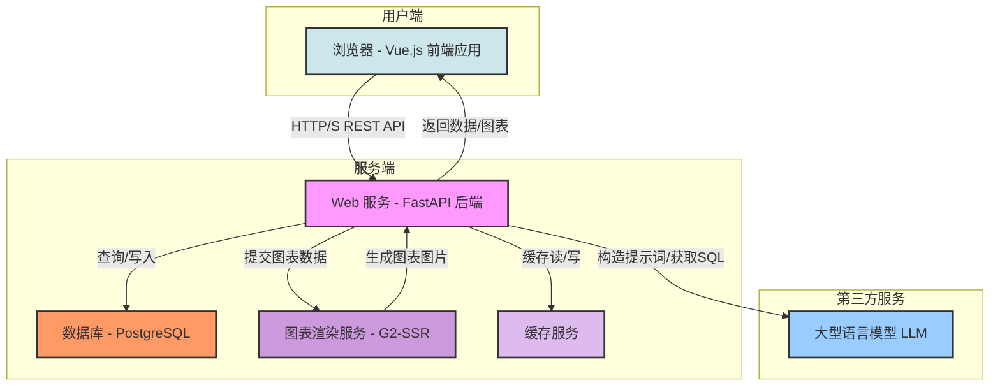
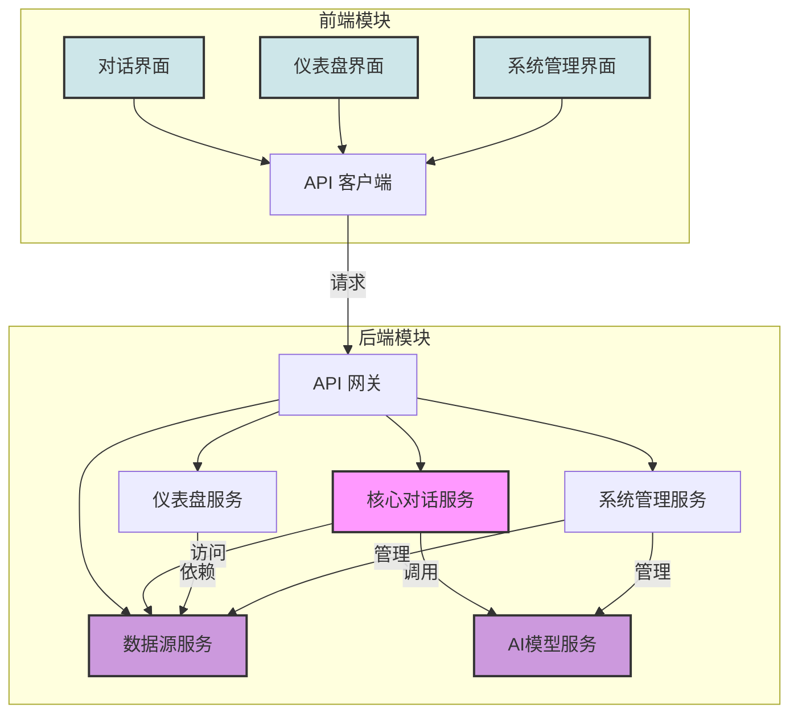
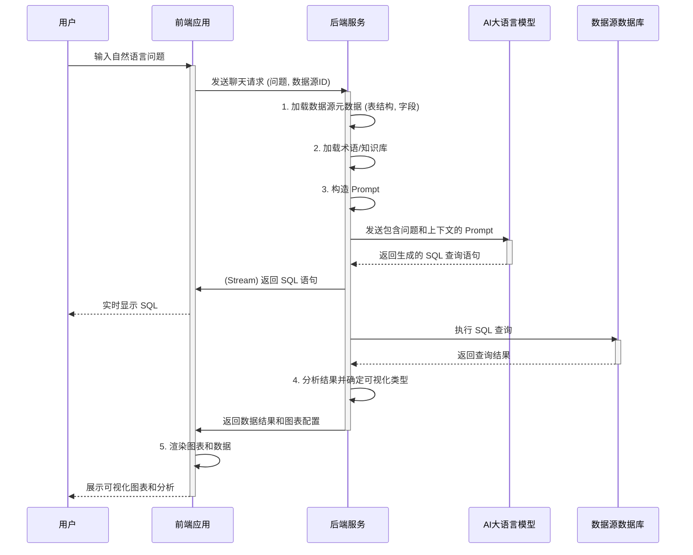
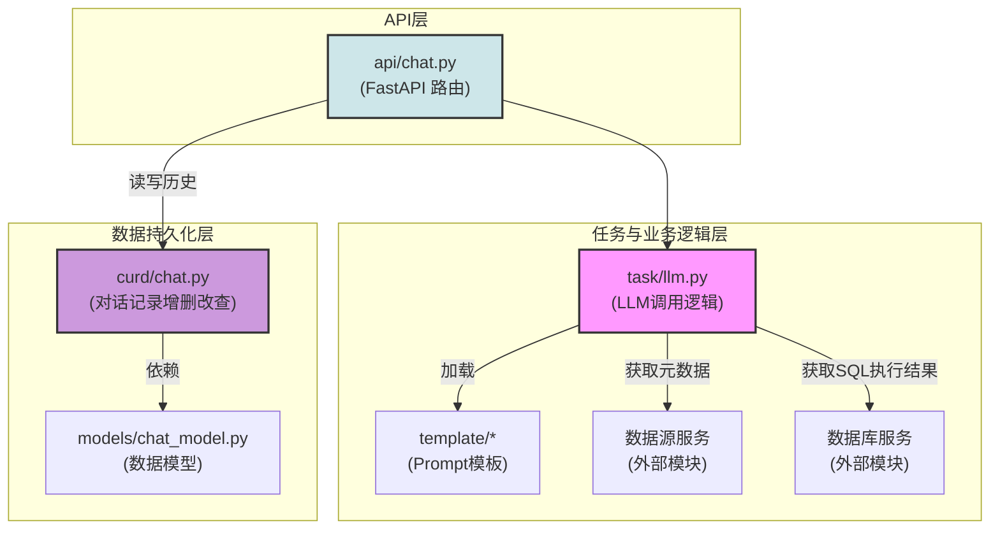
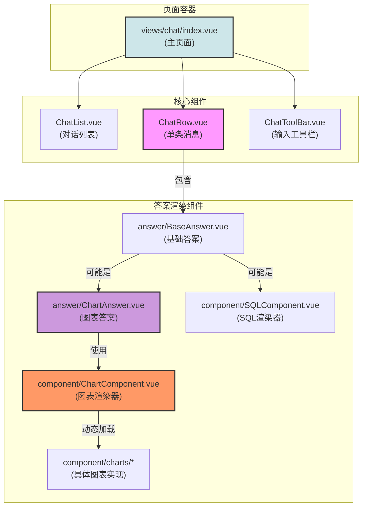
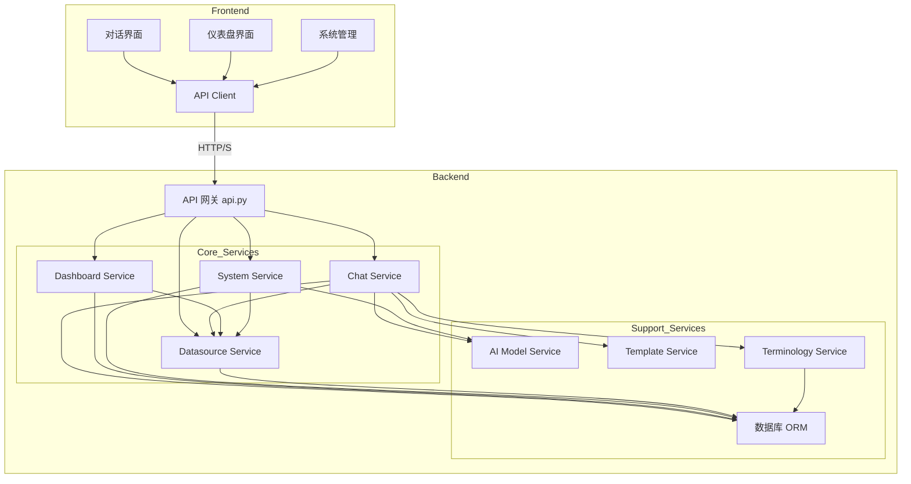

# SQLBot
# 项目概述

SQLBot 是一款创新的数据分析与交互平台，其核心定位是利用大型语言模型（LLM）的能力，将自然语言无缝转换为结构化查询语言（SQL），从而赋能非技术背景的用户通过对话方式与数据库进行交互、探索数据并获取洞察。项目旨在打破传统商业智能（BI）工具的技术壁垒，让数据分析变得像与智能助手聊天一样简单直观。

该项目的核心功能是实现一个完整的“文本到SQL”（Text-to-SQL）工作流。用户可以在一个友好的聊天界面中，使用日常语言提出数据查询需求，例如“查询上个季度销售额最高的前五个产品”或“展示各类商品的月度销售趋势”。SQLBot 的后端服务会接收这些问题，结合预先配置的数据源元数据（如表结构、字段信息、同义词等），通过精心设计的提示工程（Prompt Engineering）技术，引导大型语言模型生成准确、高效的SQL查询。生成的SQL不仅可以直接执行，还会返回给前端进行展示，增加了整个过程的透明度。

执行查询后，系统能自动将返回的数据以最合适的方式进行可视化呈现，支持包括表格、柱状图、折线图、饼图等多种图表类型。用户不仅能看到数据结果，更能直观地理解数据背后的模式与趋势。此外，项目还包含了强大的仪表盘（Dashboard）功能，允许用户将聊天中生成的有价值的图表和分析结果，通过拖拽的方式沉淀到可定制的仪表盘中，形成一个动态、可交互的数据报告。

SQLBot 的目标用户群体非常广泛，包括但不限于业务分析师、产品经理、运营人员以及企业管理层。对于这些用户而言，他们无需学习复杂的SQL语法或BI软件操作，即可快速完成数据查询和分析任务，从而将更多精力聚焦于业务决策本身。项目通过提供数据源管理、AI模型管理、用户权限控制以及嵌入式分析等功能，满足了从个人开发者到企业级应用的多种需求，致力于成为数据民主化进程中的强大推手。

---

## 技术栈

-   **编程语言**:
    *   Python 3.11 (后端)
    *   TypeScript, JavaScript (ESNext) (前端)

-   **框架与库**:
    *   **后端**:
        *   **Web 框架**: FastAPI
        *   **ASGI 服务器**: Uvicorn
        *   **ORM 与数据库交互**: SQLModel, SQLAlchemy
        *   **数据库迁移**: Alembic
        *   **AI/LLM 集成**: OpenAI API 兼容接口
    *   **前端**:
        *   **核心框架**: Vue.js 3
        *   **UI 组件库**: Element Plus
        *   **状态管理**: Pinia
        *   **路由**: Vue Router
        *   **图表库**: AntV G2
        *   **富文本编辑**: TinyMCE
        *   **Markdown 解析**: Markdown-it, Highlight.js
    *   **图表服务端渲染**:
        *   Node.js
        *   AntV G2-SSR, node-canvas

-   **构建与工具**:
    *   **前端构建**: Vite
    *   **代码规范与格式化**: Ruff, Pre-commit
    *   **容器化**: Docker, Docker Compose
    *   **Python 包管理**: uv

-   **主要外部依赖**:
    *   **数据库**: PostgreSQL
    *   **缓存**: Redis 或 内存缓存 (可配置)
    *   **大型语言模型 (LLM)**: 兼容 OpenAI API 的各类模型服务 (如 Azure OpenAI, Gemini, Kimi, 通义千问等)

---

## 可视化图表

#### 系统架构图



#### 模块依赖图



#### 关键调用流程图 (Text-to-SQL)



---

## 模块解析

### **后端 (Backend)**

#### **1. 系统管理模块 (System Management)**
*   **核心职责**: 负责整个系统的基础支撑功能，包括用户认证、授权、工作空间管理、AI模型配置以及系统设置等。
*   **关键文件/组件/功能**:
    *   `backend/apps/system/`: 模块根目录。
    *   `api/login.py`: 处理用户登录逻辑，生成并验证访问令牌。
    *   `api/user.py`, `api/workspace.py`: 提供用户和工作空间管理的CRUD接口。
    *   `api/aimodel.py`: 管理和配置项目所需的大语言模型（LLM）和嵌入模型（Embedding Model）。用户可以在此添加、修改和删除不同的AI模型配置，如API密钥、终端地址等。
    *   `crud/`: 包含了与数据库交互的底层实现，实现了业务逻辑与数据访问的分离。
    *   `middleware/auth.py`: FastAPI中间件，用于拦截API请求，验证用户Token，确保接口访问的安全性。
    *   `models/system_model.py`, `models/user.py`: 定义了系统和用户相关的数据模型（SQLModel），映射到数据库表。
*   **代码特性**:
    *   **认证机制**: 采用基于Token的认证方式，保障API接口的安全性。
    *   **多租户隔离**: 通过工作空间（Workspace）实现不同用户或团队的数据和资源隔离。
    *   **模型加密**: `crud/aimodel_manage.py` 中的 `async_model_info` 函数展示了一个异步任务，用于加密存储在数据库中的AI模型密钥和地址，增强了敏感信息的安全性。

#### **2. 数据源管理模块 (Datasource Management)**
*   **核心职责**: 允许用户连接和管理各种类型的数据库，并对数据源中的表和字段进行同步、配置和权限控制。
*   **关键文件/组件/功能**:
    *   `backend/apps/datasource/`: 模块根目录。
    *   `api/datasource.py`: 提供数据源连接、同步、删除以及获取表和字段信息的API。
    *   `crud/datasource.py`: 核心的CRUD操作，负责处理数据源的连接测试、元数据同步等。
    *   `crud/table.py`, `crud/field.py`: 分别管理数据源中的表和字段的元数据，支持自定义注释，这对于提升LLM生成SQL的准确性至关重要。
    *   `models/datasource.py`: 定义了数据源、表、字段等核心实体的数据模型。
    *   `utils/utils.py`: 包含加密工具函数 `aes_encrypt` 和 `aes_decrypt`，用于加密存储数据源的连接密码等敏感信息。
*   **代码特性**:
    *   **元数据同步**: 能够连接到数据库，自动拉取表结构和字段信息，为后续的Text-to-SQL提供上下文。
    *   **敏感信息加密**: 使用AES算法对数据库密码等敏感信息进行加密存储，防止信息泄露。

#### **3. 核心对话服务模块 (Core Chat Service)**
*   **核心职责**: 这是SQLBot的大脑，负责接收前端的自然语言问题，编排整个Text-to-SQL的流程，包括构建提示、调用LLM、执行SQL以及后处理。
*   **关键文件/组件/功能**:
    *   `backend/apps/chat/`: 模块根目录。
    *   `api/chat.py`: 对话流程的主入口API，接收用户问题并启动处理流程。
    *   `task/llm.py`: 包含了调用大型语言模型的具体逻辑，将构造好的Prompt发送给AI模型并获取响应。
    *   `curd/chat.py`: 负责对话历史记录的存储和读取。
    *   `models/chat_model.py`: 定义了对话（Chat）和对话记录（ChatRecord）的数据模型。
    *   `backend/apps/template/`: **极为关键的目录**，存放着用于生成不同类型Prompt的YAML模板。
        *   `generate_sql/generator.py`: 加载生成SQL的模板。
        *   `generate_chart/generator.py`: 加载生成图表建议的模板。
        *   `template.yaml`: 定义了所有Prompt的结构和内容，是影响LLM输出质量的核心。
*   **代码特性**:
    *   **模板驱动的提示工程**: 通过 `template.yaml` 将复杂的提示词逻辑结构化、配置化，使得优化和调整对LLM的指令变得简单高效。
    *   **异步任务处理**: 对话流程中调用LLM和数据库查询等耗时操作，适合采用异步方式处理，提升系统吞吐量。

#### **4. 仪表盘模块 (Dashboard Service)**
*   **核心职责**: 提供创建、管理和展示仪表盘的功能。用户可以将对话中生成的图表保存到仪表盘中，进行自由布局和组合。
*   **关键文件/组件/功能**:
    *   `backend/apps/dashboard/`: 模块根目录。
    *   `api/dashboard_api.py`: 提供仪表盘资源的增删改查以及布局保存的接口。
    *   `crud/dashboard_service.py`: 仪表盘相关的核心业务逻辑实现。
    *   `models/dashboard_model.py`: 定义了仪表盘（Dashboard）和仪表盘内组件的数据模型。
*   **代码特性**:
    *   **画布布局存储**: `canvas_view_info` 字段用于存储仪表盘的布局信息，通常为JSON格式，记录了每个组件的位置、大小等属性。

### **前端 (Frontend)**

#### **1. 对话界面模块 (Chat UI)**
*   **核心职责**: 为用户提供与SQLBot进行交互的核心界面，包括输入问题、展示对话历史、渲染SQL代码、呈现数据图表等。
*   **关键文件/组件/功能**:
    *   `frontend/src/views/chat/`: 模块根目录。
    *   `index.vue`: 对话页面的主容器，整合了聊天列表、聊天窗口和输入区域。
    *   `ChatRow.vue`: 单条对话消息的组件，能够根据消息类型（用户问题、机器人回答、图表、SQL）显示不同的内容。
    *   `answer/ChartAnswer.vue`: 专门用于渲染图表类型答案的组件。
    *   `component/ChartComponent.vue`: 图表渲染的核心组件，它会动态加载不同的图表实现。
    *   `component/charts/`: 包含了各种具体图表（如 `Bar.ts`, `Line.ts`）的实现，基于AntV G2封装。
*   **代码特性**:
    *   **组件化设计**: 将对话中的不同元素（问题、文本回复、SQL、图表）抽象为独立的Vue组件，易于维护和扩展。
    *   **动态图表渲染**: 通过 `getChartInstance` 工厂函数，根据后端返回的图表类型，动态创建并渲染对应的图表实例。

#### **2. 仪表盘模块 (Dashboard UI)**
*   **核心职责**: 提供仪表盘的创建、编辑和查看界面，支持用户通过拖拽方式自由布局图表组件。
*   **关键文件/组件/功能**:
    *   `frontend/src/views/dashboard/`: 模块根目录。
    *   `editor/DashboardEditor.vue`: 仪表盘编辑器核心组件，提供了工具栏和画布。
    *   `canvas/CanvasCore.vue`: 核心画布组件，负责组件的拖拽、缩放等交互操作。
    *   `preview/SQPreviewShow.vue`: 用于展示最终渲染好的仪表盘。
    *   `components/`: 存放仪表盘中的各种可复用组件，如文本框 (`sq-text`)、视图 (`sq-view`) 等。
*   **代码特性**:
    *   **拖拽式布局**: 实现了基于画布的自由布局系统，用户体验友好。
    *   **状态快照**: 使用Pinia store (`stores/dashboard/snapshot.ts`) 可能用于实现仪表盘编辑过程中的撤销/重做功能。

## 各个模块内文件/组件/功能关系图

#### 核心对话服务 (Backend) 内部关系图



#### 对话界面 (Frontend) 内部关系图



## 典型应用场景

**场景：市场运营团队需要快速了解不同渠道来源的用户增长情况，并制作周报。**

1.  **连接数据源**:
    运营负责人小张首先在 SQLBot 的【数据源管理】页面，配置并连接了公司的用户行为分析数据库（例如 PostgreSQL）。系统自动同步了数据库中的相关表，如 `users` (用户信息表) 和 `events` (行为事件表)。小张还为一些关键字段添加了中文注释，比如将 `utm_source` 字段的注释改为“广告来源渠道”。

2.  **开始对话式分析**:
    小张打开 SQLBot 的对话界面，创建一个新的聊天，并选择刚刚配置的用户行为数据库。
    *   **第一次提问**: 他在输入框中用自然语言提问：“**统计上周每天新增的用户数**”。
    *   **SQLBot 的响应**:
        *   系统界面几乎立刻展示出由 LLM 生成的 SQL 查询语句：
          ```sql
          SELECT DATE(created_at) AS creation_date, COUNT(id) AS new_users
          FROM users
          WHERE created_at >= '2025-09-22' AND created_at < '2025-09-29'
          GROUP BY creation_date
          ORDER BY creation_date ASC;
          ```
        *   同时，后端服务执行该 SQL，并将查询结果返回。
        *   前端根据返回的数据，自动选择并渲染了一张**折线图**，清晰地展示了上一周每日用户增长的趋势。

3.  **深化探索**:
    看到总体趋势后，小张想进一步挖掘细节。
    *   **第二次提问**: 他接着问：“**按渠道来源拆分，看看哪个渠道上周带来的新用户最多**”。
    *   **SQLBot 的响应**:
        *   系统理解了上下文，结合第一次查询的“上周”和“新用户”概念，生成了新的 SQL：
          ```sql
          SELECT utm_source, COUNT(id) AS new_users
          FROM users
          WHERE created_at >= '2025-09-22' AND created_at < '2025-09-29'
          GROUP BY utm_source
          ORDER BY new_users DESC;
          ```
        *   这次，系统智能地选择了一张**柱状图**来展示不同渠道的用户数对比，让小张一目了然地看到了效果最好的渠道。

4.  **创建仪表盘**:
    小张认为这两张图对于周报非常有价值。
    *   他点击图表右上角的“添加到仪表盘”按钮。
    *   在弹出的对话框中，他选择“新建仪表盘”，并命名为“用户增长周报”。
    *   他将折线图和柱状图都添加到了这个新的仪表盘中。
    *   进入仪表盘编辑页面，他通过简单的拖拽调整了两张图表的大小和位置，并在旁边添加了一个富文本组件，输入了本周的结论摘要。

5.  **分享与协作**:
    完成仪表盘制作后，小张点击“分享”按钮，生成一个链接，直接发送到团队的工作群中。团队成员点击链接即可实时查看最新的用户增长数据，无需再等待小张手动制作和发送报表截图。整个过程从数据查询到报表生成，耗时不到十分钟。


# **SQLBot 项目代码技术文档**

---

### **目录**
1.  [项目概览](#1-项目概览)
    -   [1.1 项目目的与边界](#11-项目目的与边界)
    -   [1.2 顶层结构与技术栈](#12-顶层结构与技术栈)
2.  [模块与分层](#2-模块与分层)
    -   [2.1 模块清单](#21-模块清单)
    -   [2.2 模块依赖关系图](#22-模块依赖关系图)
3.  [核心功能说明](#3-核心功能说明)
    -   [3.1 系统管理核心功能](#31-系统管理核心功能)
    -   [3.2 数据源管理核心功能](#32-数据源管理核心功能)
    -   [3.3 核心对话 (Text-to-SQL) 功能](#33-核心对话-text-to-sql-功能)
    -   [3.4 仪表盘核心功能](#34-仪表盘核心功能)
4.  [数据结构与关系](#4-数据结构与关系)
    -   [4.1 核心领域实体](#41-核心领域实体)
    -   [4.2 数据库模式演进](#42-数据库模式演进)
5.  [接口与集成](#5-接口与集成)
    -   [5.1 后端核心 API](#51-后端核心-api)
    -   [5.2 第三方服务集成](#52-第三方服务集成)

---

### **1. 项目概览**

#### **1.1 项目目的与边界**

**项目目的**：
SQLBot 是一个基于大型语言模型（LLM）的智能数据分析平台。其核心目标是通过自然语言处理（NLP）技术，将用户的自然语言问题转化为可执行的 SQL 查询，从而实现通过对话方式进行数据探索、分析和可视化。该项目旨在降低数据分析的技术门槛，使非技术人员（如业务分析师、运营人员）也能轻松地与数据库交互，获取数据洞察，并创建可交互的数据仪表盘。

**项目边界（推断）**：
*   **输入**：用户的自然语言问题、数据源连接信息、AI 模型配置、仪表盘布局配置。
*   **输出**：可执行的 SQL 查询、格式化的数据结果、多种类型的可视化图表（表格、柱状图、折线图等）、可交互的仪表盘页面。
*   **核心能力**：Text-to-SQL 转换、数据查询与执行、结果集自动可视化、仪表盘构建与展示、多数据源管理、多 AI 模型管理、用户与权限管理。
*   **非目标**：项目不负责底层数据库的运维和管理，仅作为数据查询和分析的中间层。它不是一个通用的 SQL 客户端，而是专注于自然语言驱动的 BI 分析。项目本身不包含大型语言模型，而是通过 API 与外部 LLM 服务集成。

#### **1.2 顶层结构与技术栈**

**顶层结构**：
项目采用**前后端分离的多服务架构**。
*   **`backend`**：基于 Python FastAPI 的后端单体服务，负责所有核心业务逻辑、API 提供和第三方服务集成。
*   **`frontend`**：基于 Vue.js 的前端单页应用（SPA），提供所有用户交互界面。
*   **`g2-ssr`**：一个独立的 Node.js 服务，用于服务器端渲染（SSR）G2 图表，推断是为了在无客户端环境或生成报告时输出图表图片。
*   **`installer`**：包含部署脚本和配置文件，使用 Docker Compose 进行容器化部署。

**主要技术栈**：
*   **运行时**:
    *   后端: Python 3.11
    *   前端: Node.js (v18.x)
    *   数据库: PostgreSQL (v17.6)
    *   容器: Docker
*   **后端框架与库**:
    *   Web 框架: FastAPI
    *   ORM: SQLModel, SQLAlchemy
    *   数据库迁移: Alembic
    *   异步 Web 服务器: Uvicorn
*   **前端框架与库**:
    *   核心框架: Vue.js 3
    *   UI 库: Element Plus
    *   状态管理: Pinia
    *   图表: AntV G2
    *   构建工具: Vite
*   **开发与部署工具**:
    *   代码检查/格式化: Ruff, Pre-commit
    *   部署编排: Docker Compose

### **2. 模块与分层**

#### **2.1 模块清单**

**后端 (`backend/apps`)**

| 模块名称 | 路径 | 核心职责 | 对外接口 (API) | 向内依赖 |
| :--- | :--- | :--- | :--- | :--- |
| **System** | `system/` | 用户认证、授权、工作空间、AI模型、助手及嵌入式配置管理。 | `/login`, `/user`, `/workspace`, `/system/*` | `common`, `db` |
| **Datasource** | `datasource/` | 管理外部数据源连接，同步表和字段元数据，处理数据权限。 | `/datasource/*`, `/ds_permission/*` | `common`, `db`, `ai_model` (用于 Embedding) |
| **AI Model** | `ai_model/` | 封装与外部大语言模型 (LLM) 和嵌入 (Embedding) 模型的交互。 | (内部服务) | `common` |
| **Chat** | `chat/` | 处理核心的 Text-to-SQL 流程，管理对话历史。 | `/chat/*` | `datasource`, `ai_model`, `template`, `db` |
| **Template** | `template/` | 存储和管理用于构建 Prompt 的 YAML 模板。 | (内部服务) | - |
| **Dashboard** | `dashboard/` | 仪表盘的创建、布局保存、组件管理。 | `/dashboard/*` | `datasource`, `db` |
| **Terminology** | `terminology/` | 管理专业术语/词汇表，用于提升 LLM 理解业务上下文的准确性。 | `/settings/terminology`, `/system/terminology` | `db` |
| **Data Training**| `data_training/`| （推断）管理用于模型微调或上下文增强的数据集。 | `/system/data-training` | `db` |
| **MCP** | `mcp/` | （推断）多渠道平台（Multi-Channel Platform）相关接口，可能用于支持嵌入式或多应用场景。 | `/mcp/*` | `chat` |

**前端 (`frontend/src`)**

| 模块名称 | 路径 | 核心职责 |
| :--- | :--- | :--- |
| **Views** | `views/` | 包含所有页面的高级组件，如对话、仪表盘、系统设置等。 |
| **API** | `api/` | 封装所有与后端交互的 HTTP 请求。 |
| **Components**| `components/` | 可复用的基础 UI 组件，如布局、图标、富文本编辑器等。 |
| **Stores** | `stores/` | 使用 Pinia 进行全局状态管理，如用户信息、仪表盘状态。 |
| **Router** | `router/` | 定义前端路由规则。 |
| **Utils** | `utils/` | 通用工具函数，如请求封装、日期格式化、缓存处理等。 |

#### **2.2 模块依赖关系图**



### **3. 核心功能说明**

#### **3.1 系统管理核心功能**

*   **业务目标**：提供平台的基础配置和安全保障，包括用户登录、AI模型接入、多租户隔离等。
*   **主要流程：用户登录**
    1.  **输入**：用户在前端 `login/index.vue` 页面输入账号和密码。
    2.  **前端加密**：`frontend/src/api/login.ts` 中的 `AuthApi.login` 方法调用 `LicenseGenerator.sqlbotEncrypt` (一个全局 JS 函数) 对用户名和密码进行加密。
        *   **未知/待确认**：`LicenseGenerator` 对象的具体来源和加密算法未知，推断为项目自定义的加密库或商业授权组件。
    3.  **API 请求**：前端向后端 `POST /login/access-token` 发起请求。
        *   **请求体 (x-www-form-urlencoded)**: `{ "username": "encrypted_username", "password": "encrypted_password" }`
    4.  **后端处理**：`backend/apps/system/api/login.py` 接收请求。
        *   使用 `sqlbot_decrypt` (`common/utils/crypto.py`) 解密凭证。此函数代理了 `sqlbot_xpack` 包的功能，表明加密/解密是商业扩展包（xpack）的一部分。
        *   在数据库中验证用户名和密码。
        *   如果验证成功，生成一个 JWT (JSON Web Token)。
    5.  **输出**：后端返回包含 Token 的 JSON 对象。
        *   **返回数据结构**: `{ "data": { ...user_info }, "token": "jwt_token" }`
    6.  **前端存储**：前端将 Token 存入 `localStorage` 或 `sessionStorage`，并用于后续所有 API 请求的 `Authorization` 头。

*   **主要流程：添加 AI 模型**
    1.  **输入**：管理员在前端 `system/model/ModelForm.vue` 页面填写 AI 模型信息。
    2.  **API 请求**：前端通过 `frontend/src/api/system.ts` 的 `modelApi.add` 方法向后端 `POST /system/aimodel` 发起请求。
        *   **请求数据结构 (`AiModelCreator`)**:
            ```typescript
            {
              "name": "模型名称", // string
              "model_type": 0, // integer, 0: 大语言模型
              "base_model": "gpt-4", // string
              "supplier": 1, // integer
              "protocol": 1, // integer
              "default_model": false, // boolean
              "api_domain": "https://api.openai.com/v1", // string
              "api_key": "sk-...", // string
              "config_list": [ // List[AiModelConfigItem]
                { "key": "temperature", "val": 0.7, "name": "温度" }
              ]
            }
            ```
    3.  **后端处理**：`backend/apps/system/api/aimodel.py` 接收请求。
        *   调用 `sqlbot_encrypt` 异步加密 `api_domain` 和 `api_key`。
        *   将加密后的模型信息存入数据库 `ai_model_detail` 表。
    4.  **输出**：返回成功或失败的状态。

#### **3.2 数据源管理核心功能**

*   **业务目标**：安全地连接用户数据库，并同步其元数据（表和字段信息），为 Text-to-SQL 提供必要的上下文。
*   **主要流程：添加并同步数据源**
    1.  **输入**：用户在前端 `ds/DatasourceForm.vue` 页面填写数据库连接信息（类型、地址、端口、用户名、密码等）。
    2.  **前端加密**：`frontend/src/views/ds/js/aes.ts` 中的 `encrypted` 函数使用 `CryptoJS` (AES-ECB 模式，密钥为硬编码的 `'SQLBot1234567890'`) 对密码等敏感字段进行加密。
    3.  **API 请求**：前端向后端 `POST /datasource` 发起请求。
    4.  **后端处理**：`backend/apps/datasource/api/datasource.py` 接收请求。
        *   使用 `utils/utils.py` 中的 `aes_decrypt`（与前端对应的 AES 密钥和模式）解密连接信息。
        *   尝试连接数据库以验证凭证的有效性。
        *   连接成功后，保存数据源信息到 `core_datasource` 表。
        *   **异步同步元数据**：启动一个后台任务，从用户数据库中拉取所有表（`information_schema.tables`）和字段（`information_schema.columns`）的元数据。
        *   将同步到的表和字段信息分别存入 `core_table` 和 `core_field` 表。
    5.  **输出**：返回新创建的数据源对象。

#### **3.3 核心对话 (Text-to-SQL) 功能**

*   **业务目标**：将用户的自然语言问题转化为 SQL，执行查询，并以最合适的形式（数据+图表）返回给用户。
*   **主要流程**：
    1.  **输入**：用户在 `frontend/src/views/chat/index.vue` 中输入问题，如“上周用户增长情况”。
    2.  **API 请求**：前端向后端 `POST /chat/completions` 发起流式（streaming）请求。
        *   **请求数据结构**:
            ```json
            {
              "chat_id": "...",
              "question": "上周用户增长情况",
              "datasource_id": "...",
              "model": "模型名称"
            }
            ```
    3.  **后端处理 (`backend/apps/chat/api/chat.py`)**:
        *   **步骤 1: 获取上下文**
            *   调用 `DatasourceService`，根据 `datasource_id` 从 `core_table` 和 `core_field` 表中查询出该数据源下所有已勾选的表结构和字段信息（包括字段名、类型、自定义注释）。
            *   调用 `TerminologyService`，获取相关的专业术语及其释义。
        *   **步骤 2: 构建 Prompt**
            *   调用 `TemplateService` (`backend/apps/template/generate_sql/generator.py`)，加载 `template.yaml` 中定义的 SQL 生成模板。
            *   将用户的原始问题、数据库方言（如 PostgreSQL）、表结构信息、专业术语等上下文信息填充到模板中，形成一个结构化的、信息丰富的 Prompt。
        *   **步骤 3: 调用 LLM 生成 SQL**
            *   调用 `AIModelService` (`backend/apps/ai_model/model_factory.py`)，将构建好的 Prompt 发送给用户指定的 LLM。
            *   以流式方式接收 LLM 返回的 SQL 语句，并实时通过 HTTP Stream 推送给前端。
        *   **步骤 4: 执行 SQL**
            *   接收完完整的 SQL 后，通过 `DatasourceService` 在用户的数据库上执行该查询。
        *   **步骤 5: 结果分析与可视化推荐**
            *   获取 SQL 查询结果（数据样本）。
            *   **再次调用 LLM**: 构建一个新的 Prompt（使用 `generate_chart/generator.py` 模板），将用户问题、SQL 语句、查询结果的数据样本和字段信息发送给 LLM，要求其推荐最合适的可视化图表类型（如`bar`, `line`, `pie`）并指定维度（x）、指标（y）和系列（series）。
        *   **步骤 6: 返回最终结果**
            *   将完整的 SQL 执行结果、LLM 推荐的图表配置（类型、轴信息）和一段分析性文字总结，作为最终结果返回给前端。
    4.  **输出**：前端接收到数据后，`frontend/src/views/chat/component/ChartComponent.vue` 会根据图表配置动态实例化并渲染 G2 图表。

#### **3.4 仪表盘核心功能**

*   **业务目标**：允许用户将对话中产生的有价值的图表固化到可定制的仪表盘中，用于持续监控和分享。
*   **主要流程：添加图表到仪表盘并保存布局**
    1.  **输入**：用户在对话界面点击图表上的“添加到仪表盘”按钮。
    2.  **API 请求 (创建)**：前端向后端 `POST /dashboard/create_canvas` 发送请求，将图表的配置信息（SQL、图表类型、轴设置等）保存为一个仪表盘组件。
    3.  **前端编辑**：用户进入 `frontend/src/views/dashboard/editor/DashboardEditor.vue` 页面，通过拖拽和缩放 `canvas/CanvasCore.vue` 中的组件来调整布局。
    4.  **API 请求 (更新)**：布局调整完成后，用户点击保存。前端将整个仪表盘的所有组件及其位置、大小信息（一个 JSON 对象）发送到后端 `POST /dashboard/update_canvas`。
        *   **请求数据结构 (部分)**:
            ```json
            {
              "dashboard_id": "...",
              "canvas_view_info": "[{\"_dragId\":\"...\",\"x\":0,\"y\":0,\"sizeX\":12,\"sizeY\":8,\"chart_id\":\"...\"}, ...]"
            }
            ```
    5.  **后端处理**：`backend/apps/dashboard/api/dashboard_api.py` 将 `canvas_view_info` (JSON 字符串) 保存到 `core_dashboard` 表的同名字段中。
    6.  **输出**：保存成功。当用户再次访问该仪表盘时，前端会获取 `canvas_view_info` 并据此恢复布局和渲染所有组件。

### **4. 数据结构与关系**

#### **4.1 核心领域实体**

**用户与系统 (`system/models`)**

*   **`UserModel (sys_user)`**: 用户表
    *   `id`: BigInteger, PK
    *   `account`: String(255), Unique
    *   `oid`: BigInteger, (推断) 组织/工作空间 ID
    *   `name`: String(255), Unique
    *   `password`: String(255)
    *   `email`: String(255)
    *   `status`: Integer, Default 0
    *   `language`: String(255), Default 'zh-CN'

*   **`AiModelDetail (ai_model_detail)`**: AI 模型配置表
    *   `id`: BigInteger, PK
    *   `name`: String(255)
    *   `model_type`: Integer, 模型类型（LLM/Embedding）
    *   `api_key`: Text, 加密存储
    *   `api_domain`: Text, 加密存储
    *   `config`: Text, JSON 字符串，存储额外配置（如 temperature）

**数据源 (`datasource/models`)**

*   **`CoreDatasource (core_datasource)`**: 数据源连接信息表
    *   `id`: BigInteger, PK
    *   `name`: String(255)
    *   `type`: String(64), 数据库类型 (e.g., 'mysql', 'postgresql')
    *   `config`: Text, JSON 字符串，存储主机、端口、用户、密码（加密后）等连接信息。
    *   `oid`: BigInteger, 工作空间 ID
*   **`CoreTable (core_table)`**: 数据源中的表元数据
    *   `id`: BigInteger, PK
    *   `ds_id`: BigInteger, FK -> `core_datasource.id`
    *   `table_name`: String(255)
    *   `comment`: Text, 原始注释
    *   `custom_comment`: Text, 用户自定义注释
    *   `checked`: Boolean, 是否在 Text-to-SQL 中启用
*   **`CoreField (core_field)`**: 表中的字段元数据
    *   `id`: BigInteger, PK
    *   `table_id`: BigInteger, FK -> `core_table.id`
    *   `field_name`: String(255)
    *   `field_type`: String(64)
    *   `comment`: Text, 原始注释
    *   `custom_comment`: Text, 用户自定义注释
    *   `checked`: Boolean
    *   `field_index`: BigInteger, 字段排序

**对话与仪表盘**

*   **`Chat (chat)`**: 对话会话表
    *   `id`: BigInteger, PK
    *   `name`: String(255)
    *   `uid`: BigInteger, 用户 ID
    *   `datasource`: Integer, 关联的数据源 ID
    *   `origin`: Integer, 对话来源 (0: default, 1: mcp, 2: assistant)
*   **`ChatRecord (chat_record)`**: 单条对话记录表
    *   `id`: BigInteger, PK
    *   `chat_id`: BigInteger, FK -> `chat.id`
    *   `question`: Text
    *   `sql_text`: Text, 生成的 SQL
    *   `result_data`: Text, SQL 执行结果的 JSON
    *   `chart_data`: Text, 图表配置的 JSON
*   **`CoreDashboard (core_dashboard)`**: 仪表盘表
    *   `id`: BigInteger, PK
    *   `name`: String(255)
    *   `uid`: BigInteger, 用户 ID
    *   `canvas_view_info`: Text, 存储组件布局的 JSON 字符串

#### **4.2 数据库模式演进**

从 `backend/alembic/versions/` 目录下的迁移脚本可以看出数据模型的关键演进：
*   **`001_ddl.py` ~ `007_add_chat.py`**: 项目初期，建立了系统用户、数据源、表、字段以及对话的核心表结构。
*   **`020_workspace_ddl.py`, `021_user_ws_ddl.py`**: 引入了工作空间（Workspace）和用户-工作空间关联表，标志着多租户/团队协作功能的设计。
*   **`022_assistant_ddl.py`**: 增加了“助手”（Assistant）的概念，可能用于封装特定的数据分析场景或嵌入式应用。
*   **`026_row_column_permission.py`**: 增加了行级和列级权限相关的表，这是一个企业级 BI 功能，表明项目向更精细化的数据安全管控方向发展。
*   **`039_create_terminology.py`**: 增加了术语表（`terminology`），这是一个重要的架构决策，旨在通过提供业务知识库来提升 LLM 生成 SQL 的准确性。
*   **`042_data_training.py`**: 增加了数据训练相关的表，可能用于支持 RAG (Retrieval-Augmented Generation) 或模型微调，进一步增强智能化水平。

### **5. 接口与集成**

#### **5.1 后端核心 API**

| 模块 | 方法 | 路径 | 鉴权 | 描述 |
| :--- | :--- | :--- | :--- | :--- |
| **Login** | `POST` | `/login/access-token`| 否 | 用户登录，获取 Token。 |
| **User** | `GET` | `/user/info` | 是 | 获取当前用户信息。 |
| **Datasource** | `POST` | `/datasource` | 是 | 新增数据源连接。 |
| | `POST` | `/datasource/sync/{id}` | 是 | 手动同步指定数据源的元数据。 |
| | `GET` | `/datasource/tables/{id}` | 是 | 获取指定数据源的表列表。 |
| **Chat** | `POST` | `/chat/completions` | 是 | 发起一次对话，核心 Text-to-SQL 接口（流式）。 |
| | `GET` | `/chat/records/{chat_id}`| 是 | 获取指定对话的所有历史记录。 |
| **Dashboard** | `POST` | `/dashboard/create_canvas`| 是 | 创建或更新一个仪表盘组件。 |
| | `POST` | `/dashboard/update_canvas`| 是 | 保存仪表盘的整体布局信息。 |
| **AI Model** | `POST` | `/system/aimodel` | 是 | 新增一个 AI 模型配置。 |
| | `PUT` | `/system/aimodel` | 是 | 修改一个 AI 模型配置。 |

#### **5.2 第三方服务集成**

*   **大型语言模型 (LLM)**:
    *   **调用点**: `backend/apps/ai_model/model_factory.py` (推断)
    *   **配置**: 通过 `ai_model_detail` 表进行管理，支持多种兼容 OpenAI API 的模型。前端资源文件 `frontend/src/assets/model/` 下的图标表明支持 Azure OpenAI, Gemini, Kimi, 通义千问, 百度文心, 讯飞星火等多种模型。
    *   **参数**: `api_domain`, `api_key`, 及其他模型特定参数（如 `temperature`）。

*   **数据库 (PostgreSQL)**:
    *   **调用点**: 整个后端服务都依赖，通过 SQLAlchemy 和 SQLModel 进行交互。
    *   **配置**: `installer/install.conf` 文件中的 `SQLBOT_DB_*` 环境变量，包括主机、端口、用户名、密码和数据库名。

*   **G2 图表渲染服务**:
    *   **调用点**: **未知/待确认**。后端代码中未直接找到调用 `g2-ssr` 服务的明确代码，但其存在表明了有此需求。可能的调用点是在生成需要嵌入图片格式报告的场景中。
    *   **配置**: `start.sh` 脚本显示该服务在容器启动时与主服务一同运行在 `8001` 端口（`mcp_app`）。

*   **商业扩展包 (sqlbot_xpack)**:
    *   **调用点**: `backend/common/utils/crypto.py`, `aes_crypto.py`
    *   **描述**: 项目依赖一个名为 `sqlbot_xpack` 的闭源包，用于处理敏感信息的加解密。这表明项目可能存在社区版和商业版之分，高级安全功能为商业特性。