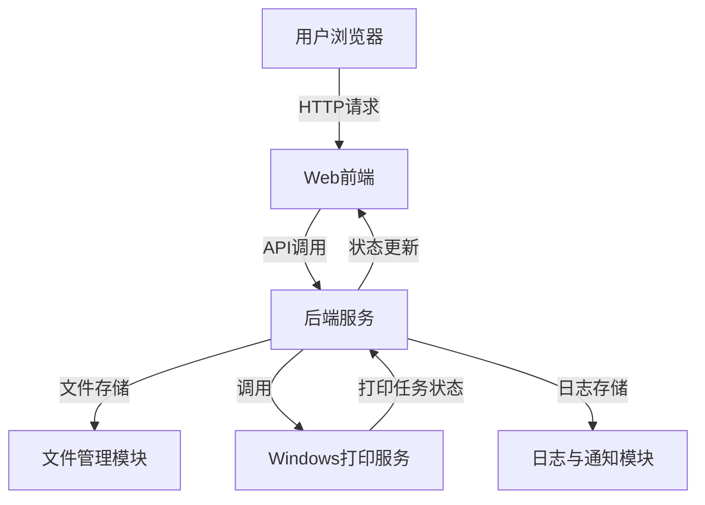
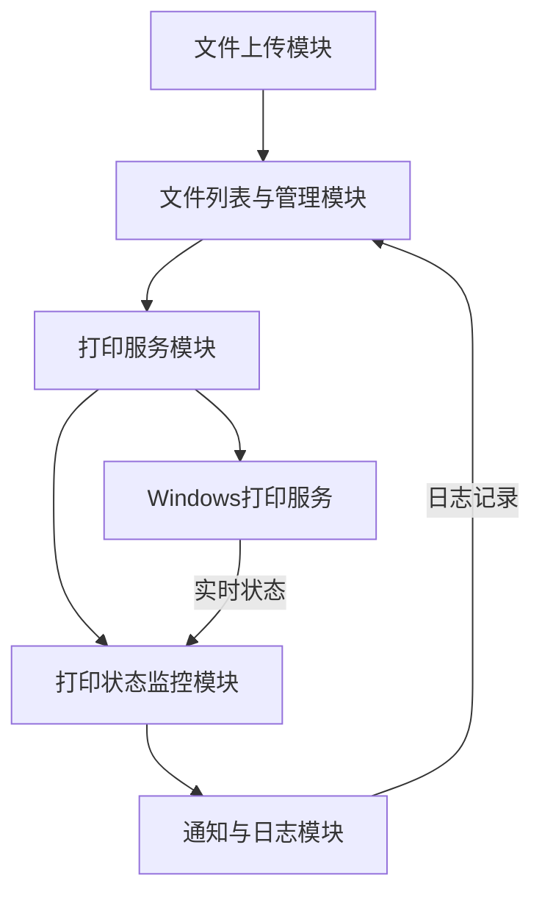

## 1、应用构想
我想创建一个共享服务器打印机的服务。这个服务需要在服务器上运行，让其他电脑可以通过网页访问。用户可以通过简单的文件拖拽或点击上传按钮将待打印的文档上传到服务端，服务端检查文件后提供打印选项按钮。

为什么需要这样的工具：

1. 我有一台Windows服务器，连接着两台打印机
2. 平常使用Mac电脑，无法直接连接这些打印机
3. 目前需要登录Windows服务器，将文件拷贝到相应目录
4. 不同格式的文件（Word、PDF、图片等）需要在Windows服务器上安装对应软件才能打印，过程繁琐

期望的功能需求：

1. 提供简单的Web界面
2. 支持文件拖拽上传或点击上传
3. 显示待打印文件列表
4. 支持单个或批量打印审批
5. 后台自动调用Windows打印服务
6. 可监控打印进度，显示打印状态
7. 打印完成后发送通知

技术要求：  
前端：

- 使用现代化框架如Tailwind CSS和Vue.js
- 简洁易用的界面设计
- 无需复杂的登录流程

后端：

- 使用Python + API架构
- 需要调用Windows打印服务的相关库
- 文件处理和打印队列管理

整体期望一个轻量级、易用的解决方案，实现从上传、确认到打印的简单工作流程。

## 2、应用功能模块
#### **核心功能模块**：
系统无需登录直接可以访问功能

1. **文件上传模块**：
    
    - 支持文件拖拽和点击上传。
        
    - 检查文件格式是否受支持（如PDF、Word、图片等）。
        
    - 对上传文件进行简单预览。
        
2. **文件列表与管理模块**：
    
    - 显示待打印文件列表。
        
    - 支持文件删除、排序、批量选择等操作。
        
    - 打印确认功能：用户确认后可提交打印。
        
3. **打印服务模块**：
    
    - 调用Windows打印服务完成打印。
        
    - 支持单个文件或批量任务的打印。
        
        
4. **打印状态监控模块**：
    
    - 实时显示打印状态（如待处理、打印中、已完成等）。
        
    - 监控打印进度并更新状态。
        
5. **通知与日志模块**：
    
    - 打印完成后通过Web界面通知用户。
        
    - 记录打印日志，供用户查看历史任务。

## 3、典型场景分析

## **场景一：Mac用户上传并打印PDF文件**

**用户操作流程**：

1. 打开Web应用，进入主界面。
    
2. 拖拽PDF文件到上传框，系统提示文件上传成功。
    
3. 在文件列表中选择刚上传的文件。
    
4. 点击“打印”按钮，无需选择打印机和参数即可打印
    
5. 系统显示打印进度，完成后弹出通知。
    

## 4、系统架构图

### **系统架构图**

---

### **功能模块交互图**

---
## 5、功能模块说明
### **1. 总体功能描述**

该系统是一个轻量级的跨平台打印服务，通过Web应用提供简洁的文件打印功能，支持文件上传、打印任务管理、状态监控和日志记录。用户无需登录系统即可直接访问功能，完成从文件上传到打印的全流程操作。

整体功能包括以下模块：

1. **文件上传模块**：提供文件的上传入口，支持拖拽上传或点击上传，检查文件格式并展示预览。
    
2. **文件列表与管理模块**：展示用户上传的待打印文件列表，支持文件管理与打印操作。
    
3. **打印服务模块**：调用Windows打印服务完成打印任务，支持单个或批量打印。
    
4. **打印状态监控模块**：实时显示打印任务的状态，并更新打印进度。
    
5. **通知与日志模块**：打印完成后通知用户，并记录打印历史日志供查询。
    

---

### **2. 各模块详细功能说明**

#### **模块一：文件上传模块**

**功能目标**：提供用户上传文件的入口，支持主流文件格式并进行预检查。

**功能点**：

1. **文件上传**：
    
    - 支持拖拽上传或点击上传。
        
    - 一次性上传多个文件。
        
2. **文件格式检查**：
    
    - 仅允许支持的文件格式（如PDF、Word、图片等）。
        
    - 对不支持的文件提示错误信息。
        
3. **文件预览**：
    
    - 显示文件的缩略图或文件名。
        
    - 提供文件大小、格式等基本信息。
        
4. **上传反馈**：
    
    - 上传成功后，提示用户操作成功。
        
    - 上传失败时，明确提示失败原因（如格式错误、文件过大等）。
        

**交互说明**：

- 用户拖拽或点击上传文件，系统检查文件格式；若符合要求，将文件显示在待打印文件列表中。
    

---

#### **模块二：文件列表与管理模块**

**功能目标**：展示用户上传的文件，并管理待打印任务。

**功能点**：

1. **文件列表展示**：
    
    - 按上传时间展示文件列表。
        
    - 提供文件名、文件大小、文件格式等信息。
        
2. **文件管理**：
    
    - 支持删除单个或多个文件。
        
    - 文件排序功能（按名称、时间等）。
        
3. **打印确认**：
    
    - 用户选择单个或多个文件。
        
    - 提供打印确认按钮，提交任务至打印服务模块。
        

**交互说明**：

- 用户可在文件列表中查看上传的文件，选择文件后点击“打印”按钮提交任务。
    

---

#### **模块三：打印服务模块**

**功能目标**：将用户提交的任务发送至Windows打印服务并执行打印。

**功能点**：

1. **打印任务提交**：
    
    - 接收用户选择的文件。
        
    - 调用Windows打印服务接口完成打印。
        
2. **打印参数设置**（简化版本）：
    
    - 默认调用系统设置的打印机和参数。
        
    - 无需用户选择打印机或设置复杂参数。
        
3. **批量任务处理**：
    
    - 支持一次性打印多个文件。
        
    - 自动按照提交顺序依次处理任务。
        

**交互说明**：

- 用户提交打印任务后，系统调用Windows打印服务按顺序完成打印。
    

---

#### **模块四：打印状态监控模块**

**功能目标**：实时跟踪打印任务的状态，向用户展示打印进度。

**功能点**：

1. **状态监控**：
    
    - 显示打印任务的状态（如待处理、打印中、已完成）。
        
    - 实时更新任务状态。
        
2. **异常处理**：
    
    - 若任务失败（如打印机离线），显示错误信息。
        
    - 提供重新提交任务的选项。
        
3. **任务完成反馈**：
    
    - 打印完成后自动更新状态为“已完成”。
        

**交互说明**：

- 系统在后台定时检查打印服务状态，并将结果反馈至Web界面，用户可随时查看任务进度。
    

---

#### **模块五：通知与日志模块**

**功能目标**：为用户提供打印完成通知，并记录打印历史。

**功能点**：

1. **通知功能**：
    
    - 打印完成后，在Web界面弹出通知。
        
    - 提供简单的任务详情（如文件名、打印时间）。
        
2. **日志记录**：
    
    - 自动记录每个打印任务的详细信息（文件名、打印时间、状态等）。
        
    - 提供日志查询功能，用户可查看历史任务记录。
        
3. **日志导出**：
    
    - 支持将打印日志导出为CSV格式，供用户存档或分析。
        

**交互说明**：

- 打印完成后，系统将自动弹出通知，同时记录日志供用户查询。
    

---

### **模块间的整体交互流程**

1. **用户上传文件**：
    
    - 文件上传模块接收文件并进行格式检查。
        
    - 上传成功后，将文件加入文件列表并显示在文件列表与管理模块中。
        
2. **用户选择文件并提交打印**：
    
    - 用户在文件列表中选择文件，提交至打印服务模块。
        
    - 打印服务模块调用Windows打印服务执行任务。
        
3. **监控打印状态**：
    
    - 打印状态监控模块实时追踪任务状态，并更新至Web界面。
        
4. **打印完成后通知用户**：
    
    - 打印完成后，通知与日志模块弹出通知，并记录任务日志。